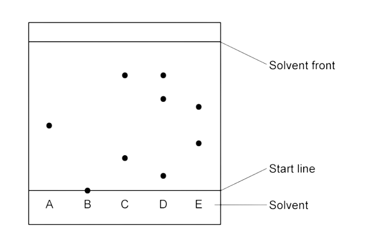
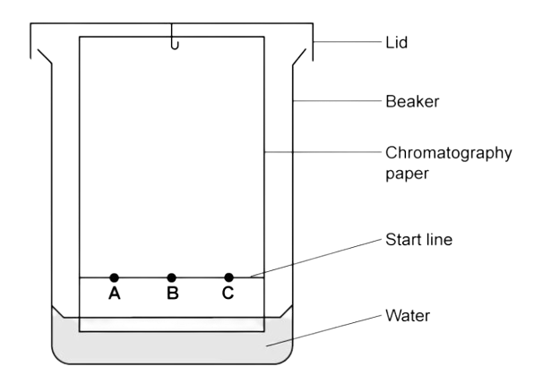
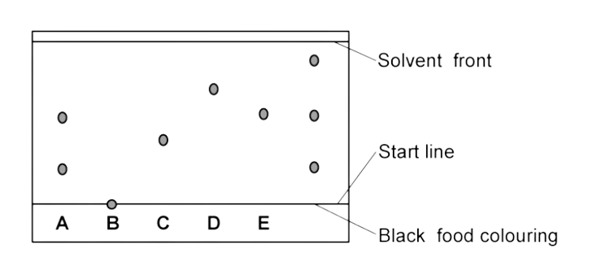

# Elements, Compounds & Mixtures

Course: igcse-chemistry-19 · Section: 1. Principles of Chemistry

Source: https://www.savemyexams.com/igcse/chemistry/edexcel/19/flashcards/1-principles-of-chemistry/1-2-elements-compounds-and-mixtures/

## Card 1 — keyword_definition (`fl_Jmwc6jWgryT59dBP`)

**FRONT**

State what is meant by the term **element**.

**BACK**

An **element **is a substance made of atoms that all contain the same number of protons and cannot be split into anything simpler.

## Card 2 — true_or_false (`fl_BBRQMhR2PTcJpRZB`)

**FRONT**

**True or False?**

Nitrogen is an element.

**BACK**

**True**.

Nitrogen is an element.

## Card 3 — true_or_false (`fl_57WQmC2kjGVgNVvy`)

**FRONT**

**True or False?**

Water is an element.

**BACK**

**False**.

Water is a compound composed of hydrogen and oxygen atoms chemically combined.

## Card 4 — keyword_definition (`fl_JCCG4y6mmSBtPGJp`)

**FRONT**

State what is meant by the term **compound**.

**BACK**

A **compound **is a pure substance made up of two or more different elements chemically combined together.

## Card 5 — true_or_false (`fl_x2MfDNDCk4z2nQrp`)

**FRONT**

**True or False?**

Compounds can be separated into their elements by physical means.

**BACK**

**False**.

Compounds cannot be separated into their elements by physical means.

## Card 6 — keyword_definition (`fl_kxjvj3C3vTQQQCCh`)

**FRONT**

What is a **mixture**?

**BACK**

A **mixture **is a combination of two or more substances (elements and/or compounds) that are not chemically combined.

## Card 7 — question_and_answer (`fl_FwNVjTGkZ3Y6HXnK`)

**FRONT**

What is the difference between a compound and a mixture?

**BACK**

A compound consists of **two or more elements** that are **chemically combined**, while a mixture consists of **two or more substances **that are **not chemically combined**.

## Card 8 — true_or_false (`fl_xQv8HMRw2vPwGhDS`)

**FRONT**

**True or False?**

All substances can be classified as elements, compounds, or mixtures.

**BACK**

**True**.

All substances can be classified into one of these three types.

## Card 9 — question_and_answer (`fl_X7X7p9N8kcFRVwv7`)

**FRONT**

Classify the following as an element, compound or mixture:

- Air
- Ammonia, NH3
- Chlorine, Cl2
- Copper sulfate, CuSO4

**BACK**

The classifications of the following are:

- Air = mixture
- Ammonia, NH3 = compound
- Chlorine, Cl2 = element
- Copper sulfate, CuSO4 = compound

## Card 10 — question_and_answer (`fl_J4HKMHmDCDqnKVBJ`)

**FRONT**

What is the difference between an element and a compound?

**BACK**

An element consists of only one element, while a compound consists of **two or more elements** that are **chemically combined**.

## Card 11 — question_and_answer (`fl_NFytytpcYbDPZ3Cp`)

**FRONT**

Is a copper wire an element or compound?

**BACK**

Copper wire is an element.

## Card 12 — question_and_answer (`fl_s7dD6SQsRVSX75KG`)

**FRONT**

Why is copper sulfate **not **on the Periodic Table?

**BACK**

Copper sulfate is **not **in the Periodic Table because it is a compound / not an element.

## Card 13 — question_and_answer (`fl_pkfdCWrchMPsqzyH`)

**FRONT**

What is the difference between a pure substance and a mixture?

**BACK**

A pure substance consists of only one substance (this can be an element or a compound), while a mixture contains two or more different substances that are not chemically combined.

## Card 14 — true_or_false (`fl_jCCKgWmC9rsky67Z`)

**FRONT**

**True or False?**

Salt dissolved in water is a pure substance.

**BACK**

**False**.

A solution of salt dissolved in water is a mixture.

## Card 15 — keyword_definition (`fl_fGJXH2gJ5CbNnZDM`)

**FRONT**

State what is meant by the term **melting point**.

**BACK**

The **melting point **is the temperature at which a solid turns into a liquid.

## Card 16 — keyword_definition (`fl_hnzFSDQR9wTTccrB`)

**FRONT**

What is a **boiling point**?

**BACK**

The **boiling point **is the temperature at which a liquid turns into a gas.

## Card 17 — question_and_answer (`fl_s7p9hrgXmJZMQbRJ`)

**FRONT**

What property can be used to distinguish a pure substance from a mixture?

**BACK**

Melting point and boiling point can be used to distinguish a pure substance from a mixture.

## Card 18 — true_or_false (`fl_PRqFHCZ7THXz6hDR`)

**FRONT**

**True or False? **

Pure substances have a range of melting and boiling points.

**BACK**

**False**.

Pure substances have sharp, specific melting and boiling points, while mixtures have a range of melting and boiling points.

## Card 19 — keyword_definition (`fl_4CfHmJ9v37S9n4Kc`)

**FRONT**

What is a **cooling curve**?

**BACK**

A **cooling curve **is a graph that shows how a substance changes from a gas to a liquid to a solid as temperature decreases.

## Card 20 — question_and_answer (`fl_xnTJVnB2sYGQd4xh`)

**FRONT**

What does a **horizontal line **on a cooling curve indicate?

**BACK**

A **horizontal line **on a cooling curve indicates where a substance is changing from a gas to a liquid or from a liquid to a solid.

## Card 21 — keyword_definition (`fl_8fcNGtmSgVtWm2vc`)

**FRONT**

What is a **pure substance**?

**BACK**

A **pure substance **is a single element or compound that contains no other substances.

## Card 22 — question_and_answer (`fl_TyPwxq2g7Mb6Zbxt`)

**FRONT**

How can melting and boiling points distinguish between pure substances and mixtures?

**BACK**

Pure substances have specific and sharp melting and boiling points, while mixtures have a range of melting and boiling points.

## Card 23 — keyword_definition (`fl_TyqhnfsmSQKB2HJt`)

**FRONT**

State the use of **melting point analysis**.

**BACK**

**Melting point analysis **is used to assess the purity of a substance.

## Card 24 — keyword_definition (`fl_rJGM8Bts7v3Z3tyQ`)

**FRONT**

What does **simple distillation **separate?

**BACK**

**Simple distillation **is used to separate:

- a liquid and **soluble **solid from a solution (e.g., water from a solution of salt water)
- a pure liquid from a mixture of liquids

## Card 25 — keyword_definition (`fl_2HpK4znnFzqKMDGy`)

**FRONT**

State what is meant by the term **simple distillation**.

**BACK**

**Simple distillation **is a technique used to separate a liquid from a solution (e.g., water from a salt solution) by boiling the solution and condensing the vapour.

## Card 26 — keyword_definition (`fl_S7x39bV54qrMT8g8`)

**FRONT**

What is **fractional distillation**?

**BACK**

**Fractional distillation **is a technique used to separate two or more liquids that have different boiling points from a mixture.

## Card 27 — keyword_definition (`fl_j8NPj5GQK4tf98Hs`)

**FRONT**

What does **filtration **separate?

**BACK**

**Filtration **separates an undissolved solid from a mixture of solid and liquid.

## Card 28 — question_and_answer (`fl_HMHP3vfZV8dsr8W9`)

**FRONT**

What is **crystallisation **used for?

**BACK**

**Crystallisation **is used to separate a dissolved solid from a solution.

## Card 29 — question_and_answer (`fl_NJc2ghWPMRy2NP6b`)

**FRONT**

In terms of the solid (solute), what is important about the solvent?

**BACK**

It is important that the solid (solute) is more soluble in hot solvent than in cold.

## Card 30 — keyword_definition (`fl_f2T4Jn9xQ6wDdhXb`)

**FRONT**

Which property does paper chromatography depend upon?

**BACK**

Paper chromatography depends upon the solubility of different substances.

## Card 31 — question_and_answer (`fl_KyngnTn72TMDS2y8`)

**FRONT**

What is **paper chromatography **used for?

**BACK**

**Paper chromatography **is used to separate substances that have different solubilities in a given solvent, such as identifying the components of a mixture.

## Card 32 — question_and_answer (`fl_Wdw4SvFXmVXPRKGP`)

**FRONT**

What is the **mobile phase **in paper chromatography?

**BACK**

The **mobile phase **in chromatography is the solvent / liquid that travels up the paper.

## Card 33 — keyword_definition (`fl_QQnwDQb932CSHWbg`)

**FRONT**

Why should the **baseline **(starting line) in chromatography be drawn in **pencil**?

**BACK**

The **baseline **(starting line) should be drawn in **pencil **because it will not contaminate the results / will not run.

## Card 34 — true_or_false (`fl_333gH58HSpwmkjxz`)

**FRONT**

**True or False?**

In paper chromatography, a **pure **substance produces more than **one spot**.

**BACK**

**False.**

In paper chromatography, a **pure **substance only produces **one spot**.

## Card 35 — keyword_definition (`fl_8bG3r2FRPKbB9hVW`)

**FRONT**

Which technique separates solutions with more than one type of dissolved solid (solute)?

**BACK**

The technique that separates solutions with more than one type of dissolved solid is chromatography.

## Card 36 — question_and_answer (`fl_pqczJNZxmnjjTCHJ`)

**FRONT**

What does a **single spot **on a chromatogram indicate?

**BACK**

A **single spot **on a chromatogram indicates that the substance is pure.

## Card 37 — true_or_false (`fl_pbCcZqmwyqnvvXHB`)

**FRONT**

**True or False?**

Multiple spots on a chromatogram indicate a pure substance.

**BACK**

**False**.

Multiple spots on a chromatogram indicate that the substance is a mixture.

## Card 38 — keyword_definition (`fl_kXkhq8bCxtFf4XBP`)

**FRONT**

State the **equation **to calculate the retention factor (*R*f value).

**BACK**

The **equation **for the retention factor (*R*f value) is:

*R*f = $\frac{\mathrm{Distance} \mathrm{travelled} \mathrm{by} \mathrm{sample}}{\mathrm{Distance} \mathrm{travelled} \mathrm{by} \mathrm{solvent} \mathrm{front}}$

## Card 39 — question_and_answer (`fl_d5H8npPwsDRwTK8K`)

**FRONT**

What does an *R*f value closer to 1 indicate?

**BACK**

An *R*f value close to 1 indicates that the component is very / highly soluble in the solvent used.

## Card 40 — true_or_false (`fl_XB8N2KH2fj9t25pZ`)

**FRONT**

**True or False?**

The *R*f value of a compound is always the same, regardless of the solvent used.

**BACK**

**False**.

The *R*f value of a compound depends on the solvent used.

If the solvent is changed, the *R*f value will change.

## Card 41 — question_and_answer (`fl_Bc8yGPCn2fH6BQGS`)

**FRONT**

What is the purpose of calculating *R*f values in paper chromatography?

**BACK**

The purpose of calculating *R*f values is to allow chemists to identify unknown substances.

## Card 42 — question_and_answer (`fl_vJ6yV227VfwrPTqh`)

**FRONT**

What does the *R*f value range between?

**BACK**

The *R*f values ranges between 0 and 1.

## Card 43 — question_and_answer (`fl_Jx8zj7HNzGwYbN4X`)

**FRONT**

What should the initial line on a chromatogram be drawn with?

**BACK**

The initial line on a chromatogram should be drawn with a pencil.

## Card 44 — question_and_answer (`fl_CSvGKk9tWdsyHh52`)

**FRONT**

How many substances are in sample D?

**BACK**

There are 3 substances in D.

## Card 45 — true_or_false (`fl_dnFGgBcb2x8dMwyd`)

**FRONT**

**True or False?**

The solvent level should start above the pencil line on a chromatogram.

**BACK**

**False**.

The solvent level should not start above the pencil line, as this would ruin the chromatogram.

## Card 46 — question_and_answer (`fl_hz6H4SstdvGYv8jh`)

**FRONT**

Identify the mobile and stationary phase in the chromatography experiment below.

**BACK**

The mobile phase is the water, and the stationary phase is the chromatography paper.

## Card 47 — true_or_false (`fl_Gk7CZjB9jTXtrmDX`)

**FRONT**

**True or False?**

If two substances are the same, they will produce identical chromatograms.

**BACK**

**True**.

If two substances are the same, they will produce identical chromatograms.

## Card 48 — question_and_answer (`fl_CyRytfktbsM5YqbQ`)

**FRONT**

Why does an *R*f value have no units?

**BACK**

An *R*f value does not have units because it is a ratio.

## Card 49 — question_and_answer (`fl_qBdFsPBt6fbSqw2Z`)

**FRONT**

Which colours from A-E does black food colouring contain?

**BACK**

The black food colouring contains A, E and an unknown.

