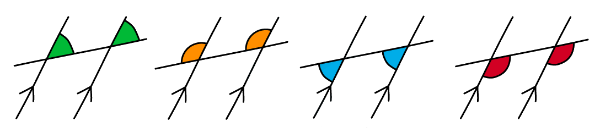

# Angles in Polygons & Parallel Lines

Course: igcse-maths-a-18-foundation · Section: 4. Geometry & Trigonometry

Source: https://www.savemyexams.com/igcse/maths/edexcel/a/18/foundation/flashcards/geometry-and-trigonometry/angles-in-polygons-and-parallel-lines/

## Card 1 — keyword_definition (`fl_tzq5zTcvsN744gnx`)

**FRONT**

What is a **polygon**?

**BACK**

A polygon is a **flat **(plane) shape with $n$ **straight sides**.

E.g. a quadrilateral is a 4-sided polygon.

## Card 2 — true_or_false (`fl_mq32R5736qJr33WY`)

**FRONT**

**True or False?**

The** sum of the exterior angles** in any polygon always adds up to **360°**.

**BACK**

**True.**

The **sum of the** **exterior angles** in any polygon always adds up to** 360°**.

## Card 3 — true_or_false (`fl_c4P8xW55vm4tCMns`)

**FRONT**

**True or False?**

The **sum of an interior angle and an exterior angle** at the same vertex on a polygon is equal to **180°**.

**BACK**

**True. **

The **sum of an interior angle and an exterior angle** at the same vertex on a polygon **is** equal to **180°**.

## Card 4 — keyword_definition (`fl_NVf9fp6v9kYv9XN3`)

**FRONT**

State the** equation** in terms of the number of sides of a polygon, $n$, for the **sum of interior angles** in a polygon.

**BACK**

The** equation** in terms of the number of sides of a polygon, $n$, for the **sum of interior angles** in a polygon is:

Sum of interior angles = `180 cross times open parentheses n minus 2 close parentheses`.

## Card 5 — keyword_definition (`fl_TCVgmDQV9nMhYYgW`)

**FRONT**

What is a** regular polygon**?

**BACK**

A regular polygon is a polygon where **all sides are equal **and** all angles are equal**.

## Card 6 — true_or_false (`fl_5PnH9D9w6brPBmcq`)

**FRONT**

**True or False?**

An** irregular polygon** can have** more than one side **of the** same length**.

**BACK**

**True.**

An **irregular polygon **can have **more than one side** of the **same length**.

It is an irregular polygon unless **all sides** are the same length and **all angles** are the same size, in which case it would be a regular polygon.

## Card 7 — true_or_false (`fl_wTDg5Srw6nbyxsKP`)

**FRONT**

**True or False?**

The **sum of interior angles** in a **regular polygon** is **different** to the **sum of interior angles** in an **irregular polygon** with the same number of sides.

**BACK**

**False.**

The **sum of interior angles** in a **regular polygon** is **the same as** the **sum of interior angles** in an **irregular polygon** with the same number of sides.

The **sum of interior angles** is dependent on the **number of sides**.

It is not dependent on whether the polygon is regular or irregular.

## Card 8 — keyword_definition (`fl_DNRprqV3YmmwD5RV`)

**FRONT**

What are **parallel lines**?

**BACK**

Parallel lines are lines that are **always equidistant** (i.e. the same distance apart) and **never meet**.

## Card 9 — keyword_definition (`fl_hhSx3JD7j6k7yydG`)

**FRONT**

What is a **transverse line**?

**BACK**

A transverse line is a **straight line** that **extends across two parallel lines**.

## Card 10 — keyword_definition (`fl_H43WSmWj5TWQ6Mxt`)

**FRONT**

What are **corresponding angles**?

**BACK**

**Corresponding angles **are **equal angles** in **corresponding positions**.

## Card 11 — keyword_definition (`fl_7p9mNgdwqxNbZKn5`)

**FRONT**

What are **co-interior (supplementary) angles**?

**BACK**

**Co-interior (supplementary) angles** are a **pair of angles** that are formed **between **a pair of parallel lines and a transverse line.  Co-interior angles sum to **180****o**.

## Card 12 — keyword_definition (`fl_wcHxSC6zCXq8d4W3`)

**FRONT**

What **angle fact** is represented by the diagram below?

**BACK**

**Alternate angles **are **equal angles**.

## Card 13 — true_or_false (`fl_PH2g69D9bZshZ44V`)

**FRONT**

**True or False?**

In an exam question involving the use of angle facts, you should state the **appropriate angle fact** as well as the **size of the relevant angle**.

**BACK**

**True.**

To get full marks in an exam you will need to write down the** size of any angles **that you have found but you will also need to give **reasons**.

Make sure that you use the **correct terminology **for the different angle facts.

