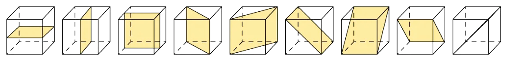
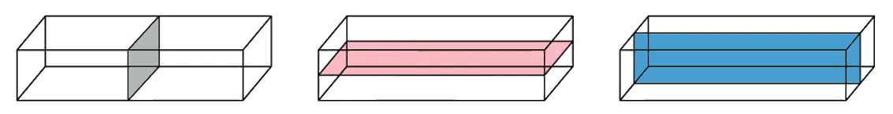
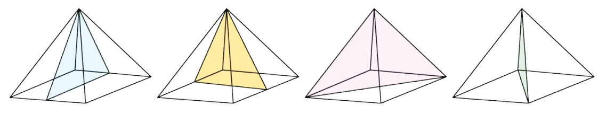

# Symmetry & Shapes

Course: igcse-maths-a-18-foundation · Section: 4. Geometry & Trigonometry

Source: https://www.savemyexams.com/igcse/maths/edexcel/a/18/foundation/flashcards/geometry-and-trigonometry/symmetry-and-shapes/

## Card 1 — keyword_definition (`fl_5nwwkTFSHfC98CYB`)

**FRONT**

What is **rotational symmetry**?

**BACK**

A shape is said to have rotational symmetry if, during a **360° rotation** about its centre, it **looks the same** as it did in its **original position**.

## Card 2 — keyword_definition (`fl_fBjRHfxCyKdBbZJv`)

**FRONT**

What is meant by the **order** **of rotational symmetry**?

**BACK**

The order of rotational symmetry refers to the **number of times** a shape **looks the same** as it is **rotated 360°** about its centre.

## Card 3 — true_or_false (`fl_tTnbTkWFVHcnBNGT`)

**FRONT**

**True or False?**

A shape can have **order 0** rotational symmetry.

**BACK**

**False. **

A shape can **never **have order 0 rotational symmetry.

A shape is said to have **no rotational symmetry **when the **order of rotational symmetry is 1**, i.e. it only looks like its original position when it has been rotated through the full 360°.

## Card 4 — question_and_answer (`fl_3PfPRyTCHG2CbRc7`)

**FRONT**

How can **tracing paper** be used to help work out the **order of rotational symmetry** of a shape?

**BACK**

You can use tracing paper to help you work out the order of symmetry for a particular shape by doing the following:

1. Sketch the shape onto the tracing paper.
2. Draw an arrow pointing upwards on the tracing paper.
3. Place your pencil in the centre of the shape and rotate the tracing paper until the arrow is pointing upwards again (360º).
4. Count how many times the shape on the tracing paper maps over the shape on the paper beneath exactly; this is the **order of rotational symmetry**.

## Card 5 — keyword_definition (`fl_WsDxrh7R7MGtGzMd`)

**FRONT**

What is **line symmetry**?

**BACK**

A shape is said to have line symmetry when one half of the shape is a **mirror image **of the other half.

## Card 6 — keyword_definition (`fl_rVsqq8GySJwvRvNH`)

**FRONT**

What is a **line of symmetry**?

**BACK**

A **line of symmetry** is a **line** across which a shape can be **folded or reflected** so that the two halves match exactly.

## Card 7 — true_or_false (`fl_RC9R4S4jJQNWTfBf`)

**FRONT**

**True or False?**

A** line of symmetry** is also known as a** line of reflection**.

**BACK**

**True.**

A **line of symmetry** is also known as a **line of reflection**.

It can also be called a **mirror line**.

## Card 8 — question_and_answer (`fl_x5h8TYnTQv7Yc4Bz`)

**FRONT**

How can **tracing paper **be used to help sketch the** reflection **of a shape?

**BACK**

You can use tracing paper to help you sketch the reflection of a shape:

1. Trace the shape and the line of symmetry on the tracing paper.
2. Flip the paper over the line of symmetry.
3. The traced image will now be in its reflected position.

## Card 9 — keyword_definition (`fl_JkzGxDSkSXJ9RTTm`)

**FRONT**

What is a **plane of symmetry** in a 3D shape?

**BACK**

A **plane of symmetry** in a 3D shape is a plane (flat 2D shape) that splits a 3D shape into **two** **congruent** (identical) halves that are **mirror images** of each other.

## Card 10 — question_and_answer (`fl_w8HWmgBQymM9SThQ`)

**FRONT**

How** **many **planes of symmetry** does a **cube** have?

**BACK**

A **cube** has **9 planes of symmetry**.

## Card 11 — question_and_answer (`fl_NcKK7RfngqTpt5y8`)

**FRONT**

How** **many **planes of symmetry** does a **cuboid** have?

**BACK**

A **cuboid** has **3 planes of symmetry**.

## Card 12 — question_and_answer (`fl_Tr8VMvTb5GHcFgzX`)

**FRONT**

How** **many **planes of symmetry** does a **square-based pyramid** have?

**BACK**

A **square-based pyramid **has **4 planes of symmetry**.

## Card 13 — true_or_false (`fl_cGTYvGrY8NFZJpJ9`)

**FRONT**

**True or False?**

A **cylinder** has** infinite** **rotational symmetry**.

**BACK**

**True.**

A **cylinder** has **infinite rotational symmetry** about the axis that runs through the centre point of both circular faces.

