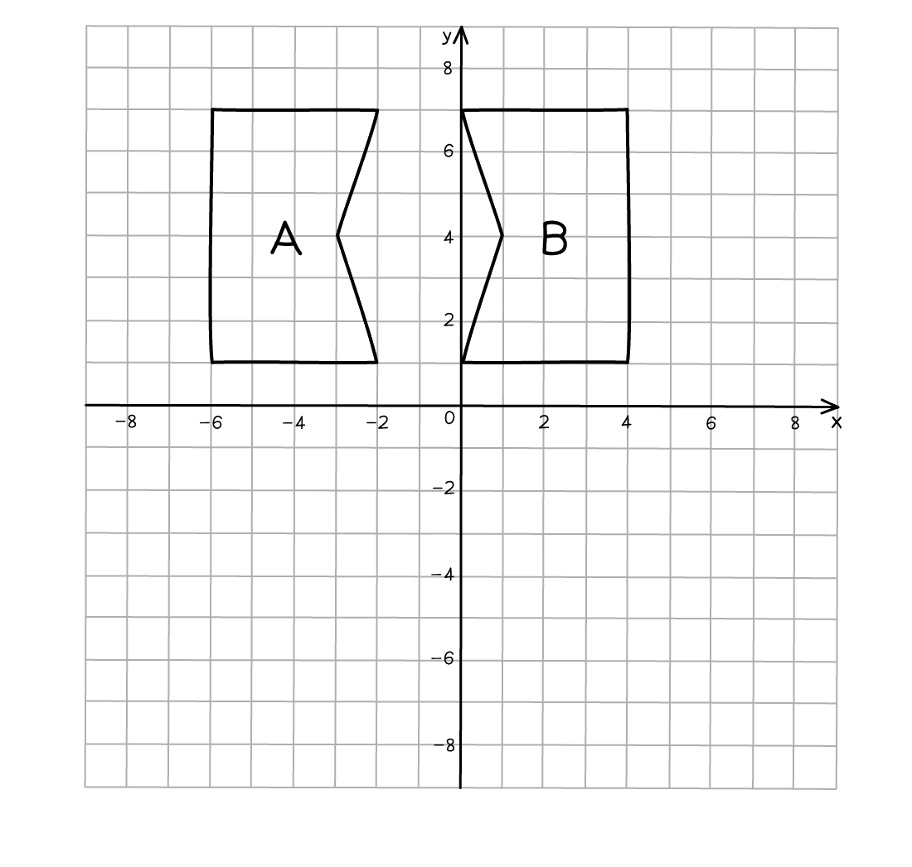
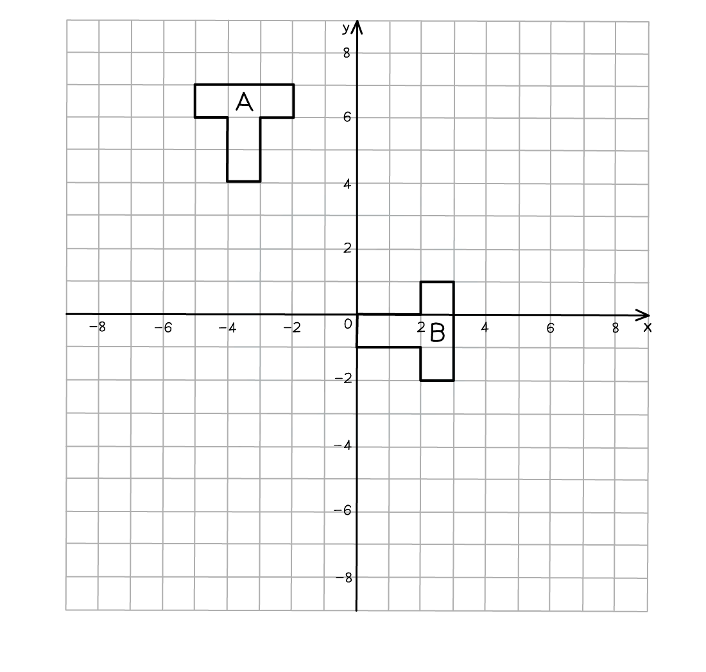

# Transformations

Course: igcse-maths-a-18-foundation · Section: 5. Vectors & Transformation Geometry

Source: https://www.savemyexams.com/igcse/maths/edexcel/a/18/foundation/flashcards/vectors-and-transformation-geometry/transformations/

## Card 1 — keyword_definition (`fl_xGcTfhvjrNctVjSQ`)

**FRONT**

Define the term **translation**.

**BACK**

A **translation **is when a shape is **moved**.

Its position changes but its size, shape and orientation stay the same.

## Card 2 — question_and_answer (`fl_97KvBqYY8Y8XkHjy`)

**FRONT**

What do you use to **describe **how a shape is **moved horizontally and vertically **by a **translation**?

**BACK**

You use a **vector **in the form `open parentheses table row x row y end table close parentheses` to **describe a translation**.

Within the vector,  $x$ describes the horizontal movement and $y$ describes the vertical movement.

## Card 3 — true_or_false (`fl_4Ckf5MxNJ39fNrPV`)

**FRONT**

**True or False?**

The vector `open parentheses table row 2 row 3 end table close parentheses` means **3 **units to the **right **and **2 **units **up**.

**BACK**

**False.**

The vector `open parentheses table row 2 row 3 end table close parentheses` does **not** mean **3 **units to the **right **and **2 **units **up**.

The vector `open parentheses table row 2 row 3 end table close parentheses` means **2 **units to the **right **and **3 **units **up**.

The **top **number is **horizontal **and the **bottom **number is **vertical.**

## Card 4 — true_or_false (`fl_6P9y2kSFh6nZJnRn`)

**FRONT**

**True or False?**

The vector `open parentheses table row cell negative 2 end cell row 0 end table close parentheses` means **2 **units to the **left**.

**BACK**

**True.**

The vector `open parentheses table row cell negative 2 end cell row 0 end table close parentheses` means **2 **units to the **left**.

## Card 5 — true_or_false (`fl_ZNCymVDYQG98bXDn`)

**FRONT**

**True or False?**

The vector `open parentheses table row 0 row cell negative 3 end cell end table close parentheses` means **3 **units **up**.

**BACK**

**False.**

The vector `open parentheses table row 0 row cell negative 3 end cell end table close parentheses` does **not **mean **3 **units **up**.

The vector `open parentheses table row 0 row cell negative 3 end cell end table close parentheses` means **3 **units **down**.

If the **bottom **number is **negative **it goes **down**.

## Card 6 — question_and_answer (`fl_sQRhK5mzHg2zMxFk`)

**FRONT**

How do you **translate **a shape?

**BACK**

To translate a shape, **move **each corner according to the vector.

**Join **the new corners together to make the translated shape.

## Card 7 — true_or_false (`fl_YT3r9hhDmn6q5j34`)

**FRONT**

**True or False?**

When you **translate **a shape, it should **not overlap** with the original shape.

**BACK**

**False.**

When you **translate **a shape, it **can overlap** with the original shape.

## Card 8 — question_and_answer (`fl_kPxjNCKyW86QKjy7`)

**FRONT**

To get full marks, what **information **do you need to give when **describing a translation **in an exam question?

**BACK**

When **describing a translation**, you need to:

- State that the transformation is a **translation**.
- State the **vector**.

## Card 9 — question_and_answer (`fl_vSRDcVSJVpHSxBMN`)

**FRONT**

How do you **reverse** a **translation**?

E.g. reverse a translation of `open parentheses table row 6 row cell negative 2 end cell end table close parentheses`.

**BACK**

A translation can be reversed by **changing the sign** (but not the number) of **each value** in the **translation vector,** and moving the shape by this new vector.

E.g. to reverse a translation of `open parentheses table row 6 row cell negative 2 end cell end table close parentheses`, move the translated shape by the vector `open parentheses table row cell negative 6 end cell row 2 end table close parentheses`.

## Card 10 — question_and_answer (`fl_szhxQ6SZmmQdgJNc`)

**FRONT**

What **type of transformation** is seen in the the diagram below?

**BACK**

The transformation in the diagram is a **translation**.

The shape has moved position but has not changed in size or orientation.

Shape A has been translated to shape B by the vector `open parentheses table row 2 row cell negative 3 end cell end table close parentheses`.

## Card 11 — true_or_false (`fl_m7DpgxgYyBGttcFw`)

**FRONT**

**True or False?**

In a **translation** there are **no invariant points**.

**BACK**

**True.**

In a **translation** there are **no invariant points**.

All of the points on a shape move when it is translated.

## Card 12 — keyword_definition (`fl_YFv6VxGDPPkbfytB`)

**FRONT**

Define the term **reflection**.

**BACK**

A **reflection **is when a shape is **flipped **about a line of symmetry.

Its orientation changes and its position could change but its size stays the same.

## Card 13 — true_or_false (`fl_qxc4GK8HNSbk8sYj`)

**FRONT**

**True or False?**

A **reflection **in the line $y=0$ is **always the same** as a reflection in the *y*-axis.

**BACK**

**False.**

A **reflection **in the line $y=0$ is **always the same** as a reflection in the ***x*****-axis**.

## Card 14 — true_or_false (`fl_cywdr5y5YYvFCwHx`)

**FRONT**

**True or False?**

The **line of reflection** will always be **horizontal **or **vertical**.

**BACK**

**False.**

The **line of reflection** will **not **always be **horizontal **or **vertical**. It could be diagonal such as $y=x$ or $y=-x$.

## Card 15 — question_and_answer (`fl_6s53sW65swJRWVBr`)

**FRONT**

Which points **do not change** when reflected?

**BACK**

Any points that lie on the **line of reflection** **do not change** when reflected.

## Card 16 — question_and_answer (`fl_dM99HFX6N78kYZvB`)

**FRONT**

How do you **reflect **a shape about a line of reflection?

**BACK**

To **reflect **a shape, reflect each corner separately.

- Count or measure the perpendicular distance from a corner to the line of reflection.
- Repeat this distance on the other side of the line.
- Label the new corner.
- Join all the corners up to form the reflected shape.

## Card 17 — question_and_answer (`fl_Ghw6f4zFFjM3XQ34`)

**FRONT**

To get full marks, what **information **do you need to give when **describing a reflection **in an exam question?

**BACK**

When **describing a reflection**, you need to:

- State that the transformation is a **reflection**.
- State the **equation **of the** line of reflection**.

## Card 18 — true_or_false (`fl_WBvccHnJSQCm9bjG`)

**FRONT**

**True or False?**

To **reverse** a **reflection**, you can **reflect **it about the **same line of reflection **again.

E.g. if an object has been reflected along the *x*-axis, then reflecting it along the *x*-axis again will bring it back to its initial position.

**BACK**

**True.**

To **reverse** a **reflection**, you can **reflect **it about the **same line of reflection **again.

## Card 19 — question_and_answer (`fl_6QV9zGk2KxzWpFbr`)

**FRONT**

What **type** **of transformation** is seen in the diagram below.

**BACK**

The transformation in the diagram is a** reflection**.

The two shapes are the same size but are in different positions and orientations.

Shape A has been reflected to shape B in the line $x=-1$.

## Card 20 — question_and_answer (`fl_kjSq68WsvWDkxyw6`)

**FRONT**

Which points are **invariant** with a reflection?

**BACK**

In a** reflection**, any points that **lie on the mirror line** (line of reflection) are invariant points, as they **do not move **when reflected.

## Card 21 — keyword_definition (`fl_kHNydXfQp97zk48b`)

**FRONT**

Define the term **rotation**.

**BACK**

A **rotation **is when a shape is **turned **about a point.

Its position could change but its size stays the same.

## Card 22 — true_or_false (`fl_PtvrNTq4V93Gdf8j`)

**FRONT**

**True or False?**

A rotation **90****° ****clockwise** is the **same **as a rotation **270****°**** anticlockwise**.

**BACK**

**True.**

A rotation **90****° ****clockwise** is the **same **as a rotation **270****°**** anticlockwise**.

## Card 23 — true_or_false (`fl_gwVn29WG57FYxzKX`)

**FRONT**

**True or False?**

You must state the **direction **of the rotation when the angle is **180°**.

**BACK**

**False.**

You do not need to state the **direction **of the rotation when the angle is **180°**. 180° clockwise is the same as 180° anticlockwise.

## Card 24 — question_and_answer (`fl_PBmSJQshNv6RC8Rr`)

**FRONT**

To get full marks, what **information **do you need to give when **describing a rotation **in an exam question?

**BACK**

When **describing a rotation**, you need to:

- State that the transformation is a **rotation**.
- State the **angle and direction **of the rotation.
- State the position of the **centre of the rotation**.

## Card 25 — question_and_answer (`fl_9VnF3X42WCDDqJQD`)

**FRONT**

How do you **rotate **a shape about a **centre of rotation**?

**BACK**

To **rotate **a shape about a **centre of rotation**:

- Trace over the original shape.
- Put your pencil on the centre of rotation.
- Rotate the tracing paper by the given angle and in the given direction.
- Draw the rotated shape as indicated by the tracing paper.

## Card 26 — true_or_false (`fl_SXR7p6WXK3xtFnjb`)

**FRONT**

**True or False?**

The** centre of rotation** can be **inside **the original shape.

**BACK**

**True.**

The** centre of rotation** can be **inside **the original shape.

## Card 27 — question_and_answer (`fl_x589Gf7CfYWVgkDG`)

**FRONT**

What **type of transformation** is shown in the diagram below?

**BACK**

The transformation in the diagram is a **rotation**.

The shapes are identical but the positions and orientations are different.

Shape A has been rotated by 90º in a clockwise direction about the centre (-4, 0) onto shape B.

## Card 28 — true_or_false (`fl_YzDXWDPdvFJgdtjR`)

**FRONT**

**True or False?**

In a **rotation** there are **no invariant points**.

**BACK**

**False.**

In **some** cases there are **no invariant points** in a **rotation**, however, it is not always true.

If the **centre of rotation** is a point on the shape, then **that point** is **invariant**.

If a shape is rotated by **360º** then** all points** on the shape are **invariant**.

