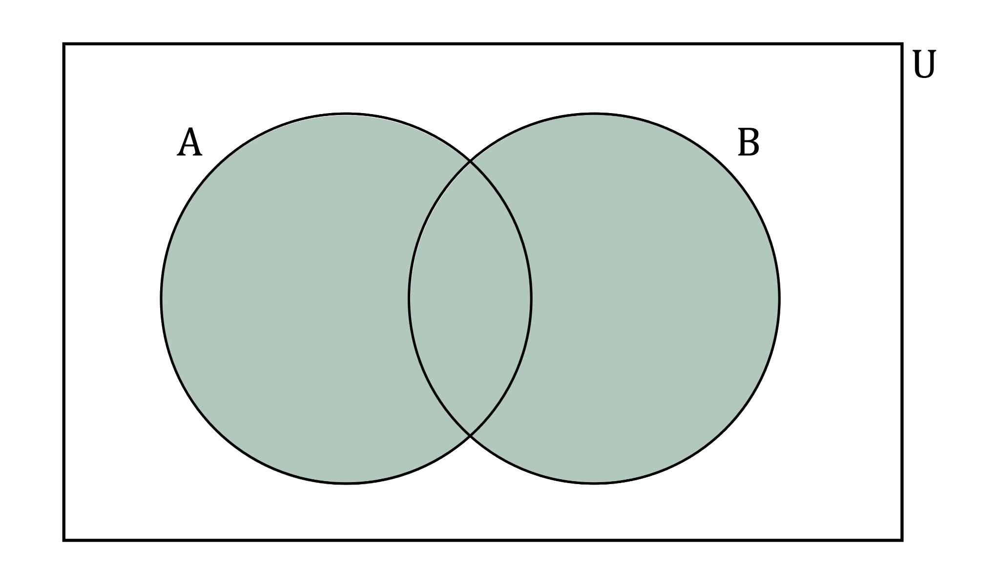
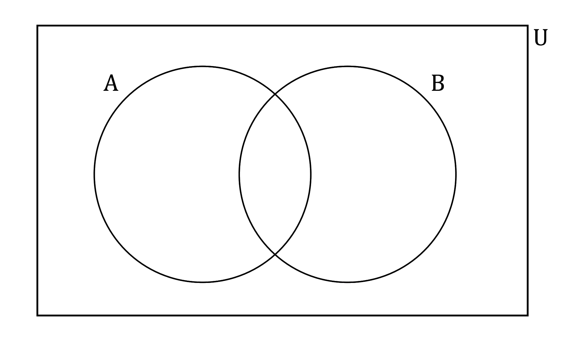
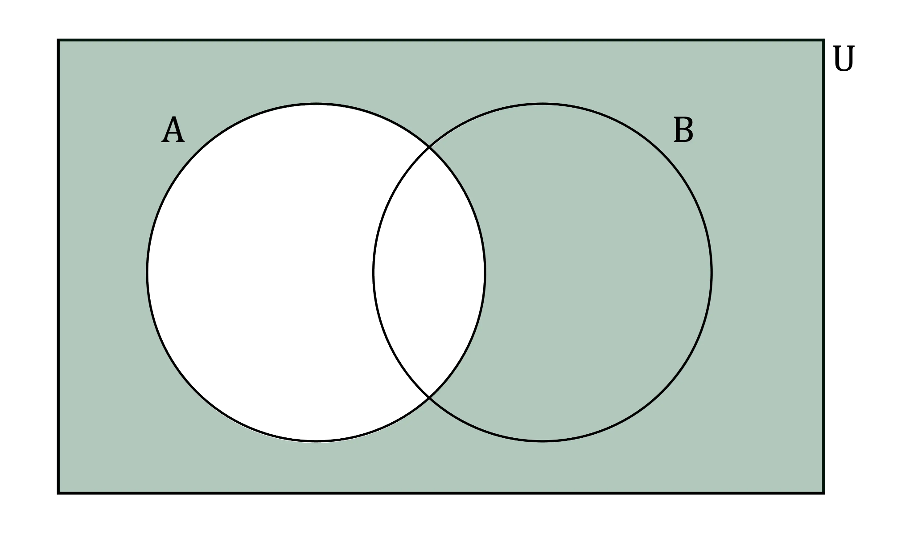
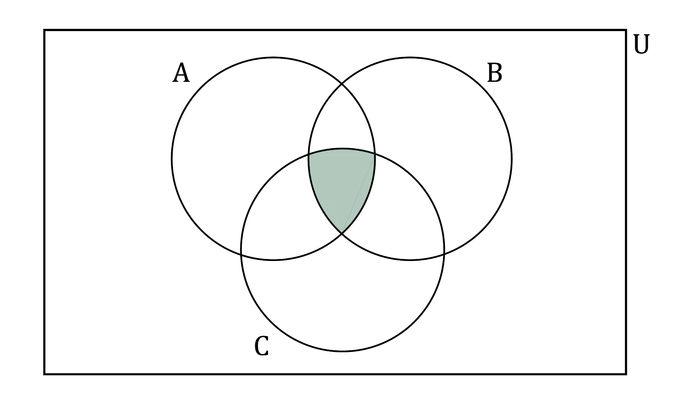
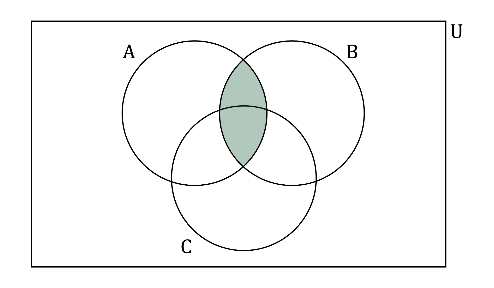

# Set Notation & Venn Diagrams

Course: igcse-maths-a-18-higher · Section: Numbers & the Number System

Source: https://www.savemyexams.com/igcse/maths/edexcel/a/18/higher/flashcards/1-numbers-and-the-number-system/set-notation-and-venn-diagrams/

## Card 1 — keyword_definition (`fl_3DwGJjqFdWJ8ryhh`)

**FRONT**

What is a **set**?

**BACK**

A set is a **collection of elements**.

## Card 2 — question_and_answer (`fl_5BbZvVTrjd3GQXjD`)

**FRONT**

What **symbol** is the **empty set** represented by?

**BACK**

**∅ **represents the **empty set** (the set with no elements).

## Card 3 — keyword_definition (`fl_mZjj9pSWJqpHnNnG`)

**FRONT**

Define the term **subset**.

**BACK**

A subset is a **set within another set**.

E.g. If every element of set *A* is also in set *B*, then* A* is a subset of *B*, ($A\subsetB$).

## Card 4 — question_and_answer (`fl_6PcpxkCH3Xv34d5b`)

**FRONT**

What **notation** is used to represent the **number of elements** in a set?

E.g. The number of elements in set* A*.

**BACK**

**n(*****A*****)** represents the **number of elements in set *****A***.

## Card 5 — question_and_answer (`fl_p5YQnkx9zz7hGSKt`)

**FRONT**

What **region** in the Venn diagram represents the **union **of* A* and *B*, `open parentheses A union B close parentheses`?

**BACK**

The union of A and B, `open parentheses straight A union straight B close parentheses`, is the set of **all elements in** **A or B or both**.

## Card 6 — question_and_answer (`fl_724hQXWyY3g7H58j`)

**FRONT**

Which **region** represents ***A*****'** on the Venn diagram below?

**BACK**

***A*****'** means** not *****A***, (*A*' is the complement of *A*) .
The regions** not in the *****A***** circle**, (everything outside *A*), represent *A*'.

## Card 7 — true_or_false (`fl_fvp8mnHTfTsH4pgV`)

**FRONT**

**True or False?**

The region shaded below represents the** intersection** of *A* and *B*, `open parentheses A intersection B close parentheses`.

**BACK**

**False.**

The region shown is the intersection of A, B and C, `open parentheses straight A intersection straight B intersection straight C close parentheses`.

The intersection of A and B, `open parentheses straight A intersection straight B close parentheses`, is:

## Card 8 — question_and_answer (`fl_8mGw88XZVRY6X3Sb`)

**FRONT**

What **notation** is used when writing out a set of elements?

E.g. Set *A* contains the elements 1, 2 and 3.

**BACK**

A set containing a number of elements is shown with the elements written inside **curly brackets** {}.

E.g. *A* = {1, 2, 3}.

## Card 9 — true_or_false (`fl_RVkyrWgvwpX43xQy`)

**FRONT**

**True or False?**

The **universal set** is represented by the **rectangle** in a Venn diagram.

**BACK**

**True.**

The universal set is represented by the rectangle in a Venn diagram.

## Card 10 — keyword_definition (`fl_c52N8wzKkNRZqmkj`)

**FRONT**

What does the symbol $E$** **represent?

**BACK**

$E$ is the **universal set **(the set of everything).

You may also see other symbols for the universal set, such as U, S or $ξ$.

## Card 11 — question_and_answer (`fl_Fck9DHtBV6CTdRK4`)

**FRONT**

What does** **$a\inA$** **mean?

**BACK**

$a\inA$ means $a$** is an element of **$A$.

$a$ is in the set $A$, or $a$ is a member of the set $A$.

