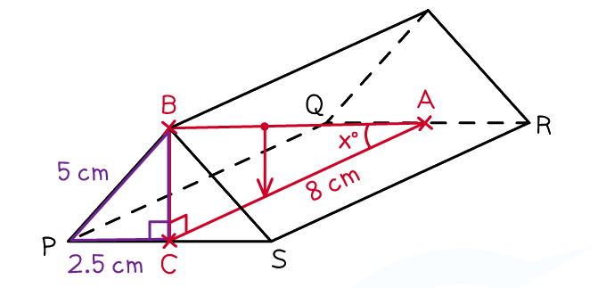
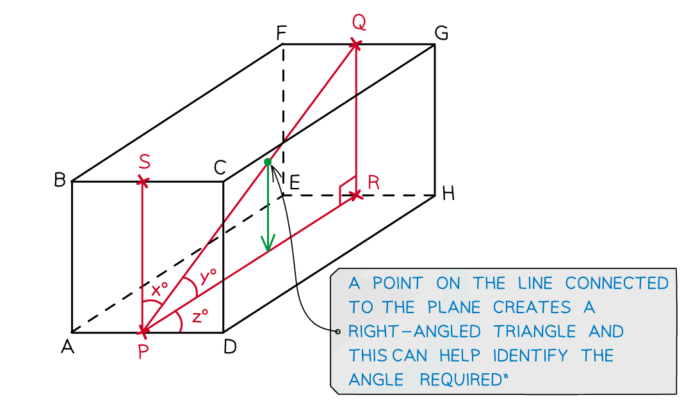

# 3D Pythagoras & Trigonometry

Course: igcse-maths-a-18-higher · Section: Geometry & Trigonometry

Source: https://www.savemyexams.com/igcse/maths/edexcel/a/18/higher/flashcards/4-geometry-and-trigonometry/3d-pythagoras-and-trigonometry/

## Card 1 — question_and_answer (`fl_N4D6BTPCXdXcSKmq`)

**FRONT**

How can 3D problems involving Pythagoras' theorem and trigonometry be made **easier**?

**BACK**

It is usually easier to solve 3D Pythagoras' theorem and trigonometry problems by **splitting them into 2D problems**. Look for** right-angled triangles** that share a side or an angle with the information that you know or that you want to know.

## Card 2 — question_and_answer (`fl_6qdnTvhtBJryTBv8`)

**FRONT**

State the **3D version** of the **Pythagoras' theorem** formula.

**BACK**

The 3D version of Pythagoras' theorem is $d^{2}=x^{2}+y^{2}+z^{2}$

Where:

- $d$ is the straight line distance between two points
- $x$ is the distance in the $x$-direction between the two points
- $y$ is the distance in the $y$-direction between the two points
- $z$ is the distance in the $z$-direction between the two points

## Card 3 — question_and_answer (`fl_2w2RFQ54D49b48Y3`)

**FRONT**

How can you find the **angle between a line and a plane**?

**BACK**

Draw a new line from a point on the line creating a right-angled triangle. The angle between the line and the plane is the same as the **angle between the initial line and **the **side **of the triangle that lies on the plane.

