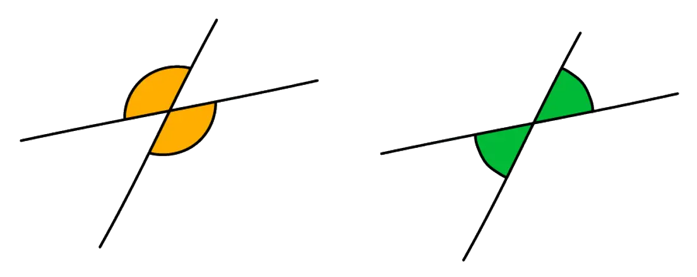
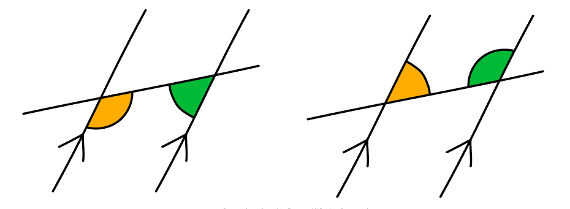
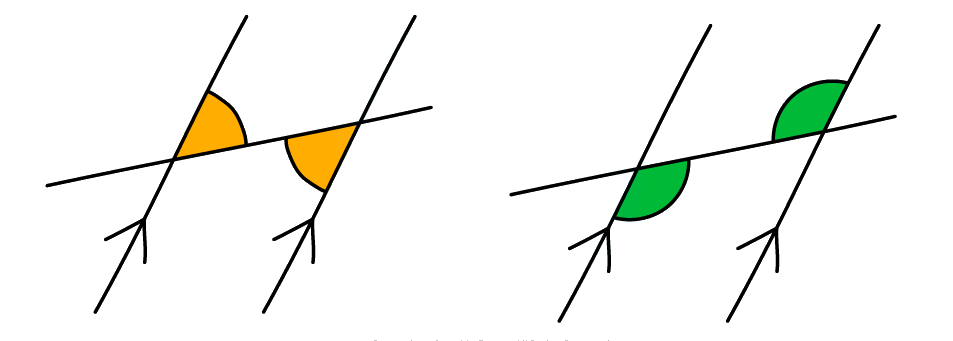

# Angles in Polygons & Parallel Lines

Course: igcse-maths-a-18-higher · Section: Geometry & Trigonometry

Source: https://www.savemyexams.com/igcse/maths/edexcel/a/18/higher/flashcards/4-geometry-and-trigonometry/angles-in-polygons-and-parallel-lines/

## Card 1 — keyword_definition (`fl_HvHSKw6vhC4J4NbB`)

**FRONT**

What are **vertically opposite** angles?

**BACK**

**Vertically opposite** angles are angles that are opposite to each other when two lines intersect. Vertically opposite angles are **equal**.

## Card 2 — true_or_false (`fl_WSp46QwRtz8ZWdFq`)

**FRONT**

**True or False? **

Angles around a **point** add up to **180°**.

**BACK**

**False. **

Angles around a** point** add up to **360°**.

## Card 3 — keyword_definition (`fl_JkF2gh4c98ZKM9W9`)

**FRONT**

Define an** isosceles triangle**.

**BACK**

An** isosceles triangle** is a triangle with **two sides **of** equal length** and **two angles** of **equal size**.

## Card 4 — keyword_definition (`fl_Rq2Gr4gd8NXfp2Pg`)

**FRONT**

What is an **equilateral triangle**?

**BACK**

An **equilateral triangle** is a triangle with **three sides** of **equal length** and **three equal angles**.

## Card 5 — true_or_false (`fl_c97FZxHzVCcrp95v`)

**FRONT**

**True or False?**

The **three interior angles** inside any **triangle **add up to** 180°**.

**BACK**

**True. **

The **three interior angles** inside any **triangle **add up to** 180°**.

## Card 6 — keyword_definition (`fl_3Tywj8SHX4t96Yjy`)

**FRONT**

Define the term **quadrilateral**.

**BACK**

A **quadrilateral** is a **polygon** with **four sides**.

## Card 7 — true_or_false (`fl_JXp4RVjs4ZwKDxgc`)

**FRONT**

**True or False?**

The **four interior angles** inside any **quadrilateral **add up to **360°**.

**BACK**

**True. **

The **four interior angles** inside any **quadrilateral** add up to **360°**.

## Card 8 — question_and_answer (`fl_gY5MQcHjzVZ65nJp`)

**FRONT**

What is the **sum of angles** along a **straight line**?

**BACK**

**Angles** along a **straight line **add up to **180°**.

## Card 9 — true_or_false (`fl_DJhD77zHzRyb9Sn7`)

**FRONT**

**True or false?**

**Opposite angles** in a** rhombus** are **equal**.

**BACK**

**True. **

**Opposite angles** in a** rhombus** are **equal**.

## Card 10 — true_or_false (`fl_drwmgRsjp6bSzXr2`)

**FRONT**

**True or false?**

A **kite** has **two pairs** of **equal angles**.

**BACK**

**False.**

A **kite** is a **quadrilateral **with **one pair **of **equal angles**.

## Card 11 — keyword_definition (`fl_tzq5zTcvsN744gnx`)

**FRONT**

What is a **polygon**?

**BACK**

A polygon is a **flat **(plane) shape with $n$ **straight sides**.

E.g. a quadrilateral is a 4-sided polygon.

## Card 12 — true_or_false (`fl_mq32R5736qJr33WY`)

**FRONT**

**True or False?**

The** sum of the exterior angles** in any polygon always adds up to **360°**.

**BACK**

**True.**

The **sum of the** **exterior angles** in any polygon always adds up to** 360°**.

## Card 13 — true_or_false (`fl_c4P8xW55vm4tCMns`)

**FRONT**

**True or False?**

The **sum of an interior angle and an exterior angle** at the same vertex on a polygon is equal to **180°**.

**BACK**

**True. **

The **sum of an interior angle and an exterior angle** at the same vertex on a polygon **is** equal to **180°**.

## Card 14 — keyword_definition (`fl_NVf9fp6v9kYv9XN3`)

**FRONT**

State the** equation** in terms of the number of sides of a polygon, $n$, for the **sum of interior angles** in a polygon.

**BACK**

The** equation** in terms of the number of sides of a polygon, $n$, for the **sum of interior angles** in a polygon is:

Sum of interior angles = `180 cross times open parentheses n minus 2 close parentheses`.

## Card 15 — keyword_definition (`fl_TCVgmDQV9nMhYYgW`)

**FRONT**

What is a** regular polygon**?

**BACK**

A regular polygon is a polygon where **all sides are equal **and** all angles are equal**.

## Card 16 — true_or_false (`fl_5PnH9D9w6brPBmcq`)

**FRONT**

**True or False?**

An** irregular polygon** can have** more than one side **of the** same length**.

**BACK**

**True.**

An **irregular polygon **can have **more than one side** of the **same length**.

It is an irregular polygon unless **all sides** are the same length and **all angles** are the same size, in which case it would be a regular polygon.

## Card 17 — true_or_false (`fl_wTDg5Srw6nbyxsKP`)

**FRONT**

**True or False?**

The **sum of interior angles** in a **regular polygon** is **different** to the **sum of interior angles** in an **irregular polygon** with the same number of sides.

**BACK**

**False.**

The **sum of interior angles** in a **regular polygon** is **the same as** the **sum of interior angles** in an **irregular polygon** with the same number of sides.

The **sum of interior angles** is dependent on the **number of sides**.

It is not dependent on whether the polygon is regular or irregular.

## Card 18 — keyword_definition (`fl_VRWQSK3g9KCvG9bk`)

**FRONT**

What are **parallel lines**?

**BACK**

Parallel lines are lines that are **always equidistant** (i.e. the same distance apart) and **never meet**.

## Card 19 — keyword_definition (`fl_WWb5fNdqMd9qX6Vw`)

**FRONT**

What is a **transverse line**?

**BACK**

A transverse line is a **straight line** that **extends across two parallel lines**.

## Card 20 — keyword_definition (`fl_SfX9zfDMpfHSkmj6`)

**FRONT**

What are **corresponding angles**?

**BACK**

**Corresponding angles **are **equal angles** in **corresponding positions**.

## Card 21 — keyword_definition (`fl_9npyzMyyNXgB4jG5`)

**FRONT**

What are **allied (or co-interior) angles**?

**BACK**

**Allied (co-interior) angles** are a **pair of angles** that are formed **between **a pair of parallel lines and a transverse line.  Allied angles sum to **180****o**.

## Card 22 — keyword_definition (`fl_K5WhKFKr23CfdkyV`)

**FRONT**

What **angle fact** is represented by the diagram below?

**BACK**

**Alternate angles **are **equal angles**.

## Card 23 — true_or_false (`fl_g2qCZsK4Qz9TFc3n`)

**FRONT**

**True or False?**

In an exam question involving the use of angle facts, you should state the **appropriate angle fact** as well as the **size of the relevant angle**.

**BACK**

**True.**

To get full marks in an exam you will need to write down the** size of any angles **that you have found but you will also need to give **reasons**.

Make sure that you use the **correct terminology **for the different angle facts.

## Card 24 — true_or_false (`fl_rPZqM2W5XRHqGcCb`)

**FRONT**

**True or False?**

The **circumference **of a** circle** is the perimeter of the circle.

**BACK**

**True.**

The **circumference of a circle** is the **perimeter** of the **circle**.

It is the length around the outside of the shape.

## Card 25 — question_and_answer (`fl_gWQdsN2jCTRYhstR`)

**FRONT**

What is the name for the **line of symmetry **of a **circle**?

**BACK**

A circle's **line of symmetry** is known as the **diameter**.

A **diameter **of a circle is a line that touches the circumference at either end and passes through the **centre** of the circle.

## Card 26 — question_and_answer (`fl_Cqrg2TZ9KzxmBg4p`)

**FRONT**

How many **sides** does a **decagon** have?

**BACK**

A **decagon** has **10 sides**.

## Card 27 — keyword_definition (`fl_mN3tcjq4DFDJQ4FF`)

**FRONT**

What are the defining **properties** of a **parallelogram**?

**BACK**

A** parallelogram** is a** quadrilateral **with:

- **two pairs **of **equal**, **opposite angles**,
- and **two pairs** of **opposite**, **parallel sides**.

(Each pair of opposite parallel sides are also of equal length.)

## Card 28 — keyword_definition (`fl_7fPQF9zt8sGW782C`)

**FRONT**

What are the defining** properties** of a **rhombus**?

**BACK**

A** rhombus **is a** quadrilateral **with:

- **two pairs** of **equal**, **opposite angles**,
- **two pairs** of **opposite**, **parallel sides**,
- and **four sides** of **equal length**.

## Card 29 — true_or_false (`fl_rGDYDtKPK6VVFBzK`)

**FRONT**

**True or False?**

The** diagonals** of a **rectangle bisect **each other at the **centre** of the rectangle.

**BACK**

**True. **

The **diagonals** of a **rectangle bisect **each other at the **centre** of the rectangle.

## Card 30 — keyword_definition (`fl_cD4G49YqwTCr2JRp`)

**FRONT**

What are the defining** properties** of a **trapezium**?

**BACK**

A **trapezium** is a **quadrilateral** with:

- **one pair **of **opposite**, **parallel sides** of **unequal** **length**.

## Card 31 — keyword_definition (`fl_35PxXMWkPFQp7xmt`)

**FRONT**

What are the defining **properties** of a** kite**?

**BACK**

A** kite** is a **quadrilateral** with:

- **one line** of** symmetry**,
- **one pair **of **equal angles opposite** the **main diagonal**,
- and **two pairs** of **equal**, **adjacent sides**.

## Card 32 — true_or_false (`fl_rKTF3cH9cHPcjJK9`)

**FRONT**

**True or False?**

The** diagonals **of a **rhombus bisect **each other at **right angles **(90°).

**BACK**

**True. **

The** diagonals** of a** rhombus bisect **each other at **right angles** (90°).

## Card 33 — true_or_false (`fl_HBGP3Mjj9xp8Hnwb`)

**FRONT**

**True or false?**

If a **trapezium** has a **line of symmetry** it is an **isosceles trapezium**.

**BACK**

**True.**

If a **trapezium** has a **line of symmetry** it is an **isosceles trapezium**.

