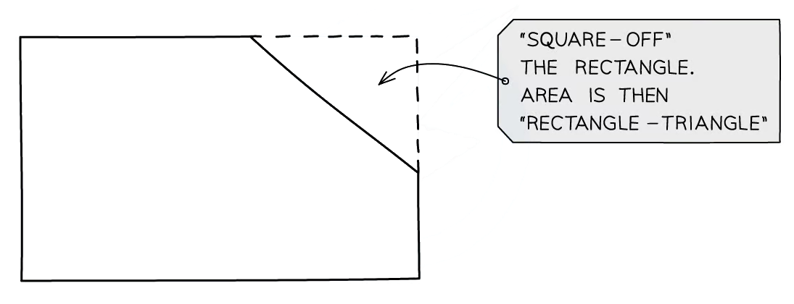

# Area & Perimeter

Course: igcse-maths-a-18-higher · Section: Geometry & Trigonometry

Source: https://www.savemyexams.com/igcse/maths/edexcel/a/18/higher/flashcards/4-geometry-and-trigonometry/area-and-perimeter/

## Card 1 — true_or_false (`fl_jPQZzTzRVqPNtTbD`)

**FRONT**

**True or False?**

To find the **perimeter** of a** regular** 2D shape you **multiply** the **number of sides** by the** length of one side**.

**BACK**

**True.**

To find the **perimeter** of a **regular **2D shape you **multiply** the **number of sides** by the **length of one side**.

## Card 2 — true_or_false (`fl_7W3FxHpKpmbJbrh7`)

**FRONT**

**True or False?**

In a **compound shape **made up of **two rectangles**, the length of the two shorter sides **opposite** a longer side will add up to the **same length** as the longer side.

**BACK**

**True.**

In a **compound shape **made up of **two rectangles**, the length of the two shorter sides **opposite** a longer side will add up to the **same length** as the longer side.

## Card 3 — question_and_answer (`fl_tV3TmjygjZCMSmxy`)

**FRONT**

What does a '**dash**' on **two or more sides** of a shape in a diagram indicate?

**BACK**

**All sides** in a diagram that are annotated with a **dash** are of **equal length**.

E.g. A rectangle has two pairs of opposite sides of equal length.

## Card 4 — question_and_answer (`fl_8FV7HNxsvFNDCcXs`)

**FRONT**

What is the term used to describe the** perimeter **of a **circle**?

**BACK**

The **circumference** of a **circle** is its** perimeter**.

## Card 5 — question_and_answer (`fl_2V246hbbcxxCnTwr`)

**FRONT**

What is the** formula** for the **area of a triangle**?

**BACK**

The formula for the** area of a triangle** is $A=\frac{1}{2}bh$

Where:

- $A=$area
- $b=$base
- $h=$perpendicular height

## Card 6 — question_and_answer (`fl_Q5H3WcN25qCKp5vF`)

**FRONT**

What is the **formula** for the **area of a rectangle**?

**BACK**

The formula for the** area of a rectangle** is $A=lw$

Where:

- $A=$area
- $l=$length
- $w=$width

## Card 7 — question_and_answer (`fl_J32s2pzRSPZfyrnw`)

**FRONT**

What is the** formula** for the **area of a parallelogram**?

**BACK**

The formula for the **area of a parallelogram **is $A=bh$

Where:

- $A=$area
- $b=$base
- $h=$perpendicular height

## Card 8 — question_and_answer (`fl_gkzVwbZCk5JQtV2J`)

**FRONT**

What is the** formula** for the **area of a trapezium**?

**BACK**

The formula for the **area of a trapezium** is `A equals 1 half open parentheses a plus b close parentheses h`

Where:

- $A=$area
- $a$ and $b$ are the lengths of the two parallel sides
- $h=$perpendicular height

## Card 9 — true_or_false (`fl_H6ZK7TzSXqcq6sV4`)

**FRONT**

**True or False? **

The **formula** for the **area of a circle** is $A=2πr$.

**BACK**

**False. **

The formula for the **area of a circle** is $A=πr^{2}$

Where:

- $A=$area
- $r=$radius

## Card 10 — question_and_answer (`fl_gFyWKtYtVTFy2NQp`)

**FRONT**

How do you find the** area of a compound shape**?

**BACK**

First **split the shape** into a combination of** standard shapes**.

Find the **area of each **of the standard shapes and **add **them together.

## Card 11 — true_or_false (`fl_DxKRDFqVkKwgqmYM`)

**FRONT**

**True or False? **

The **area of a compound shape** can **only **be found by** adding areas**.

**BACK**

**False. **

You may usually find the area of a compound shape by adding areas but sometimes it may be easier to find the **area of a larger shape **and **subtract **the area of **another** **shape** from it to find the area of the compound shape.

## Card 12 — true_or_false (`fl_478rWFnnfcjjtpM9`)

**FRONT**

**True or False?**

An exam question will always tell you the **specific measure or quantity** that you need to calculate.

**BACK**

**False.**

Sometimes the** specific measure or quantity **that you need to calculate will only be **implied** by the context of the question.

E.g. When being asked to find the **amount of paint** required for a wall, you will need to calculate the **area of the wall**.

