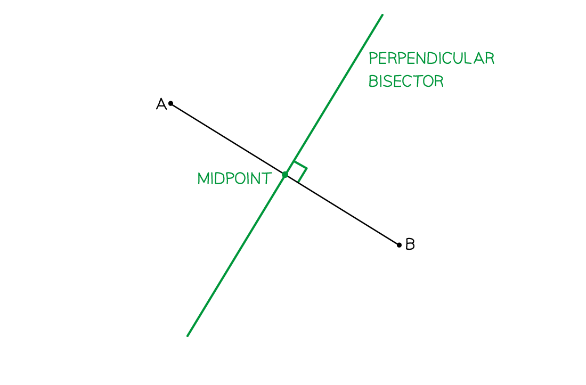

# Bearings, Scale Drawing & Constructions

Course: igcse-maths-a-18-higher · Section: Geometry & Trigonometry

Source: https://www.savemyexams.com/igcse/maths/edexcel/a/18/higher/flashcards/4-geometry-and-trigonometry/bearings-scale-drawing-and-constructions/

## Card 1 — keyword_definition (`fl_z4g8mCR6Z23mKx3G`)

**FRONT**

What is a **bearing**?

**BACK**

A bearing is a way of **describing** and** using** **a direction as an angle**.

## Card 2 — question_and_answer (`fl_wQB68XdMPp4xcxmz`)

**FRONT**

From **which compass direction** should a bearing always be measured?

**BACK**

A bearing should always be measured from **North**.

## Card 3 — true_or_false (`fl_ZRQwKjSbVYX5jb9f`)

**FRONT**

**True or False?**

Bearings are measured in an **anti-clockwise** direction.

**BACK**

**False.**

Bearings are measured in a **clockwise** direction.

## Card 4 — question_and_answer (`fl_k5rydtF8QhGMgmKT`)

**FRONT**

How many** figures** must a bearing be written with?

**BACK**

A bearing must be written with **3 figures**.

For angles under 100°, zero(es) should be used to fill in the missing figures, e.g. 059º, 008º.

## Card 5 — true_or_false (`fl_sRmWWnvGFb9Fn8Ns`)

**FRONT**

**True or False?**

**SOHCAHTOA **and** Pythagoras' theorem** are frequently used in bearings questions.

**BACK**

**True.**

**Pythagoras' theorem** and **SOHCAHTOA **are frequently used in bearings questions.

This is because situations often include finding missing lengths or angles in **right-angled triangles**.

## Card 6 — question_and_answer (`fl_TzGRtNhvVm4HqzzR`)

**FRONT**

If a** bearing of A from B **is known, how do you find the** bearing** **of B from A**?

**BACK**

If a bearing** of A from B is less than 180****o**, then **add 180****o**** **to find the** bearing of B from A.**
E.g. if the bearing of** **A from B is 030o, then the bearing of B from A is 210o.

If a bearing** of A from B is greater than 180****o**, then** subtract 180****o**** **to find the** bearing of B from A.**
E.g. if the bearing of** **A from B is 270o, the bearing of B from A is 090o.

## Card 7 — question_and_answer (`fl_CgDY69VqWdyxpRsV`)

**FRONT**

Which** compass direction **is indicated by a **bearing of 090°**?

**BACK**

When a bearing is 090°, it means **due east**.

## Card 8 — true_or_false (`fl_sjjD4CRqgngn4cNQ`)

**FRONT**

**True or False?**

**North **should always be indicated on a diagram.

**BACK**

**True. **

**North **should always be indicated on a diagram as a point of reference.

## Card 9 — question_and_answer (`fl_PjYZS2rKFc46XkFG`)

**FRONT**

What does it mean when a **scale **for a diagram** is given as a ratio**?

E.g. a scale of 1 : 10,000.

**BACK**

When the scale is given as a ratio (e.g., 1:10,000), it means that **1 unit **on the diagram represents **10,000 of the same type of units** in real life.

E.g. 1 cm on map = 10, 000 cm (or 100 m) in real life

## Card 10 — question_and_answer (`fl_xsgtKcGSQ3cqfpNn`)

**FRONT**

How is a** scale **length on a map **converted **to a **real-life **length?

E.g. a length of 3 cm on a map with scale 1 : 20, 000.

**BACK**

To convert from a scale length to a real length, **multiply by the scale factor**.

E.g. 3 × 20 000 = 60 000 cm (600 m).

## Card 11 — question_and_answer (`fl_2vzCNRS6WcyK8DR5`)

**FRONT**

How is a **real-life** length** converted **to a **scale** length on a map?

E.g. a real-length of 15 km using a map with scale 1 : 50, 000.

**BACK**

To convert from a real length to a scale length,** divide by the scale factor**.

E.g. 15 ÷ 50, 000 = 0.000 3 km (30 cm).

## Card 12 — true_or_false (`fl_B6ZRKBWGmhZZVHFn`)

**FRONT**

**True or False?**

It may be helpful to **convert the scale** **to more suitable units** when dealing with very small or large scales.

**BACK**

**True.**

It may be helpful to **convert the scale** **to more suitable units** when dealing with very small or large scales.

For example, if 1 cm on a map represents 25,000 cm in real life, it may be easier to convert the units and use 1 cm represents 250 m or 0.25 km.

## Card 13 — true_or_false (`fl_D4b37Wcy6fbqV3sJ`)

**FRONT**

**True or False? **

Map scales are always given with **units**.

**BACK**

**False. **

Map scales are usually given in the form 1 : n with **no reference to units**.

## Card 14 — keyword_definition (`fl_GXZNjXb65zh4WnjC`)

**FRONT**

What is meant by a "**scale drawing**"?

**BACK**

A **scale drawing** uses a given scale (e.g. 1 : 300) to produce an **accurate** drawing of a real life object.

They are used when designing a vehicle or a building.

## Card 15 — question_and_answer (`fl_FXdXZWCxYhqg25v5`)

**FRONT**

What **equipment **might you need to be able to **construct a triangle**?

**BACK**

The **equipment** you may need to be able to **construct a triangle** is:

- A sharp **pencil**
- A **ruler**
- A **protractor**
- A pair of **compasses**

## Card 16 — question_and_answer (`fl_NkDVF4Xf7XDdTY5H`)

**FRONT**

You could be asked to **construct a triangle** for any of the following cases: **SSS**, **SAS**, or **ASA**.

What do each of these mean?

**BACK**

When **constructing a triangle**, it could be for any of the following cases:

- **SSS **- you are given the lengths of all three sides.
- **SAS** - you are given the lengths of two sides and the angle in between them (the included angle).
- **ASA** - you are given the size of two angles and the length of the side in between them (the included side).

## Card 17 — question_and_answer (`fl_ycQnVtyGB8bgxBBC`)

**FRONT**

How would you **construct a triangle** when told the** lengths of three sides**? (**SSS**)

**BACK**

To **construct a triangle** when told the** lengths of three sides **(**SSS**):

1. Draw the longest side using a ruler as a horizontal base.
2. Use compasses set to the length of the next side and draw an arc from the end of the base line.
3. Repeat this for the third side, drawing an arc from the other end of the base line, the same length as the third side.
4. The arcs should intersect. Join the intersection of the arcs to each end of the base line using a ruler.

## Card 18 — question_and_answer (`fl_WThZhHXPYKnbTjnx`)

**FRONT**

How would you **construct a triangle** when told the** lengths of two sides**, and the** angle **between them? (**SAS**)

**BACK**

To **construct a triangle** when told the** lengths of two sides **and the **angle between them **(**SAS**):

1. Draw the longest side using a ruler as a horizontal base.
2. Use a protractor to measure the given angle from one end of the base line and make a mark on the paper at this angle.
3. Use a ruler to draw the second given side length from the end of the base line through the mark you have just made.
4. Check the lengths and angles are all correct so far using a ruler and protractor.
5. Use a ruler to draw the remaining side, between the end of the base line and the end of the second given side.

## Card 19 — question_and_answer (`fl_h2cvymqdmFrzGdbC`)

**FRONT**

How would you **construct a triangle** when told **two angles**, and the** length of a side **between them? (**ASA**)

**BACK**

To **construct a triangle** when told **two angles**, and the** length of a side **between them (**ASA**):

1. Use a ruler to draw the given length as a horizontal base.
2. Use a protractor to measure the first given angle from one end of the base line and make a mark on the paper at this angle.
3. Use a ruler to join the end of the horizontal base line to the mark you have just made, and extend the line further.
4. Repeat steps 2 & 3 for the second given angle, at the other end of the base line.
5. The lines should intersect, forming a triangle.

## Card 20 — true_or_false (`fl_JdD3K4zRWt2QrRVH`)

**FRONT**

**True or False?**

You should **leave all your working and construction lines** on the page, and not rub any out.

**BACK**

**True.**

You should **leave all your working and construction lines** on the page, and not rub any out.

## Card 21 — keyword_definition (`fl_4b2PtNgQfdR25PXH`)

**FRONT**

What is a **perpendicular bisector**?

**BACK**

A **perpendicular bisector** is a line that** cuts another line exactly in half** (bisects) and also **crosses it at a right angle** (perpendicular).

## Card 22 — question_and_answer (`fl_G7nZKyd9QtmXG3VJ`)

**FRONT**

How would you **construct **a** perpendicular bisector?**

**BACK**

To construct a **perpendicular bisector**:

1. Set the distance between the point of the compasses and the pencil to be **more than half the length** of the line.
2. Place the point of the compasses on one end of the line and **sketch an arc** **above **and **below **the line.
3. Keeping your compasses set to the **same distance**, move the point of the compasses to the **other end of the line** and sketch an arc **above **and **below **it again.
4. The **arcs should intersect** each other both above and below the line, **connect **the points where the arcs intersect using a **ruler**.

## Card 23 — true_or_false (`fl_NRZ9qdSmghmtyKvB`)

**FRONT**

**True or False?**

The **shortest distance** from a **point **to a **line **is a **straight line**, which meets the line at **90 degrees**.

**BACK**

**True.**

The **shortest distance** from a **point **to a **line **is a **straight line**, which meets the line at **90 degrees**.

E.g. When finding the shortest distance between a boat and a coastline, construct a perpendicular line from the boat to the coastline.

## Card 24 — question_and_answer (`fl_ZyZhNVsp6ffpx8rt`)

**FRONT**

How would you **construct a perpendicular to a line, from a point?**

**BACK**

To construct a **perpendicular to a line, from a point**:

1. Set the distance between the point of your compasses and the pencil to be **greater than the distance between the point and the line**.
2. Place the point of the compasses onto the point and **draw an arc that intersects the line** in **two **places.
3. Make sure that the distance between the point of the compasses and the pencil is greater than half the distance between the intersection points. Place the point of the compasses on a **point of intersection**, and **sketch an arc** above and below the line.
4. Keeping the distance between the point on the compasses and the pencil **the same**, do this **again **from the **other point of intersection**. These should **intersect **with the previous arcs.
5. **Join** the **original point **with the point where the** arcs intersect**.

## Card 25 — keyword_definition (`fl_dGrNPwcN6Kz5Qyw4`)

**FRONT**

What is an **angle bisector**?

**BACK**

An **angle bisector** is a line that **cuts an angle exactly in half** (bisect).

## Card 26 — question_and_answer (`fl_S9sXPYnG9Ms2YsFc`)

**FRONT**

How would you **construct an angle bisector?**

**BACK**

To construct an **angle bisector**:

1. Place the point of the **compasses at the point of the angle** and **sketch an arc** that intersects both of the lines that form the angle.
2. Set the distance between the point of your compasses and the pencil to be greater than half the distance between the intersection points. Place the point of the compasses **on one of the points of intersection** and **sketch an arc**.
3. Keeping the **distance **between the point of the compasses and the pencil** the same**, place the point of the compasses on the **other point of intersection** and **sketch another arc**, this should intersect the arc sketched in step 2.
4. **Join **the** point of the angle** to the **point of intersection** of the arcs with a ruler.

