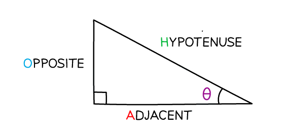
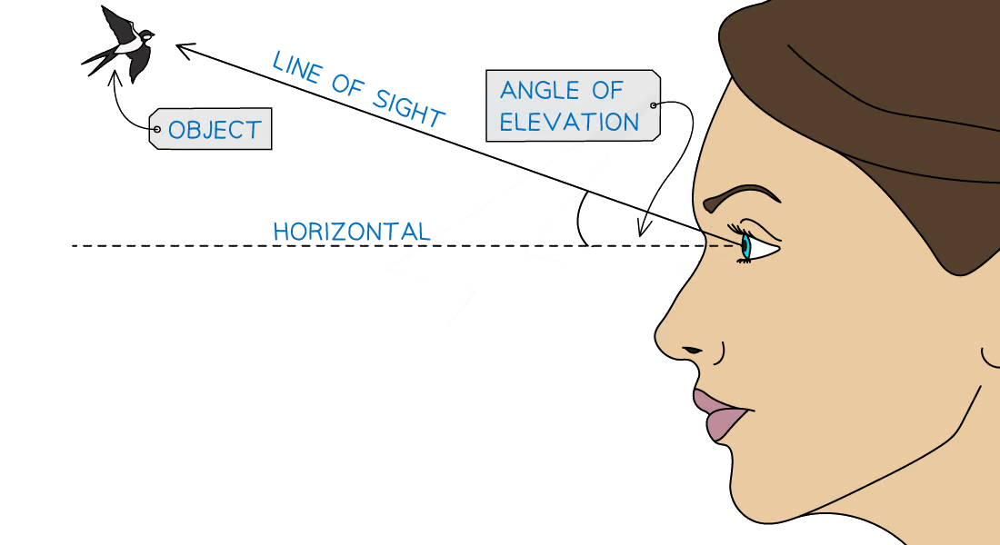
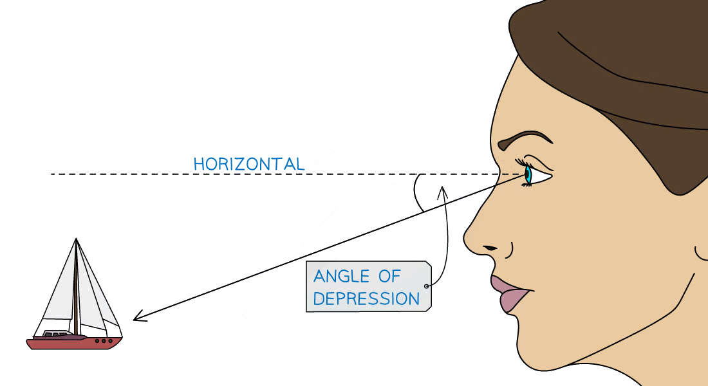

# Right-Angled Triangles - Pythagoras & Trigonometry

Course: igcse-maths-a-18-higher · Section: Geometry & Trigonometry

Source: https://www.savemyexams.com/igcse/maths/edexcel/a/18/higher/flashcards/4-geometry-and-trigonometry/right-angled-triangles---pythagoras-and-trigonometry/

## Card 1 — keyword_definition (`fl_8XT4FhXHBnF4FCK8`)

**FRONT**

What is the** hypotenuse**?

**BACK**

The **hypotenuse** is the **longest side** in a **right-angled triangle**.

It is located **opposite the right angle**.

## Card 2 — keyword_definition (`fl_G2VWFHHWJXX44JHG`)

**FRONT**

State the **equation**, in terms of $a$, $b$, and $c$, for **Pythagoras' theorem, **where $c$ is the **length of the hypotenuse**.

**BACK**

The** equation** for **Pythagoras' theorem** is $a^{2}+b^{2}=c^{2}$

Where:

- $a$ and $b$ are the lengths of the two shorter sides
- $c$ is the length of the hypotenuse

## Card 3 — true_or_false (`fl_rcjMmjFVPzf67J7g`)

**FRONT**

**True or False?**

Pythagoras' theorem applies to **equilateral **triangles.

**BACK**

**False.**

Pythagoras' theorem can only be used on **right-angled triangles**.

An equilateral triangle contains no right angles. However an isosceles or scalene triangle may also be a right-angled triangle.

## Card 4 — true_or_false (`fl_fwMJb9RgwBpyGn22`)

**FRONT**

**True or False? **

To find the length of the **hypotenuse**, you **add inside the square root**.

**BACK**

**True.**

To find the length of the **hypotenuse**, you **add inside the square root **using $c=\sqrt{a^{2}+b^{2}}$

## Card 5 — question_and_answer (`fl_4VFSx6ZCHtsVv47j`)

**FRONT**

What is the** equation** to find the length of **one of the** **shorter sides** in a right-angled triangle?

**BACK**

To find the length of **one of the shorter sides** in a right-angled triangle, use the equation $a=\sqrt{c^{2}-b^{2}}$ or $b=\sqrt{c^{2}-a^{2}}$.

## Card 6 — question_and_answer (`fl_WKcPb38KpqczGK3N`)

**FRONT**

What does **SOHCAHTOA** stand for?

**BACK**

**SOHCAHTOA** is a mnemonic to help you remember the different **trigonometric ratios**.

It stands for:

- Sin = Opposite ÷ Hypotenuse
- Cos = Adjacent ÷ Hypotenuse
- Tan = Opposite ÷ Adjacent

## Card 7 — keyword_definition (`fl_HhSFJbDMbcGZxrs2`)

**FRONT**

State the SOHCAHTOA **equation **for **sine**.

**BACK**

The SOHCAHTOA **equation **for **sine **is `sin open parentheses theta close parentheses equals Opposite over Hypotenuse`.

## Card 8 — keyword_definition (`fl_K2fBXz7D5Yr8zfX4`)

**FRONT**

State the SOHCAHTOA **equation** for **cosine**.

**BACK**

The SOHCAHTOA **equation **for **cosine** is `cos open parentheses theta close parentheses equals Adjacent over Hypotenuse`.

## Card 9 — keyword_definition (`fl_yT4TbCTvNqNN78pV`)

**FRONT**

State the SOHCAHTOA **equation** for **tangent**.

**BACK**

The SOHCAHTOA **equation **for **tangent **is `tan open parentheses theta close parentheses equals Opposite over Adjacent`.

## Card 10 — question_and_answer (`fl_NJJGFpwyjSFRwH4d`)

**FRONT**

What** type of triangles** can SOHCAHTOA be used on?

**BACK**

SOHCAHTOA can only be used on **right-angled triangles**.

## Card 11 — question_and_answer (`fl_mz3KW39S5kDnDt4N`)

**FRONT**

What does the** inverse trigonometric function **do, e.g. $\mathrm{sin}^{-1}$?

**BACK**

The** inverse trigonometric function** is used to **find missing angles** when two sides of a right-angled triangle are known.

E.g. `theta equals sin to the power of negative 1 end exponent open parentheses Opposite over Hypotenuse close parentheses`.

## Card 12 — question_and_answer (`fl_8z9BxxM7C6XpfgPd`)

**FRONT**

What **labels** are given to the **sides of a triangle **when using SOHCAHTOA?

**BACK**

The three sides are labelled the **Hypotenuse** (the side opposite the right-angle), the **Adjacent** (the side next to the angle in question) and the **Opposite** (the side opposite the angle in question).

## Card 13 — question_and_answer (`fl_4HfQFWbP9Xz9XSQV`)

**FRONT**

What is the **angle of elevation**?

**BACK**

The **angle of elevation **is the angle between the horizontal and the line of sight when **looking up** at an object.

## Card 14 — question_and_answer (`fl_Y5kgNPXWPpXhBpFd`)

**FRONT**

What is the **angle of depression**?

**BACK**

The **angle of depression** is the angle between the horizontal and the line of sight when **looking down** at an object.

## Card 15 — question_and_answer (`fl_4HVdvTXzcxJKZdBM`)

**FRONT**

Which **trigonometric ratio **is often used in problems involving angles of elevation and depression?

**BACK**

The trigonometric ratio that is often used in real-life scenarios with angles of elevation and depression is the **tangent ratio**.

This is because real-life questions are often concerned with the height of an object (the 'opposite' side) and the horizontal distance from an object (the 'adjacent' side).

