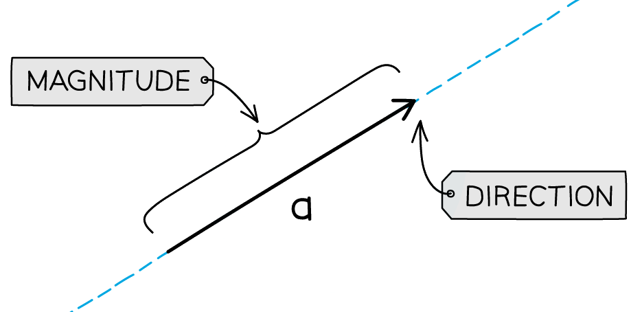
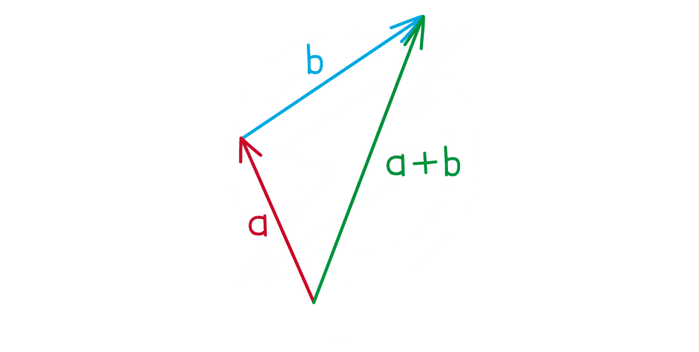

# Vectors

Course: igcse-maths-a-18-higher · Section: Vectors & Transformation Geometry

Source: https://www.savemyexams.com/igcse/maths/edexcel/a/18/higher/flashcards/5-vectors-and-transformation-geometry/vectors/

## Card 1 — keyword_definition (`fl_CGRrvKdt2TH9wft5`)

**FRONT**

What is a **vector**?

**BACK**

A **vector **is a type of number with both **size **and **direction**.

## Card 2 — true_or_false (`fl_F6PVd4vByfyM8PMN`)

**FRONT**

**True or False?**

$\overset{\rightarrow}{BA}$ represents the vector **from **$B$** to **$A$.

**BACK**

**True.**

$\overset{\rightarrow}{BA}$ represents the vector **from **$B$** to **$A$.

## Card 3 — question_and_answer (`fl_kQd88cdMCY2T9HBk`)

**FRONT**

How do you write "**3 to the left and 2 up**" as a **column vector**?

**BACK**

"**3 to the left and 2 up**" can be written as the **column vector** `open parentheses table row cell negative 3 end cell row 2 end table close parentheses`.

## Card 4 — true_or_false (`fl_VD2Tz9jxdz9NWds6`)

**FRONT**

**True or False?**

The vector `open parentheses table row 2 row 3 end table close parentheses` **must **be drawn **starting **at `open parentheses 0 comma space 0 close parentheses` and **ending **at the point `open parentheses 2 comma space 3 close parentheses`.

**BACK**

**False.**

The vector `open parentheses table row 2 row 3 end table close parentheses` **does not need to **be drawn **starting **at `open parentheses 0 comma space 0 close parentheses` and **ending **at the point `open parentheses 2 comma space 3 close parentheses`.

The vector can **start at** **any point**, as long as it goes 2 to the right and 3 up.

## Card 5 — question_and_answer (`fl_XDN4G7Wxb5Z6WDZf`)

**FRONT**

How do you **add **two **column vectors**?

**BACK**

To **add **two column vectors, **add together** the numbers in the **corresponding **parts of the vector.

For example, `open parentheses table row 1 row 2 end table close parentheses plus open parentheses table row 3 row cell negative 5 end cell end table close parentheses equals open parentheses table row cell 1 plus 3 end cell row cell 2 plus open parentheses negative 5 close parentheses end cell end table close parentheses equals open parentheses table row 4 row cell negative 3 end cell end table close parentheses`.

## Card 6 — true_or_false (`fl_bRR98xXp6dz8SmN7`)

**FRONT**

**True or False?**

`5 cross times open parentheses table row 3 row 4 end table close parentheses equals open parentheses table row 15 row 4 end table close parentheses`

**BACK**

**False.**

`5 cross times open parentheses table row 3 row 4 end table close parentheses not equal to open parentheses table row 15 row 4 end table close parentheses`.

To multiply a vector by a scalar, you need to **multiply all parts **of the vector by the scalar.

`5 cross times open parentheses table row 3 row 4 end table close parentheses equals open parentheses table row cell 5 cross times 3 end cell row cell 5 cross times 4 end cell end table close parentheses equals open parentheses table row 15 row 20 end table close parentheses`.

## Card 7 — question_and_answer (`fl_BYdVMRYGcTqr2YqR`)

**FRONT**

If you know what the vectors $a$ and $b$ look like, how can you draw the vector $a+b$?

**BACK**

If you know what the vectors $a$ and $b$ look like, to draw the vector $a+b$:

- Draw the vector $a$
- Draw the vector $b$ starting at the end of $a$
- Draw a vector from the start of $a$ to the end of $b$

## Card 8 — true_or_false (`fl_g9PyWbH4dGCjhv3N`)

**FRONT**

**True or False?**

The vector $2a$ is in the **same direction **as $a$ but is **double the length **of** **$a$.

**BACK**

**True.**

The vector $2a$ is in the **same direction** as $a$ but is **double the length**.

Scalar multiples of a vector change the length of the vector.

## Card 9 — question_and_answer (`fl_YWpppJrc3CnhdV8X`)

**FRONT**

What is the **geometrical relationship** between the vectors $a$ and $-a$?

**BACK**

The vectors $a$ and $-a$ have the **same length** but they are in **opposite directions**.

## Card 10 — keyword_definition (`fl_NtBb39WBthJp8nkK`)

**FRONT**

What is meant by the **magnitude (modulus)** of a vector?

**BACK**

The **magnitude (modulus)** of a vector is its **length**.

## Card 11 — true_or_false (`fl_RxfsfJFzG68qqCbx`)

**FRONT**

**True or False?**

The **magnitude **of the vector `open parentheses table row 2 row 3 end table close parentheses` is $2^{2}+3^{2}$.

**BACK**

**False.**

The **magnitude **of the vector `open parentheses table row 2 row 3 end table close parentheses` is **not **$2^{2}+3^{2}$.

To find the magnitude of a vector, you square the numbers, add them together and then take the positive square root.

The **magnitude **of the vector `open parentheses table row 2 row 3 end table close parentheses` is $\sqrt{2^{2}+3^{2}}$.

## Card 12 — true_or_false (`fl_rJs5BpwzCG2c38R3`)

**FRONT**

**True or False?**

The **magnitude **of the vector `open parentheses table row 2 row cell negative 3 end cell end table close parentheses` is $\sqrt{2^{2}-3^{2}}$.

**BACK**

**False.**

The **magnitude **of the vector `open parentheses table row 2 row cell negative 3 end cell end table close parentheses` is **not **$\sqrt{2^{2}-3^{2}}$.

You need to square the negative in front of the 3.

The **magnitude **of the vector `open parentheses table row 2 row cell negative 3 end cell end table close parentheses` is `square root of 2 squared plus open parentheses negative 3 close parentheses squared end root`.

## Card 13 — true_or_false (`fl_WWRc8mBcJdNqHv6T`)

**FRONT**

**True or False?**

$\overset{\rightarrow}{AB}=\overset{\rightarrow}{OA}-\overset{\rightarrow}{OB}$

**BACK**

**False.**

$\overset{\rightarrow}{AB}\neq\overset{\rightarrow}{OA}-\overset{\rightarrow}{OB}$

The **correct **equation is $\overset{\rightarrow}{AB}=\overset{\rightarrow}{OB}-\overset{\rightarrow}{OA}$.

## Card 14 — true_or_false (`fl_dmWgGTNKKX9QpVvY`)

**FRONT**

**True or False?**

$\overset{\rightarrow}{AB}+\overset{\rightarrow}{BC}=\overset{\rightarrow}{AC}$

**BACK**

**True.**

$\overset{\rightarrow}{AB}+\overset{\rightarrow}{BC}=\overset{\rightarrow}{AC}$

This means if you start at A then go to B and then go to C, this is the **same vector** as starting at A and going to C.

## Card 15 — question_and_answer (`fl_fV8bNcHP8bPj7CQC`)

**FRONT**

How else could you write the vector $-\overset{\rightarrow}{AB}$?

**BACK**

The vector $-\overset{\rightarrow}{AB}$ can also be written as $\overset{\rightarrow}{BA}$.

## Card 16 — true_or_false (`fl_f2N65SKZhxDDP3Qt`)

**FRONT**

**True or False?**

If two vectors are **parallel**, then they are **scalar multiples**.

**BACK**

**True.**

If two vectors are **parallel**, then they are **scalar multiples**.

E.g. the vectors $3a$ and $12a$ are parallel.

## Card 17 — true_or_false (`fl_BhZ7fPM5J2V4MM9B`)

**FRONT**

**True or False?**

If the point P **divides **the line AB in the ratio 1 : 3, then $\overset{\rightarrow}{AP}=\frac{1}{3}\overset{\rightarrow}{AB}$.

**BACK**

**False.**

If the point P **divides **the line AB in the ratio 1 : 3, then $\overset{\rightarrow}{AP}\neq\frac{1}{3}\overset{\rightarrow}{AB}$.

P divides the line into 4 equal parts, with 1 part on one side, and 3 parts on the other side.

The correct equation is $\overset{\rightarrow}{AP}=\frac{1}{4}\overset{\rightarrow}{AB}$.

## Card 18 — question_and_answer (`fl_bvrgQcnTkJC2trGN`)

**FRONT**

If the vectors $\overset{\rightarrow}{AB}$ and $\overset{\rightarrow}{AC}$ are **parallel**, what does this tell you about the **three points**, $A$, $B$ and $C$?

**BACK**

If the vectors $\overset{\rightarrow}{AB}$ and $\overset{\rightarrow}{AC}$ are **parallel**, then the **three points** $A$, $B$ and $C$ all lie on the **same straight line**.

## Card 19 — question_and_answer (`fl_TF7QdfvkV4pPVWPq`)

**FRONT**

Points *A* and *B* have position vectors $a$ and $b$, respectively.

Write a **formula **for the **position vector** of the **midpoint **of *A* and *B* in terms of  $a$ and $b$.

**BACK**

Points *A* and *B* have position vectors $a$ and $b$, respectively.

A **formula **for the **position vector** of the **midpoint **of *A* and *B* is `1 half open parentheses bold a plus bold b close parentheses`.

