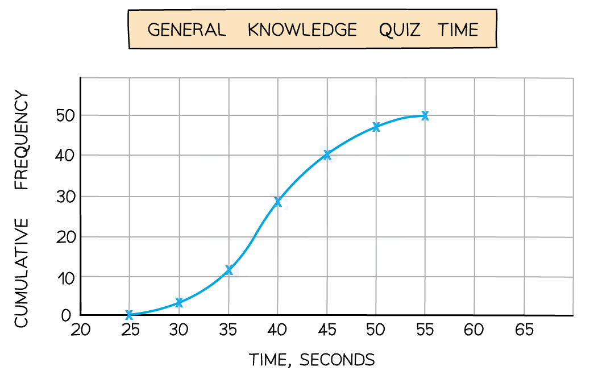

# Cumulative Frequency Diagrams

Course: igcse-maths-a-18-higher · Section: Statistics & Probability

Source: https://www.savemyexams.com/igcse/maths/edexcel/a/18/higher/flashcards/6-statistics-and-probability/cumulative-frequency-diagrams/

## Card 1 — keyword_definition (`fl_T8k8VpnjNfsysmzx`)

**FRONT**

What is meant by **cumulative frequency**?

**BACK**

The **cumulative frequency **of an item is the **total frequency** of all items that are **less than or equal to** the given item.

Cumulative frequency is a **running total** of the frequencies.

## Card 2 — question_and_answer (`fl_kzqqpHb2dd8crTh6`)

**FRONT**

In a **cumulative frequency table**, such as the one below, how do you find the** actual frequency** for a **particular group**?

| **Group** | **Cumulative frequency** |
|---|---|
| 0 ≤ *x* < 20 | 14 |
| 0 ≤ *x* < 40 | 39 |
| 0 ≤ *x* < 60 | 68 |

**BACK**

To find the **actual frequency** for a **particular group** from a cumulative frequency table, subtract the previous cumulative frequency from the cumulative frequency for the the group that you want.

| **Group** | Cumulative Frequency | **Actual frequency** |
|---|---|---|
| 0 ≤ *x* < 20 | 14 | 14 |
| 0 ≤ *x* < 40 | 39 | 39 - 14 = 25 |
| 0 ≤ *x* < 60 | 68 | 68 - 39 = 29 |

## Card 3 — question_and_answer (`fl_TW8kvGvgmWkCWcM2`)

**FRONT**

How do you draw a **cumulative frequency diagram**?

**BACK**

To draw a **cumulative frequency diagram**:

- For each group, plot the cumulative frequency at the endpoint of the group
- Join the points together with a smooth curve that is always increasing

## Card 4 — true_or_false (`fl_cfnjnd3y6XJsVvmq`)

**FRONT**

**True or False?**

To draw a **cumulative frequency diagram**, you plot the **midpoint **of a group against its **frequency**.

**BACK**

**False.**

To draw a **cumulative frequency diagram**, you do **not **plot the **midpoint **of a group against its **frequency**.  This is a mistake that students often make on the exam.

You plot the **endpoint **of a group against its **cumulative frequency**.

## Card 5 — question_and_answer (`fl_Wd2KPFf6HcnrmNDG`)

**FRONT**

What **shape** does a typical **cumulative frequency diagram **make?

**BACK**

A typical **cumulative frequency diagram** is an 's-shaped' curve, e.g.

## Card 6 — true_or_false (`fl_p87Nqbhbg2M5Tspn`)

**FRONT**

**True or False?**

A **cumulative frequency diagram **will get slightly **closer** to the** *****x*****-axis **again at the **end of the curve**.

**BACK**

**False.**

A **cumulative frequency diagram **will **never** get closer to the** *****x*****-axis**.

## Card 7 — question_and_answer (`fl_jYCFzRhCjzBXBvZh`)

**FRONT**

If the** total frequency **is 100, how do you use a **cumulative frequency diagram** to estimate the **median **value?

**BACK**

If the** total frequency **is 100, you can use a **cumulative frequency diagram** to estimate the **median **value.

1. Draw a **horizontal **line from 50 ($100\div2$) on the vertical axis to the curve.
2. Draw a **vertical **line down from this point on the curve to the horizontal axis.

The value on the **horizontal axis** is an estimate of the **median**.

## Card 8 — question_and_answer (`fl_RTbkDf7fxzbccKJ3`)

**FRONT**

How can you estimate the **lower quartile** using a **cumulative frequency diagram**?

**BACK**

To estimate the **lower quartile** using a **cumulative frequency diagram**:

1. Divide the total frequency by 4.
2. Draw a horizontal line from that result on the vertical axis to the curve.
3. Draw a vertical line down from this point to the horizontal axis.

The number on the **horizontal axis** is an estimate for the **lower quartile**.

## Card 9 — true_or_false (`fl_mg6qFsRXX8cdzf43`)

**FRONT**

**True or False?**

To find the **number** of data items** **that are **greater than** a particular value:

- find the relevant value on the *x*-axis,
- draw a vertical line up to the curve,
- then draw a horizontal line back across to the *y*-axis.

The value on the *y*-axis will be the number of data items that are greater than that value.

**BACK**

**False.**

If you follow those steps you have found the number of data items that are **less than or equal to the specified value**.

To find the number of data items that are **greater** than the value, you need to **subtract** the number of data items that are less than or equal to the specified value from the total number of data items.

