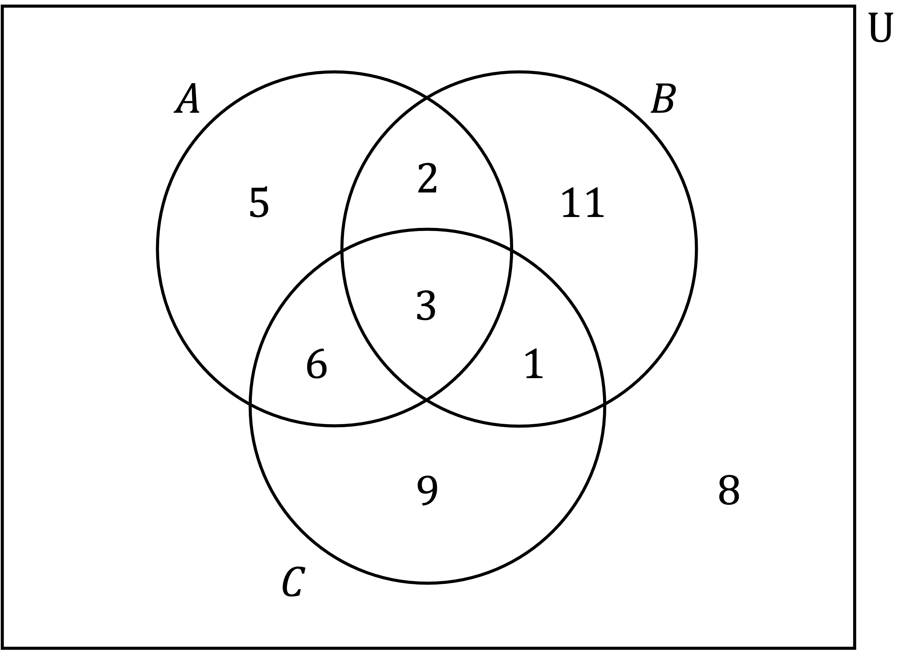
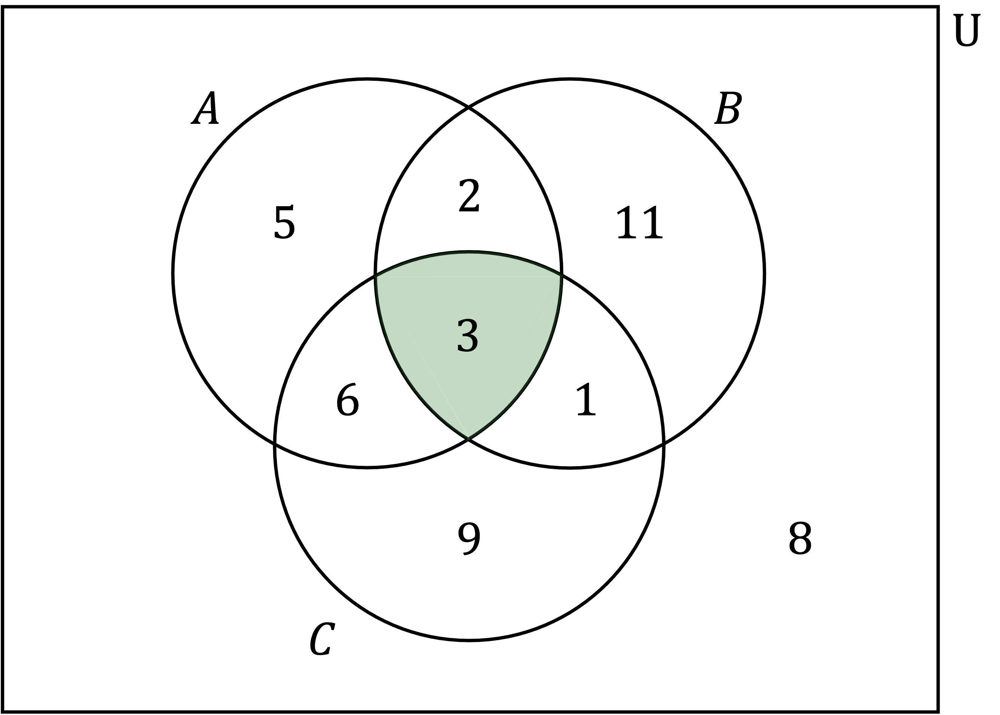

# Probability Diagrams - Venn & Tree Diagrams

Course: igcse-maths-a-18-higher · Section: Statistics & Probability

Source: https://www.savemyexams.com/igcse/maths/edexcel/a/18/higher/flashcards/6-statistics-and-probability/probability-diagrams---venn-and-tree-diagrams/

## Card 1 — keyword_definition (`fl_FJqZwqqx3rvwfcfB`)

**FRONT**

Describe how to find `straight P open parentheses A close parentheses` from a Venn diagram that shows sets $A$ and $B$.

E.g. find `straight P open parentheses A close parentheses` from the Venn diagram.

**BACK**

`straight P open parentheses A close parentheses` is the probability of being in set $A$.

This is the number inside the full circle of set $A$ divided by the total number of the whole Venn diagram, e.g. `straight P open parentheses A close parentheses equals fraction numerator 8 plus 2 over denominator 8 plus 2 plus 15 plus 7 end fraction equals 10 over 32`.

## Card 2 — keyword_definition (`fl_yfw72p9dtprCHCJv`)

**FRONT**

Describe how to find `straight P open parentheses A intersection B close parentheses` from a Venn diagram that shows sets $A$ and $B$.

E.g. find `straight P open parentheses A intersection B close parentheses` from the Venn diagram.

**BACK**

`straight P open parentheses A intersection B close parentheses` is the probability of being in the intersection of set $A$ and set $B$.

This is the value inside the  **overlapping region** of set $A$ and set $B$ divided by the total number of the whole Venn diagram, e.g. `straight P open parentheses A intersection B close parentheses equals fraction numerator 2 over denominator 8 plus 2 plus 15 plus 7 end fraction equals 2 over 32`.

## Card 3 — true_or_false (`fl_MYqtm657cX3wKH3Y`)

**FRONT**

**True or False?**

If $A$ and $B$ are mutually exclusive, then `straight P open parentheses A intersection B close parentheses equals 0`.

**BACK**

**True.**

If $A$ and $B$ are mutually exclusive, then `straight P open parentheses A intersection B close parentheses equals 0`.

On a Venn diagram, if $A$ and $B$ are mutually exclusive then their circles do not overlap (they cannot both happen at the same time).

This makes being in the intersection impossible, so `straight P open parentheses A intersection B close parentheses equals 0`.

## Card 4 — true_or_false (`fl_PF7GB5g2t9gwd3Zy`)

**FRONT**

**True or False?**

To find `straight P open parentheses A union B close parentheses` you need to **double-count **the numbers in the intersection (overlap) as they occur twice.

**BACK**

**False.**

To find `straight P open parentheses A union B close parentheses` you do not double-count the numbers in the intersection $A\capB$, you just count them once.

## Card 5 — question_and_answer (`fl_KYFCzv85GpXkVymG`)

**FRONT**

Describe which region on a Venn diagram is required to calculate `straight P open parentheses A intersection B intersection C close parentheses`.

E.g. find `straight P open parentheses A intersection B intersection C close parentheses` from the Venn diagram.

**BACK**

The region required to calculate `straight P open parentheses A intersection B intersection C close parentheses` is the one that is the overlap of all three sets $A$, $B$ and $C$. E.g. `straight P open parentheses A intersection B intersection C close parentheses equals fraction numerator 3 over denominator 5 plus 2 plus 11 plus 6 plus 3 plus 1 plus 9 plus 8 end fraction equals 3 over 45`.

## Card 6 — true_or_false (`fl_v9tXGM2hWdFKnMJT`)

**FRONT**

**True or False?**

On a Venn diagram showing sets $A$ and $B$, the region required to calculate `straight P open parentheses A apostrophe close parentheses` is the part of set $B$ that does not overlap $A$.

**BACK**

**False.**

On a Venn diagram showing sets $A$ and $B$, the region required to calculate `straight P open parentheses A apostrophe close parentheses` is anything that is outside the circle of $A$, e.g.

## Card 7 — keyword_definition (`fl_vzr8cDYFYSz8sPtW`)

**FRONT**

On a Venn diagram showing sets $A$ and $B$, explain how to calculate `straight P open parentheses A vertical line B close parentheses`.

E.g. find `straight P open parentheses A vertical line B close parentheses` from the Venn diagram.

**BACK**

`straight P open parentheses A vertical line B close parentheses` is a **conditional probability **meaning the probability of being in $A$, given that you are in $B$. Therefore the probability is out of set $B$ only.

The only part of set $A$ in set $B$ is $A\capB$, so divide the number in $A\capB$ by the total number in $B$, e.g. `straight P open parentheses A vertical line B close parentheses equals fraction numerator 2 over denominator 2 plus 15 end fraction equals 2 over 17`.

## Card 8 — true_or_false (`fl_sZdnGtJDk7sMDVf3`)

**FRONT**

**True or False?**

To find the probability of *A* **and ***B* using a probability tree diagram, you **add **the probabilities on the branches fo*r A* **and ***B*.

**BACK**

**False.**

To find the probability of *A ***and ***B* using a probability tree diagram, you do **not add **the probabilities on the branches for *A* **and***** ****B*.

To find the probability of *A* **and*** B*, you **multiply **along the branches.

## Card 9 — true_or_false (`fl_rhrsXvrybyKpxwhg`)

**FRONT**

**True or False?**

The probabilities on **all of **the branches in a **probability tree diagram **should **add up to 1**.

**BACK**

**False.**

The probabilities on **all of **the branches in a **probability tree diagram **should **not add up to 1**.

The probabilities on any **set of branches **(usually a pair) should **add up to 1**.

## Card 10 — true_or_false (`fl_Rv6Cd5VvFNq4GnFZ`)

**FRONT**

**True or False?**

The **sum **of the** probabilities** of **all** of the **final outcomes **on a probability tree diagram should be **equal to 1**.

**BACK**

**True.**

The **sum **of the** probabilities** of **all** of the **final outcomes **on a probability tree diagram should be **equal to 1**.

## Card 11 — question_and_answer (`fl_dcCTJzJCxDpp8v3t`)

**FRONT**

A tree diagram is used to represent **two events**, *A* and *B*, where each event has **three possible outcomes**, 1, 2 and 3.

How many possible **final outcomes** are there?

**BACK**

For a tree diagram used to represent **two events**, where each events has **three possible outcomes**, there are nine possible final outcomes (32 = 9).

## Card 12 — question_and_answer (`fl_jVQjYpJwSPVcjPsp`)

**FRONT**

A tree diagram is used to represent **three tennis matches**, where each event has **two possible outcomes**:** player A winning** or** player B winning**.

How many possible **final outcomes** are there?

**BACK**

A tree diagram is used to represent **three tennis matches**, where each event has **two possible outcomes**:** player A winning** or** player B winning**.

There are eight possible final outcomes (23 = 8).

The eight outcomes are AAA, AAB, ABA, ABB, BAA, BAB, BBA, BBB.

