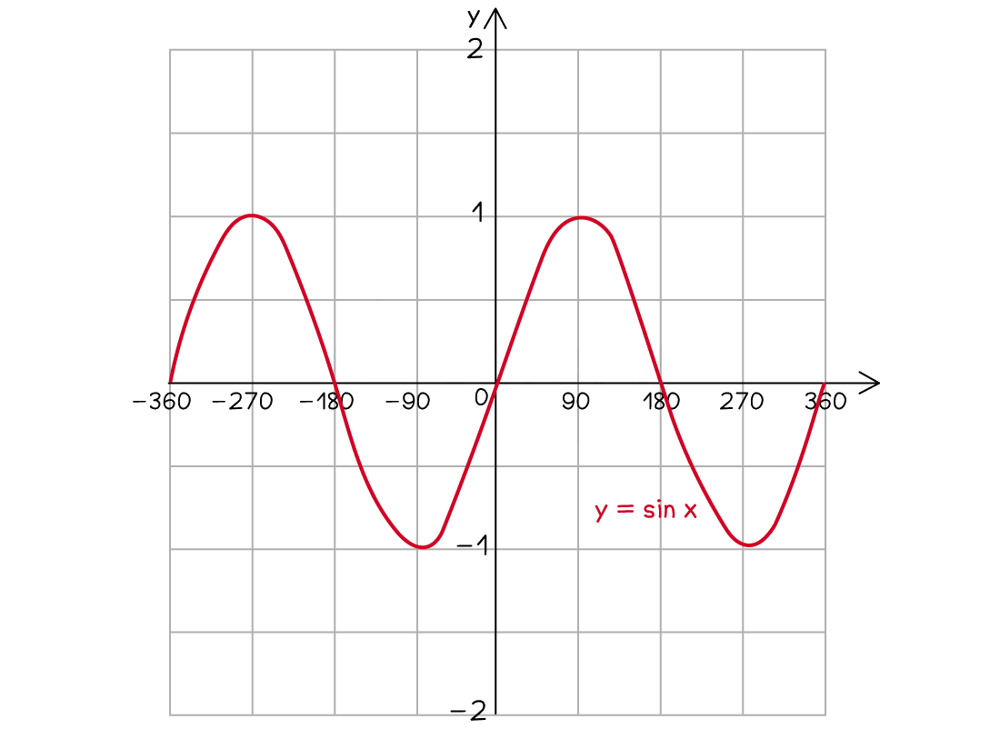
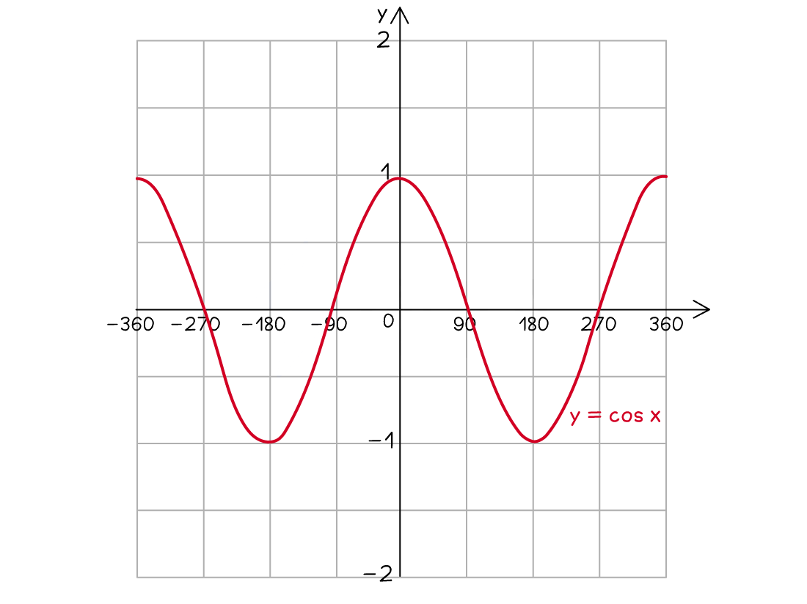
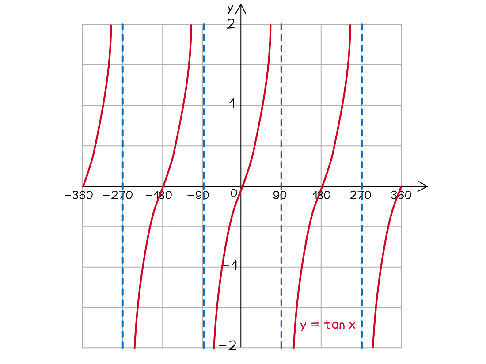

# Graphs of Functions

Course: igcse-maths-a-modular-24-higher-unit-1 · Section: Graphs & Coordinates

Source: https://www.savemyexams.com/igcse/maths/edexcel/a-modular/24/higher-unit-1/flashcards/graphs-and-coordinates/graphs-of-functions/

## Card 1 — question_and_answer (`fl_rd3SPCtnzKRk93R7`)

**FRONT**

Why does the graph of $y=\frac{1}{x}$ **not touch **the *y*-axis?

**BACK**

The graph of $y=\frac{1}{x}$ **not touch **the *y*-axis because on the *y*-axis, $x=0$. You cannot divide by zero therefore the graph does not have any values on the *y*-axis.

## Card 2 — keyword_definition (`fl_NKVyPw3hCqp5yKPf`)

**FRONT**

What is an **asymptote**?

**BACK**

An **asymptote** is a line on a graph that a curve gets closer and closer to but never touches.

These may be horizontal or vertical.

E.g. $y=\frac{1}{x}$ has asymptotes at $y=0$ and $x=0$.

## Card 3 — question_and_answer (`fl_pFM7HmXk8JKnGwjN`)

**FRONT**

How many **turning points** does the graph of a **cubic **have?

**BACK**

The graph of a **cubic **has **two turning points**; a minimum and a maximum.

However, note that $y=\pmx^{3}$ does not have any turning points.

## Card 4 — question_and_answer (`fl_GVsVh9Qsbsv66zJm`)

**FRONT**

Will the **vertex **of the graph $y=-x^{2}+x+5$ be a **maximum **or a **minimum **point?

**BACK**

The **vertex **of the graph $y=-x^{2}+x+5$ will be a **maximum **point.

The vertex of a quadratic graph will be a maximum point if the coefficient of $x^{2}$ is **negative**. The graph is n-shaped.

## Card 5 — question_and_answer (`fl_7P4zgWt6BhjRTYnn`)

**FRONT**

Where does the graph of `y equals 3 open parentheses x minus 1 close parentheses open parentheses x plus 2 close parentheses` **cross the *****x*****-axis**?

**BACK**

The graph of `y equals 3 open parentheses x minus 1 close parentheses open parentheses x plus 2 close parentheses` **crosses the *****x*****-axis** at `open parentheses 1 comma space 0 close parentheses` and `open parentheses negative 2 comma space 0 close parentheses`.

To find these roots, make each factor equal to zero to find the *x*-coordinate:

- $x-1=0$ gives $x=1$
- $x+2=0$ gives $x=-2$

## Card 6 — question_and_answer (`fl_PRy9h5kjwDm7662b`)

**FRONT**

How can you find the coordinates of the **turning point** of a quadratic graph?

**BACK**

To find the coordinates of the **turning point** of a quadratic graph, you can either:

- complete the square
- differentiate and set the derivative equal to zero to find the *x*-coordinate

## Card 7 — true_or_false (`fl_6TwpjVHffR6qnFS4`)

**FRONT**

**True or False?**

The** turning point **of `y equals 4 minus open parentheses x minus 1 close parentheses squared` is at the point `open parentheses 4 comma space 1 close parentheses`.

**BACK**

**False.**

The** turning point **of `y equals 4 minus open parentheses x minus 1 close parentheses squared` is **not at the point **`open parentheses 4 comma space 1 close parentheses`.

The *x*-coordinate is the value that makes the squared bracket equal to zero.

The coordinates should be `open parentheses 1 comma space 4 close parentheses`.

## Card 8 — true_or_false (`fl_TTz8jX39nghTn5Gt`)

**FRONT**

**True or False?**

You should **always **use a **ruler **when plotting the graph of a function.

**BACK**

**False.**

You should **only **use a **ruler **if a graph is **linear **(and for drawing the axes if they are not given).

For curves, draw a **single smooth freehand curve**.

## Card 9 — question_and_answer (`fl_jcC5yNV2BJ68ztR9`)

**FRONT**

How would you find the ***y*****-intercept** of a graph using its equation?

**BACK**

To find the ***y*****-intercept** of a graph, you would substitute $x=0$ into the equation.

## Card 10 — true_or_false (`fl_r6ytRQ5MnyHcGV9J`)

**FRONT**

**True or False?**

The **solutions **to $x^{3}-4x=0$ are the value(s) where the graph of $y=x^{3}-4x$ crosses the ***y*****-axis**.

**BACK**

**False.**

The **solutions **to $x^{3}-4x=0$ are **not **the value(s) where the graph of $y=x^{3}-4x$ crosses the ***y*****-axis**.

$x^{3}-4x=0$ when $y=0$ which is the *x*-axis. Therefore the solutions are the values where the graph crosses** the *****x*****-axis**.

## Card 11 — question_and_answer (`fl_SBjxgqKH2YcybsJg`)

**FRONT**

The **solutions **of $x^{3}+x^{2}-3=x-2$ are the *x* values of the **intersections **between $y=x^{3}+x^{2}-3$ and **which other graph**?

**BACK**

The **solutions **of $x^{3}+x^{2}-3=x-2$ are the *x* values of the **intersections **between $y=x^{3}+x^{2}-3$ and $y=x-2$.

## Card 12 — true_or_false (`fl_sCYDH7bXXy9s4Sys`)

**FRONT**

**True or False?**

The** *****x***** values** of the **intersections **of the two graphs $y=x+1$ and $y=x^{2}+5x+4$ are the **solutions **of $x^{2}+4x+3=0$.

**BACK**

**True.**

The** *****x***** values** of the **intersections **of the two graphs $y=x+1$ and $y=x^{2}+5x+4$ are the **solutions **of $x^{2}+4x+3=0$.

Set the equations equal to each other and rearrange: $x^{2}+5x+4=x+1$.

## Card 13 — keyword_definition (`fl_qPGxm7rxknJpr76g`)

**FRONT**

What is the** graph** of $y=\mathrm{sin}x$ for $-360^{\circ}\leqx\leq360^{\circ}$?

**BACK**

The** graph** of $y=\mathrm{sin}x$ for $-360^{\circ}\leqx\leq360^{\circ}$ is:

## Card 14 — keyword_definition (`fl_j98DHFQ4QG3WWXqZ`)

**FRONT**

What is the** graph** of $y=\mathrm{cos}x$ for  $-360^{\circ}\leqx\leq360^{\circ}$?

**BACK**

The** graph** of $y=\mathrm{cos}x$ for  $-360^{\circ}\leqx\leq360^{\circ}$ is:

## Card 15 — keyword_definition (`fl_RSdB4TShSVc3R5Dc`)

**FRONT**

What is the** graph** of $y=\mathrm{tan}x$ for  $-360^{\circ}\leqx\leq360^{\circ}$?

**BACK**

The** graph** of $y=\mathrm{tan}x$ for  $-360^{\circ}\leqx\leq360^{\circ}$ is:

## Card 16 — true_or_false (`fl_jwpGHMmSrcZWfvWt`)

**FRONT**

**True or False?**

The point `open parentheses 0 comma space 0 close parentheses` lies on the graph $y=\mathrm{sin}x$.

**BACK**

**True.**

The point `open parentheses 0 comma space 0 close parentheses` lies on the graph $y=\mathrm{sin}x$.

## Card 17 — question_and_answer (`fl_mrbpv4Cc4jJQnQNX`)

**FRONT**

What is the ***y*****-intercept** of the graph $y=\mathrm{cos}x$?

**BACK**

The ***y*****-intercept** of the graph $y=\mathrm{cos}x$ is `open parentheses 0 comma space 1 close parentheses`.

## Card 18 — question_and_answer (`fl_nyMmhyGHYhKrHPxK`)

**FRONT**

What is the **minimum *****y***** value** of the graph $y=\mathrm{sin}x$?

**BACK**

The **minimum y value** of the graph $y=\mathrm{sin}x$ is **-1**.

## Card 19 — true_or_false (`fl_BGCXcT73bgv2KQyp`)

**FRONT**

**True or False?**

The graph $y=\mathrm{cos}x$ **repeats itself every 180°**.

**BACK**

**False.**

The graph $y=\mathrm{cos}x$ does **not repeat itself every 180°**.

It repeats itself every **360°**.

## Card 20 — true_or_false (`fl_cJbZRRz2kHjTqhFc`)

**FRONT**

**True or False?**

The graph $y=\mathrm{tan}x$ **repeats itself every 180°**.

**BACK**

**True.**

The graph $y=\mathrm{tan}x$ **repeats itself every 180°**.

## Card 21 — question_and_answer (`fl_d6jwygJGwfQJX5Fp`)

**FRONT**

The graph $y=\mathrm{sin}x$ **repeats itself** every how many degrees?

**BACK**

The graph $y=\mathrm{sin}x$ **repeats itself** every 360°.

## Card 22 — true_or_false (`fl_2m2PS8zfpxwRHKP4`)

**FRONT**

**True or False?**

The **maximum *****y***** value** on the graph $y=\mathrm{tan}x$ is **1**.

**BACK**

**False.**

The **maximum *****y***** value** on the graph $y=\mathrm{tan}x$ is **not 1**.

The graph $y=\mathrm{tan}x$ does not have a maximum value.

