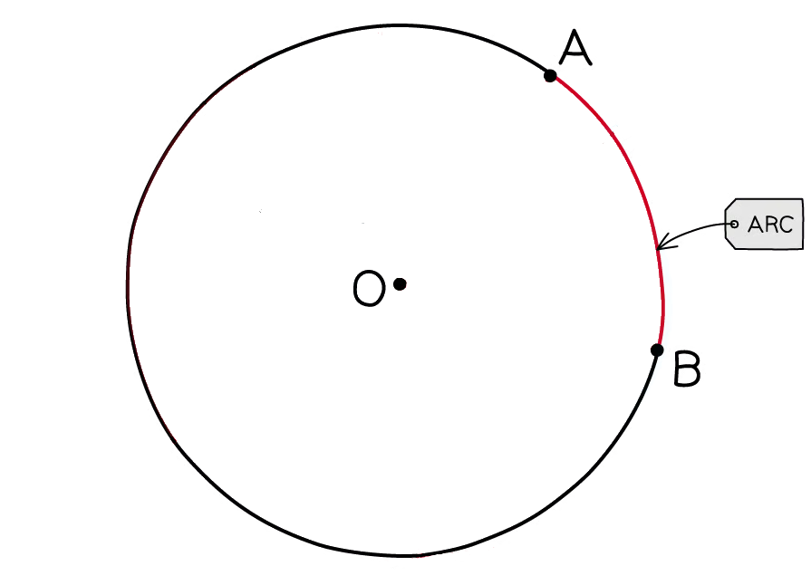
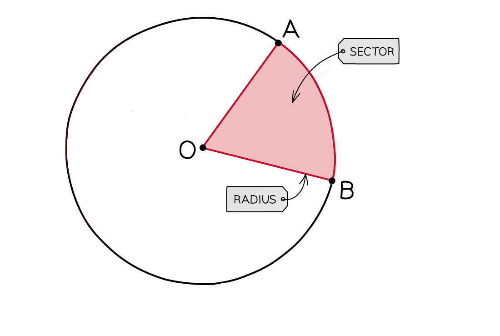

# Circles, Arcs & Sectors

Course: igcse-maths-a-modular-24-higher-unit-1 · Section: Shape, Space & Measure

Source: https://www.savemyexams.com/igcse/maths/edexcel/a-modular/24/higher-unit-1/flashcards/shape-space-and-measure/circles-arcs-and-sectors/

## Card 1 — keyword_definition (`fl_QT79Nn2N4Fgp2H47`)

**FRONT**

What is the **formula** for the **circumference of a circle**?

**BACK**

There are **two formulas** for the **circumference of a circle**,** **$C=2πr=πd$

Where:

- $C=$circumference
- $r=$radius
- $d=$diameter

## Card 2 — keyword_definition (`fl_cbfDzWKNxGD4x68n`)

**FRONT**

Define the term **radius** **of a circle**.

**BACK**

A **radius of a circle **is the **distance** from the **centre** of a circle to its **circumference**.

## Card 3 — true_or_false (`fl_znp67SM5QkfPs6j8`)

**FRONT**

**True or False? **

**Pi (**$π$**)** is the** ratio** between a circle's **diameter** and its **circumference**.

**BACK**

**True.**

**Pi (**$π$**)** is the** ratio** between a circle's **diameter** and its **circumference**.

## Card 4 — question_and_answer (`fl_6jNkPhysrV92fwQj`)

**FRONT**

What is the **relationship** between the **diameter** of a circle and the **radius**?

**BACK**

The **diameter** of a circle is **twice the length** of the **radius** ($d=2r$).

## Card 5 — true_or_false (`fl_zmFhVcfB89GVsdbx`)

**FRONT**

**True or False? **

**Every point** on the **circumference** of a circle is** equidistant** from its **centre**.

**BACK**

**True.**

**Every point** on the **circumference** of a circle is** equidistant** from its **centre**.

## Card 6 — keyword_definition (`fl_DGscBVK8P3dFs2fw`)

**FRONT**

What is an **arc**?

**BACK**

An **arc** is a **part** of the **circumference** of a circle.

## Card 7 — question_and_answer (`fl_2MxzpzbFzS9HG8Zc`)

**FRONT**

What is the **minor arc **?

**BACK**

The **minor arc** is the **smaller **of the **two arcs **created by **two points** on the **circumference** of a circle.

## Card 8 — question_and_answer (`fl_vmsxYTctqRGZp3RY`)

**FRONT**

What is the **formula** for the **length of an arc**?

**BACK**

The formula for the **length of an arc **is $l=\frac{θ}{360}\times2πr$

Where:

- $l=$length of the arc
- $θ=$angle of the sector
- $r=$radius

## Card 9 — keyword_definition (`fl_xf4Qhb3NfW67zQWR`)

**FRONT**

What is a** sector**?

**BACK**

A** sector** is the **part of a circle** enclosed by **two radii** and **an arc**.

## Card 10 — question_and_answer (`fl_H3XBmsQ85PQZYm6x`)

**FRONT**

What is the** major sector**?

**BACK**

The** major sector** is the** larger **of the **two sectors **created by** two radii **in a circle.

## Card 11 — question_and_answer (`fl_295zDJN5Q7h5MqXf`)

**FRONT**

What is the **formula** for the **area of a sector**?

**BACK**

The formula for the **area of a sector** is $A=\frac{θ}{360}\timesπr^{2}$

Where:

- $A=$area
- $θ=$the angle of the sector
- $r=$radius

## Card 12 — true_or_false (`fl_ptzt4sct94gj4hym`)

**FRONT**

**True or False? **

The **area of a sector** is a **fraction **of the **area **of the **whole circle**.

**BACK**

**True. **

The **area of a sector** is a **fraction **of the **area **of the **whole circle**.

## Card 13 — question_and_answer (`fl_PWtkjJqf62QhdGd6`)

**FRONT**

In the equation $A=\frac{θ}{360}\timesπr^{2}$, what does $θ$ represent?

**BACK**

In the equation $A=\frac{θ}{360}\timesπr^{2}$, the quantity $θ$ represents the **angle of the sector**.

