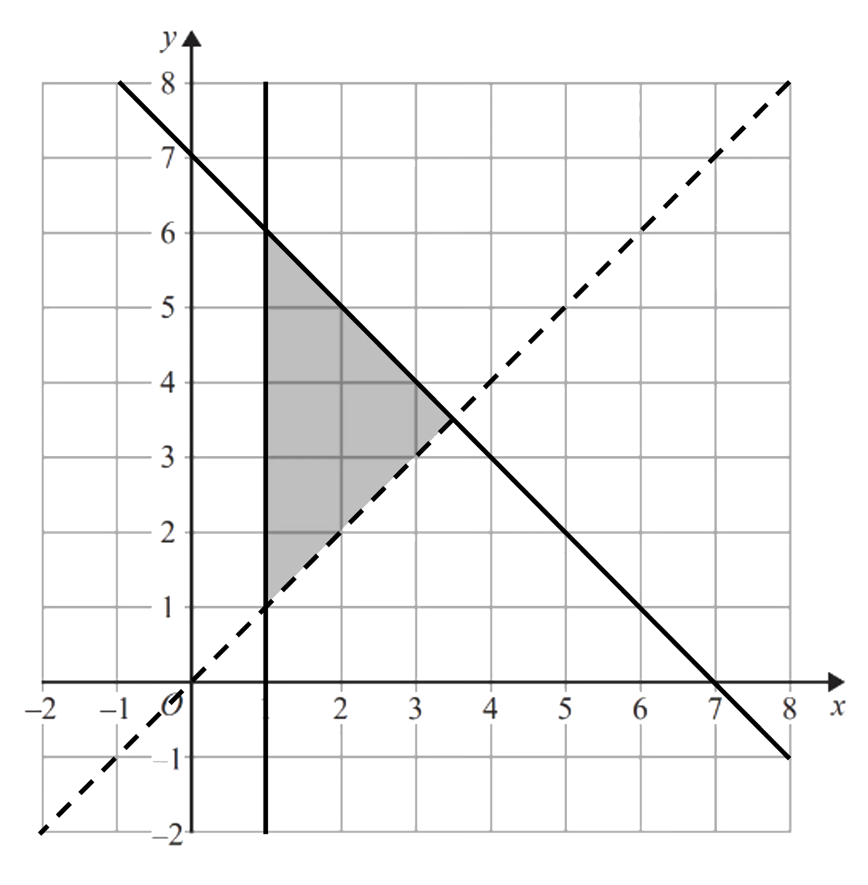

# Graphing Inequalities

Course: igcse-maths-a-modular-24-higher-unit-2 · Section: Functions, Graphs & Differentiation

Source: https://www.savemyexams.com/igcse/maths/edexcel/a-modular/24/higher-unit-2/flashcards/functions-graphs-and-differentiation/graphing-inequalities/

## Card 1 — true_or_false (`fl_pbbYfgrxJxVv4FN4`)

**FRONT**

**True or False?**

A **solid line** is used when drawing the line for the inequality $y\leqx+1$.

**BACK**

**True.**

A **solid line** is used when drawing the line for the inequality $y\leqx+1$.

Solid lines are used when the inequality includes an equals, ≤ or ≥.

## Card 2 — question_and_answer (`fl_gbrF2hSdG9y28MWd`)

**FRONT**

Which **side **of the line $x=1$ satisfies the inequality $x\leq1$?

**BACK**

The** side to the left** of the line $x=1$ (including the line itself) satisfies the inequality $x\leq1$.

## Card 3 — true_or_false (`fl_9fNnPNZgJD48VmYp`)

**FRONT**

**True or False?**

The region **below **the line $y=x-2$ satisfies the inequality $y>x-2$.

**BACK**

**False.**

The region **below **the line $y=x-2$ does **not **satisfy the inequality $y>x-2$.

The region **above **the line satisfies the inequality.

## Card 4 — question_and_answer (`fl_SskZjsxzdkfnJkwc`)

**FRONT**

How could you use the point `open parentheses 0 comma space 0 close parentheses` to determine which **side **of the line $2x+3y=12$ satisfies the inequality $2x+3y>12$?

**BACK**

To use the point `open parentheses 0 comma space 0 close parentheses` to determine which **side **of the line $2x+3y=12$ satisfies the inequality $2x+3y>12$:

- Substitute $x=0$ and $y=0$ into $2x+3y$.
- If the answer is **greater than 12** then the side of the line containing `open parentheses 0 comma space 0 close parentheses` satisfies the inequality.
- If the answer is **less than 12** then the side of the line which does not contain `open parentheses 0 comma space 0 close parentheses` satisfies the inequality.

## Card 5 — question_and_answer (`fl_tNMqQ74FGTVzWpCY`)

**FRONT**

How can you identify the** inequalities** needed to **define a region **from a graph?

**BACK**

To identify the** inequalities** needed to **define a region **from a graph:

- Identify the equation of each line.
- Substitute the coordinates of a **point within the region** into each equation.

  - If the answer is **less than the given value** in the equation, then it satisfies the inequality$<$ (if the line is dotted) or $\leq$ (if the line is solid)
  - If the answer is **greater than the given value** in the equation, then it satisfies the inequality$>$ (if the line is dotted) or $\geq$ (if the line is solid)

