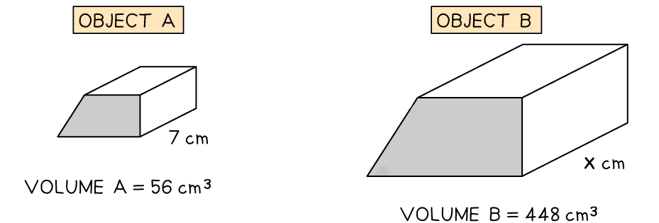
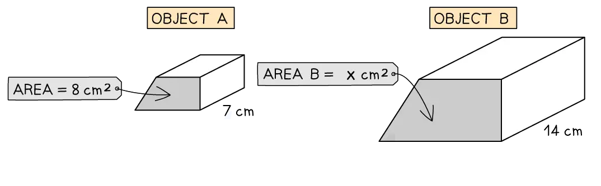

# Area & Volume of Similar Shapes

Course: igcse-maths-a-modular-24-higher-unit-2 · Section: Geometry

Source: https://www.savemyexams.com/igcse/maths/edexcel/a-modular/24/higher-unit-2/flashcards/geometry/area-and-volume-of-similar-shapes/

## Card 1 — question_and_answer (`fl_vwXy2gD5bBWGDn53`)

**FRONT**

What is the **relationship** between the** length scale factor **and the** area scale factor**?

**BACK**

The **area scale factor**, $k^{2}$, is the **square** of the** length scale factor **$k$.

## Card 2 — question_and_answer (`fl_2sXYDbS2wppbVyZv`)

**FRONT**

What is the **relationship** between the** length scale factor **and the** volume scale factor**?

**BACK**

The **volume scale factor**, $k^{3}$, is the **cube **of the** length scale factor **$k$.

## Card 3 — true_or_false (`fl_pmByC526rg7fDsDf`)

**FRONT**

**True or False?**

The **cube root** of the **volume** **scale factor** can be used to find an **unknown length**.

**BACK**

**True. **

The **cube root** of the **volume** **scale factor** is the **length scale factor**. This can be used to find an **unknown length**.

E.g. you can find length $x$ by finding the volume scale factor, $\frac{448}{56}=8$, taking its cube root, `cube root of 8 equals 2`, and multiplying the result by the corresponding length on object A, $x=7\times2=14\mathrm{cm}$.

## Card 4 — question_and_answer (`fl_txDzqdK8rSDNx5rk`)

**FRONT**

How do you find the **area **of a** similar shape** from a** known area** using the **length scale factor**, $k$?

E.g. how can you find Area B in the diagram below?

**BACK**

To find the **area** of a **similar shape** from a **known area**, find the **length scale factor**, $k$, and **square** it to find the **area scale factor**, $k^{2}$. Then multiply the result by the area of the shape you know.

E.g. to find Area B, $\mathrm{length} \mathrm{scale} \mathrm{factor}=\frac{14}{7}=2$, so $\mathrm{area} \mathrm{scale} \mathrm{factor}=2^{2}=4$. 
Therefore, $\mathrm{Area}B=8\times4=32\mathrm{cm}^{2}$.

## Card 5 — true_or_false (`fl_WFXd2ykcZH5mmZWY`)

**FRONT**

**True or False? **

Multiplying the **cube root** of the **volume scale factor** by an **area** can be used to find a corresponding** area** on a **similar shape**.

**BACK**

**False.**

Multiplying the **cube root** of the **volume scale factor** by an **area** can **not** be used to find a corresponding** area** on a **similar shape**.

The cube root of the volume scale factor, is the **length scale factor**. This needs to be** squared **to find the **area scale factor**, which can then be used to find a corresponding area on a similar shape.

