# Circle Theorems

Course: igcse-maths-a-modular-24-higher-unit-2 · Section: Geometry

Source: https://www.savemyexams.com/igcse/maths/edexcel/a-modular/24/higher-unit-2/flashcards/geometry/circle-theorems/

## Card 1 — keyword_definition (`fl_rKRtzwK2CFX2wTWh`)

**FRONT**

What is an **arc**?

**BACK**

An arc is a **portion of the circumference** of a circle.

## Card 2 — keyword_definition (`fl_BFJ7gryhVkNt9CVq`)

**FRONT**

What is the** circle theorem** shown below?

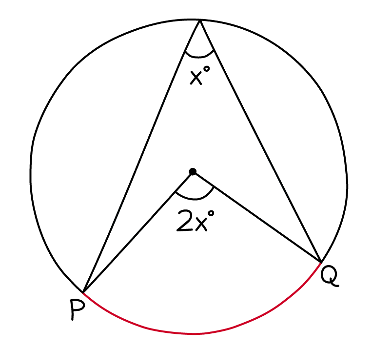

**BACK**

The circle theorem shown in the diagram is:** The angle subtended by an arc at the centre is twice the angle at the circumference. **

Note that both angles need to share the** same arc** (it should look like an arrow head not a kite).

## Card 3 — true_or_false (`fl_McFdWNwKkR4677Xb`)

**FRONT**

**True or False?**

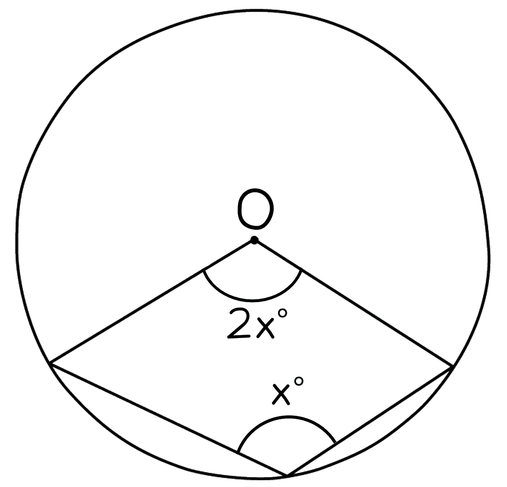

**BACK**

**False.**

For the angle at the centre to be twice that of the angle at the circumference, both angles must be subtended by the **same arc**.

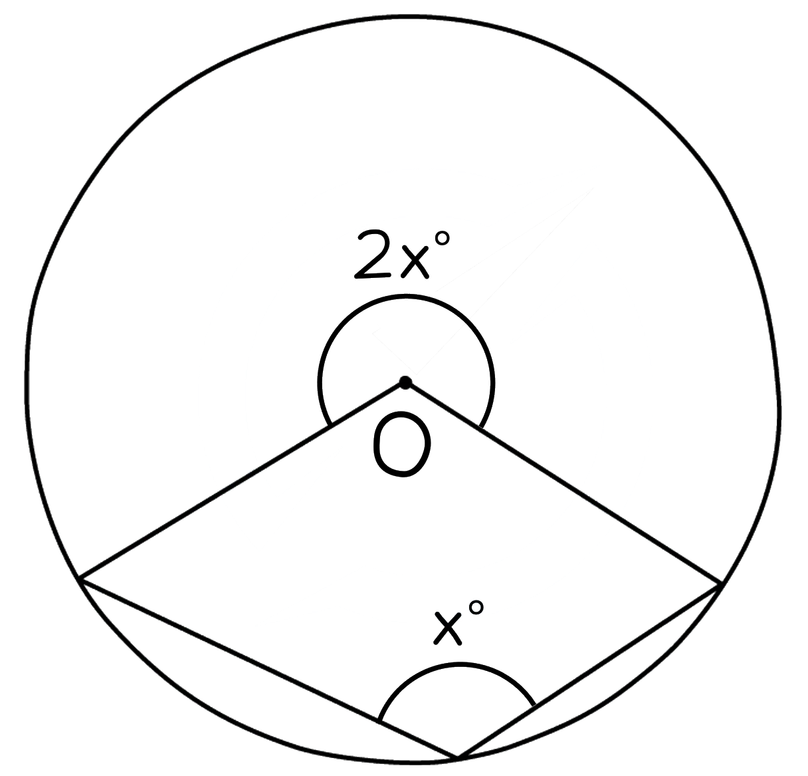

## Card 4 — keyword_definition (`fl_FkKfTQX3XHmRPHsQ`)

**FRONT**

What is the **circle theorem** shown below?

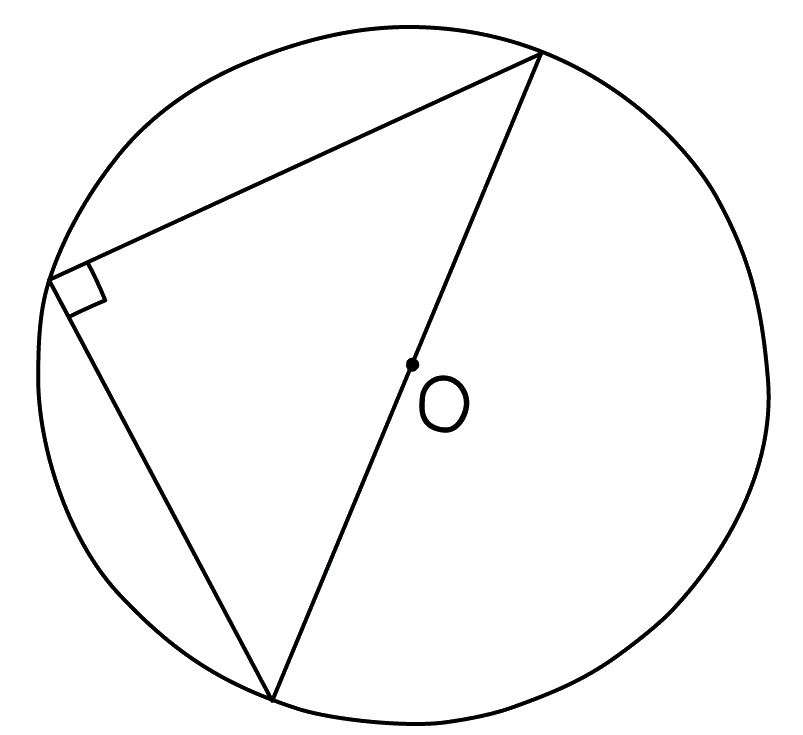

**BACK**

The circle theorem in the diagram is: **The angle in a semicircle is a right angle.**

If one edge of the triangle inside a circle is the diameter, then the triangle is contained within half of the circle (a semicircle) and the angle opposite the diameter is 90º.

## Card 5 — true_or_false (`fl_QBYYjCtKyhVZ9YS6`)

**FRONT**

**True or False?**

A triangle in a circle, where **all three points touch the circumference** of the circle, will always be a **right-angled triangle**.

**BACK**

**False.**

A triangle in a circle, where all three points touch the circumference of the circle, will **not **always be a right-angled triangle.

It will only be a right-angled triangle if one of the sides is the **diameter** of the circle.

## Card 6 — true_or_false (`fl_fSmr3ZpNXV2BbrXb`)

**FRONT**

**True or False? **

The **angle in a semicircle is a right angle** circle theorem is a **special case** of the **angle subtended by an arc at the centre is twice the angle at the circumference** circle theorem.

**BACK**

**True. **

The **angle in a semicircle is a right angle** circle theorem is a **special case** of the **angle subtended by an arc at the centre is twice the angle at the circumference** circle theorem.

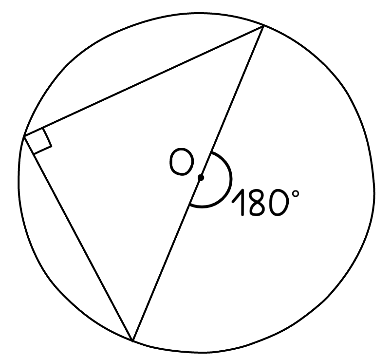

## Card 7 — keyword_definition (`fl_M3wC9GKQXKKJ7RXV`)

**FRONT**

What is a **chord**?

**BACK**

A chord is any **straight line** that joins **two points** on the **circumference** of a circle.

## Card 8 — keyword_definition (`fl_KBmXFQj2zwwCnwRJ`)

**FRONT**

What is a **tangent**?

**BACK**

A tangent is a** straight line** that touches a circle at** exactly one point**.

## Card 9 — keyword_definition (`fl_vvHwy5QjNsMYPb8j`)

**FRONT**

What is a **radius**?

**BACK**

A radius is a **line segment** connecting the** centre** of a circle to a point on the **circumference**.

## Card 10 — keyword_definition (`fl_mFGtQ3QDY7BcC2YK`)

**FRONT**

Define the term **perpendicular bisector**.

**BACK**

A perpendicular bisector is a **line** that cuts another line **exactly in half** (bisects) and crosses it at a **right angle **(perpendicular).

## Card 11 — true_or_false (`fl_YFMQQYffCbH4rsh6`)

**FRONT**

**True or False?**

The** perpendicular bisector** of a **chord** passes through the **centre **of the circle.

**BACK**

**True. **

This is the circle theorem: **The perpendicular bisector of a chord passes through the centre**.

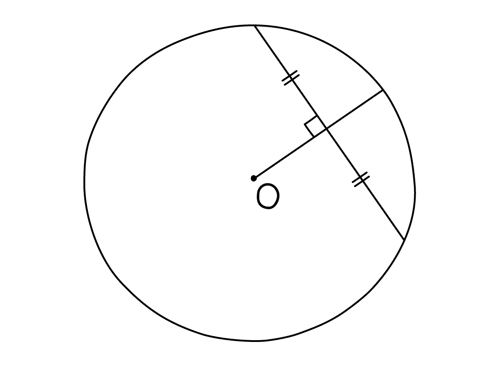

## Card 12 — question_and_answer (`fl_cKdPyrNt428bQXg2`)

**FRONT**

What **type of triangle** is formed in a circle from **two radii and a chord**?

**BACK**

If a triangle is formed from two radii and a chord within a circle it will be an** isosceles triangle** as the two radii are two sides of the same length.

## Card 13 — keyword_definition (`fl_Zddtx9rf8cypg7BZ`)

**FRONT**

What is the **circle theorem** that describes the **relationship** between a **radius** and a **tangent**?

**BACK**

The circle theorem is: **A radius and a tangent are perpendicular**.

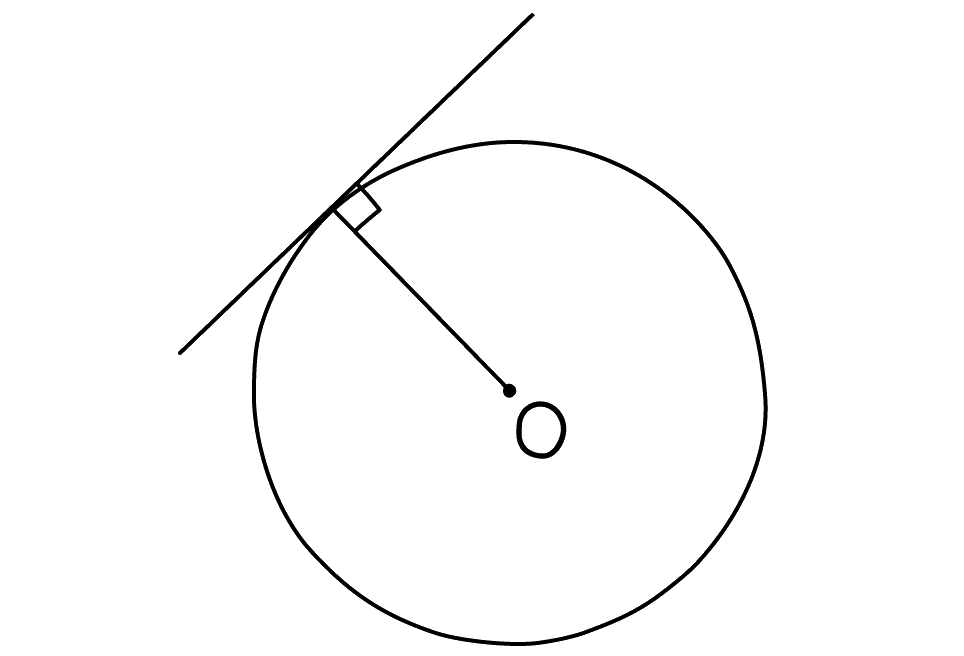

## Card 14 — question_and_answer (`fl_9zRsDtqNzFkCfRQv`)

**FRONT**

If **two tangents** to a circle **intersect**, what can be said about the **distances on each line **between the point of intersection and the circle?

**BACK**

The distances are **equal**. This is the circle theorem: **Tangents from an external point are equal in length**.

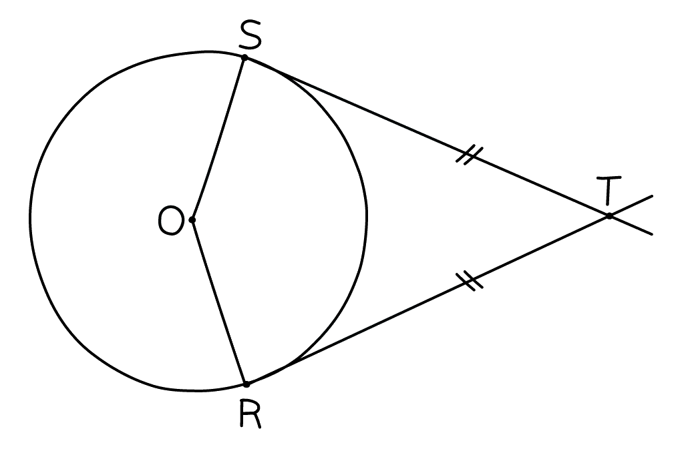

## Card 15 — question_and_answer (`fl_qDcgSPypqXNB6Ymg`)

**FRONT**

What **geometrical shape** is formed by the **centre of a circle**, **two tangents** to the same circle that intersect, and **two radii**?

**BACK**

A **kite** is formed by the centre of a circle, two tangents to the circle that intersect, and two radii

The two radii form **two adjacent sides of equal length** and the tangents form the **other pair of adjacent sides of equal length**. The angle between each radius and tangent is 90º.

## Card 16 — true_or_false (`fl_j2KfWJ9rqFCXM6Pc`)

**FRONT**

**True or False?**

For two chords, AB and CD that meet at point P, **the ratio of longer lengths (of chords) ≡ ratio of shorter lengths (of chords)**.

**BACK**

**True. **

For two chords, AB and CD that meet at point P the ratio of longer lengths ≡ ratio of shorter lengths (of chords). This is known as the** intersecting chord theorem**.

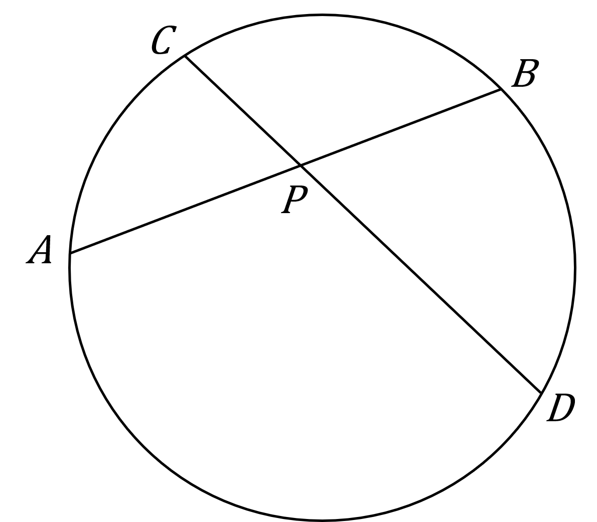

## Card 17 — question_and_answer (`fl_nP9hX4m2Wj2rvvQn`)

**FRONT**

How is the **intersecting chord theorem** used to solve problems?

**BACK**

The easiest way to use the intersecting chord theorem is to use it in its multiplicative form, **AP × PB = CP × PD**.

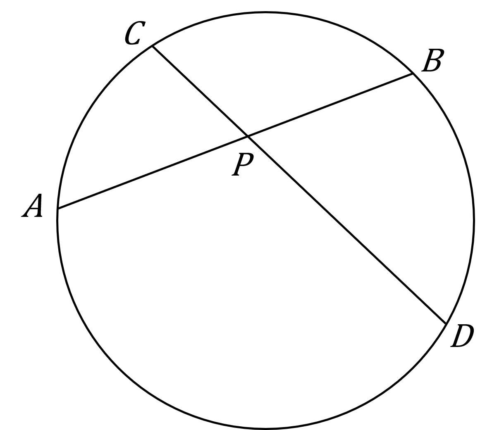

## Card 18 — keyword_definition (`fl_GKwC8Mk2P7z5DmMT`)

**FRONT**

What is a** secant**?

**BACK**

A secant is a **line** that extends through a circle, **intersecting** it at **two points**.

## Card 19 — true_or_false (`fl_s7RrN6Zk9CGBrFjj`)

**FRONT**

**True or False?**

The** intersecting secant theorem **applies when **two chords intersect outside** the circle.

**BACK**

**True. **

The intersecting secant theorem is a version of the intersecting chords theorem and applies when two chords intersect **outside** the circle instead of inside.

## Card 20 — question_and_answer (`fl_K8C9dP4h59P4y8Hv`)

**FRONT**

How is the **intersecting secant theorem** used to solve problems?

**BACK**

For two intersecting secants, ABP and CDP that meet at point P, the easiest way to use the intersecting secant theorem in the form **BP(AB + BP) = DP(CD + DP)**

## Card 21 — keyword_definition (`fl_h54HbRV6BrPC75Bj`)

**FRONT**

What is a **cyclic quadrilateral**?

**BACK**

A cyclic quadrilateral is a **quadrilateral inside a circle** with all **four vertices** of the quadrilateral lying on the **circumference** of the circle.

## Card 22 — keyword_definition (`fl_pbJFdbS5M7wyQ68v`)

**FRONT**

What is the** circle theorem** that describes the **relationship** between **angles** in a **cyclic quadrilateral**?

**BACK**

Circle theorem: **Opposite angles in a cyclic quadrilateral add up to 180º**.

Angle ABC + Angle ADC = Angle BAD + Angle BCD = 180º.

## Card 23 — true_or_false (`fl_pYdNJr9KpXdSR2fY`)

**FRONT**

**True or False?**

**Opposite angles **in the quadrilateral below **add up to 180º**.

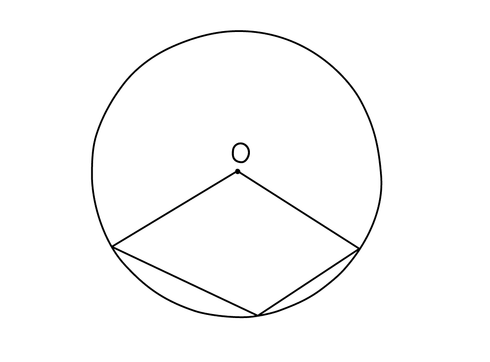

**BACK**

**False.**

For a quadrilateral in a circle that has one vertex at the centre of the circle and the other three on the circumference, opposite angles do not add up to 180º.

**All four vertices must lie on the circumference** of the circle for it to be a cyclic quadrilateral.

## Card 24 — keyword_definition (`fl_9CqhdfKs5tzsx5Ds`)

**FRONT**

What is a** segment**?

**BACK**

A segment is a **region bounded by a chord and an arc **of a circle.

## Card 25 — question_and_answer (`fl_j8PrVsQb9XtW6Zcx`)

**FRONT**

Identify the** circle theorem** in the diagram below.

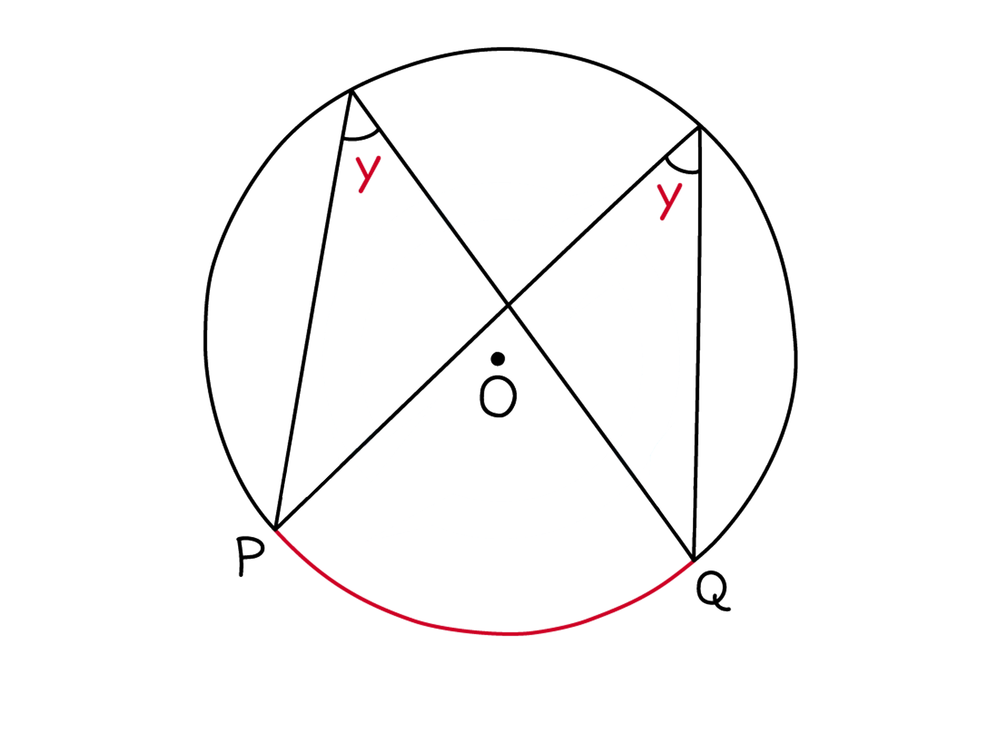

**BACK**

The circle theorem in the diagram is: **Angles at the circumference subtended by the same arc are equal **or** Angles in the same segment are equal**.

## Card 26 — question_and_answer (`fl_xw764xJbF8GRcwNp`)

**FRONT**

What is a **cyclic triangle**?

**BACK**

A cyclic triangle is a **triangle within a circle** where **all three vertices** of the triangle lie on the **circumference** of the circle.

## Card 27 — question_and_answer (`fl_xphpS4GTYXKhQ7Gm`)

**FRONT**

Identify the **circle theorem **in the diagram below.

**BACK**

The circle theorem in the diagram is:** The alternate segment theorem**.

The angle between a chord and a tangent is equal to the angle in the alternate segment.

## Card 28 — true_or_false (`fl_ftmqkcB3PTr5XZTd`)

**FRONT**

**True or False? **

You can spot the **alternate segment theorem **by just identifying a** cyclic triangle**.

**BACK**

**False. **

Identifying a cyclic triangle can **help** you to spot the alternate angle theorem, but it is not enough on its own.

You must also look to make sure that **one of the vertices** of the cyclic triangle touches the **same point on the circumference** as a **tangent **to the circle.

