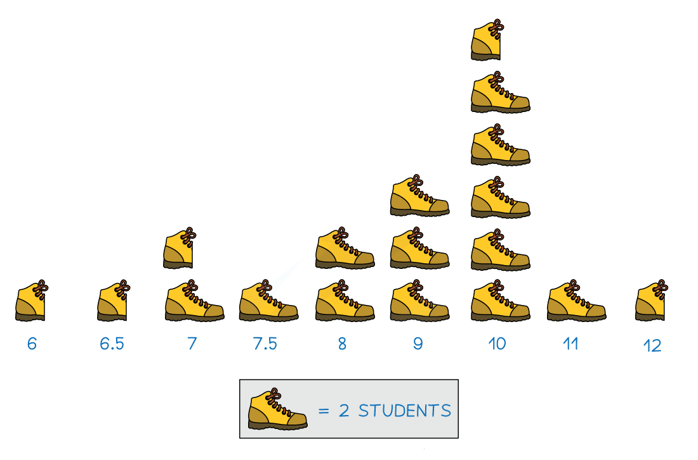
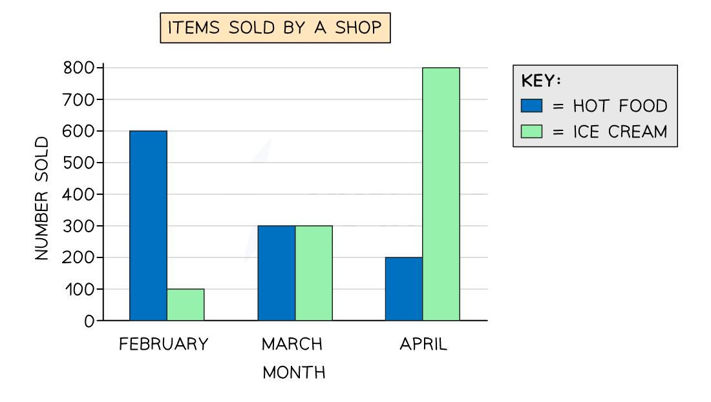
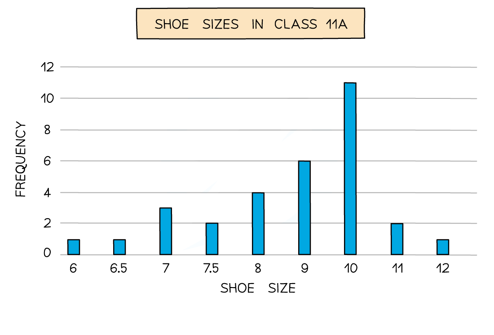

# Statistics Toolkit

Course: igcse-maths-a-modular-24-higher-unit-2 · Section: Statistics

Source: https://www.savemyexams.com/igcse/maths/edexcel/a-modular/24/higher-unit-2/flashcards/statistics/statistics-toolkit/

## Card 1 — question_and_answer (`fl_TVwp8M7snVGDfMQb`)

**FRONT**

What is **discrete **data?

**BACK**

**Discrete data** refers to data that can only take **certain numerical values**. It is often (but not always) data that can be **counted**.

Examples of discrete data include:

- Number of pets
- Shoe size
- Number of petals on a flower

## Card 2 — question_and_answer (`fl_KFycWPzj5q4THrRZ`)

**FRONT**

What is **continuous **data?

**BACK**

**Continuous data **refers to data that can take **any numerical value within a range**. It is usually data that needs to be **measured**.

Examples of continuous data include:

- Height
- Weight
- Time taken to complete a jigsaw

## Card 3 — keyword_definition (`fl_gCSXx2XHxmJNvycJ`)

**FRONT**

How do you find the **mean** of a set of numbers?

**BACK**

To find the **mean** of a set of numbers:

1. **Add **the values together.
2. **Divide **by the total number of values.

## Card 4 — keyword_definition (`fl_YSSxzx4qCCvwNMPF`)

**FRONT**

How do you find the **median** of a set of numbers?

**BACK**

To find the **median** of a set of numbers:

1. Put the numbers **in order**.
2. Find the **middle **number.

If there are two middle numbers then the median is the midpoint of those numbers.

## Card 5 — keyword_definition (`fl_r8GzqDqxW2b8wkKv`)

**FRONT**

How do you find the **mode** of a set of numbers?

**BACK**

The **mode **of a set of numbers is the value that appears the **most**.

## Card 6 — true_or_false (`fl_qhQ9NdbvXwsSCcbr`)

**FRONT**

**True or False?**

There can be **more than one median** value in a data set.

**BACK**

**False.**

There can **not **be **more than one median** value in a data set. The median is the **middle value**.

The only average that can have **more than one value** is the **mode**.

## Card 7 — true_or_false (`fl_RpqDSWnSCQFCnMsY`)

**FRONT**

**True or false?**

The** mean** is affected by **extreme values**.

**BACK**

**True. **

The** mean **is affected by **extreme values**.

## Card 8 — true_or_false (`fl_NjzmbJk44XNswQhs`)

**FRONT**

**True or false?**

The **median** is affected by **extreme values**.

**BACK**

**False. **

The **median** is **not** affected by **extreme values**.

## Card 9 — question_and_answer (`fl_t7KkCYKmHDJCFbyf`)

**FRONT**

How can you find the **total of all data values** if you know the **mean** and the **number of values**?

E.g. if the mean of a set of 25 values is 3.7, what is the total of all values in the data set?

**BACK**

If you know the **mean** and **number of values**, you can calculate the **total of values **by rearranging the mean formula:

- $\mathrm{total} \mathrm{of} \mathrm{values}=\mathrm{mean}\times\mathrm{number} \mathrm{of} \mathrm{values}$

E.g. if the mean of a set of 25 values is 3.7, then the total of all values in the data set is $3.7\times25=92.5$.

## Card 10 — question_and_answer (`fl_FB6vDTMvNWW9vgfz`)

**FRONT**

How can you find the **number of data values** if you know the **mean** and the **total of the values**?

E.g. if the total of a set of data values is 66 and the mean is 8.25, how many data values are there?

**BACK**

If you know the **mean** and **total of the data values**, you can calculate the **number of values** by rearranging the mean formula:

- $\mathrm{number} \mathrm{of} \mathrm{values}=\frac{\mathrm{total} \mathrm{of} \mathrm{values}}{\mathrm{mean}}$

E.g. the total number of data values in a set of data with a total of 66 and mean of 8.25 is $\frac{66}{8.25}=8$.

## Card 11 — question_and_answer (`fl_ZvxJYXJRxsmwWDjM`)

**FRONT**

How can you find the new **mean** of a data set if a **new data item is added** to the set?

E.g. a data set of 12 items has a mean of 5.7. 
A new data item of 9.6 is added to the set. 
What is the new mean?

**BACK**

To find the new **mean** of a data set if a **new data item is added** to the set:

1. Find the total of the current data set: $\mathrm{total} \mathrm{of} \mathrm{values}=\mathrm{mean}\times\mathrm{number} \mathrm{of} \mathrm{values}$
2. Add the new data item
3. Divide by the new total number of data items

E.g. for a data set of 12 items and a mean of 5.7, the total of the values is $12\times5.7=68.4$.
Therefore when a new data item of 9.6 is added to the set, the new mean is $\frac{68.4+9.6}{13}=6$.

## Card 12 — question_and_answer (`fl_wPDtGMvZC8rtmYC3`)

**FRONT**

How do you find the **mean** from a** frequency table**?

**BACK**

To find the **mean** from a** frequency table**:

1. Include a column for (value $\times$ frequency).
2. Add the values in this column.
3. Divide the sum by the total frequency.

## Card 13 — question_and_answer (`fl_p26mt8FrXBdRzYzR`)

**FRONT**

How do you find the **median** from a **frequency table**?

**BACK**

To find the **median** from a **frequency table**:

1. Make sure the values in the table are in order.
2. Find the $\frac{n+1}{2}$th value, where $n$ is the total frequency.

## Card 14 — question_and_answer (`fl_p4sXd6TrHr6THTzZ`)

**FRONT**

How do you find the **mode **from a **frequency table**?

**BACK**

To find the **mode** from a** frequency table**, look for the value with the **highest frequency**.

## Card 15 — question_and_answer (`fl_pyzh7TNZJ6RRbT4t`)

**FRONT**

How do you** estimate the mean** from **grouped data**?

**BACK**

To **estimate the mean** from **grouped data**:

1. Find the midpoint of each class.
2. Calculate (midpoint × frequency) for each class.
3. Sum the (midpoint × frequency) values.
4. Divide the sum by the total frequency.

## Card 16 — question_and_answer (`fl_4vpG5swvZqG8NTJ5`)

**FRONT**

What is a **class interval**?

**BACK**

A class interval is a **range of values** within which data points are grouped together.

## Card 17 — true_or_false (`fl_fhZSgX5tTNcTbJGx`)

**FRONT**

**True or false?**

The** actual mean** can be calculated from** grouped data**.

**BACK**

**False.**

Only an **estimate of the mean** can be calculated from grouped data.

## Card 18 — question_and_answer (`fl_kJdXg2BKdtKJ7HBc`)

**FRONT**

How do you find the** class interval** containing the **median** from **grouped data**?

**BACK**

To find the **class interval **containing the **median **from** grouped data**:

1. Find the position of the median using $\frac{n}{2}$, where $n$ is the total frequency.
2. Use the table to determine the class interval containing this position.

## Card 19 — question_and_answer (`fl_N4xYnm38nH5csQJW`)

**FRONT**

How do you find the **modal class interval** from **grouped data**?

**BACK**

To find the **modal class interval** from** grouped data**, look for the **class interval** with the **highest frequency**.

## Card 20 — question_and_answer (`fl_MTms3MRH64KznSp2`)

**FRONT**

What does the phrase "**estimate the mean**" usually indicate on an exam question?

**BACK**

The phrase "**estimate the mean**" usually indicates that the data is **grouped**, and that you should use the **midpoint method** to **estimate** the mean.

## Card 21 — keyword_definition (`fl_7BNh8498v9GbBRDK`)

**FRONT**

Define the **range** of a data set.

**BACK**

The **range** is the **difference **between the **highest and lowest values** in a data set (i.e., highest value minus lowest value).

## Card 22 — keyword_definition (`fl_Mscp8FDGpmWZvWyV`)

**FRONT**

What is a **quartile** in a set of data?

**BACK**

A **quartile** is one of the values (lower quartile, median and upper quartile) that **divide an ordered data** set into **four equal parts**.

## Card 23 — keyword_definition (`fl_M5Cfd2sQMsmyspdY`)

**FRONT**

Define the **interquartile range** (**IQR**) of a data set.

**BACK**

The **interquartile range (IQR)** of a data set is the **difference** between the **upper and lower quartiles** (i.e., upper quartile minus lower quartile).

## Card 24 — keyword_definition (`fl_7SsCznsTq38fsRfG`)

**FRONT**

What is the **lower quartile (LQ) **in a set of data?

**BACK**

The** lower quartile (LQ) **is the** value** **below which 25% of the data lies **(and above which 75% of the data lies).

## Card 25 — keyword_definition (`fl_HjmbhyKgzfNcdhbB`)

**FRONT**

What is the **upper quartile (UQ)** of a set of data?

**BACK**

The **upper quartile (UQ)** is the **value above which 25% of the data lies **(and below which 75% of the data lies).

## Card 26 — true_or_false (`fl_BK8XtfqpvkFKVhjf`)

**FRONT**

**True or false? **

The** range** is **not affected by outliers**.

**BACK**

**False. **

The range** is** affected by outliers.

## Card 27 — true_or_false (`fl_kNJtJ68gPRZZ8wrG`)

**FRONT**

**True or false? **

The** IQR** is **not affected by outliers**.

**BACK**

**True. **

The IQR is **not** affected by outliers.

## Card 28 — keyword_definition (`fl_s3fwz2cW9dQHNYxC`)

**FRONT**

State the** formula** for finding the **lower quartile** in terms of $n$.

**BACK**

Lower quartile $=\frac{n+1}{4}$th value

- where $n$ is the total frequency

## Card 29 — keyword_definition (`fl_jdtTFCkpGc4t8NFx`)

**FRONT**

State the **formula** for finding the upper quartile in terms of $n$.

**BACK**

Upper quartile `equals fraction numerator 3 open parentheses n plus 1 close parentheses over denominator 4 end fraction`th value

- where $n$ is the total frequency

## Card 30 — keyword_definition (`fl_zB8B8TRSvBb7XKXX`)

**FRONT**

State the **equation** for finding the **IQR** in terms of the **UQ and LQ**.

**BACK**

The **equation** for the interquartile range (IQR) is  $\mathrm{IQR}=\mathrm{UQ}-\mathrm{LQ}$

Where:

- $\mathrm{UQ}$ is the upper quartile
- $\mathrm{LQ}$ is the lower quartile

## Card 31 — question_and_answer (`fl_tmHD8xphGfNn99R6`)

**FRONT**

Which** measures **should you look at when **comparing distributions**?

**BACK**

When **comparing distributions**, you should compare **two things**:

- An **average** for the distributions, e.g. mean, median or mode.
- A measure of **spread** for the distributions, e.g. range or IQR.

## Card 32 — true_or_false (`fl_s8tkP2D5yhnGhGF2`)

**FRONT**

**True or false? **

The **mode** should **always** be used to **compare the averages** of distributions.

**BACK**

**False.**

The **mean or median **are usually used to compare the averages of distributions.

The mode can be used for non-numerical data.

## Card 33 — question_and_answer (`fl_RqzCZy62TbDb4CVB`)

**FRONT**

What **measures of spread** can be used when **comparing distributions**?

**BACK**

The **range or interquartile range (IQR) **can be used to compare the spread of distributions.

The IQR focuses on the middle 50% of the data.

## Card 34 — question_and_answer (`fl_nyrBDvfJvMpFgXRV`)

**FRONT**

**How **should you **compare** the **averages of distributions**?

**BACK**

To **compare the averages**:

1. Give the numerical values of the averages, 
e.g. data set A has a mean of 43.5 and data set B has a mean of 53.7.
2. Explicitly compare them, 
e.g. the mean of set B is greater than the mean of set A.
3. Explain what the comparison means in the context of the question,
e.g. this means that, on average, the people in set B take longer on the task than the people in set A.

## Card 35 — question_and_answer (`fl_Sb4DWkSWc69cK435`)

**FRONT**

**How** should you **compare** the **spreads of distributions**?

**BACK**

To **compare the spreads**:

1. Give the numerical values of the range or interquartile range, 
e.g. set A has a range of 7, set B has a range of 10
2. Explicitly compare them, 
e.g. the range of set B is greater than the range of set A.
3. Explain what the comparison means in the context of the question,
e.g. this means that the times taken by individuals in set B is more spread out than the times taken by individuals in set A.

## Card 36 — true_or_false (`fl_Rxqtgs5CXPMFPnsh`)

**FRONT**

**True or False?**

**Extreme values **should be considered when comparing raw data sets.

**BACK**

**True.**

When comparing raw data sets, you should check for **extreme values** in either distribution and mention how they **may affect the reliability** of the results and comparisons.

## Card 37 — true_or_false (`fl_y5fn9pQBSP3SKjKY`)

**FRONT**

**True or false?**

You should make **at least two pairs of comments** when **comparing distributions**.

**BACK**

**True. **

You should make **at least two pairs of comments **when comparing distributions, one pair **comparing averages **and one pair **comparing spread**.

## Card 38 — question_and_answer (`fl_VRHS9GqMkZQMTF4p`)

**FRONT**

**True or False.**

You must consider any **assumptions or potential issues** with the data when **comparing data sets**.

**BACK**

**True. **

When **comparing distributions**, you should also consider any **assumptions or potential issues** with the data as these could affect the **validity of the comparisons**.

E.g. when assessing the water quality of a river, the samples may have all been taken from one place so may not be representative of the whole river.

## Card 39 — true_or_false (`fl_xJCG5gnPQfnRKwSn`)

**FRONT**

**True or false?**

The **context** of the question **doesn't matter** when comparing averages and spread.

**BACK**

**False.**

When comparing averages and spread, you **must discuss them in the context of the question**, not just compare the numbers.

## Card 40 — keyword_definition (`fl_6S84HTDsp5JkdNDD`)

**FRONT**

The image below shows what **type** of statistical diagram?

**BACK**

The diagram shown is a **pictogram**.

A pictogram is a visual representation of **discrete data** using repeated **symbols or icons**.

## Card 41 — true_or_false (`fl_fCDmWWCNbnFqF5Rt`)

**FRONT**

**True or false?**

**Bar charts** are used for **continuous** data.

**BACK**

**False.**

Bar charts are **not** used for continuous data.

Bar charts are used for **discrete** data.

## Card 42 — question_and_answer (`fl_vnpXZPGJrPFSHrrD`)

**FRONT**

How do you identify the **mode **from a **bar chart**?

**BACK**

To  identify the **mode** from a **bar chart**, find the **bar with the highest height** or frequency.

## Card 43 — keyword_definition (`fl_QtCp2fVGJbqcKcv4`)

**FRONT**

What is a **comparative bar chart**?

**BACK**

A **comparative bar char**t is a bar chart that displays two or more data sets side by side for easy comparison.

## Card 44 — true_or_false (`fl_fPQZkMwnD34FNR6J`)

**FRONT**

**True or false?**

A **key** is **optional** when creating a** pictogram**.

**BACK**

**False.**

A** key** is **not optional **when creating a **pictogram**.

A pictogram requires a key that specifies the frequency represented by each symbol or icon.

## Card 45 — true_or_false (`fl_yqqdqwjXSSC5WVrx`)

**FRONT**

**True or false?**

**Bar charts** should have **gaps** between the bars.

**BACK**

**True.**

**Bar charts** should have** gaps** between the bars.

## Card 46 — true_or_false (`fl_FW75m6PCmgtPWCMN`)

**FRONT**

**True or false?**

**Pictogram symbols** can be of **different sizes**.

**BACK**

**False.**

**Pictogram symbols** should be of the **same size** for easy comparison.

(Though a pictogram may use *part* of a symbol, to represent a frequency that is less than the value of the complete symbol.)

## Card 47 — true_or_false (`fl_rkBDry5GG2YRJF2x`)

**FRONT**

**True or False?**

A** two-way table **is used to compare **two types **of **characteristics**.

**BACK**

**True.**

A** two-way table **is used to compare **two types **of **characteristics**.

E.g. school year group and favourite genre of movie.

## Card 48 — question_and_answer (`fl_w3zJdCRRfQtfjGPf`)

**FRONT**

How do you **construct** a **two-way table **from information given in words?

**BACK**

1. Identify the two characteristics, e.g. favourite colours, gender
2. Use rows for one characteristic and columns for the other
3. Add an extra row and column for marginal totals

|   | Red | Blue | Yellow | ***Total*** |
|---|---|---|---|---|
| Male |   |   |   |   |
| Female |   |   |   |   |
| ***Total*** |   |   |   |   |

## Card 49 — true_or_false (`fl_gj6qFj3dT8vZ2Kn5`)

**FRONT**

**True or false?**

The **numbers **needed to** complete a two-way table **will **always** be **given explicitly** in a question.

**BACK**

**False.**

When completing a two-way table, some values can be filled in directly from the **question information**, but some values will need to be **worked out**.

E.g. you may need to subtract other values in a row from the row total to find a missing value.

## Card 50 — question_and_answer (`fl_M6GnRQBb528ppHSH`)

**FRONT**

How can you **double-check** your answers when completing a **two-way table**?

**BACK**

You can **double-check** your answers when completing a **two-way table **by making sure that **all row and column totals** add up correctly, and that they **match the grand total**.

## Card 51 — question_and_answer (`fl_rZvCdHfpq4Z5mCR5`)

**FRONT**

How can the **probability** of an **event** occurring be worked out from a **two-way table**?

E.g. what is the probability that a randomly selected student's favourite subject is Physics?

|   | **Biology** | Physics | **Chemistry** | *Total* |
|---|---|---|---|---|
| **Year 7** | 12 | 8 | 10 | *30* |
| **Year 8** | 8 | 13 | 6 | *27* |
| ***Total*** | *20* | *21* | *16* | *57* |

**BACK**

The **probability** of a particular **event** occurring can be worked out by finding the number of successes by the total number.

E.g. the probability that a student's favourite subject is Physics is $\frac{21}{57}$.

|   | **Biology** | Physics | **Chemistry** | *Total* |
|---|---|---|---|---|
| **Year 7** | 12 | 8 | 10 | *30* |
| **Year 8** | 8 | 13 | 6 | *27* |
| ***Total*** | *20* | **21** | *16* | **57** |

## Card 52 — question_and_answer (`fl_ZhkGDgPj9nf8kdht`)

**FRONT**

A **pie chart** is drawn for a set of data where the **total frequency** is **180**.

What do you do to the **frequency** of each item to find its **angle** for the pie chart?

**BACK**

If a **pie chart** is drawn for a set of data where the **total frequency** is **180**, you **multiply the frequency** of an item by **2** (i.e. 360 ÷ 180) to find the size of its **angle** on the pie chart.

## Card 53 — question_and_answer (`fl_BcZzxYpkp2jMfGXr`)

**FRONT**

In a pie chart, if you know that the **angle 30°** represents a **frequency of 10**, how would you find the **total frequency**?

**BACK**

In a pie chart, if an angle of 30° represents a frequency of 10, then you can find the **total frequency** by:

- dividing 10 by 30 to find how much 1° represents,
- then multiplying this by 360.

Alternatively, you can see how many times 30° goes into 360° and then multiply this by 10.

## Card 54 — question_and_answer (`fl_pVWC4KnskqD3MWv2`)

**FRONT**

How do you calculate the **angles **needed for a** pie chart**?

**BACK**

To calculate the **angles **needed for a pie chart:

- Divide each frequency by the total frequency.
- Multiply each result by 360°.

Alternatively:

- Divide 360° by the total frequency.
- Multiply each frequency by this number.

## Card 55 — question_and_answer (`fl_c7mk89fTKRrSFm3x`)

**FRONT**

If you are given the **angles **in a **pie chart **and the **total frequency**, how do you calculate the **individual frequencies**?

**BACK**

If you are given the **angles **in a **pie chart **and the **total frequency**, you can calculate the** individual frequencies** by doing the following:

- Divide each angle by 360°.
- Multiply by the total frequency.

Alternatively:

- Divide the total frequency by 360.
- Multiply each angle by this number.

## Card 56 — question_and_answer (`fl_D6SRhfJpf8cWdQjv`)

**FRONT**

What sorts of things should you look for when **reading and interpreting statistical diagrams**?

**BACK**

When **reading and interpreting statistical diagrams**, you should look for:

- Keys
- Shading
- Axis labels
- The word "frequency"
- Any unusual or unexpected information mentioned

## Card 57 — keyword_definition (`fl_Mz4fbjhfPzDHJzt3`)

**FRONT**

Define **anomaly** in the context of statistical diagrams.

**BACK**

An **anomaly**, otherwise known as an extreme value or outlier, is a data point that is **significantly different **from the rest of the data.

## Card 58 — true_or_false (`fl_RVPhh4c4HnxDxbHC`)

**FRONT**

**True or false?**

You may be asked to comment on aspects of a statistical diagram that could be **misleading or incorrect**.

**BACK**

**True.**

You may be asked to comment on aspects of a statistical diagram that could be **misleading or incorrect**, such as uneven gaps in axis values or a missing key.

## Card 59 — keyword_definition (`fl_8kVTz2rm9dt3rJmz`)

**FRONT**

Define **key** in the context of statistical diagrams.

**BACK**

In the context of statistical diagrams, a** key** is a legend that explains the meaning of symbols, colours, or shading used in the diagram.

## Card 60 — true_or_false (`fl_MVFbPbXJ2KsfQrqj`)

**FRONT**

**True or False?**

The purpose of comparing statistical diagrams is to identify and comment on differences or similarities in **averages**, **spread**, and **unusual data values** for the data sets represented by the diagrams.

**BACK**

**True.**

The purpose of comparing statistical diagrams is to identify and comment on differences or similarities in **averages**, **spread**, and **unusual data values** for the data sets represented by the diagrams.

## Card 61 — question_and_answer (`fl_YBSDtQ2txBjynz4b`)

**FRONT**

What should you consider when deciding **which measures** to compare in statistical diagrams?

**BACK**

When deciding which measures to compare in statistical diagrams, you should consider:

- Whether the mean, median or mode is the appropriate average to use.
- Whether the range or interquartile range is the appropriate measure of spread to use.
- Whether any assumptions or potential issues with the data could affect the reliability of the results and comparisons.

## Card 62 — true_or_false (`fl_qTzHzGn7vGdBSdn8`)

**FRONT**

**True or false?**

You should aim to make **at least one pair of comments **when **comparing** statistical diagrams.

**BACK**

**False.**

You should aim to make **at least two pairs of comments **when **comparing** statistical diagrams:

- One pair should compare averages and comment on what this means in the context of the question.
- The other pair should compare spread and comment on what this means in the context of the question.

