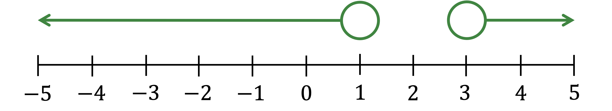
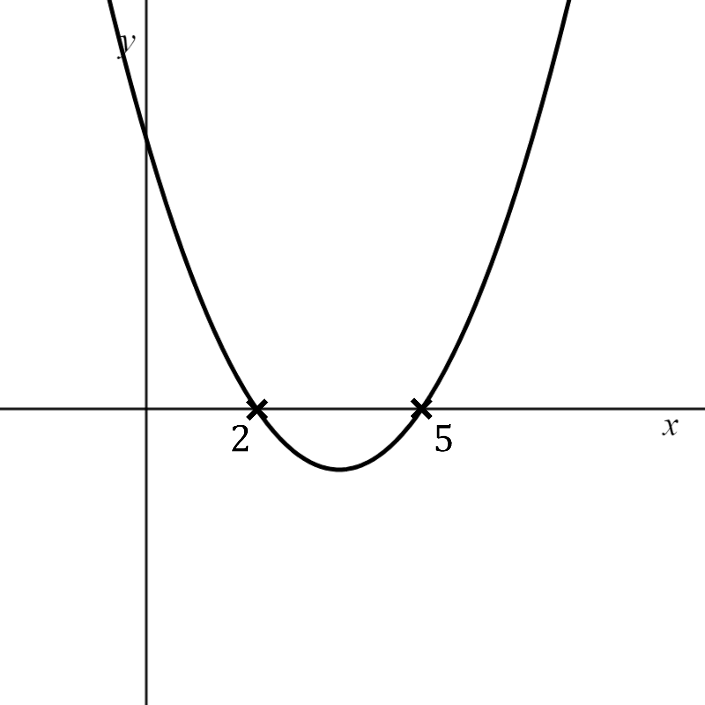
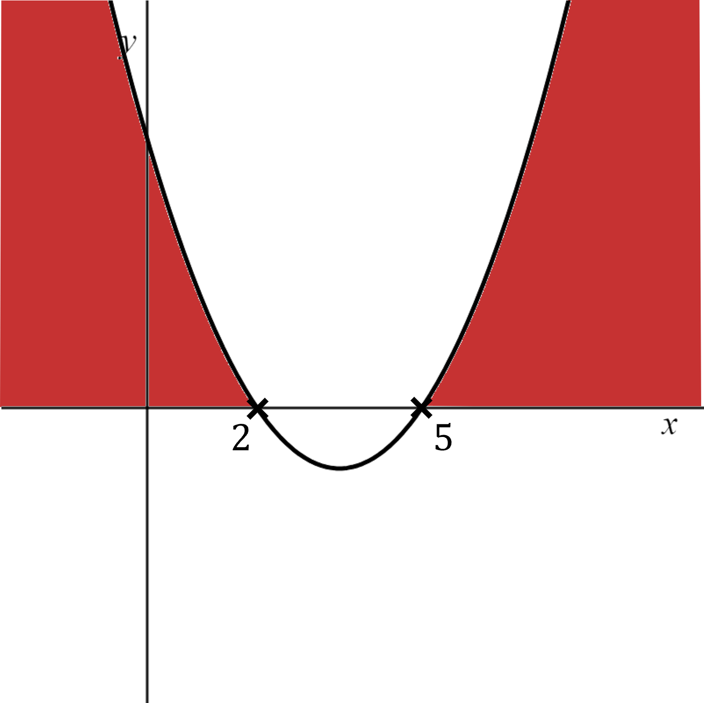
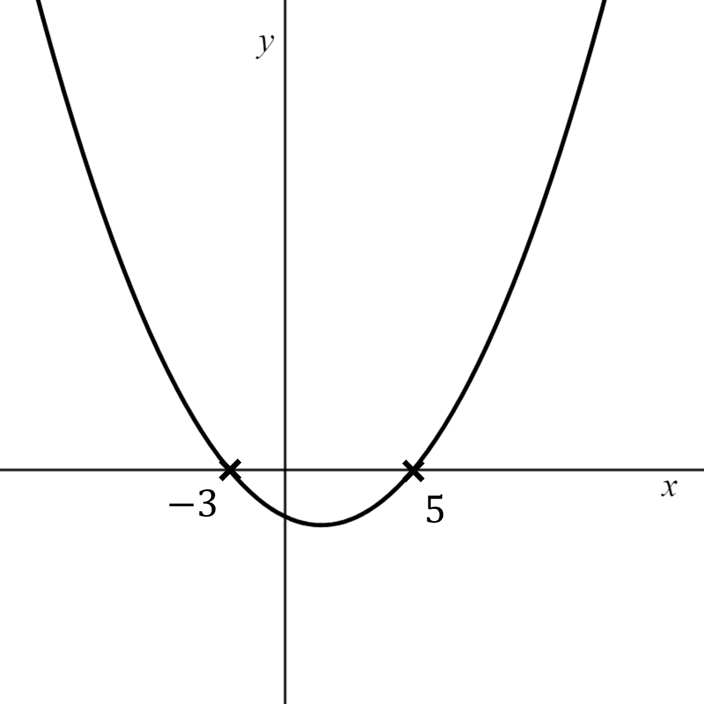
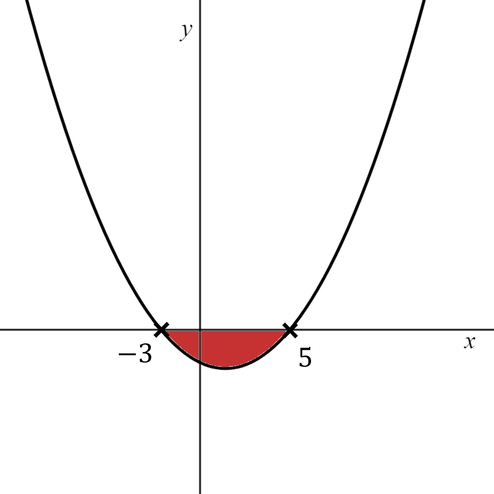
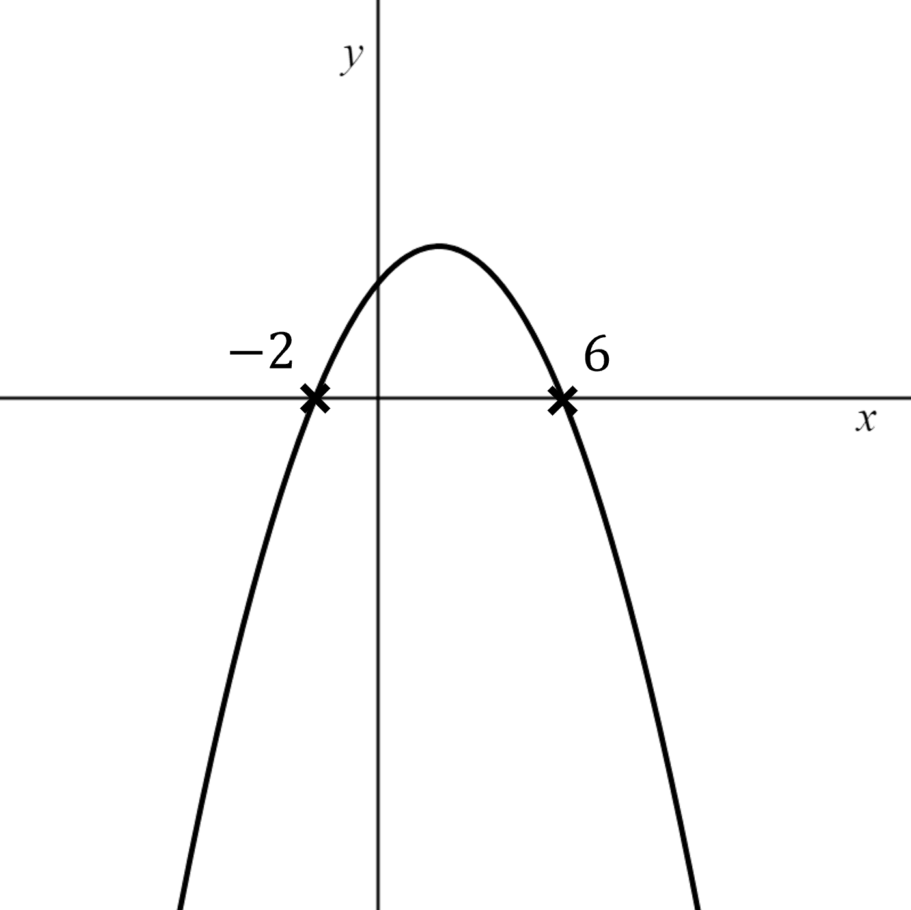
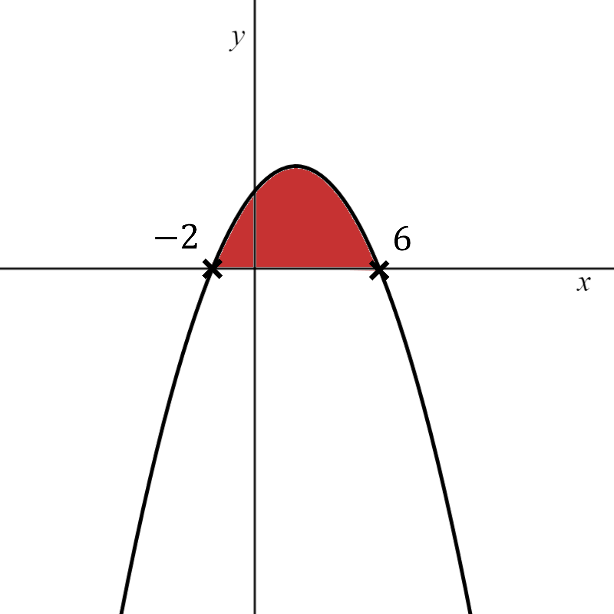

# Solving Inequalities

Course: igcse-maths-b-16 · Section: Algebra

Source: https://www.savemyexams.com/igcse/maths/edexcel/b/16/flashcards/algebra/solving-inequalities/

## Card 1 — keyword_definition (`fl_ndM9PFD6kwG42vqr`)

**FRONT**

Define the word** inequality **in algebra.

**BACK**

An **inequality **compares a left-hand side to a right-hand side and states which one is bigger, using the symbols $<,>,\leq,\geq$.

## Card 2 — keyword_definition (`fl_zDnW59fKdCpJY3PP`)

**FRONT**

Explain the meaning of the word** linear** in linear inequality.

**BACK**

The word** linear **in linear inequality means that the terms in the inequality are either constant numbers or terms in $x$, but not terms in $x^{2}$ or $x^{3}$ etc.

These are examples of linear inequalities:

- $x+2>5$
- $2x<x-1$

## Card 3 — true_or_false (`fl_S3D2WXDcqTZQbdYr`)

**FRONT**

**True or False?**

You can **add or subtract terms** to both sides of a **linear inequality** in exactly the **same way **as you do to a **linear equation**.

**BACK**

**True.**

You can **add or subtract terms** to both sides of a **linear inequality** in exactly the **same way** as you do to a** linear equation**.

## Card 4 — true_or_false (`fl_sTJv24PGWSGXqnTy`)

**FRONT**

**True or False?**

You can** multiply or divide **both sides of a** linear inequality** in exactly the **same way** as you do to a** linear equation**.

**BACK**

**False.**

You can **multiply or divide** both sides of a** linear inequality** in exactly the **same way** as you do to a **linear equation** as long as you **multiply or divide by positive numbers**.

If, however, you multiply or divide both sides by **negative numbers**, you have to **flip the direction **of the inequality sign.

E.g.  You can divide `table row cell 2 x end cell less than 4 end table` by 2 to get `table row x less than 2 end table`.
You can divide `table row cell negative 2 x end cell less than 4 end table` by -2, but you must flip the inequality to get `table row x greater than cell negative 2 end cell end table`.

## Card 5 — keyword_definition (`fl_xwrTqwZ2HRPbjHmv`)

**FRONT**

How do **number lines** highlight the difference between **strict** inequalities (such as $x<3$) and **non-strict** inequalities (such as $x\leq3$)?

**BACK**

Number lines show an **open circle** for strict inequalities, e.g. $x<3$, and a **closed circle** for non-strict inequalities, e.g. $x\leq3$.

## Card 6 — true_or_false (`fl_vjJrWvtq8wYDV68t`)

**FRONT**

**True or False?**

The number line representing " $x<1$ or $x>3$" consists of two separate arrows pointing outwards in opposite directions.

**BACK**

**True.**

The number line representing " $x<1$ or $x>3$" consists of two separate arrows pointing outwards in opposite directions.

## Card 7 — true_or_false (`fl_bgjn2myQvQb7skks`)

**FRONT**

**True or False?**

The diagram below shows the inequality $-4<x\leq2$.

**BACK**

**False.**

The number line in the diagram does** not **show the inequality $-4<x\leq2$.

It has two open circles which indicate the inequality $-4<x<2$.

## Card 8 — question_and_answer (`fl_7S73MdbTqcK9h7wq`)

**FRONT**

Explain how you would **solve an inequality **in the form $-10<ax+b<10$.

**BACK**

To solve an inequality in the form $-10<ax+b<10$,

1. Subtract $b$ from** all three parts**.
2. Then divide all three parts by $a$.

E.g. $-10<2x+6<10\,-16<2x<16\,-8<x<8$

An **alternative** method is to split into two different inequalities, $-10<2x+6$ and $2x+6<10$, then solve these individually.

## Card 9 — question_and_answer (`fl_SXTvQkJJkZsT9Tcr`)

**FRONT**

Outline how to solve a **quadratic inequality**, such as $ax^{2}+bx+c>0$.

**BACK**

To solve a quadratic inequality such as $ax^{2}+bx+c>0$:

- Find the **roots **of the quadratic equation $ax^{2}+bx+c=0$.
- **Sketch **a graph of the quadratic and label the roots.

  - If it is a positive quadratic it will be U-shaped.
  - If it is a negative quadratic it will be n-shaped.
- **Identify the region that satisfies** the inequality.

  - For $ax^{2}+bx+c>0$ the region **above **the *x*-axis satisfies the inequality.

## Card 10 — question_and_answer (`fl_JV5PWqNtMvcHYQ52`)

**FRONT**

The graph of $y=x^{2}-7x+10$ is shown below.

Use the graph to find the answer to   $x^{2}-7x+10>0$.

**BACK**

Shade the region which satisfies $x^{2}-7x+10>0$ (above the *x*-axis).

The answer is $x>5$ or $x<2$.

## Card 11 — question_and_answer (`fl_htPNw6hSPV2ZVZJp`)

**FRONT**

The graph of $y=x^{2}-2x-15$ is shown below.

Use the graph to find the answer to   $x^{2}-2x-15<0$.

**BACK**

Shade the region which satisfies $x^{2}-2x-15<0$ (below the *x*-axis).

The answer is $-3<x<5$.

## Card 12 — question_and_answer (`fl_KqxFC3gjTsy9pctk`)

**FRONT**

The graph of $y=-x^{2}+4x+12$ is shown below.

Use the graph to find the answer to   $-x^{2}+4x+12>0$.

**BACK**

Shade the region which satisfies $-x^{2}+4x+12>0$ (above the *x*-axis).

The answer is $-2<x<6$.

