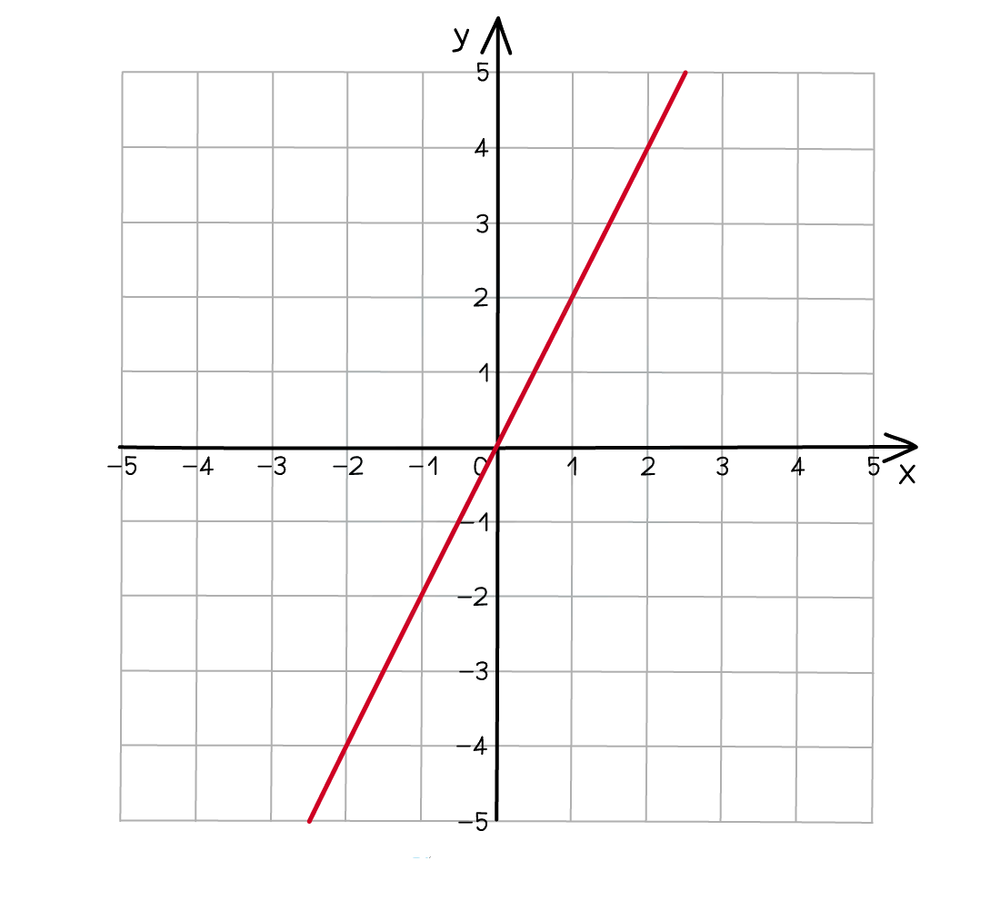
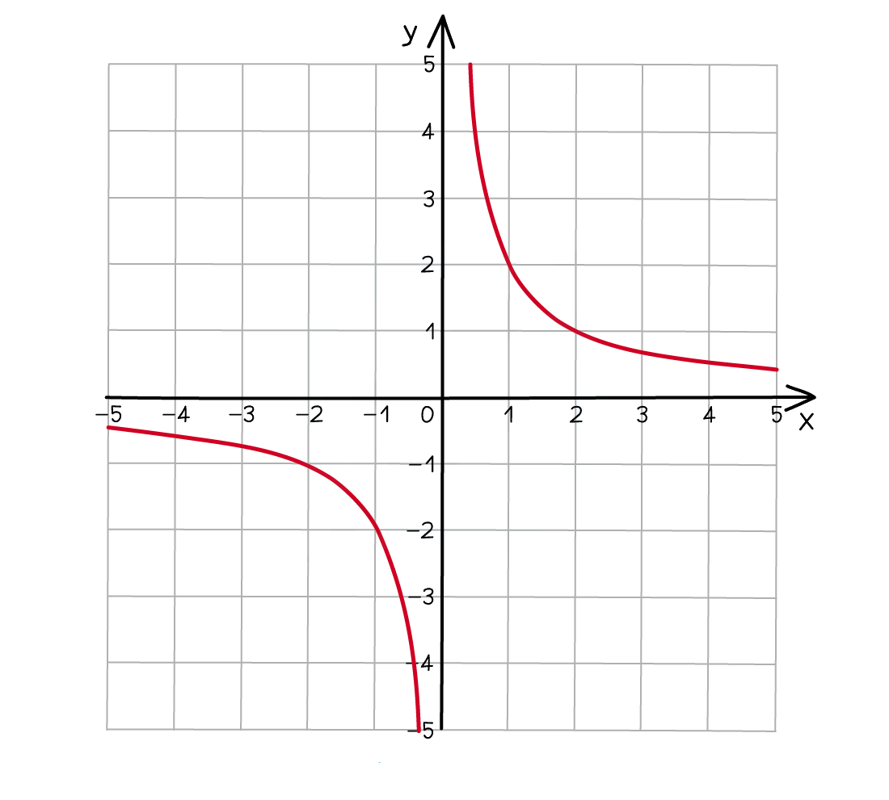

# Direct & Inverse Proportion

Course: igcse-maths-b-16 · Section: Functions

Source: https://www.savemyexams.com/igcse/maths/edexcel/b/16/flashcards/functions/direct-and-inverse-proportion/

## Card 1 — keyword_definition (`fl_x6YKCTtPJ2W6BGdY`)

**FRONT**

What is **direct proportion**?

**BACK**

**Direct proportion** means that as **one variable goes up** the **other goes up** by the **same factor**.

## Card 2 — true_or_false (`fl_ddkbBPndtCvY9SGC`)

**FRONT**

**True or False?**

If $x$ and $y$ are **directly proportional**, then $x:y$ will always be the **same**.

**BACK**

**True.**

If $x$ and $y$ are **directly proportional**, then $x:y$ will always be the **same**.

## Card 3 — question_and_answer (`fl_nc8MDYwtXMrrCNQF`)

**FRONT**

What is $k$ used to **represent** when working with **direct proportion**?

**BACK**

When working with direct proportion, $k$ is used to represent the **constant of proportionality** that connects $x$ and $y$.

$y=kx$ when $x$ and $y$ are directly proportional.

## Card 4 — question_and_answer (`fl_BRvK2f3hxv28yc9m`)

**FRONT**

What does it mean for $y$ to be **directly proportional** to the **square **of $x$?

**BACK**

If $y$ is **directly proportional** to the **square** of $x$, it means that $y=kx^{2}$.

## Card 5 — true_or_false (`fl_dyJhwYq4bSmvzB8t`)

**FRONT**

**True or False?**

The **graph** of two** directly proportional **variables is a **straight line**.

**BACK**

**True.**

The **graph** of two **directly proportional **variables is a **straight line**.

## Card 6 — true_or_false (`fl_nPdXYbq2Gf4PG8S4`)

**FRONT**

**True or false?**

When solving a direct proportion problem, one of the **first things **you should do is **find the value of the constant of proportionality** $k$.

**BACK**

**True.**

When solving a direct proportion problem, one of the **first things** you should do is **find the value of the constant of proportionality** $k$.

## Card 7 — keyword_definition (`fl_FDB5QmrTNzMg26Qw`)

**FRONT**

What is **inverse proportion**?

**BACK**

**Inverse proportion** means as **one variable goes up** the **other goes down **by the **same factor**.

## Card 8 — question_and_answer (`fl_C4md9RQMSqst5xBz`)

**FRONT**

What is $k$ used to represent when working with **inverse proportion**?

**BACK**

When working with inverse proportion, $k$ is used to represent the **constant of proportionality** that connects $x$ and $y$.

$y=\frac{k}{x}$ when $x$ and $y$ are** inversely proportional**.

## Card 9 — true_or_false (`fl_N5GkG8hfnyFKgVVJ`)

**FRONT**

**True or False?**

If $x$ is **inversely proportional** to $y$, then $x:y$ will always be the **same**.

**BACK**

**False.**

If $x$ is** inversely proportional** to $y$, then $x:\frac{1}{y}$ will always be the **same**.

## Card 10 — question_and_answer (`fl_KVcJJZG2P5WGyZDG`)

**FRONT**

How would you describe the **relationship** between $A$and $B$ if $A=\frac{k}{B}$?

**BACK**

If $A=\frac{k}{B}$, it means that $A$ is** inversely proportional **to $B$.

## Card 11 — question_and_answer (`fl_pYC3sGHKh9fy8qVV`)

**FRONT**

What is the **equation** for $A$ in terms of $B$ if $A$ is **inversely proportional** to the **square** of $B$?

**BACK**

If $A$ is **inversely proportional** to the **square** of $B$, then $A=\frac{k}{B^{2}}$.

## Card 12 — true_or_false (`fl_TRS3wr5gJQ5R4ySR`)

**FRONT**

**True or False?**

The **graph** of two** inversely proportional **variables is a **straight line**.

**BACK**

**False.**

The **graph **of two** inversely proportional** variables is a **not a straight line**.

