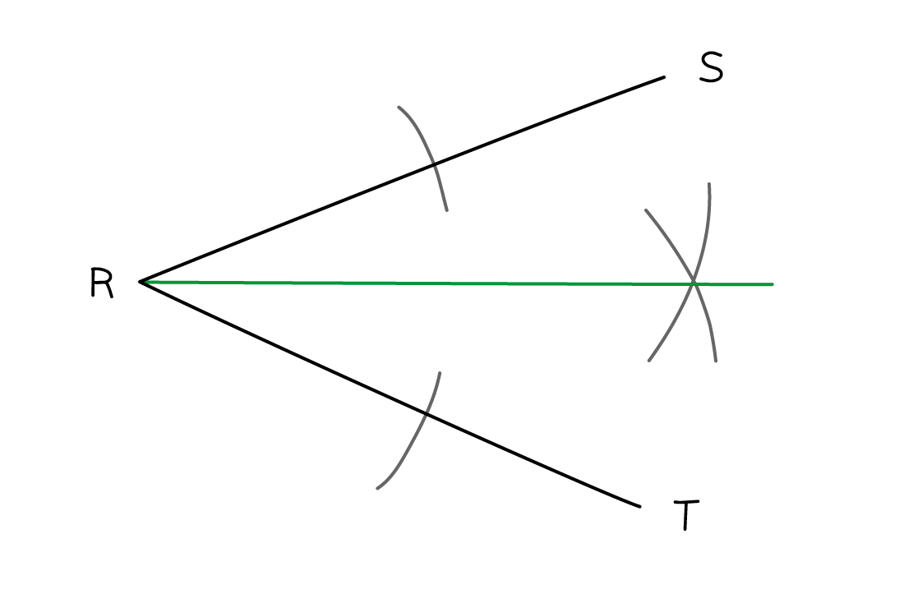

# Constructions & Loci

Course: igcse-maths-b-16 · Section: Geometry

Source: https://www.savemyexams.com/igcse/maths/edexcel/b/16/flashcards/geometry/constructions-and-loci/

## Card 1 — keyword_definition (`fl_4b2PtNgQfdR25PXH`)

**FRONT**

What is a **perpendicular bisector**?

**BACK**

A **perpendicular bisector** is a line that** cuts another line exactly in half** (bisects) and also **crosses it at a right angle** (perpendicular).

## Card 2 — question_and_answer (`fl_G7nZKyd9QtmXG3VJ`)

**FRONT**

How would you **construct **a** perpendicular bisector?**

**BACK**

To construct a **perpendicular bisector**:

1. Set the distance between the point of the compasses and the pencil to be **more than half the length** of the line.
2. Place the point of the compasses on one end of the line and **sketch an arc** **above **and **below **the line.
3. Keeping your compasses set to the **same distance**, move the point of the compasses to the **other end of the line** and sketch an arc **above **and **below **it again.
4. The **arcs should intersect** each other both above and below the line, **connect **the points where the arcs intersect using a **ruler**.

## Card 3 — true_or_false (`fl_NRZ9qdSmghmtyKvB`)

**FRONT**

**True or False?**

The **shortest distance** from a **point **to a **line **is a **straight line**, which meets the line at **90 degrees**.

**BACK**

**True.**

The **shortest distance** from a **point **to a **line **is a **straight line**, which meets the line at **90 degrees**.

E.g. When finding the shortest distance between a boat and a coastline, construct a perpendicular line from the boat to the coastline.

## Card 4 — question_and_answer (`fl_ZyZhNVsp6ffpx8rt`)

**FRONT**

How would you **construct a perpendicular to a line, from a point?**

**BACK**

To construct a **perpendicular to a line, from a point**:

1. Set the distance between the point of your compasses and the pencil to be **greater than the distance between the point and the line**.
2. Place the point of the compasses onto the point and **draw an arc that intersects the line** in **two **places.
3. Make sure that the distance between the point of the compasses and the pencil is greater than half the distance between the intersection points. Place the point of the compasses on a **point of intersection**, and **sketch an arc** above and below the line.
4. Keeping the distance between the point on the compasses and the pencil **the same**, do this **again **from the **other point of intersection**. These should **intersect **with the previous arcs.
5. **Join** the **original point **with the point where the** arcs intersect**.

## Card 5 — keyword_definition (`fl_dGrNPwcN6Kz5Qyw4`)

**FRONT**

What is an **angle bisector**?

**BACK**

An **angle bisector** is a line that **cuts an angle exactly in half** (bisect).

## Card 6 — question_and_answer (`fl_S9sXPYnG9Ms2YsFc`)

**FRONT**

How would you **construct an angle bisector?**

**BACK**

To construct an **angle bisector**:

1. Place the point of the **compasses at the point of the angle** and **sketch an arc** that intersects both of the lines that form the angle.
2. Set the distance between the point of your compasses and the pencil to be greater than half the distance between the intersection points. Place the point of the compasses **on one of the points of intersection** and **sketch an arc**.
3. Keeping the **distance **between the point of the compasses and the pencil** the same**, place the point of the compasses on the **other point of intersection** and **sketch another arc**, this should intersect the arc sketched in step 2.
4. **Join **the** point of the angle** to the **point of intersection** of the arcs with a ruler.

## Card 7 — keyword_definition (`fl_7yzHN74WrDhMpMj2`)

**FRONT**

Define a **locus**.

**BACK**

A locus is a line, shape or path made up of all the points that satisfy a given restriction.

The plural is **loci**, and one example is every point exactly 2 m from a fixed point, which forms a circle.

Spec links: `spcpt_Yhn8BQfZNrRp26cf`

## Card 8 — fill_in_the_blanks (`fl_Yh8zrwVCb7RfwGwc`)

**FRONT**

Fill in the two missing loci.

Points a fixed distance from a point form a `\_\_\_\_\_\_` around it, points equidistant from two points form the `\_\_\_\_\_\_` bisector of the line joining them, and points equidistant from two lines form the angle bisector.

**BACK**

The completed sentence is:

Points a fixed distance from a point form a **circle** around it, points equidistant from two points form the **perpendicular** bisector of the line joining them, and points equidistant from two lines form the angle bisector.

These are three of the four standard loci you need to recognise.

*Blanks: 0 — answers: []*

Spec links: `spcpt_Yhn8BQfZNrRp26cf`

Flags: fitb_no_blank_marker

## Card 9 — question_and_answer (`fl_ZnfjsTqyg8wqm2TS`)

**FRONT**

What is the locus of points a fixed distance from a straight line segment?

**BACK**

It is a running-track shape: a pair of **parallel lines** either side of the segment, joined by a **semicircle** at each end.

The semicircles appear because points beyond each end are that fixed distance from the end point itself.

Spec links: `spcpt_Yhn8BQfZNrRp26cf`

## Card 10 — question_and_answer (`fl_rCNTRGt6XtpZrRWv`)

**FRONT**

Which region is closer to point A than to point B?

**BACK**

The side of the **perpendicular bisector** of the line joining A to B that **contains A**.

Points lying on the bisector itself are exactly the same distance from both.

Spec links: `spcpt_Yhn8BQfZNrRp26cf`

## Card 11 — true_or_false (`fl_6wkDnvFkq5wmYJzQ`)

**FRONT**

**True or False?**

The region more than 5 m from a point is the region inside a circle of radius 5 m drawn around it.

**BACK**

**False.**

The region **inside** the circle is the one **closer** than 5 m to the point.

Points more than 5 m away lie **outside** that circle, and the circle itself is exactly 5 m away.

Spec links: `spcpt_Yhn8BQfZNrRp26cf`

## Card 12 — question_and_answer (`fl_JPvv7F8m5Xgnw7Qt`)

**FRONT**

How do you find the region satisfying several conditions at once?

**BACK**

Take one condition at a time and mark each region with a **tick** if it satisfies that condition and a **cross** if it does not.

The answer is the region carrying only ticks and no crosses, and that is the one to shade.

Spec links: `spcpt_Yhn8BQfZNrRp26cf`

## Card 13 — question_and_answer (`fl_Z82BQKzHb3J8qbxr`)

**FRONT**

A map has a scale of 1 cm to 1 mile. How wide should you open your compasses to draw the locus 5 miles from a point?

**BACK**

To **5 cm**, because the scale turns 5 miles on the ground into 5 cm on the map.

Always convert the real distance into a map distance before drawing any locus on a scale diagram.

Spec links: `spcpt_Yhn8BQfZNrRp26cf`

