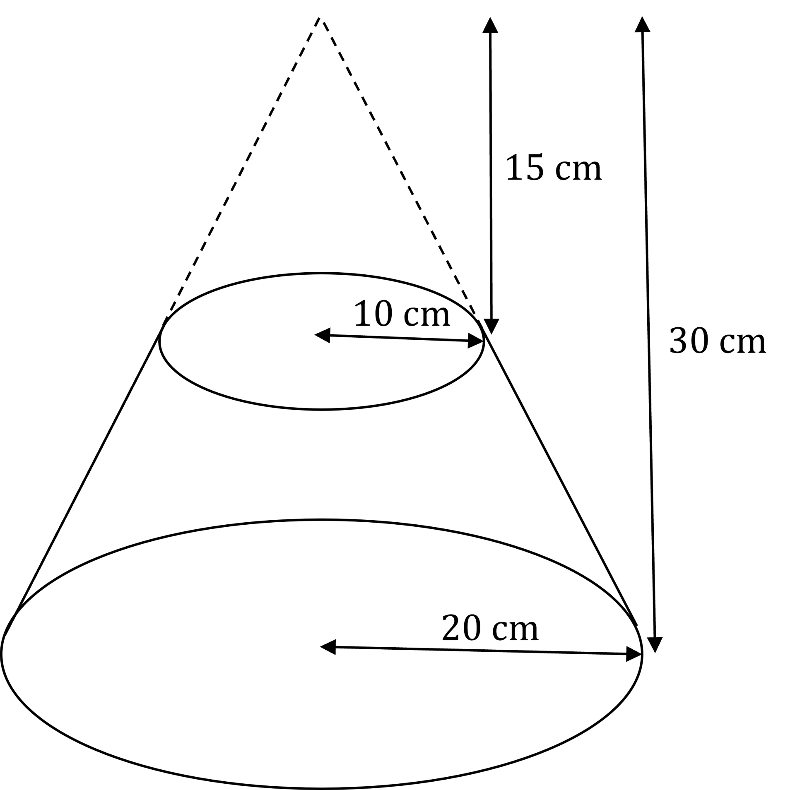

# Volume & Surface Area

Course: igcse-maths-b-16 · Section: Mensuration

Source: https://www.savemyexams.com/igcse/maths/edexcel/b/16/flashcards/mensuration/volume-and-surface-area/

## Card 1 — keyword_definition (`fl_Stdyv46xhKq6v79k`)

**FRONT**

What is a **vertex **on a 3D shape?

**BACK**

A **vertex** is a** corner** of a 3D shape.

E.g. a square-based pyramid has 5 vertices.

## Card 2 — keyword_definition (`fl_84WDYT7c6Db38z5N`)

**FRONT**

What is a **face** on a 3D shape?

**BACK**

A **face **is an** individual flat surface** of a 3D shape.

E.g. a cylinder has 2 circular faces (the two 'ends'), along with one curved surface.

## Card 3 — question_and_answer (`fl_STYTzTpj3VqfJBhr`)

**FRONT**

What is a **prism**?

**BACK**

A **prism **is a 3D shape with the **same cross-section** throughout.

E.g. a cuboid is a rectangular prism.

## Card 4 — true_or_false (`fl_ZnVWDMPddscbghWd`)

**FRONT**

**True or False?**

A **cuboid** has **six equal**, square faces.

**BACK**

**False. **

A **cuboid **has **six** **rectangular faces**. 
They consist of **three pairs **of equal rectangular faces.

A **cube** has** six equal**, square faces.

## Card 5 — question_and_answer (`fl_bnKS6C2Yd7gnD6ZP`)

**FRONT**

What does a **net** of a 3D shape represent?

**BACK**

A **net **of a 3D shape is a** 2D pattern** that could be folded to make that **3D shape**.

## Card 6 — question_and_answer (`fl_DPDM9tHGDRhnwH8x`)

**FRONT**

How many** edges **are there on a **square-based pyramid**?

**BACK**

There are **eight edges** on a **square-based pyramid**.

## Card 7 — true_or_false (`fl_g9G8WHBTQV4ngm4g`)

**FRONT**

**True or False?**

The **base** of a **tetrahedron **is a **square**.

**BACK**

**False. **

The **base **of a **tetrahedron** is a **triangle**.

## Card 8 — question_and_answer (`fl_kkQYGBKwpZr9HQWz`)

**FRONT**

What **shape** is the **cross-section** of a **cylinder**?

**BACK**

The **cross-section** of a **cylinder **is a **circle**.

## Card 9 — true_or_false (`fl_jbKM6R9BQ4CmVdN7`)

**FRONT**

**True or False? **

A **triangular prism** has **two equal triangular faces** and **three rectangular faces**.

**BACK**

**True.**

A **triangular prism** has **two equal triangular faces** and **three rectangular faces**.

## Card 10 — true_or_false (`fl_H6hmk2k947PkTFRq`)

**FRONT**

**True or False?**

A** cube** is a type of **prism**.

**BACK**

**True.**

A **cube** is a type of **prism** with a **square cross-section**.

## Card 11 — question_and_answer (`fl_BY8RFRQ4ZjHYtynV`)

**FRONT**

What is the** formula **for the **volume of a cuboid**?

**BACK**

The **formula **for the** volume of a cuboid** is $V=l\timesw\timesh$

Where:

- $V=$volume
- $l=$length
- $w=$width
- $h=$height

## Card 12 — question_and_answer (`fl_zNH262MHnq3RZ5Qq`)

**FRONT**

What is the **formula** for the **volume of a cylinder**?

**BACK**

The **formula **for the **volume of a cylinder** is $V=πr^{2}h$

Where:

- $V=$volume
- $r=$radius
- $h=$height

## Card 13 — question_and_answer (`fl_2x736gRQ4QyZPJdk`)

**FRONT**

What is the **formula **for the **volume of a cone**?

**BACK**

The **formula **for the **volume of a cone** is $V=\frac{1}{3}πr^{2}h$

Where:

- $V=$volume
- $r=$radius
- $h=$perpendicular height

## Card 14 — question_and_answer (`fl_m37BcTyztpYV7WW2`)

**FRONT**

What is the **formula** for the **volume of a sphere**?

**BACK**

The **formula **for the **volume of a sphere **is $V=\frac{4}{3}πr^{3}$

Where:

- $V=$volume
- $r=$radius

## Card 15 — question_and_answer (`fl_SJkPP9gHx3JGCGR7`)

**FRONT**

What is the **formula** for the **volume of a prism**?

**BACK**

The **formula **for the **volume of a prism **is $V=Al$

Where:

- $V=$volume
- $A=$cross-sectional area
- $l=$length

## Card 16 — keyword_definition (`fl_f658DZfTbRnyvKBk`)

**FRONT**

What is a **frustum**?

**BACK**

A **frustum** is a **truncated** (chopped-off) **cone**.

E.g.

## Card 17 — question_and_answer (`fl_9kCtpC4tVnbJ2Hgp`)

**FRONT**

How can the** volume** of a **hemisphere** be found?

**BACK**

The** volume** of a **hemisphere** can be found by **halving** the **volume** of the **complete sphere**.

## Card 18 — question_and_answer (`fl_M2N5TzYHRNWD4Gm4`)

**FRONT**

How can the **volume** of a** frustum** be found?

**BACK**

The **volume** of a** frustum** is the** volume** of the** larger cone minus** the **volume** of the **smaller cone** that has been 'cut off'.

## Card 19 — question_and_answer (`fl_N8JvCpswJcFs2JhF`)

**FRONT**

What is the** formula** for the **surface area** of a **cylinder**?

**BACK**

The formula for the **surface area** of a **cylinder** is $A=2πr^{2}+2πrh$

Where:

- $A=$ surface area
- $r=$radius
- $h=$height

## Card 20 — true_or_false (`fl_xjC24gBjrbz3ngWs`)

**FRONT**

**True or False?**

The **formula** for the **curved surface area** of a **cone** is $A=πrl+πr^{2}$

Where:

- $A=$surface area
- $r=$radius
- $l=$slant height

**BACK**

**False.**

$A=πrl+πr^{2}$ is the **total surface area** of a **cone**.

The **formula** for the **curved surface area** of a **cone** is $A=πrl$

Where:

- $A=$surface area
- $r=$radius
- $l=$slant height

($πr^{2}$ is the area of the circular base of the cone.)

## Card 21 — question_and_answer (`fl_ZPhKwmmV8Ng4Zpkz`)

**FRONT**

What is the **formula** for the **surface area** of a **sphere**?

**BACK**

The formula for the **surface area** of a **sphere** is $A=4πr^{2}$

Where:

- $A=$surface area
- $r=$radius

## Card 22 — true_or_false (`fl_Zv9q42S3dST2BT4K`)

**FRONT**

**True or False? **

The **surface area **of a** hemisphere** comprises the **surface area** of a **sphere **and the **area **of a** circle** of the **same radius**.

**BACK**

**False.**

The **surface area **of a** hemisphere** comprises **half** the **surface area** of a **sphere, **and the **area **of a** circle** of the **same radius**.

## Card 23 — true_or_false (`fl_XVzFd8pfRYy2dJWh`)

**FRONT**

**True or False?**

The** surface area** of a **cuboid **consists of **three pairs** of **equal rectangles**.

**BACK**

**True.**

The** surface area** of a **cuboid **consists of **three pairs** of **equal rectangles**.

## Card 24 — question_and_answer (`fl_BFjdMDWs7rzd2B92`)

**FRONT**

What is the** formula** for the **total surface area** of a **cone**?

**BACK**

The formula for the **total surface area** of a **cone** is $A=πr^{2}+πrl$

Where:

- $A=$surface area
- $r=$radius
- $l=$slant height

## Card 25 — true_or_false (`fl_sZVyhMxj52z2HHV3`)

**FRONT**

**True or False? **

The **net **of a **cylinder **consists of** two circles** and a **rectangle**.

**BACK**

**True. **

The **net **of a **cylinder **consists of **two circles** and a **rectangle**.

