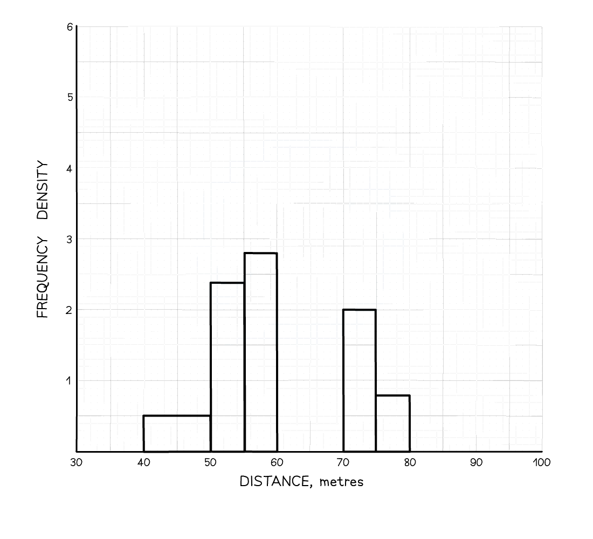

# Histograms

Course: igcse-maths-b-16 · Section: Statistics & Probability

Source: https://www.savemyexams.com/igcse/maths/edexcel/b/16/flashcards/statistics-and-probability/histograms/

## Card 1 — keyword_definition (`fl_XZGPfH327XQWCYpG`)

**FRONT**

State the **formula** for **frequency density**.

**BACK**

The formula for **frequency density** is:

$\mathrm{frequency} \mathrm{density}=\frac{\mathrm{frequency}}{\mathrm{class} \mathrm{width}}$.

## Card 2 — question_and_answer (`fl_grfsqR3ZxKnMppYj`)

**FRONT**

When calculating **frequency densities**, given a table with a first column for the class intervals and a second column for the frequencies, it is useful to **add two more columns **to the table.

What information should these columns be used for?

| Speed, *s* (km/h) | Frequency | ......... | ......... |
|---|---|---|---|
| $20\leqs<40$ | 5 |   |   |
| $40\leqs<50$ | 15 |   |   |

**BACK**

When calculating **frequency densities**, given a table with a first column for the class intervals and a second column for the frequencies, two extra two columns should be added for **class width** and **frequency density**.

| Speed, *s* (km/h) | Frequency | Class width | Frequency Density |
|---|---|---|---|
| $20\leqs<40$ | 5 | 20 | 0.25 |
| $40\leqs<50$ | 15 | 10 | 1.5 |

## Card 3 — true_or_false (`fl_mBMcq7wS44nmBdb7`)

**FRONT**

**True or False?**

A **histogram** is used to show the **frequency distribution** of **discrete **data.

**BACK**

**False.**

A **histogram **is used to show the **frequency distribution** of **continuous** data.

## Card 4 — true_or_false (`fl_tjKymgxm89pNBjTJ`)

**FRONT**

**True or False?**

A **histogram **is the **same **as a **bar chart** but **without the gaps** between the bars.

**BACK**

**False.**

A **histogram **is **not **the **same **as a **bar chart**.

A histogram uses **frequency density**, whereas a bar chart uses frequency.

## Card 5 — question_and_answer (`fl_pVg3DmMfJfdVWS7p`)

**FRONT**

What type of **statistical diagram** is shown below.

**BACK**

The statistical diagram shown is a **histogram**.

## Card 6 — true_or_false (`fl_rxkhjNW59Vps9b22`)

**FRONT**

**True or False?**

The **height **of a bar in a histogram is equal to the **frequency **of that class.

**BACK**

**False.**

The **height **of a bar in a histogram is **not **equal to the **frequency **of that class.

The height is equal to the **frequency density**.

## Card 7 — true_or_false (`fl_Vb8jNDGM8P3qqCjY`)

**FRONT**

**True or False?**

The **area **of a bar in a histogram is **proportional **to its **frequency**.

**BACK**

**True.**

The **area **of a bar in a histogram is **proportional **to its **frequency**.

In most cases the area is **equal **to the frequency.

## Card 8 — keyword_definition (`fl_Hh3wBDjRtxjdyX87`)

**FRONT**

How can you find the **frequency** of a group from a histogram?

**BACK**

The **frequency **of a histogram is proportional to the **area** of the bar.

Therefore, in order to find the frequency for a particular bar, you can  find its area by multiplying the height (frequency density) by the width of the bar (class width).

$\mathrm{frequency}=\mathrm{frequency} \mathrm{density}\times\mathrm{class} \mathrm{width}$

## Card 9 — keyword_definition (`fl_ZvSTDtjmpWHzpCR7`)

**FRONT**

How can you find the **frequency** of a part of a class interval from a histogram?

**BACK**

To **estimate** the frequency of **part** of a class interval within a histogram:

- Find the area of the bar for the part of the interval required.

