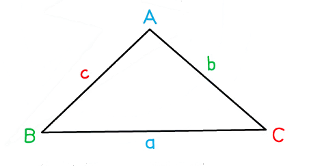

# Sine, Cosine Rules & Area of Triangles

Course: igcse-maths-b-16 · Section: Trigonometry

Source: https://www.savemyexams.com/igcse/maths/edexcel/b/16/flashcards/trigonometry/sine-cosine-rules-and-area-of-triangles/

## Card 1 — keyword_definition (`fl_K9m3QXGTdb4cCVkN`)

**FRONT**

State the **equation** for the **sine rule**.

**BACK**

The equation for the** sine rule** is `fraction numerator a over denominator sin open parentheses A close parentheses end fraction equals fraction numerator b over denominator sin open parentheses B close parentheses end fraction equals fraction numerator c over denominator sin open parentheses C close parentheses end fraction`

Where:

- $a$ is the length of the side opposite angle $A$
- $b$ is the length of the side opposite angle $B$
- $c$ is the length of the side opposite angle $C$

It can also be used in the form `fraction numerator sin open parentheses A close parentheses over denominator a end fraction equals fraction numerator sin open parentheses B close parentheses over denominator b end fraction equals fraction numerator sin open parentheses C close parentheses over denominator c end fraction`

## Card 2 — question_and_answer (`fl_fbBP5dgjXGyY37FC`)

**FRONT**

What **type of triangle** can the** sine rule** be used on?

**BACK**

The sine rule can be applied to **any type of triangle**.

Unlike SOHCAHTOA, it is **not** restricted to right-angled triangles.

## Card 3 — true_or_false (`fl_ns3pm3PJzGCRKQ4r`)

**FRONT**

**True or False?**

The** sine rule **can be used to find **missing side lengths** in **non right-angled triangles**.

**BACK**

**True. **

The sine rule can be used to find **missing side lengths **in **non-right angled triangles**.

It is easiest to do this when the equation is in the form with the angles in the numerators, `fraction numerator sin open parentheses A close parentheses over denominator a end fraction equals fraction numerator sin open parentheses B close parentheses over denominator b end fraction equals fraction numerator sin open parentheses C close parentheses over denominator c end fraction`.

## Card 4 — question_and_answer (`fl_Prqc3thrypS6hpp6`)

**FRONT**

How should the **angles** and **sides** of a triangle be** labelled** in order to apply the** sine rule**?

**BACK**

**Angles** should be labelled in **capitals**, $A$, $B$ and $C$.

**Sides opposite** to the angles should be labelled with the **corresponding lower case letters**, $a$, $b$ and $c$.

## Card 5 — true_or_false (`fl_QwJN9xTXHwXKJjMb`)

**FRONT**

**True or False? **

When using the **inverse sine function**, the result is always an **acute** angle.

**BACK**

**True.**

When using the** inverse sine function**, the result is always an **acute **angle.

## Card 6 — question_and_answer (`fl_cS5tftjFB5GrjgxC`)

**FRONT**

How can you find the corresponding **obtuse** angle when using the **inverse sine** function?

**BACK**

As the** inverse sine** function will always give you the **acute **angle, you must **subtract this from 180º** if you want to find the corresponding **obtuse **angle.

## Card 7 — keyword_definition (`fl_zshbTrjZ2w5ddWvg`)

**FRONT**

State the **equation** for the **cosine rule** in the form used to find a** **missing **angle**.

**BACK**

The **equation** for the **cosine rule** in the form used to find a missing **angle **is `cos open parentheses A close parentheses equals fraction numerator b squared plus c squared minus a squared over denominator 2 b c end fraction`

Where:

- $a$ is the length of the side opposite angle $A$
- $b$ and $c$ are the lengths of the two other sides

## Card 8 — keyword_definition (`fl_dGdgMHDD7kQmyFMj`)

**FRONT**

State the **equation** for the **cosine rule** in the form used to find a missing** side**.

**BACK**

The equation for the **cosine rule** in the form used to find a missing **side** is `a squared equals b squared plus c squared minus 2 b c space cos space open parentheses A close parentheses`

Where:

- $a$ is the length of the side opposite angle $A$
- $b$ and $c$ are the lengths of the two other sides

## Card 9 — true_or_false (`fl_Jw39pxpZ9NWdh6fD`)

**FRONT**

**True or False?**

The cosine rule can only be applied to **right-angled **triangles.

**BACK**

**False. **

The **cosine rule** can be used on** any type of triangle**.

If, however, you have a right-angled triangle, it is often quicker to use SOHCAHTOA.

## Card 10 — true_or_false (`fl_dmBnkQG3TzRZmJx6`)

**FRONT**

**True or False?**

You should always check your** calculator settings** before completing any calculations involving** trigonometry**.

**BACK**

**True.**

You must check that your calculator is in **degrees mode** and not radians or gradians mode to ensure that it will give you a correct answer.

This is especially important to check **before an exam**!

## Card 11 — keyword_definition (`fl_XngRDXykttb28hgs`)

**FRONT**

What is the** formula** for the **area of a triangle**?

**BACK**

The **area of a triangle** is given by the formula `A equals 1 half a b space sin open parentheses C close parentheses`

Where:

- $A$ is the area of the triangle
- $a$ and $b$ are the lengths of two sides
- $C$ is the angle between those two sides

## Card 12 — question_and_answer (`fl_BtrW3Gh9rMmTFbzd`)

**FRONT**

If $C=90^{\circ}$, what does the area formula for a triangle **simplify** to?

**BACK**

If $C=90^{\circ}$, the area formula for a triangle **simplifies **to $A=\frac{1}{2}bh$

Where:

- $A$ is the area of the triangle
- $b$ is the length of the base
- $h$ is the perpendicular height of the triangle

(This is because `sin open parentheses 90 degree close parentheses equals 1`.)

## Card 13 — question_and_answer (`fl_DwKj4nnvNyH8QX24`)

**FRONT**

How should the **angles** and **sides **of a triangle be **labelled** in order to apply the **area of a triangle** formula?

**BACK**

**Angles** should be labelled in **capitals**, $A$, $B$ and $C$.

**Sides opposite** to the angles should be labelled with the **corresponding lower case letters**, $a$, $b$ and $c$.

## Card 14 — true_or_false (`fl_ZGvBHpTbrH9pKRJN`)

**FRONT**

**True or False?**

When using the** area of a triangle **formula, the **angle** in question must be **between** the** two sides**.

**BACK**

**True.**

When using the **area of a triangle** formula, the **angle** in question must be **between** the** two sides**.

## Card 15 — question_and_answer (`fl_P4yFPMsV5m89DQnQ`)

**FRONT**

Which** trigonometric rule** should be used if you know** three sides** of a triangle and want to work out a** missing angle**?

**BACK**

If you know** three sides** of a triangle and want to work out a **missing angle** then the **cosine rule** should be used.

## Card 16 — true_or_false (`fl_XqcY4wSy8ZSxB3Jb`)

**FRONT**

**True or False?**

The **cosine rule** will sometimes give you an** ambiguous answer** for an angle.

**BACK**

**False. **

The cosine rule will **always give the correct answer **for an angle, as long as the correct values are entered into the formula.

## Card 17 — question_and_answer (`fl_YZ5yDmtZ6T7k3QSp`)

**FRONT**

Which **trigonometric rule **should be used if you know the **area of a triangle** and **two of its sides** and you want to find the **angle between those two sides**?

**BACK**

If you know the **area of a triangle** and **two of its sides** and you want to find the **angle between those two sides**,** **then the **area of a triangle formula** should be used.

## Card 18 — true_or_false (`fl_p6QqjBDkdzst3ZYv`)

**FRONT**

**True or False?**

Using the** sine rule** to find an angle **may not result in the required angle**.

**BACK**

**True.**

Using the sine rule to find an angle will always generate the **acute **angle.

If you need to find the **obtuse **angle, you will need to **subtract the result from 180º**.

## Card 19 — question_and_answer (`fl_5BsWQVYsKVqf23c7`)

**FRONT**

Which **trigonometric rule** should be used if you know **two sides** of a triangle and the **angle between them** and you want to find the **length of the third side**?

**BACK**

If you know **two sides** of a triangle and the **angle between them** and you want to find the **length of the third side**, then the **cosine rule** should be used.

## Card 20 — true_or_false (`fl_2pFwDt93vP2Vqryg`)

**FRONT**

**True or False?**

In some exam questions you will be expected to use a **combination **of trigonometric rules or the **same rule more than once**.

**BACK**

**True. **

In some exam questions you will be expected to use a **combination **of trigonometric rules or the **same rule more than once**.

## Card 21 — true_or_false (`fl_m2tCcRVxJ7g4Zktd`)

**FRONT**

**True or False?**

The cosine rule should be used if you know **two sides **and the **angle opposite one of the sides **and you want to find the **angle opposite the other side**.

**BACK**

**False.**

If you** know two sides** and the **angle opposite one of the sides** and you want to find the **angle opposite the other side**, then you should use the **sine rule**.

