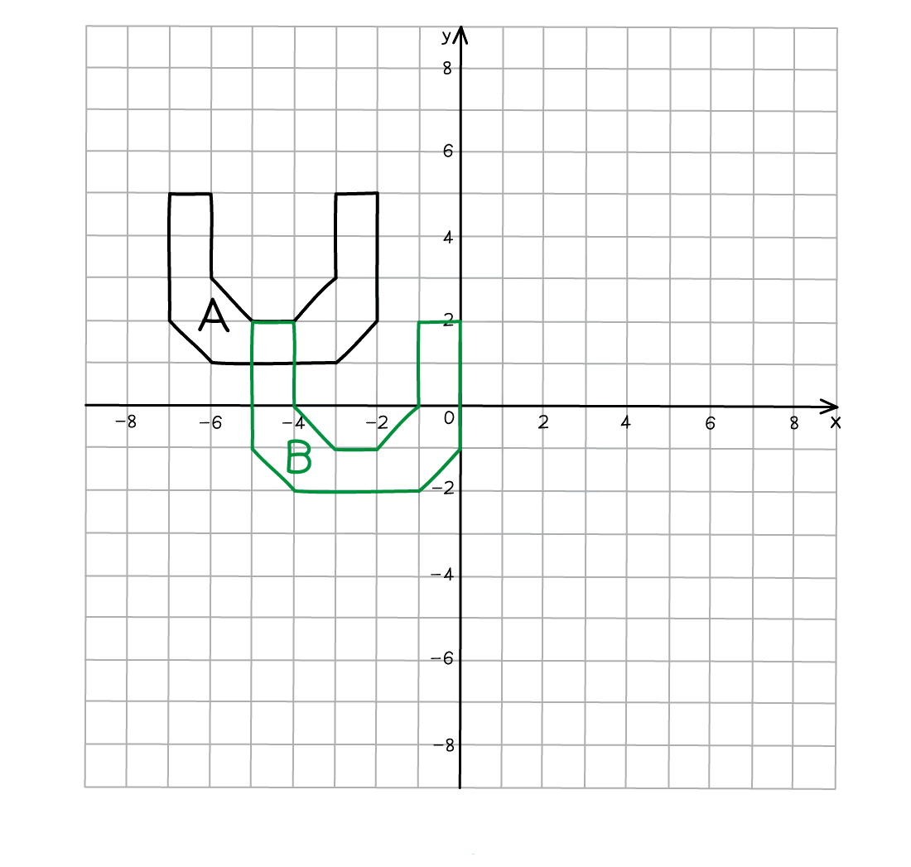

# Transformations

Course: igcse-maths-b-16 · Section: Vectors & Transformation Geometry

Source: https://www.savemyexams.com/igcse/maths/edexcel/b/16/flashcards/vectors-and-transformation-geometry/transformations/

## Card 1 — keyword_definition (`fl_dNF6H94jBBNnbf4T`)

**FRONT**

Define the term **translation**.

**BACK**

A **translation **is when a shape is **moved**.

Its position changes but its size, shape and orientation stay the same.

## Card 2 — question_and_answer (`fl_zMpMYJ4gTJPMTwKN`)

**FRONT**

What do you use to **describe **how a shape is **moved horizontally and vertically **by a **translation**?

**BACK**

You use a **vector **in the form `open parentheses table row x row y end table close parentheses` to **describe a translation**.

Within the vector,  $x$ describes the horizontal movement and $y$ describes the vertical movement.

## Card 3 — true_or_false (`fl_cFg3WhdJvH7ndZz5`)

**FRONT**

**True or False?**

The vector `open parentheses table row 2 row 3 end table close parentheses` means **3 **units to the **right **and **2 **units **up**.

**BACK**

**False.**

The vector `open parentheses table row 2 row 3 end table close parentheses` does **not** mean **3 **units to the **right **and **2 **units **up**.

The vector `open parentheses table row 2 row 3 end table close parentheses` means **2 **units to the **right **and **3 **units **up**.

The **top **number is **horizontal **and the **bottom **number is **vertical.**

## Card 4 — true_or_false (`fl_tRdWtHfdVM3J5vqf`)

**FRONT**

**True or False?**

The vector `open parentheses table row cell negative 2 end cell row 0 end table close parentheses` means **2 **units to the **left**.

**BACK**

**True.**

The vector `open parentheses table row cell negative 2 end cell row 0 end table close parentheses` means **2 **units to the **left**.

## Card 5 — true_or_false (`fl_tcHfXjdppP5zr6PX`)

**FRONT**

**True or False?**

The vector `open parentheses table row 0 row cell negative 3 end cell end table close parentheses` means **3 **units **up**.

**BACK**

**False.**

The vector `open parentheses table row 0 row cell negative 3 end cell end table close parentheses` does **not **mean **3 **units **up**.

The vector `open parentheses table row 0 row cell negative 3 end cell end table close parentheses` means **3 **units **down**.

If the **bottom **number is **negative **it goes **down**.

## Card 6 — question_and_answer (`fl_m7TN7tfGs6YDT8hQ`)

**FRONT**

How do you **translate **a shape?

**BACK**

To translate a shape, **move **each corner according to the vector.

**Join **the new corners together to make the translated shape.

## Card 7 — true_or_false (`fl_khVzTgx5rrHgHpdb`)

**FRONT**

**True or False?**

When you **translate **a shape, it should **not overlap** with the original shape.

**BACK**

**False.**

When you **translate **a shape, it **can overlap** with the original shape.

## Card 8 — question_and_answer (`fl_FBMBYt85R3Vptkw9`)

**FRONT**

To get full marks, what **information **do you need to give when **describing a translation **in an exam question?

**BACK**

When **describing a translation**, you need to:

- State that the transformation is a **translation**.
- State the **vector**.

## Card 9 — question_and_answer (`fl_bMkQCgGsdTksTZK6`)

**FRONT**

How do you **reverse** a **translation**?

E.g. reverse a translation of `open parentheses table row 6 row cell negative 2 end cell end table close parentheses`.

**BACK**

A translation can be reversed by **changing the sign** (but not the number) of **each value** in the **translation vector,** and moving the shape by this new vector.

E.g. to reverse a translation of `open parentheses table row 6 row cell negative 2 end cell end table close parentheses`, move the translated shape by the vector `open parentheses table row cell negative 6 end cell row 2 end table close parentheses`.

## Card 10 — question_and_answer (`fl_fPFGMJyYpH5BKzxJ`)

**FRONT**

What **type of transformation** is seen in the the diagram below?

**BACK**

The transformation in the diagram is a **translation**.

The shape has moved position but has not changed in size or orientation.

Shape A has been translated to shape B by the vector `open parentheses table row 2 row cell negative 3 end cell end table close parentheses`.

## Card 11 — keyword_definition (`fl_9WcdznGGkWdwrtQQ`)

**FRONT**

Define the term **reflection**.

**BACK**

A **reflection **is when a shape is **flipped **about a line of symmetry.

Its orientation changes and its position could change but its size stays the same.

## Card 12 — true_or_false (`fl_J5v4JpRmX5Z2NrYB`)

**FRONT**

**True or False?**

A **reflection **in the line $y=0$ is **always the same** as a reflection in the *y*-axis.

**BACK**

**False.**

A **reflection **in the line $y=0$ is **always the same** as a reflection in the ***x*****-axis**.

## Card 13 — true_or_false (`fl_4QS969cfpxNrkVJ3`)

**FRONT**

**True or False?**

The **line of reflection** will always be **horizontal **or **vertical**.

**BACK**

**False.**

The **line of reflection** will **not **always be **horizontal **or **vertical**. It could be diagonal such as $y=x$ or $y=-x$.

## Card 14 — question_and_answer (`fl_Nn7HJZpfD8FvWcM4`)

**FRONT**

Which points **do not change** when reflected?

**BACK**

Any points that lie on the **line of reflection** **do not change** when reflected.

## Card 15 — question_and_answer (`fl_4vjDCCr3ctdMv7Jk`)

**FRONT**

How do you **reflect **a shape about a line of reflection?

**BACK**

To **reflect **a shape, reflect each corner separately.

- Count or measure the perpendicular distance from a corner to the line of reflection.
- Repeat this distance on the other side of the line.
- Label the new corner.
- Join all the corners up to form the reflected shape.

## Card 16 — question_and_answer (`fl_hqKv33vPqmtqDmYM`)

**FRONT**

To get full marks, what **information **do you need to give when **describing a reflection **in an exam question?

**BACK**

When **describing a reflection**, you need to:

- State that the transformation is a **reflection**.
- State the **equation **of the** line of reflection**.

## Card 17 — true_or_false (`fl_F7RbMsVRxkq4PwGY`)

**FRONT**

**True or False?**

To **reverse** a **reflection**, you can **reflect **it about the **same line of reflection **again.

E.g. if an object has been reflected along the *x*-axis, then reflecting it along the *x*-axis again will bring it back to its initial position.

**BACK**

**True.**

To **reverse** a **reflection**, you can **reflect **it about the **same line of reflection **again.

## Card 18 — question_and_answer (`fl_SdP2DyKdxYWWYk2w`)

**FRONT**

What **type** **of transformation** is seen in the diagram below.

**BACK**

The transformation in the diagram is a** reflection**.

The two shapes are the same size but are in different positions and orientations.

Shape A has been reflected to shape B in the line $x=-1$.

## Card 19 — keyword_definition (`fl_DtTWvYMwv8G4RKFP`)

**FRONT**

Define the term **rotation**.

**BACK**

A **rotation **is when a shape is **turned **about a point.

Its position could change but its size stays the same.

## Card 20 — true_or_false (`fl_45TpXpbHS9WyVsk5`)

**FRONT**

**True or False?**

A rotation **90****° ****clockwise** is the **same **as a rotation **270****°**** anticlockwise**.

**BACK**

**True.**

A rotation **90****° ****clockwise** is the **same **as a rotation **270****°**** anticlockwise**.

## Card 21 — true_or_false (`fl_8mymsyXj9qQrKZvs`)

**FRONT**

**True or False?**

You must state the **direction **of the rotation when the angle is **180°**.

**BACK**

**False.**

You do not need to state the **direction **of the rotation when the angle is **180°**. 180° clockwise is the same as 180° anticlockwise.

## Card 22 — question_and_answer (`fl_SNG2dPnn4PzpwxtM`)

**FRONT**

To get full marks, what **information **do you need to give when **describing a rotation **in an exam question?

**BACK**

When **describing a rotation**, you need to:

- State that the transformation is a **rotation**.
- State the **angle and direction **of the rotation.
- State the position of the **centre of the rotation**.

## Card 23 — question_and_answer (`fl_cykYWYDSNCTrr4bY`)

**FRONT**

How do you **rotate **a shape about a **centre of rotation**?

**BACK**

To **rotate **a shape about a **centre of rotation**:

- Trace over the original shape.
- Put your pencil on the centre of rotation.
- Rotate the tracing paper by the given angle and in the given direction.
- Draw the rotated shape as indicated by the tracing paper.

## Card 24 — true_or_false (`fl_jXwMQz9Xpq7WdMbw`)

**FRONT**

**True or False?**

The** centre of rotation** can be **inside **the original shape.

**BACK**

**True.**

The** centre of rotation** can be **inside **the original shape.

## Card 25 — question_and_answer (`fl_qVF8Dnmkzm3wksjH`)

**FRONT**

What **type of transformation** is shown in the diagram below?

**BACK**

The transformation in the diagram is a **rotation**.

The shapes are identical but the positions and orientations are different.

Shape A has been rotated by 90º in a clockwise direction about the centre (-4, 0) onto shape B.

## Card 26 — keyword_definition (`fl_FTnr52rhMcgqyy5Q`)

**FRONT**

Define the term **enlargement**.

**BACK**

An **enlargement **is when a shape is **stretched **(or shrunk) both horizontally and vertically by the same factor.

## Card 27 — true_or_false (`fl_nzZ3v2NZcSnKYdfF`)

**FRONT**

**True or False?**

**Enlargements **always make shapes **bigger**.

**BACK**

**False.**

**Enlargements **do not always make shapes **bigger**.

The shape can be made **smaller **if the scale factor is between 0 and 1.

## Card 28 — question_and_answer (`fl_Yr3TMgpTdnVcbTnT`)

**FRONT**

What does a **scale factor **of 3** **mean in terms of **enlargement?**

**BACK**

In terms of enlargement, a** scale factor** of 3 means that **each edge** of the **enlarged image** will be **3 times longer **than the **corresponding edge** on the **original object**.

## Card 29 — question_and_answer (`fl_qtcX2rGjCfmkYgdT`)

**FRONT**

To get full marks, what **information **do you need to give when **describing an enlargement **in an exam question?

**BACK**

When **describing an enlargement**, you need to:

- State that the transformation is an **enlargement**.
- State the **scale factor**.
- State the coordinates of the **centre of enlargement**.

## Card 30 — true_or_false (`fl_zkK3532j66Fxn8Mw`)

**FRONT**

**True or False?**

The **centre of enlargement** determines the **position **of the enlarged shape for a given scale factor.

**BACK**

**True.**

The **centre of enlargement** determines the **position **of the enlarged shape for a given scale factor.

Moving the centre of enlargement will  change the position of the enlarged image but it will not affect its size. It will still be enlarged by the same scale factor.

## Card 31 — true_or_false (`fl_GHwTDvRTGKYzjCxD`)

**FRONT**

**True or False?**

One of the corners of the enlarged shape is **always **on the centre of enlargement.

**BACK**

**False.**

One of the corners of the enlarged shape does** not** have to be** **on the centre of enlargement.

## Card 32 — question_and_answer (`fl_bGbZTYMM4526bRWs`)

**FRONT**

How do you **enlarge **a shape?

**BACK**

To **enlarge **a shape:

- Count/measure the distances from the centre of enlargement to a corner.
- Multiply the distances by the scale factor.
- Count the new distances from the centre of enlargement.
- Repeat this for all the corners.
- Join the corners together to form the enlarged shape.

## Card 33 — true_or_false (`fl_MzHHWR9jbTdX8MDM`)

**FRONT**

**True or False?**

If you draw a **straight line **that passes through a corner on the original shape and the corresponding corner on the enlarged shape, then that line will **pass through the centre** **of enlargement**.

**BACK**

**True.**

If you draw a **straight line **that passes through a corner on the original shape and the corresponding corner on the enlarged shape, then that line will **pass through the centre of enlargement**.

This can be used to find the centre of enlargement or check your enlargements.

These lines are sometimes called rays.

## Card 34 — question_and_answer (`fl_bTNFsXKxQ9z8QbxX`)

**FRONT**

How do you find the **scale factor **of an enlargement?

**BACK**

To find the **scale factor** of an enlargement, **divide **the length of any side on the **enlarged **shape by the length of the corresponding side on the **original **shape.

## Card 35 — question_and_answer (`fl_686fQyXzwfyZBtss`)

**FRONT**

How do you find the **centre of enlargement**?

**BACK**

To find the **centre of enlargement**, draw a **straight line** that passes through a corner on the original shape and the corresponding corner on the enlarged shape.

Repeat this for one or more corners on the original shape.

The point of **intersection **of these lines will be the centre of enlargement.

## Card 36 — true_or_false (`fl_dMGPYsBGHCc2v6yx`)

**FRONT**

**True or False?**

The **scale factor** of enlargement is the scale factor between the **area **of the original shape and the area of the enlarged shape.

**BACK**

**False.**

The **scale factor** of enlargement is not the scale factor between the **area **of the original shape and the area of the enlarged shape.

It is the** scale factor of their corresponding lengths**, not their areas.

## Card 37 — true_or_false (`fl_vhdKwZXQ7x4v4NFS`)

**FRONT**

**True or False?**

The** scale factor **of an** enlargement **must be **greater than 1**.

**BACK**

**False.**

The **scale factor** of an **enlargement** does not have to be **greater than 1**.

If the **scale factor** is **greater than 0** but **less than 1**, the enlarged image will be smaller than the original object.

## Card 38 — question_and_answer (`fl_df9tzwxYngrxv53w`)

**FRONT**

How do you **reverse** an **enlargement**?

E.g. reverse an enlargement of scale factor 2 about the centre of enlargement (3, 1).

**BACK**

An enlargement can be reversed by performing another enlargement:

- The centre of enlargement remains the same.
- The scale factor is the reciprocal of the initial scale factor.

E.g. to reverse an enlargement of scale factor 2 about the centre of enlargement (3, 1), perform another enlargement with scale factor $\frac{1}{2}$ about the centre of enlargement (3, 1).

## Card 39 — question_and_answer (`fl_Q7G66FtqP9V6CfGF`)

**FRONT**

What is often true of two transformations performed one after the other?

**BACK**

They can usually be replaced by a **single** transformation with exactly the same effect.

Describing that single transformation fully means giving everything it needs, such as an angle, a direction and a centre for a rotation.

Spec links: `spcpt_3w7YqY2dN68HMc4k`

## Card 40 — question_and_answer (`fl_F6sk5XhjPYPfxdRG`)

**FRONT**

A shape is reflected in the line $x = a$ and then in the line $y = b$. What single transformation does that give?

**BACK**

A **rotation of 180°** about the point `\left(a , b\right)`.

The two mirror lines are perpendicular, and the point where they cross becomes the centre of that rotation.

Spec links: `spcpt_3w7YqY2dN68HMc4k`

## Card 41 — true_or_false (`fl_jshgztbR5wYZ3N4q`)

**FRONT**

**True or False?**

The order in which two transformations are applied never affects the final result.

**BACK**

**False.**

Reflecting in $y = x$ and then in the $x$-axis gives a **90° clockwise** rotation about the origin.

Doing those same two reflections the other way round gives a **90° anticlockwise** rotation instead, so the order matters.

Spec links: `spcpt_3w7YqY2dN68HMc4k`

## Card 42 — fill_in_the_blanks (`fl_src45fRwmqym2kq7`)

**FRONT**

Fill in the two missing ways of undoing a transformation.

A translation by `\begin{pmatrix} x \\ y \end{pmatrix}` is undone by a translation by `\_\_\_\_\_\_` and an enlargement of scale factor $k$ is undone by an enlargement of scale factor `\_\_\_\_\_\_` about the same centre.

**BACK**

The completed sentence is:

A translation by `\begin{pmatrix} x \\ y \end{pmatrix}` is undone by a translation by `\begin{pmatrix} - x \\ - y \end{pmatrix}` and an enlargement of scale factor $k$ is undone by an enlargement of scale factor $\frac{1}{k}$ about the same centre.

A **reflection** is undone by repeating it in the same line, and a **rotation** by turning through the same angle the opposite way.

*Blanks: 0 — answers: []*

Spec links: `spcpt_3w7YqY2dN68HMc4k`

Flags: fitb_no_blank_marker

## Card 43 — question_and_answer (`fl_SfMp76WvCFKMCBBR`)

**FRONT**

A shape is rotated 180° about the origin and then reflected in the line $y = 0$. What single transformation is that?

**BACK**

A reflection in the $y$-axis.

The rotation sends a point `\left(x , y\right)` to `\left(- x , - y\right)`, and reflecting that in the $x$-axis gives `\left(- x , y\right)`.

Spec links: `spcpt_3w7YqY2dN68HMc4k`

