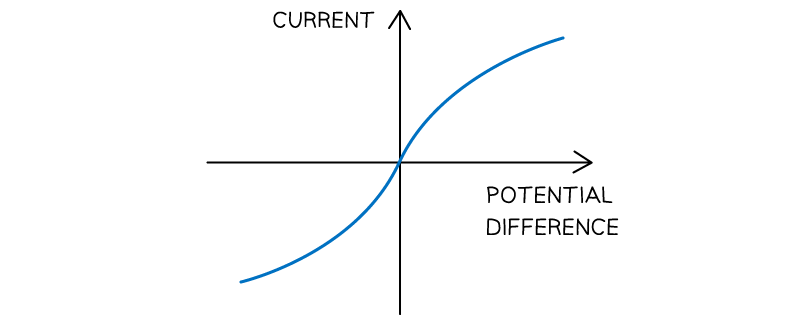
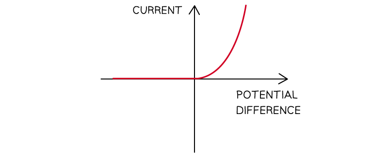
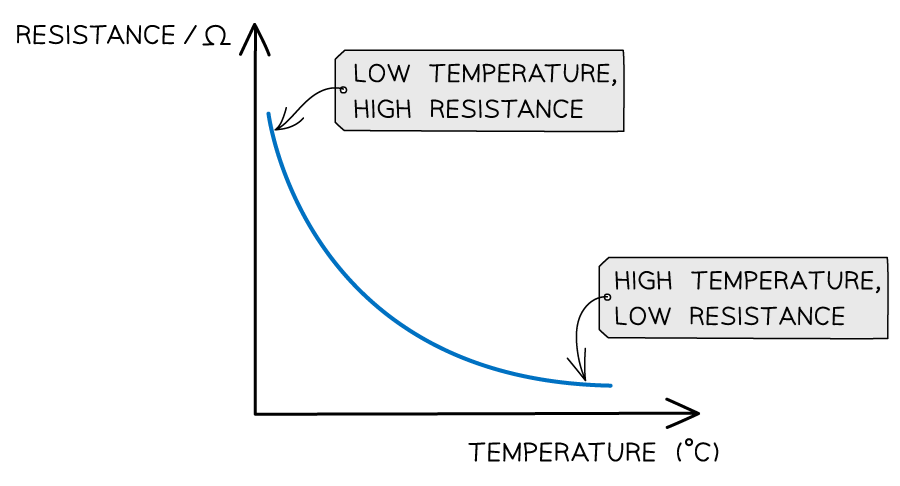
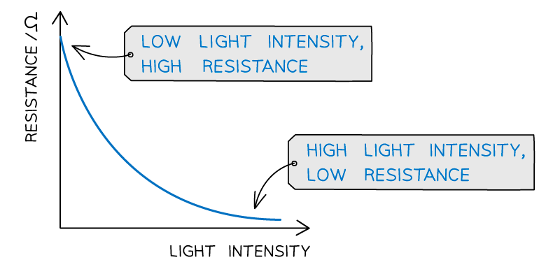

# Components in Series & Parallel Circuits

Course: igcse-physics-19 · Section: 2. Electricity

Source: https://www.savemyexams.com/igcse/physics/edexcel/19/flashcards/2-electricity/2-2-components-in-series-and-parallel-circuits/

## Card 1 — true_or_false (`fl_dyPrgjBKxqKVHz9b`)

**FRONT**

**True or False?**

Current is different at different points in a series circuit.

**BACK**

**False.**

Current is the **same** everywhere in a series circuit.

## Card 2 — true_or_false (`fl_Mj5FmDp9VCypn2WH`)

**FRONT**

**True or False?**

In a parallel circuit, the current from the power source is larger than the current in each branch.

**BACK**

**True.**

In a parallel circuit, the current from the power source is larger than the current in each branch.

## Card 3 — true_or_false (`fl_vVsSn62RWVmckxTP`)

**FRONT**

**True or False?**

The amount of current flowing in a series circuit depends on the voltage and resistance in the circuit.

**BACK**

**True.**

The amount of current flowing in **any** circuit depends on the voltage and resistance in the circuit.

## Card 4 — true_or_false (`fl_CSmtqCRCWKHQ6mVN`)

**FRONT**

**True or False?**

Current is conserved at a junction in a parallel circuit.

**BACK**

**True.**

Current is conserved at a junction in a parallel circuit because charge is **always **conserved.

## Card 5 — true_or_false (`fl_7HzJ6kdwGTKm5PHb`)

**FRONT**

**True or False?**

Current always splits equally at a junction in a parallel circuit.

**BACK**

**False. **

Current will only split equally at a junction if the **resistance** in each branch is equal.

## Card 6 — true_or_false (`fl_d5Ymnp3cTV7yRHB6`)

**FRONT**

**True or False?**

When several cells are connected in series, their combined voltage is the product of their individual voltages.

**BACK**

**False.**

When several cells are connected in series, their combined voltage is the **sum** of their individual voltages.

## Card 7 — question_and_answer (`fl_zqzDHf6JQ7QKMXbB`)

**FRONT**

What is the rule for determining the total voltage in a series circuit?

**BACK**

The **total voltage **across the components in a **series **circuit is **equal** to the **sum** of the** individual **voltages across each component.

## Card 8 — question_and_answer (`fl_qvxHzT4sZpXpywCS`)

**FRONT**

What is the rule for determining the total voltage in a parallel circuit?

**BACK**

The total** voltage** across an arrangement of **parallel **resistances is the **same** as the voltage across one **branch **in the arrangement of the parallel resistances.

## Card 9 — true_or_false (`fl_3WkwNYVw6db78zTW`)

**FRONT**

**True or False?**

One advantage of a parallel circuit is that each bulb can be arranged in its own branch with its own switch.

**BACK**

**True.**

One advantage of a parallel circuit is that each bulb can be arranged in its own branch with its own switch.

## Card 10 — true_or_false (`fl_HQrzC9YwxwbCdKPm`)

**FRONT**

**True or False?**

One advantage of a series circuit is that if one component fails the others will still work.

**BACK**

**False.**

An advantage of **parallel** circuits is that if components in one branch fail, the components in other branches will still work.

If one component fails in a **series** circuit, then the circuit is broken and the current cannot flow.

## Card 11 — question_and_answer (`fl_tSP76vvhBrqJtMP3`)

**FRONT**

What is the rule for calculating the combined resistance of two or more resistors in series?

**BACK**

When two or more resistors are connected in **series**, the **combined resistance** is the **sum **of the** individual resistances**.

## Card 12 — true_or_false (`fl_vfkQ2bktdXX9rJF8`)

**FRONT**

**True or False?**

The combined resistance of two resistors in parallel is less than that of either resistor by itself.

**BACK**

**True.**

The combined resistance of two resistors in parallel **is** less than that of either resistor by itself.

## Card 13 — keyword_definition (`fl_yKJJ5HB9T4J5J6Yx`)

**FRONT**

State the equation for calculating the combined resistance of two resistors connected in series.

**BACK**

The equation for calculating the combined resistance of two resistors connected in series is $R=R_{1}+R_{2}$

Where:

- $R$ = the total combined resistance, measured in ohms (Ω)
- $R_{1}$ = the resistance of the first resistor, measured in ohms (Ω)
- $R_{2}$ = the resistance of the second resistor, measured in ohms (Ω)

## Card 14 — question_and_answer (`fl_g4ZmK56GYM6Dj3Qk`)

**FRONT**

If the voltage of the power source remains constant, but more components are added to a circuit, what effect does this have on the **current**?

**BACK**

Adding components to a circuit increases the total resistance of the circuit, so the current would **decrease** (for a constant voltage).

## Card 15 — question_and_answer (`fl_FF59XTJr69n872mM`)

**FRONT**

If the voltage of the power source is increased, but everything else in the circuit remains constant, what effect does this have on the **current**?

**BACK**

If the voltage of the power source is increased, but everything else in the circuit remains constant, the current will **increase**.

## Card 16 — question_and_answer (`fl_yZWZJPq9h5qhS4xq`)

**FRONT**

What does the **gradient **of an I-V graph represent?

**BACK**

The gradient of an I-V graph is equal to $\frac{1}{\mathrm{resistance}}$ of a component.

## Card 17 — question_and_answer (`fl_7Bqf5ZFdMwCQR3HK`)

**FRONT**

What does a **linear **I-V graph show?

**BACK**

A linear I-V (current-voltage) graph shows

- the relationship between current and voltage is **directly proportional**
- the **resistance **of the component is **constant**

## Card 18 — question_and_answer (`fl_gSBH8QcY8FVZdr2c`)

**FRONT**

Which component has the following I-V graph?

**BACK**

This is the I-V graph for a **fixed resistor **or a **wire** (at a constant temperature).

## Card 19 — question_and_answer (`fl_tm5DsCDgm27bBfmk`)

**FRONT**

Which component has the following I-V graph?

**BACK**

This is the I-V graph for a **filament lamp**.

## Card 20 — question_and_answer (`fl_4VMxdyr5jzbvRxTy`)

**FRONT**

Which component has the following I-V graph?

**BACK**

This is the I-V graph for a **diode**.

## Card 21 — true_or_false (`fl_dY5TDkpwzDYbGFn8`)

**FRONT**

**True or False?**

As the current through a filament lamp increases, the resistance decreases.

**BACK**

**False.**

As the current through a filament lamp increases, the resistance **increases**.

## Card 22 — question_and_answer (`fl_JgFczgQP42XYcg6h`)

**FRONT**

Why does the resistance of a **filament lamp** change when the voltage is changed?

**BACK**

The resistance of a filament lamp **increases **as the voltage is increased because

- as the current increases, the lamp heats up
- as the temperature increases, metal ions in the filament wire vibrate more
- the amount of collisions between the ions and free electrons increases

## Card 23 — question_and_answer (`fl_fGPdRtGJybBD4fPC`)

**FRONT**

What are the main features of an I-V graph for a **diode**?

**BACK**

The I-V graph for a diode shows they have

- a **high **resistance when the current flows in one direction
- a **low **resistance when the current flows in the opposite direction

## Card 24 — question_and_answer (`fl_cMtjzH7w7gVpWwJ8`)

**FRONT**

What is the difference between a **fixed resistor** and a **variable resistor**?

**BACK**

The resistance of a fixed resistor is **constant**, whereas the resistance of a variable resistor can be **changed**.

The circuit symbol for a variable resistor has an arrow through it, whereas the symbol for a fixed resistor does not.

## Card 25 — question_and_answer (`fl_6HFzD994cYgtfNKd`)

**FRONT**

List **five **pieces of apparatus needed to investigate the relationship between current and voltage of a component.

**BACK**

The **five **pieces of apparatus needed to investigate the relationship between current and voltage of a component are

- an ammeter
- a voltmeter
- a variable resistor
- a power source
- wires

## Card 26 — keyword_definition (`fl_M9xDv6FMGgQmkwfz`)

**FRONT**

What is a **thermistor**?

**BACK**

A thermistor is a **temperature-dependent** resistor.

This means its resistance **changes **depending on its temperature.

## Card 27 — question_and_answer (`fl_FbRcCQSZJVdFV57w`)

**FRONT**

How does the resistance of a **thermistor **change when its temperature is increased?

**BACK**

When the temperature of a thermistor is increased, its resistance **decreases**.

## Card 28 — keyword_definition (`fl_mS62SNWrfmdh459w`)

**FRONT**

What is an **LDR**?

**BACK**

LDR stands for **light-dependent resistor**.

This means its resistance **changes **depending on the intensity of light on it.

## Card 29 — question_and_answer (`fl_GJDJvVq8cDKnzyfv`)

**FRONT**

How does the resistance of an **LDR **change when the intensity of light on it is increased?

**BACK**

When light intensity on an LDR is increased, its resistance **decreases**.

(Remember: **L**ight **D**ecreases **R**esistance - LDR)

## Card 30 — question_and_answer (`fl_KgxW55X49xjMN82N`)

**FRONT**

Sketch a graph to show the relationship between **resistance **and **temperature **for a thermistor.

**BACK**

For a thermistor, the relationship between resistance and temperature is

## Card 31 — question_and_answer (`fl_XvzR2w56fHcxc728`)

**FRONT**

Sketch a graph to show the relationship between **resistance **and **light intensity** for an LDR.

**BACK**

For an LDR, the relationship between resistance and light intensity is

## Card 32 — question_and_answer (`fl_PYKnfR8MpcGPDb3j`)

**FRONT**

What is an **LED**?

**BACK**

An LED is a **light-emitting diode**.

It is a type of **diode**, meaning it only allows current to flow in **one direction**.

## Card 33 — true_or_false (`fl_QgcVvVg8tq2hPzp9`)

**FRONT**

**True or False?**

Lamps and LEDs can be used to indicate the presence of a current in a circuit.

**BACK**

**True.**

Lamps and LEDs can be used to indicate the presence of a current in a circuit.

