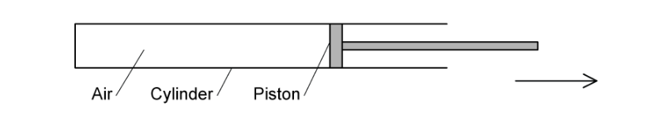

# Ideal Gases

Course: igcse-physics-19 · Section: 5. Solids, Liquids & Gases

Source: https://www.savemyexams.com/igcse/physics/edexcel/19/flashcards/5-solids-liquids-and-gases/5-3-ideal-gases/

## Card 1 — true_or_false (`fl_KHQXFkwMMMv5pnyM`)

**FRONT**

**True or False?**

The particles in a gas are in constant random motion at high speeds.

**BACK**

**True.**

The particles in a gas are in constant random motion at high speeds.

## Card 2 — true_or_false (`fl_xjP49QK9nvmHqdw9`)

**FRONT**

**True or False?**

Gases moving in random motion collide with the surfaces of the container and with other gas particles.

**BACK**

**True.**

Gases moving in random thermal motion collide with the surfaces of the container and with other gas particles.

## Card 3 — question_and_answer (`fl_kBknFwXZymmpgHxW`)

**FRONT**

What causes the pressure in a gas when it is contained?

**BACK**

Pressure in a gas is caused by collisions of the gas particles with the walls of the container.

## Card 4 — keyword_definition (`fl_nTsxvbMcMC3H2d4G`)

**FRONT**

State the equation for **pressure**.

**BACK**

The equation for pressure due to contact between two surfaces is $P=\frac{F}{A}$

Where:

- $P$ = pressure, measured in pascals (Pa)
- $F$ = force, measured in newtons (N)
- $A$ = area, measured in metres squared (m2)

## Card 5 — keyword_definition (`fl_hrqSqprNYrJ7SPqW`)

**FRONT**

Define **pressure**.

**BACK**

Pressure is force per unit area.

## Card 6 — keyword_definition (`fl_qbSMJbxMKtpzmgbV`)

**FRONT**

Define **Brownian motion**.

**BACK**

The random motion of tiny particles in a fluid is known as Brownian motion.

## Card 7 — true_or_false (`fl_B7QWqSQfWmxnj3BB`)

**FRONT**

**True or False?**

It is possible to have negative values of temperature in degrees kelvin.

**BACK**

**False.**

It is **not** possible to have negative values of temperature in degrees kelvin. 0 K is absolute zero, the lowest possible temperature.

## Card 8 — true_or_false (`fl_HD3Cf89z6nBHhh96`)

**FRONT**

**True or False?**

10 °C = 283 K

**BACK**

**True. **

0 °C = 273 K, and an increase of 1 °C is equal to an increase in 1 K. Therefore, **10 °C = 283 K**

## Card 9 — question_and_answer (`fl_YF8ncc8jT2nf3nqF`)

**FRONT**

Describe the motion of particles at absolute zero.

**BACK**

At absolute zero, particles are **stationary**.

## Card 10 — true_or_false (`fl_HYsgKpTBQwrggjsm`)

**FRONT**

**True or False?**

Ice melts at 0 K.

**BACK**

**False. **

Ice melts at 0 °C and 0 °C = 273 K. 0 K is equal to `equation`–273 °C.

## Card 11 — question_and_answer (`fl_zbz8kTdYbHWC6ZhX`)

**FRONT**

A gas experiences a temperature change of 26.4 °C. What is the change in its temperature in kelvin?

**BACK**

The gas experiences a temperature change of 26.4 K, as an increase of 1 K is the same size as an increase of 1 °C.

## Card 12 — true_or_false (`fl_HFMR9S6fX55yTPKb`)

**FRONT**

**True or False?**

Absolute temperature is inversely proportional to kinetic energy of gas particles.

**BACK**

**False.**

Temperature is **directly** proportional to kinetic energy of gas particles.

## Card 13 — keyword_definition (`fl_3YZM2zQ4PzT36JyW`)

**FRONT**

Define **temperature**.

**BACK**

Temperature is a measure of the average speed of particles in a substance.

## Card 14 — true_or_false (`fl_2xh3Kk7b4RCX8yGv`)

**FRONT**

**True or False?**

If the average kinetic energy of particles in a gas doubles, the temperature in kelvin doubles.

**BACK**

**True.**

Temperature in **kelvin** is **directly** proportional to the kinetic energy of gas particles.

## Card 15 — question_and_answer (`fl_8kxVbyXB8Wrppzj9`)

**FRONT**

What happens to the average speed of particles when a gas cools down?

**BACK**

When a gas cools down, the average speed of particles decreases.

## Card 16 — true_or_false (`fl_XDhDg5vMf47mYpfr`)

**FRONT**

**True or False?**

The frequency of collisions between particles in a container with a fixed volume increases because of a decrease in temperature.

**BACK**

**False.**

The frequency of collisions between particles in a container with a fixed volume **decreases** because of a decrease in temperature.

## Card 17 — question_and_answer (`fl_fZTfFY8D95hqzMNK`)

**FRONT**

What are the two relationships linking pressure, temperature and volume described by the gas laws?

**BACK**

The two relationships described by the gas laws are:

- Pressure and temperature
- Pressure and volume

## Card 18 — question_and_answer (`fl_rTnwYxdc7nRywQhM`)

**FRONT**

When a gas is compressed, how does its volume change?

**BACK**

When a gas is compressed, its volume decreases.

## Card 19 — question_and_answer (`fl_Qzfs5VK3cnyDmRHG`)

**FRONT**

When a gas expands, how does its volume change?

**BACK**

When a gas expands, its volume increases.

## Card 20 — true_or_false (`fl_dKFSJHJm458Kxn9r`)

**FRONT**

**True or False?**

When the volume of a gas increases at constant temperature, its pressure increases too.

**BACK**

**False.**

When the volume of a gas increases, the pressure of the gas **decreases**.

## Card 21 — true_or_false (`fl_CSX8G2NsHbSrXHqB`)

**FRONT**

**True or False?**

When the temperature of a gas increases at constant volume, its pressure increases too.

**BACK**

**True.**

When the temperature of a gas increases, its pressure also increases.

## Card 22 — true_or_false (`fl_Qrk5Y8nmf5kdKsR6`)

**FRONT**

**True or False?**

When the volume of a gas is decreased at a constant temperature, the frequency of the collisions between particles and container walls remains constant.

**BACK**

**False.**

When the volume of a gas is decreased, the frequency of collisions between particles and container walls increases.

## Card 23 — true_or_false (`fl_kY65RQmjFbZCkKPq`)

**FRONT**

**True or False?**

Increasing the temperature of a gas at fixed volume increases the average speed of particles. This reduces the frequency of collisions with the container walls so pressure increases.

**BACK**

**False.**

Increasing the temperature of a gas at a fixed volume **increases **the frequency of collisions with the container walls because speed increases.

## Card 24 — true_or_false (`fl_jF9W3D7rp4FJhzXz`)

**FRONT**

**True or False?**

For a given temperature and volume, a higher pressure gas has particles with more average kinetic energy.

**BACK**

**False.**

Temperature is a measure of particle speed, so if the temperature is the same, so is the average kinetic energy of particles.

## Card 25 — question_and_answer (`fl_cMc8dDNV5GFyvv5n`)

**FRONT**

Air is contained in the chamber sealed by the piston. What change in gas pressure causes the piston to move in the direction shown? Assume temperature remains constant.

**BACK**

A pressure **increase** causes the piston to move right, because the volume of the gas increases.

## Card 26 — true_or_false (`fl_4DqyZQwkTQzS86g7`)

**FRONT**

**True or False?**

The pressure law states that pressure is inversely proportional to volume.

**BACK**

**False. **

The pressure law states that pressure is **proportional **to **temperature**.

## Card 27 — true_or_false (`fl_WsZYFy4zH3vPxc3s`)

**FRONT**

**True or False?**

When pressure doubles at constant volume, the temperature increases from 100 °C to 200 °C.

**BACK**

**False. **

It is the temperature in **kelvin** that will double, not temperature in degrees Celsius, as pressure is proportional to **absolute** temperature.

## Card 28 — question_and_answer (`fl_kyZw3MHbFMNwrVP7`)

**FRONT**

What is the equation linking initial temperature and pressure (*T*1 and *p*1) and final temperature and pressure (*T*2 and *p*2) for a gas heated at fixed volume?

**BACK**

The equation linking the initial and final temperatures and pressures is $\frac{p_{1}}{T_{1}}=\frac{p_{2}}{T_{2}}$

## Card 29 — question_and_answer (`fl_RNdQp3hYfVCdwsvD`)

**FRONT**

What is the pressure law equation when rearranged to make initial pressure $p_{1}$ the subject?

**BACK**

The pressure law with initial pressure as the subject is  $p_{1}=\frac{p_{2}}{T_{2}}\timesT_{2}$

## Card 30 — question_and_answer (`fl_cpWj96fP63NT8Jfn`)

**FRONT**

On a graph of pressure against temperature in degrees Celsius for a gas with fixed volume, what is the value of temperature when pressure is 0 Pa?

**BACK**

When pressure is 0 Pa this occurs at –273 °C.

## Card 31 — keyword_definition (`fl_qXppFwM3r5Q4jkD5`)

**FRONT**

Define **Boyle's law**.

**BACK**

Boyle's law states that the pressure of a gas at a constant temperature is inversely proportional to its volume.

## Card 32 — keyword_definition (`fl_hRKp7mw9f24gQVzt`)

**FRONT**

State the equation for Boyle's law.

**BACK**

The equation for Boyle's law is $p_{1}V_{1}=p_{2}V_{2}$

Where:

- $p_{1}$ = initial pressure, measured in pascals (Pa)
- $p_{2}$ = final pressure, measured in pascals (Pa)
- $V_{1}$ = initial volume, measured in metres cubed (m3)
- $V_{2}$ = final volume, measured in metres cubed (m3)

## Card 33 — keyword_definition (`fl_gjMh6WK24YwH6SCC`)

**FRONT**

What is the equation for Boyle's law with the final volume $V_{2}$ as the subject?

**BACK**

The equation for Boyle's law in terms of final volume is $V_{2}=\frac{p_{1}V_{1}}{p_{2}}$

Where:

- $V_{2}$ = final volume, measured in metres cubed (m3)
- $p_{1}$ = initial pressure, measured in pascals (Pa)
- $p_{2}$ = final pressure, measured in pascals (Pa)
- $V_{1}$ = initial volume, measured in metres cubed (m3)

## Card 34 — true_or_false (`fl_XnDtVVHYMR7vtTN2`)

**FRONT**

**True or False?**

On a graph of pressure against volume at a fixed temperature, the line is curved and does not cross the x axis.

**BACK**

**True.**

The pressure vs volume graph shows an inversely proportional relationship. This is a curve which does not touch either axis.

## Card 35 — true_or_false (`fl_gj8472FS7zcVYttN`)

**FRONT**

**True or False?**

This graph shows the pressure law.

**BACK**

**False.**

The graph shows Boyle's law.

