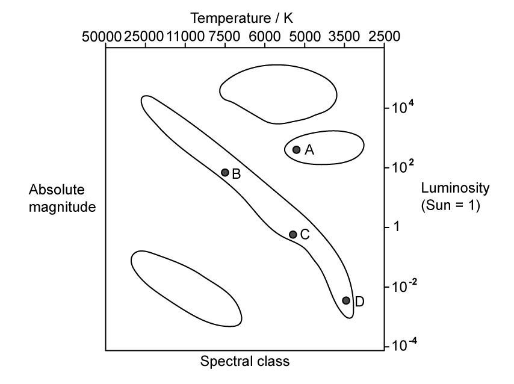
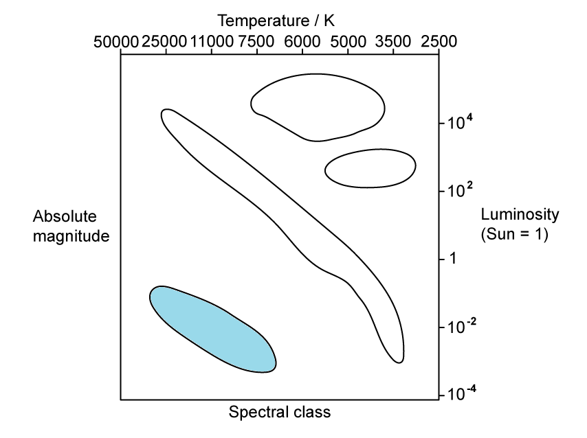
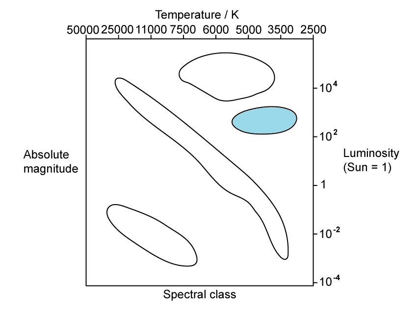

# Stellar Evolution

Course: igcse-physics-19 · Section: 8. Astrophysics

Source: https://www.savemyexams.com/igcse/physics/edexcel/19/flashcards/8-astrophysics/8-2-stellar-evolution/

## Card 1 — question_and_answer (`fl_2s6phmmRxWCSwRyx`)

**FRONT**

What property of a star does its **colour **tell us?

**BACK**

The colour of a star tells us about its **surface temperature**.

## Card 2 — true_or_false (`fl_QRwhWhYs5DWGRqmn`)

**FRONT**

**True or False? **

The hottest stars are red.

**BACK**

**False. **

The hottest stars are **blue**, whereas the coolest stars are **red**.

## Card 3 — question_and_answer (`fl_8yznxws9PSc5pTsG`)

**FRONT**

Which has a hotter surface temperature, a red giant or a white dwarf?

**BACK**

A **white dwarf** has a hotter surface temperature than a red giant.

## Card 4 — true_or_false (`fl_PWTM7sVR6jfNnxkh`)

**FRONT**

**True or False?**

As a star expands, its surface cools and becomes redder.

**BACK**

**True.**

As a star expands, its surface **cools **and becomes **redder**.

## Card 5 — true_or_false (`fl_ghjHDc6JFHC5Tpcw`)

**FRONT**

**True or False?**

All stars form from a cloud of dust and gas which becomes a protostar and then a main sequence star.

**BACK**

**True. **

All stars follow the same initial stages in their life cycle:

1. **Nebula** (cloud of dust and gas)
2. **Protostar **
3. **Main sequence star**

The stages that follow depend on the mass of the main sequence star that forms.

## Card 6 — question_and_answer (`fl_x7vWtzTRPBPvtpZs`)

**FRONT**

What forces, including their direction, act when a star is in a stable state?

**BACK**

The forces acting on a star in a stable state are:

1. **Inward **gravitational force
2. **Outward **pressure due to fusion reactions

## Card 7 — question_and_answer (`fl_2qjMpFvCWDS43nYX`)

**FRONT**

Name the stages, in the correct order, in the life cycle of a star similar to the Sun.

**BACK**

The stages, in the correct order, in the life cycle of a star similar to the Sun are:

1. **Nebula **(cloud of dust and gas)
2. **Protostar**
3. **Main sequence star**
4. **Red giant**
5. **White dwarf**

## Card 8 — question_and_answer (`fl_6skg36TZR8m9jJ7y`)

**FRONT**

When does a protostar become a main sequence star?

**BACK**

A protostar becomes a main sequence star when **nuclear fusion** reactions are initiated in its core and the inward force of gravity is **balanced **by the outward pressure from the fusion reactions.

## Card 9 — question_and_answer (`fl_Nyk6qbVK6zvYJcpg`)

**FRONT**

When does a main sequence star turn into a red giant?

**BACK**

A main sequence star turns into a red giant when hydrogen in the star's core begins to run out and the star begins to **fuse helium** into heavier elements.

## Card 10 — true_or_false (`fl_XRGZJgMFKs6w6cMV`)

**FRONT**

**True or False? **

A high-mass star will eventually explode as a supernova and become a white dwarf.

**BACK**

**False. **

A high mass star will eventually explode as a supernova and become a **neutron star **or a **black hole**.

## Card 11 — question_and_answer (`fl_88tNS6WfYbcKgnqg`)

**FRONT**

Name the stages, in the correct order, in the life cycle of a star with a mass larger than the Sun.

**BACK**

The stages, in the correct order, in the life cycle of a star with a mass larger than the Sun are:

1. **Nebula **(cloud of dust and gas)
2. **Protostar**
3. **Main sequence**
4. **Red supergiant**
5. **Supernova**
6. **Black hole, or neutron star**

## Card 12 — keyword_definition (`fl_D4VD68ChhhKc3J2P`)

**FRONT**

What is a **supernova**?

**BACK**

A supernova is a **large exploding star**.

## Card 13 — question_and_answer (`fl_ShSmkjZR2hpgxvfS`)

**FRONT**

Under what conditions does a supernova occur?

**BACK**

A supernova occurs when a star much more massive than the Sun reaches the end of its **red supergiant **stage. It collapses, becomes very unstable and **explodes**.

## Card 14 — keyword_definition (`fl_FRZs75mcssgqKNdC`)

**FRONT**

Define** luminosity**.

**BACK**

Luminosity is the **total amount of light energy emitted by a star**.

## Card 15 — keyword_definition (`fl_899TRk839RpDnbc9`)

**FRONT**

What is** apparent magnitude**?

**BACK**

Apparent magnitude is **the perceived brightness of a star as seen from Earth**.

## Card 16 — keyword_definition (`fl_cgpM9wpz5wrwTXdW`)

**FRONT**

What is **absolute magnitude**?

**BACK**

Absolute magnitude is a measure of **how bright stars would appear if they were all placed the same distance away from the Earth**.

## Card 17 — question_and_answer (`fl_YQ48FZr7vtHFgdyw`)

**FRONT**

What **two **factors influence the apparent magnitude of a star?

**BACK**

The **two **factors that influence the apparent magnitude of a star are

- the **luminosity **of the star
- the **distance **of the star from Earth

## Card 18 — question_and_answer (`fl_srZSMm33d46STrsn`)

**FRONT**

What does the **apparent magnitude scale** show?

**BACK**

The apparent magnitude scale shows that:

- the **brighter **the star, the **lower **the apparent magnitude
- the **dimmer **the star, the **higher** the apparent magnitude

## Card 19 — question_and_answer (`fl_7WgWvxtdDygm4Pww`)

**FRONT**

Why is it difficult to measure the brightness of stars directly?

**BACK**

It is difficult to measure the brightness of stars directly because a distant bright star might appear to have the **same brightness** as a nearby dim star.

## Card 20 — true_or_false (`fl_548F86ySBZsHYzq7`)

**FRONT**

**True or False?**

An object with an apparent magnitude of +10 is brighter than an object with an apparent magnitude of -10.

**BACK**

**False.**

An object with an apparent magnitude of +10 is **dimmer** than an object with an apparent magnitude of -10.

This is because the **brighter **the star, the **smaller **the magnitude.

## Card 21 — keyword_definition (`fl_mfRJn4WsFh8Pp3Ym`)

**FRONT**

What is a** Hertzsprung-Russell** (HR) diagram?

**BACK**

The Hertzsprung-Russell (HR) diagram is a plot of a star's **luminosity** on the y-axis and its **surface temperature** on the x-axis.

## Card 22 — question_and_answer (`fl_jVNtYw2RHxMwCQhF`)

**FRONT**

Which star on the H-R diagram has the **highest surface temperature**, A, B, C or D?

**BACK**

The star with the highest surface temperature is **star B**.

The hottest stars are located towards the left side of the H-R diagram.

## Card 23 — question_and_answer (`fl_F3brmKH796yJhqhG`)

**FRONT**

Which star on the H-R diagram has the **lowest surface temperature**, A, B, C or D?

**BACK**

The star with the coolest surface temperature is **star D**.

The coolest stars are located towards the right side of the H-R diagram.

## Card 24 — question_and_answer (`fl_8CXNbYrH8jyc6WRN`)

**FRONT**

Which star on the H-R diagram is the **brightest**, A, B, C or D?

**BACK**

The brightest star is **star A**.

The brightest stars are found near the top of the H-R diagram.

## Card 25 — question_and_answer (`fl_Dg465Qhy5JF4g9hH`)

**FRONT**

Which star on the H-R diagram is most similar to **the Sun**, A, B, C or D?

**BACK**

The most similar star to the Sun is **star C**.

The luminosity scale is given in **solar units**, where the luminosity of the Sun = 1

## Card 26 — question_and_answer (`fl_BzJrNsYPQ6hGhkzJ`)

**FRONT**

Where is the** main sequence** located on the H-R diagram?

**BACK**

On the H-R diagram, **main sequence stars** are stars found in a band from the top left to the bottom right.

## Card 27 — question_and_answer (`fl_48g7vQR8smw9n8K7`)

**FRONT**

Where are **white dwarfs **located on the H-R diagram?

**BACK**

On the H-R diagram, **white dwarfs** are located below the main sequence and slightly to the left.

## Card 28 — question_and_answer (`fl_bq9M3kFkkw9Zb7tz`)

**FRONT**

Where are** red giants **located on the H-R diagram?

**BACK**

On the H-R diagram, **red giants** are located above the main sequence and slightly to the right.

## Card 29 — question_and_answer (`fl_mYzg3KwmhC4XfVzM`)

**FRONT**

What type of stars are the **hottest **and **dimmest **on the H-R diagram?

**BACK**

The hottest and dimmest stars on the H-R diagram are **white dwarfs**.

## Card 30 — question_and_answer (`fl_6q54qY7v8Zf2xbQv`)

**FRONT**

What type of stars are the **coolest **and **brightest **on the H-R diagram?

**BACK**

The coolest and brightest stars on the H-R diagram are **red supergiants**.

