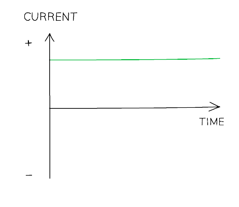

# Electrical Power & Mains Electricity

Course: igcse-science-double-award-17-physics · Section: 2. Electricity

Source: https://www.savemyexams.com/igcse/science/edexcel/double-award/17/physics/flashcards/electricity/electrical-power-and-mains-electricity/

## Card 1 — keyword_definition (`fl_SQPdnmBFMmr76y5B`)

**FRONT**

Define **electrical power**.

**BACK**

Electrical power is defined as the **rate** at which energy is transferred or converted per unit of time, typically measured in watts (W).

## Card 2 — question_and_answer (`fl_KDZ7WN9mw4nrNFN5`)

**FRONT**

What **two quantities** does electrical power depend upon?

**BACK**

The two quantities that electrical power depends on are the **voltage** and **current** of a device.

## Card 3 — keyword_definition (`fl_cnBrnFrzg3SSHG8S`)

**FRONT**

State the electrical **power** equation

**BACK**

The electrical power equation is: $P=I\timesV$

Where:

- $P$ = power, measured in watts (W)
- $V$ = voltage, measured in volts (V)
- $I$ = current, measured in amperes (A)

## Card 4 — true_or_false (`fl_4smRHSCBWGK932CD`)

**FRONT**

**True or False?**

The unit of power is joules (J).

**BACK**

**False. **

The unit of power is watts (W), where 1 watt is equivalent to 1 joule per second.

## Card 5 — true_or_false (`fl_m5MBr9wTDmxbbxZY`)

**FRONT**

**True or False? **

The unit watts (W) is the equivalent of joules per second (J/s).

**BACK**

**True. **

The unit watts (W) is the equivalent to joules per second (J/s).

## Card 6 — question_and_answer (`fl_82HxVgv7BF5KM7FF`)

**FRONT**

Describe the purpose of an electrical **fuse**.

**BACK**

An electrical fuse is a safety device designed to** cut off the flow of electricity to an appliance if the current becomes too large** (due to a fault or surge).

## Card 7 — question_and_answer (`fl_2ZFcgJsqXscmnMzt`)

**FRONT**

What happens to the wire in a fuse when the current becomes too **large**?

**BACK**

If the current inside the wire becomes too large it heats up and **melts**.

## Card 8 — question_and_answer (`fl_vSbYSgDdFFSThvQT`)

**FRONT**

Draw the electrical symbol for a **fuse**.

**BACK**

The electrical symbol for a fuse looks like this:

## Card 9 — question_and_answer (`fl_xBVwxVV2R8QVNn5K`)

**FRONT**

State the three **fuse** sizes.

**BACK**

The three **fuse** sizes are 3 A, 5 A and 13 A.

## Card 10 — question_and_answer (`fl_95kD9TNxB5ZSfwbZ`)

**FRONT**

State the correct fuse size for an appliance that requires a current of 4.5 A.

**BACK**

The correct fuse size for an appliance that requires a current of 4.5 A is **5 A**.

## Card 11 — true_or_false (`fl_FCPczFhJ3kFRRTqf`)

**FRONT**

**True or False?**

Power is the rate of doing work.

**BACK**

**True. **

Power is defined as the rate of doing work, or, the rate of energy transfer.

It is measured in watts (W).

## Card 12 — question_and_answer (`fl_C4VG6DnMJZkwn28G`)

**FRONT**

How is energy transferred related to **work done** in an electrical circuit?

**BACK**

**Work done** is equal to the energy transferred in an electrical circuit.

## Card 13 — true_or_false (`fl_n2M8t83b3XYHWqv7`)

**FRONT**

**True or False?**

Work is done when **energy is transferred** by** moving charges** in a circuit.

**BACK**

**True.**

Work is done when **energy is transferred** by** moving charges** in a circuit.

## Card 14 — true_or_false (`fl_XnzQTrY4M8NHBKCt`)

**FRONT**

**True or False?**

The energy supplied by the battery is equal to the energy transferred only to the wires of an electrical circuit with several components.

**BACK**

**False.**

The energy supplied by the battery is equal to the energy transferred to **all the components** in an electrical circuit.

## Card 15 — question_and_answer (`fl_5CQbZkQYTbYdDZb2`)

**FRONT**

What is the equation for **calculating energy transfers** in terms of current, potential difference and time?

**BACK**

The equation for **calculating energy transfers** in terms of current, potential difference and time is: $E=I\timesV\timest$

Where:

- $E$ = energy transferred, measured in joules (J)
- $I$ = current, measured in amperes (A)
- $V$ = potential difference, measured in volts (V)
- $t$ = time, measured in seconds (s)

## Card 16 — true_or_false (`fl_pQT56YHnbSYn35Cn`)

**FRONT**

**True or False?**

Mains electricity is potentially lethal.

**BACK**

**True.**

Mains electricity is potentially lethal.

## Card 17 — question_and_answer (`fl_syHsjNVX8hd33FdV`)

**FRONT**

What is the definition of an **electrical safety hazard**?

**BACK**

An **electrical safety hazard** is a condition that poses a **risk of electric shock** or fire, such as **damaged insulation** or **overheating cables**.

## Card 18 — question_and_answer (`fl_BDwnsVN6bDypQB7B`)

**FRONT**

What hazards do **damp conditions** pose to electrical circuits or appliances?

**BACK**

Hazards that **damp conditions** pose to electrical circuits or appliances are that the **moisture** can **conduct** electricity, causing a **short circuit** or posing an **electrocution risk**.

## Card 19 — keyword_definition (`fl_vCcX7gwp24dJsb8y`)

**FRONT**

Define the term **double insulation**.

**BACK**

**Double insulation** is when an appliance has insulation around the wires and a non-metallic case, eliminating the need for an earth wire.

## Card 20 — keyword_definition (`fl_CSD5d5Tn4zkYNSMr`)

**FRONT**

Define **earthing**.

**BACK**

**Earthing** is an electrical safety feature found in appliances with metal cases that provides a low resistance path to the earth to prevent electric shocks.

## Card 21 — true_or_false (`fl_vszYw5rqpWWKHpkT`)

**FRONT**

**True or False?**

A **fuse** is an example of an electrical safety feature built into domestic appliances.

**BACK**

**True.**

A **fuse** is an example of an electrical safety feature built into domestic appliances.

## Card 22 — question_and_answer (`fl_zqRs6tRcwKFGG6cZ`)

**FRONT**

What is the purpose of the** earth wire **in an electrical appliance?

**BACK**

The purpose of the earth wire in an electrical appliance is to provide a **low-resistance** path to the Earth for the current.

## Card 23 — question_and_answer (`fl_V7dHc5NNHqRKVqK2`)

**FRONT**

What is the role of **circuit breakers** in a house?

**BACK**

The role of **circuit breakers** in a house is to quickly shut off electricity if the current exceeds a certain value, protecting the electrical system.

## Card 24 — question_and_answer (`fl_Dyf8vQmQPZqt84SY`)

**FRONT**

Which materials are commonly used to **insulate wires**?

**BACK**

The materials commonly used to insulate wires are **rubber **and **plastic**.

## Card 25 — question_and_answer (`fl_G99c5fQmnv8Hp6k4`)

**FRONT**

How do electrical cables **overheat**?

**BACK**

Electrical cables overheat when **too much current** passes through the wire. This can potentially cause a fire or melt the insulation.

## Card 26 — question_and_answer (`fl_2TnXkZpHKjv9vBKP`)

**FRONT**

What do the **electrons **flowing in the wires around a circuit **collide** with?

**BACK**

The **electrons **flowing in the wires around a circuit collide with the **metal ions**.

## Card 27 — keyword_definition (`fl_sxhgD9tQPFdjy9DF`)

**FRONT**

State why the **temperature** of an electrical resistor increases.

**BACK**

The **temperature** of an electrical resistor increases because of the collisions between the **electrons flowing** in the conductor and the **lattice of metal ions **within the conductor.

## Card 28 — true_or_false (`fl_H5r6THpxTHJ6tv6k`)

**FRONT**

**True or False?**

When **current flows** through an electrical wire some energy is **dissipated** to the surroundings by **heating**.

**BACK**

**True. **

When **current flows** through an electrical wire, some energy is **dissipated** to the surroundings by **heating**.

## Card 29 — keyword_definition (`fl_zcXqhGwxTgBCcYMR`)

**FRONT**

State a domestic example of when the **heating effect** of an electrical wire is utilised.

**BACK**

A domestic example of when the **heating effect** of an electrical wire is utilised can be any one from:

- Electric heaters
- Electric ovens
- Electric hobs
- Toasters
- Kettles
- Filament bulbs
- Fuses

## Card 30 — keyword_definition (`fl_N4FGfxsMzg3W9XkJ`)

**FRONT**

State the type of current supplied by **mains electricity**.

**BACK**

Mains electricity supplies an **alternating current** (a.c.).

## Card 31 — question_and_answer (`fl_JtJNK4FFndPccWVt`)

**FRONT**

What device supplies a **direct current** (d.c.) to an electrical circuit?

**BACK**

A **battery** or **cell** supplies a direct current to an electrical circuit.

## Card 32 — keyword_definition (`fl_y2rGqGTwkKs36kgp`)

**FRONT**

Define **direct current**.

**BACK**

Direct current is a steady current, constantly flowing in **one direction** through a circuit, from positive to negative.

## Card 33 — true_or_false (`fl_2XHNYWF2kt4dd32t`)

**FRONT**

**True or False?**

The potential difference across a cell in a d.c. circuit travels in two directions only.

**BACK**

**False**.

The potential difference across a cell in a d.c. circuit travels in **one direction** only.

## Card 34 — keyword_definition (`fl_SY8jthX3C5Xghm47`)

**FRONT**

Define an **alternating current** (a.c.).

**BACK**

An alternating current is a current that **continuously changes its direction**, going back and forth around a circuit.

## Card 35 — true_or_false (`fl_ynBb8rfZZ9HWcp7f`)

**FRONT**

**True or False?**

An alternating current power supply has two different terminals, one positive and one negative.

**BACK**

**False**.

An alternating current power supply has **two identical terminals** that **change** from **positive to negative** and back again.

## Card 36 — question_and_answer (`fl_FtHqhGdJxNG3F3gn`)

**FRONT**

State the **frequency **of mains electricity in the UK.

**BACK**

The **frequency** of mains electricity in the UK is **50 Hz**.

## Card 37 — question_and_answer (`fl_RCw9zFS2srdDxQvD`)

**FRONT**

What type of current is shown in the graph?

**BACK**

The graph shows **direct current** (d.c.).

## Card 38 — keyword_definition (`fl_PmskptkzM4wG46qC`)

**FRONT**

Draw a current-time graph for **alternating current** (a.c.).

**BACK**

A current-time graph for alternating current (a.c.) looks like this:

## Card 39 — keyword_definition (`fl_VGbqS9q8kngQ4mFh`)

**FRONT**

State the type of current used by a lamp plugged into a domestic plug socket.

**BACK**

**Alternating current** is used by a lamp plugged into a domestic plug socket.

