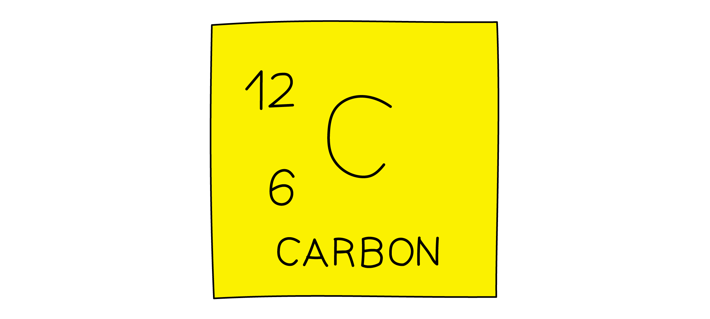
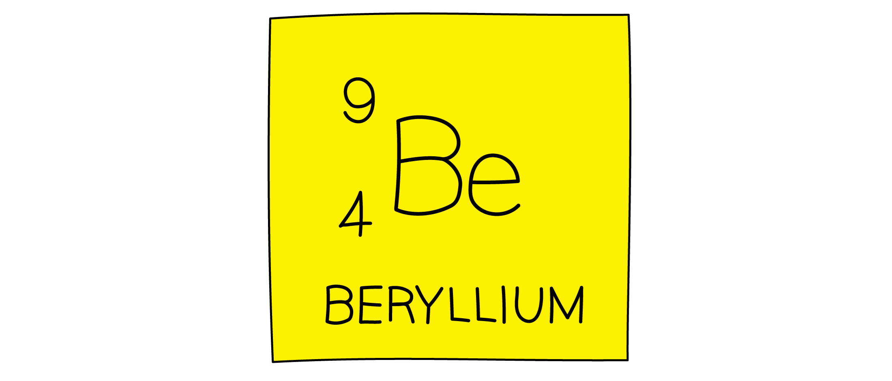

# Properties of Radiation

Course: igcse-science-double-award-17-physics · Section: 7. Radioactivity & Particles

Source: https://www.savemyexams.com/igcse/science/edexcel/double-award/17/physics/flashcards/radioactivity-and-particles/properties-of-radiation/

## Card 1 — question_and_answer (`fl_5yTC6KwRkTvQF2cg`)

**FRONT**

Which **two **particles are found in the nucleus of an atom?

**BACK**

The nucleus of an atom contains **protons **and **neutrons**.

## Card 2 — question_and_answer (`fl_BRzRP58FHj8Xm8hv`)

**FRONT**

Where are **electrons **found in an atom?

**BACK**

Electrons are found **orbiting the nucleus**.

## Card 3 — true_or_false (`fl_79PxKykxH9F3hCnQ`)

**FRONT**

**True or False?**

**Electrons **make up most of the **mass **of an atom.

**BACK**

**False.**

Most of the mass of an atom is concentrated in the **nucleus**. Electrons have a negligible mass compared to protons and neutrons.

## Card 4 — question_and_answer (`fl_nnNYJBC9F2zjHnHk`)

**FRONT**

What is the **charge **on the **nucleus **of an atom?

**BACK**

The charge on the nucleus is **positive**.

## Card 5 — true_or_false (`fl_vc6Q8g6XVq6WZfRJ`)

**FRONT**

**True or False? **

An atom is neutral because it has an equal number of protons and neutrons.

**BACK**

**False.**

An atom is neutral because it has an equal number of **protons **and **electrons**.

## Card 6 — question_and_answer (`fl_w55Bf7gKjS8mbGhb`)

**FRONT**

What is meant by the term **atomic number**?

**BACK**

The atomic number of an atom is the **number of protons** in its nucleus. This number defines the chemical element.

## Card 7 — question_and_answer (`fl_64jXxmRJg3RQKdGV`)

**FRONT**

What is meant by the term **mass number**?

**BACK**

The mass number of an atom is the** total number of protons and neutrons** in its nucleus.

## Card 8 — question_and_answer (`fl_DQf8FMBbgGRryQsG`)

**FRONT**

How can the notation below be used to determine the number of protons, neutrons and electrons in atom X?

**BACK**

In nuclear notation:

- X represents the chemical symbol
- A represents the **mass number** (number of protons and neutrons)
- Z represents the **atomic number **(number of protons)

Therefore, Z = number of protons = number of electrons, and A - Z = number of neutrons.

## Card 9 — question_and_answer (`fl_n5t6r3r9rWcM7DNz`)

**FRONT**

What is the **mass number** and **atomic number** of carbon?

**BACK**

The **mass number** (top number) of carbon is 12.

The **atomic number** (bottom number) of carbon is 6.

## Card 10 — question_and_answer (`fl_hWpj6TmsX7BytWh5`)

**FRONT**

How many protons, neutrons and electrons are in an atom of beryllium?

**BACK**

The **mass number** (top number) of beryllium is 9.

The **atomic number** (bottom number) of beryllium is 4.

Therefore, an atom of beryllium contains 4 protons, 5 neutrons and 4 electrons.

## Card 11 — keyword_definition (`fl_npsVJ7f4f2XBrnhn`)

**FRONT**

Define the term **isotope**.

**BACK**

Isotopes are atoms of the same element that have the **same **number of **protons **but a **different **number of **neutrons**.

## Card 12 — true_or_false (`fl_y2JjcJV44nm7bCqN`)

**FRONT**

**True or False? **

An element can have only one isotope.

**BACK**

**False. **

An element can have more than one isotope.

## Card 13 — true_or_false (`fl_3sVd7fcPBF5pRdHy`)

**FRONT**

**True or False?**

Two different isotopes of uranium have the same number of neutrons.

**BACK**

**False. **

Two different isotopes of uranium have the **same **number of **protons** but a **different **number of **neutrons**.

## Card 14 — true_or_false (`fl_Frhj2HY5nxbwJfdh`)

**FRONT**

**True or False?**

The following atoms are all possible isotopes of chlorine (symbol Cl):

`Cl presubscript 17 presuperscript 35`,  `Cl presubscript 18 presuperscript 35`,  `Cl presubscript 19 presuperscript 35`,  `Cl presubscript 20 presuperscript 35`

**BACK**

**False.**

The atoms `Cl presubscript 17 presuperscript 35`,  `Cl presubscript 18 presuperscript 35`,  `Cl presubscript 19 presuperscript 35`,  `Cl presubscript 20 presuperscript 35` are **not **possible isotopes of chlorine as they have the **same **mass number but **different **atomic numbers.

Isotopes of an element must have the **same atomic number **but **different mass numbers**.

## Card 15 — true_or_false (`fl_X7WtRgn8x3GgcnnC`)

**FRONT**

**True or False?**

The following atoms are all possible isotopes of iron (symbol Fe):

`Fe presubscript 26 presuperscript 54`,  `Fe presubscript 26 presuperscript 56`,  `Fe presubscript 26 presuperscript 57`,  `Fe presubscript 26 presuperscript 58`

**BACK**

**True.**

The atoms `Fe presubscript 26 presuperscript 54`,  `Fe presubscript 26 presuperscript 56`,  `Fe presubscript 26 presuperscript 57`,  `Fe presubscript 26 presuperscript 58` are all possible isotopes of iron as they have the **same **atomic number but **different **mass numbers.

## Card 16 — question_and_answer (`fl_z4ywP93gJ9zxHjXd`)

**FRONT**

Why do some nuclei emit radiation?

**BACK**

Some nuclei emit radiation because they are **unstable **due to having an **imbalance **of protons or neutrons.

## Card 17 — question_and_answer (`fl_9T7shzDM2KG7Fygk`)

**FRONT**

What are the **three **types of radiation that a nucleus can emit?

**BACK**

The three types of radiation that a nucleus can emit are:

- alpha ($α$)
- beta ($β$)
- gamma ($γ$)

## Card 18 — true_or_false (`fl_Jy5SDKnHbvrBSFtb`)

**FRONT**

**True or False?**

The emission of radiation from a nucleus is a spontaneous and random process.

**BACK**

**True.**

The emission of radiation from a nucleus is a **spontaneous** and **random **process.

## Card 19 — keyword_definition (`fl_KvvMk7fJRDGZycdt`)

**FRONT**

What is an **alpha particle**?

**BACK**

An alpha particle is composed of **two protons** and **two neutrons**. It is equivalent to a helium nucleus.

## Card 20 — keyword_definition (`fl_ZMQfy6BcQMCHgGcs`)

**FRONT**

What is a **beta particle**?

**BACK**

A beta particle is a fast-moving **electron**.

## Card 21 — keyword_definition (`fl_cThdfXf832fm9rh8`)

**FRONT**

What is **gamma radiation**?

**BACK**

Gamma radiation is a type of high-energy **electromagnetic wave**.

## Card 22 — true_or_false (`fl_qFvYStHbqGdXrkzD`)

**FRONT**

**True or False?**

Alpha particles have a charge of -1.

**BACK**

**False.**

**Alpha **particles have a charge of **+2** due to having two positively charged **protons**. It is **beta **particles that have a charge of **-1** due to the negatively charged **electron**.

## Card 23 — question_and_answer (`fl_kCsGshpNB9SXYgxP`)

**FRONT**

Which type of nuclear radiation is the **most ionising**?

**BACK**

**Alpha** particles are the **most ionising** form of nuclear radiation. Beta particles are next, and gamma radiation is the least ionising.

## Card 24 — question_and_answer (`fl_6FpZGVKpHtmWsfpt`)

**FRONT**

List the three types of nuclear radiation in order of** increasing penetrating power**.

**BACK**

The types of nuclear radiation in order of increasing penetrating power are:

- alpha (**least** penetrating, can be stopped by **paper**)
- beta (can stopped by a few mm of **aluminium**)
- gamma (**most **penetrating, can be reduced by a few mm of **lead**)

## Card 25 — question_and_answer (`fl_p6rwCnVBtMfVcvcw`)

**FRONT**

Which types of nuclear decay cause the isotope to decay into a new element?

**BACK**

An isotope will decay into a new element if the number of **protons** changes. Therefore, **alpha **and **beta **decay will produce a new element.

## Card 26 — question_and_answer (`fl_9pcWK9XDzZCNdB42`)

**FRONT**

By what value does the mass number decrease as a result of alpha decay?

**BACK**

Alpha decay results in the **mass number** decreasing by **4**, because 4 nucleons are emitted.

## Card 27 — true_or_false (`fl_gQvKcfZjDGTWb6PR`)

**FRONT**

**True or False?**

In beta decay, a neutron changes into a proton and an electron.

**BACK**

**True.**

A **neutron** changes into a **proton **and an** electron **during **beta** decay. The high-energy **electron **is emitted from the nucleus.

## Card 28 — question_and_answer (`fl_dBdfZ8hXFcqG8jn9`)

**FRONT**

By what value does the atomic number decrease as a result of alpha decay?

**BACK**

Alpha decay results in the atomic number decreasing by** 2**, because 2 protons are emitted.

## Card 29 — question_and_answer (`fl_BGQh4RCV7jYxgCng`)

**FRONT**

How are the mass and atomic numbers affected by gamma decay?

**BACK**

**Gamma** decay has **no effect** on the **mass number **or the **atomic number**. Gamma radiation reduces the **energy **of the nucleus but has no effect on the number of particles.

## Card 30 — question_and_answer (`fl_6P5bPthBnn754qxm`)

**FRONT**

By what value does the atomic number change as a result of beta decay?

**BACK**

The **atomic number** **increases** by **1 **as a result of **beta** decay. A **neutron** changes into a **proton** and an electron. The extra proton causes the atomic number to increase by 1, so a new element is formed.

## Card 31 — question_and_answer (`fl_gKHYGWQXqp4gvzx8`)

**FRONT**

By what value does the charge on a nucleus decrease when it emits an alpha particle?

**BACK**

The charge on a nucleus will decrease by **2** after it emits an alpha particle because 2 protons are emitted.

## Card 32 — question_and_answer (`fl_8vmJ5r4rK64WPWHv`)

**FRONT**

By what value does the mass number decrease as a result of beta decay?

**BACK**

The **mass number** remains **unchanged **by **beta** decay. A neutron changes into a proton which has the same mass. A beta particle is emitted but this change in mass is negligible.

## Card 33 — question_and_answer (`fl_X5czNXsN9bYvjJcx`)

**FRONT**

Name **two **methods of detecting ionising radiation.

**BACK**

Ionising radiation can be detected using:

- photographic film
- a Geiger-Muller tube / counter

## Card 34 — keyword_definition (`fl_647bSt8xn73nCSJn`)

**FRONT**

Define **background radiation**.

**BACK**

Background radiation is the radiation that exists around us all the time.

## Card 35 — true_or_false (`fl_d9YKVb3rZtbNgXJh`)

**FRONT**

**True or False? **

Radiation is solely a human-made phenomenon.

**BACK**

**False. **

Radiation is a natural phenomenon that has always existed on Earth and in outer space.

## Card 36 — question_and_answer (`fl_wg545qg6ysGqyMry`)

**FRONT**

What are the natural sources of background radiation?

**BACK**

Natural sources of background radiation include:

- radon gas
- cosmic rays from space
- radioactive elements in rocks and soil
- carbon-14 in biological material
- some food and drink

## Card 37 — true_or_false (`fl_SxH7dWjBYY3nmyH2`)

**FRONT**

**True or False?**

Ionising radiation can be measured using a detector connected to an emitter.

**BACK**

**False. **

Ionising** **radiation can be measured using a detector connected to a **counter**.

## Card 38 — question_and_answer (`fl_Jk7PBXfjMMCP32MZ`)

**FRONT**

What are the units of count rate?

**BACK**

Count rate is measured in counts per second or counts per minute.

## Card 39 — true_or_false (`fl_6DC9JYMstZJM6nzp`)

**FRONT**

**True or False?**

A corrected count rate can be calculated by adding the count rate found with no radioactive source present to the count rate with the radioactive source present.

**BACK**

**False.**

A corrected count rate can be calculated by **subtracting **the count rate found with no radioactive source present from the count rate with the radioactive source present.

## Card 40 — question_and_answer (`fl_YnsYCNkZTJkTcz66`)

**FRONT**

Does the count rate increase or decrease as the detector moves **further away** from a source of radiation?

**BACK**

The count rate **decreases **as the detector moves further from the radiation source.

