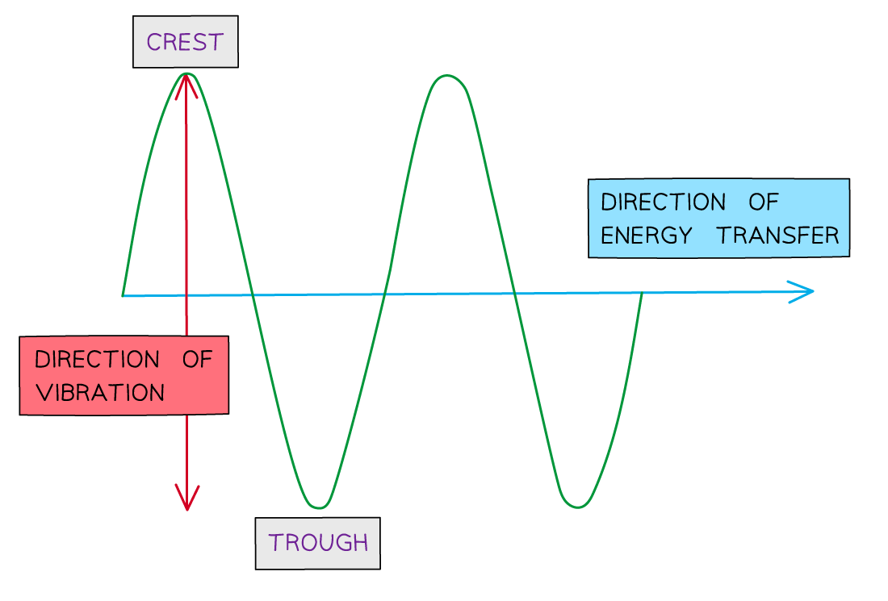

# Reflection & Refraction

Course: igcse-science-double-award-17-physics · Section: 3. Waves

Source: https://www.savemyexams.com/igcse/science/edexcel/double-award/17/physics/flashcards/waves/reflection-and-refraction/

## Card 1 — true_or_false (`fl_rVV3YHffMF4BPwjZ`)

**FRONT**

**True or False? **

Visible light is a transverse wave.

**BACK**

**True.**

Visible light is a transverse wave.

## Card 2 — true_or_false (`fl_H8gPkwMkM4McJv2j`)

**FRONT**

**True or False?**

Light can undergo reflection and refraction.

**BACK**

**True. **

Light can undergo reflection and refraction.

## Card 3 — keyword_definition (`fl_r6fQHhg2BY9TkVtj`)

**FRONT**

State the type of wave sound is.

**BACK**

Sound is a **longitudinal **wave.

## Card 4 — question_and_answer (`fl_r34cTdMpJVJcss4g`)

**FRONT**

What is the name given to the **reflection** of **sound** waves?

**BACK**

The name given to the **reflection** of **sound** waves is an **echo**.

## Card 5 — question_and_answer (`fl_bRX8PkY7qpVsjdFJ`)

**FRONT**

Can sound waves be **refracted**?

**BACK**

**Yes**, sound waves can be refracted.

## Card 6 — question_and_answer (`fl_8yjY7YsyrqYRwVHc`)

**FRONT**

State the type of wave represented by the diagram.

**BACK**

The diagram represents a **transverse** wave.

## Card 7 — question_and_answer (`fl_TccKcfWy5gGmHSw9`)

**FRONT**

State whether the diagram represents a light wave or a sound wave.

**BACK**

The diagram represents a** longitudinal **wave, so it represents a **sound** wave.

## Card 8 — keyword_definition (`fl_3MW24cC64BWyPM2N`)

**FRONT**

Define **reflection**.

**BACK**

Reflection is when a wave hits a boundary between two media and does not pass through, but instead stays in the original medium.

## Card 9 — question_and_answer (`fl_kgy5nGMmKxjBGHMk`)

**FRONT**

What does **refraction** mean?

**BACK**

Refraction means a wave passes a boundary between two different transparent media and undergoes a change in direction.

## Card 10 — question_and_answer (`fl_tCgHGC9rJR5fFy6V`)

**FRONT**

What is the **law of reflection**?

**BACK**

The law of reflection states that the angle of incidence (*i*) is equal to the angle of reflection (*r*).

## Card 11 — keyword_definition (`fl_SGjBJ5frk7wwWtCy`)

**FRONT**

Define the **angle of incidence**.

**BACK**

The angle of incidence is the angle between the incoming ray and the normal.

## Card 12 — question_and_answer (`fl_QrChFt9kJ9RS7GRZ`)

**FRONT**

What happens to light when it passes from air to glass?

**BACK**

When light passes from air to glass, it slows down so it bends **towards **the normal.

## Card 13 — question_and_answer (`fl_wX4gcdn5YQ4yQJSx`)

**FRONT**

How does light behave when moving from glass to air?

**BACK**

When light moves from glass to air, it speeds up, so it bends **away **from the normal.

## Card 14 — true_or_false (`fl_CFgZpjQtvymv5mbG`)

**FRONT**

**True or False? **

The frequency of light changes during refraction.

**BACK**

**False. **

The frequency of light does **not change** during refraction. The wavelength and speed of light change during refraction.

## Card 15 — keyword_definition (`fl_h2THG4skzKrpmZPw`)

**FRONT**

Define the term **medium **in optics.

**BACK**

In optics, a medium is a material that transmits light.

## Card 16 — question_and_answer (`fl_nKSpnczCvZhm34nF`)

**FRONT**

What is a ray diagram?

**BACK**

A ray diagram is a diagram used to show the direction of waves, with arrows indicating the incident and reflected/refracted rays.

## Card 17 — question_and_answer (`fl_PV78N8SGs2YnGfsq`)

**FRONT**

What happens to light when passing along the normal into a transparent medium?

**BACK**

When light passes along the normal into a transparent medium, it does not bend at all.

## Card 18 — question_and_answer (`fl_7nmD9kBWy2vKCRxb`)

**FRONT**

State why the light bends **towards** the normal when it passes between the boundary from air to glass as shown in the diagram.

**BACK**

The light bends **towards** the normal when it passes between the boundary from air to glass as shown in the diagram because glass has a **higher refractive index** than air. The wave **slows down** and the **wavelength increases**.

## Card 19 — keyword_definition (`fl_5QrBMnVW5JQtnF4P`)

**FRONT**

Define the **aim** of the refraction core practical.

**BACK**

The aim of the refraction core practical is to investigate the refraction of light using transparent rectangular blocks, semi-circular blocks, and triangular prisms.

## Card 20 — question_and_answer (`fl_hc9KW2H8dysWbkdg`)

**FRONT**

What is the **independent variable **in the refraction core practical?

**BACK**

The independent variable in the refraction core practical is the **shape** of the block.

## Card 21 — question_and_answer (`fl_f7DSBDwwS93QmQvQ`)

**FRONT**

What is the **dependent variable** in the refraction core practical?

**BACK**

The dependent variable in the refraction core practical is the **direction** of refraction.

## Card 22 — question_and_answer (`fl_dFjf8HZ5f4Q8DKfR`)

**FRONT**

State one **control variable** in the refraction core practical.

**BACK**

One control variable in the refraction core practical is any one from:

- Width of the light beam
- Wavelength of light
- Frequency of light

## Card 23 — question_and_answer (`fl_YyBzdZNzxKFz22tG`)

**FRONT**

What equipment is used to provide a** narrow beam** of light?

**BACK**

A** ray box** is used to provide a narrow beam of light.

## Card 24 — question_and_answer (`fl_GR4dhgS2pdF7TG34`)

**FRONT**

How is a **protractor** used in the refraction core practical?

**BACK**

A protractor is used to measure the **angles** of incidence and refraction.

## Card 25 — true_or_false (`fl_MCmj6vpGqhwk2nfr`)

**FRONT**

**True or False? **

A **sharpened pencil** is used to mark angles of incidence and refraction in the refraction core practical.

**BACK**

**True. **

A sharpened pencil is used to accurately mark angles of incidence and refraction for the refraction core practical.

## Card 26 — question_and_answer (`fl_fh2tpQfhCbdJScxw`)

**FRONT**

What is the purpose of a **sheet of paper** in the refraction core practical?

**BACK**

The purpose of a sheet of paper is to mark the lines indicating the **incident and refracted rays**.

## Card 27 — keyword_definition (`fl_RRvmWxWFV4tzRJ9c`)

**FRONT**

State a common **systematic error** in the refraction core practical.

**BACK**

A common systematic error  in the refraction experiment is an error that occurs if the **normal lines** are drawn incorrectly.

## Card 28 — question_and_answer (`fl_rB4XV7KjYdggBgJN`)

**FRONT**

What** safety consideration** should be taken when using the ray box?

**BACK**

A safety consideration that should be applied when using a ray box is to **avoid looking directly** at the light to prevent eye damage.

## Card 29 — keyword_definition (`fl_TvMPjv3mjGWY33MQ`)

**FRONT**

Define **refractive index**.

**BACK**

The refractive index is the ratio of the speed of light in a vacuum and the speed of light in a material.

## Card 30 — true_or_false (`fl_Fk8txMZ84wkKzRKG`)

**FRONT**

**True or False? **

The refractive index has no units.

**BACK**

**True.**

Since the refractive index is a ratio, it has no units.

## Card 31 — true_or_false (`fl_2RHvFfKQhKYpFZqT`)

**FRONT**

**True or False?**

When $i<r$, the refracted ray bends toward the normal.

**BACK**

**False.**

When the angle of incidence $i$ is **less **than the angle of refraction  `equation`$r$, or  $i<r$, the refracted ray bends **away from** the normal.

## Card 32 — keyword_definition (`fl_4jbJryxDZmt9nN9Z`)

**FRONT**

State the equation for the refractive index.

**BACK**

The equation for the refractive index is $n=\frac{\mathrm{speed} \mathrm{of} \mathrm{light} \mathrm{in}a\mathrm{vacuum}}{\mathrm{speed} \mathrm{of} \mathrm{light} \mathrm{in} \mathrm{material}}$

Where:

- $n$ = the refractive index

## Card 33 — true_or_false (`fl_vTcSwmJYxrHvnJ5M`)

**FRONT**

**True or False?**

The value for the refractive index of a material will always be less than the speed of light in a vacuum.

**BACK**

**True.**

The value for the refractive index of a material will always be less than the speed of light in a vacuum.

## Card 34 — question_and_answer (`fl_zsbCQM4R395FfDSz`)

**FRONT**

What trigonometric function is used in Snell's law?

**BACK**

The trigonometric function used in Snell's Law is **sine**.

## Card 35 — true_or_false (`fl_BDqN8SYDYDc7Qm6x`)

**FRONT**

**True or False?**

When $i>r$, the refracted ray bends toward the normal.

**BACK**

**True.**

When the angle of incidence $i$ is **greater **than the angle of refraction  `equation`$r$, or  $i>r$, the refracted ray bends **toward **the normal.

## Card 36 — keyword_definition (`fl_H9ZkGV7C3N7wdj8H`)

**FRONT**

State the equation for Snell's law in terms of refractive index.

**BACK**

The equation for snell's law in terms of the refractive index is $n=\frac{\mathrm{sin}i}{\mathrm{sin}r}$

Where:

- $n$ = refractive index of the material, which has no units
- $i$ = angle of incidence, measured in degrees (°)
- $r$ = angle of refraction, measured in degrees (°)

## Card 37 — question_and_answer (`fl_49zNGgJfm3rgz8Fj`)

**FRONT**

State the angle of incidence shown in the diagram.

**BACK**

From the diagram, the angle of incidence is **39°**.

## Card 38 — question_and_answer (`fl_pJHZ88Wrb996yrgV`)

**FRONT**

State the angle of refraction shown in the diagram.

**BACK**

From the diagram, the angle of refraction is **25°**.

## Card 39 — keyword_definition (`fl_bZDZ9NJqS9smh5DP`)

**FRONT**

State the aim of the **Snell's law **core practical.

**BACK**

The aim of the Snell's law core practical is to investigate the **refractive index** of glass using a glass block.

## Card 40 — question_and_answer (`fl_3kR4F8gQ3wT7r5m5`)

**FRONT**

What is the** independent variable** in the Snell's law core practical?

**BACK**

The independent variable in the Snell's law core practical is the angle of incidence (*i*).

## Card 41 — question_and_answer (`fl_sFVsRWpdsHPH3CSq`)

**FRONT**

What is the **dependent variable** in the Snell's law core practical?

**BACK**

The dependent variable in the Snell's law core practical is the angle of refraction (r).

## Card 42 — question_and_answer (`fl_Ps5VRpF94KxJxSyw`)

**FRONT**

State one **control variable** in the Snell's law core practical.

**BACK**

One control variable in the Snell's law core practical is any one from:

- use of the same glass block
- same light beam width
- same frequency
- the same wavelength of light

## Card 43 — keyword_definition (`fl_c5T7JhnvFZQms97Z`)

**FRONT**

Define Snell's law.

**BACK**

Snell's law is the ratio of the sine of the angles of incidence and refraction.

## Card 44 — question_and_answer (`fl_jzpSdKF3vT4QVFDW`)

**FRONT**

What equipment is used to measure angles in the Snell's law core practical?

**BACK**

A **protractor** is used to measure the angles of incidence and refraction in Snell's law core practical.

## Card 45 — question_and_answer (`fl_JVPYNYT6383Xyyxq`)

**FRONT**

How is the refractive index determined in the Snell's law core practical?

**BACK**

The refractive index is determined by **plotting a graph** of  sin(*i*) versus sin*(r *) graph and finding the gradient.

## Card 46 — question_and_answer (`fl_rbsGh8ZGRwF4JTs9`)

**FRONT**

What is a common source of **systematic error** in the Snell's law core practical?

**BACK**

A common source of systematic error in the Snell's law core practical is drawing the normal lines incorrectly.

## Card 47 — question_and_answer (`fl_msPhKGc77H5mSxJP`)

**FRONT**

What **safety measures** should be taken when using the ray box in the Snell's law core practical?

**BACK**

The** safety measures** that should be taken when using the ray box in Snell's law core practical are to avoid looking directly at the light to prevent eye damage.

## Card 48 — question_and_answer (`fl_XdWnykYpPkMfqbDP`)

**FRONT**

Light is incident from the air into a glass block. State whether the angles of refraction indicated will be larger or smaller than the angles of incidence.

**BACK**

The angles of refraction will be **smaller** than the angles of incidence because glass has a higher refractive index than air.

## Card 49 — keyword_definition (`fl_2K89nfP9hM9sSFNH`)

**FRONT**

Define the term **critical angle**.

**BACK**

The critical angle is the angle of incidence that gives an angle of refraction of exactly 90°.

## Card 50 — question_and_answer (`fl_j8JyZv8jBmMdhk2X`)

**FRONT**

When does total internal reflection (TIR) occur?

**BACK**

Total internal reflection (TIR) occurs when the angle of incidence is greater than the critical angle, and the ray is travelling from a denser material into a less dense material.

## Card 51 — question_and_answer (`fl_fcrsbBDm3zPsV7H8`)

**FRONT**

How is total internal reflection used in communications?

**BACK**

Total internal reflection is used to transmit information through optical fibre cables for television and internet communications.

## Card 52 — keyword_definition (`fl_7PGJMs4RNb6rXqDT`)

**FRONT**

State the equation for the critical angle in terms of the refractive index.

**BACK**

The equation for the critical angle in terms of the refractive index is $n=\frac{1}{\mathrm{sin}c}$

Where:

- $n$ = refractive index, which has no units
- $c$ = critical angle, measured in degrees (°)

## Card 53 — question_and_answer (`fl_S7FTzZjbhnTMFV9z`)

**FRONT**

Name one application of total internal reflection.

**BACK**

One application of total internal reflection is any one from:

- periscope
- optical fibre

## Card 54 — true_or_false (`fl_4NRc2Zb9MRNKqGYN`)

**FRONT**

**True or False?**

Total internal reflection can occur when light travels from a less dense medium into a denser medium.

**BACK**

**False.**

Total internal reflection only occurs when light travels **from **a **denser **material **into **a **less dense** material.

## Card 55 — keyword_definition (`fl_KgMzvjwGZWWTxjCh`)

**FRONT**

Describe what happens to the ray of light at the glass-liquid boundary at X in the following diagram.

**BACK**

The behaviour of the light ray at the glass-liquid boundary at X is defined as **total internal reflection** (TIR).

## Card 56 — question_and_answer (`fl_H4tNPQQmHPbShH8d`)

**FRONT**

Identify the diagram where the angle of incidence equals the critical angle.

**BACK**

The **second diagram** shows the angle of incidence *i *equal to the critical angle *c*.

