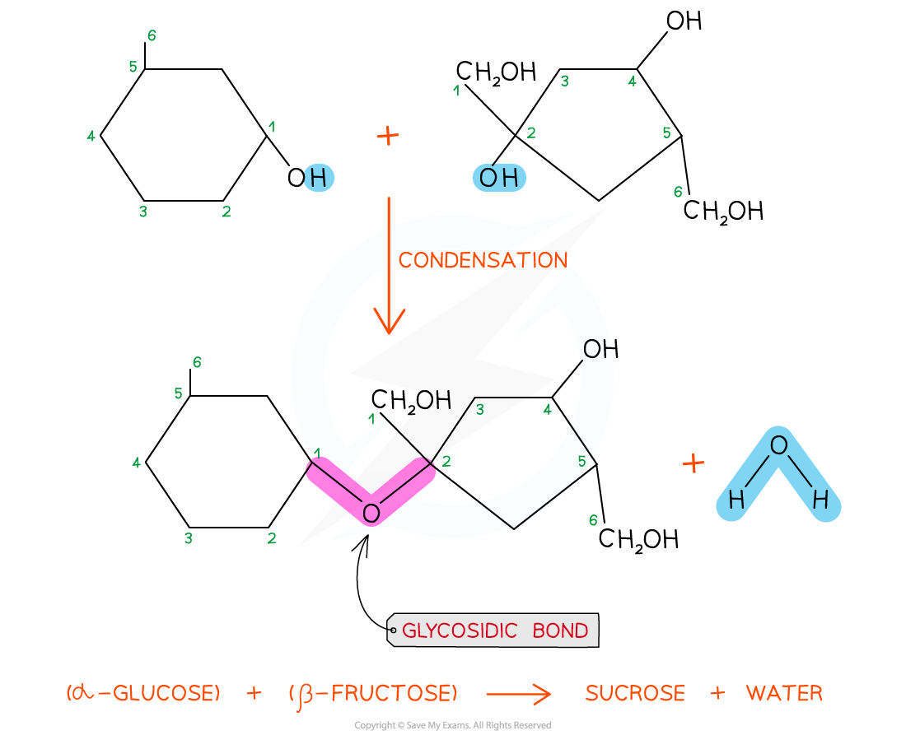
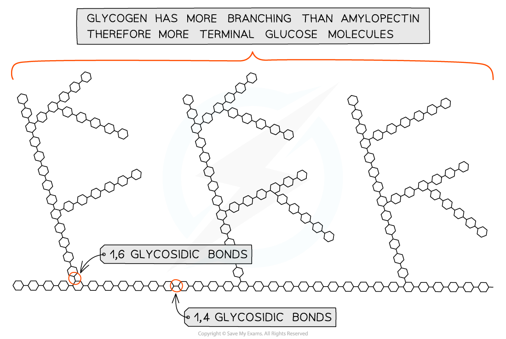
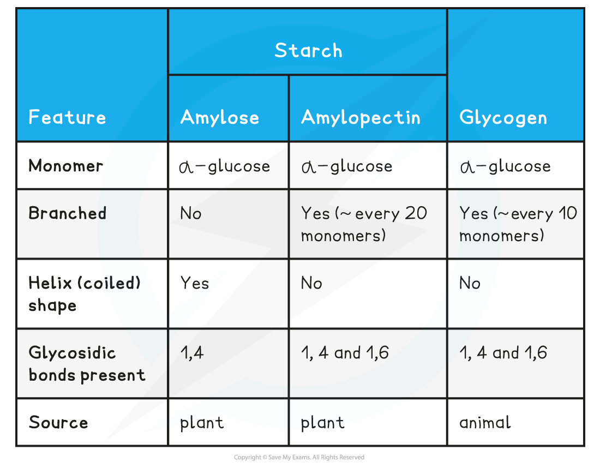
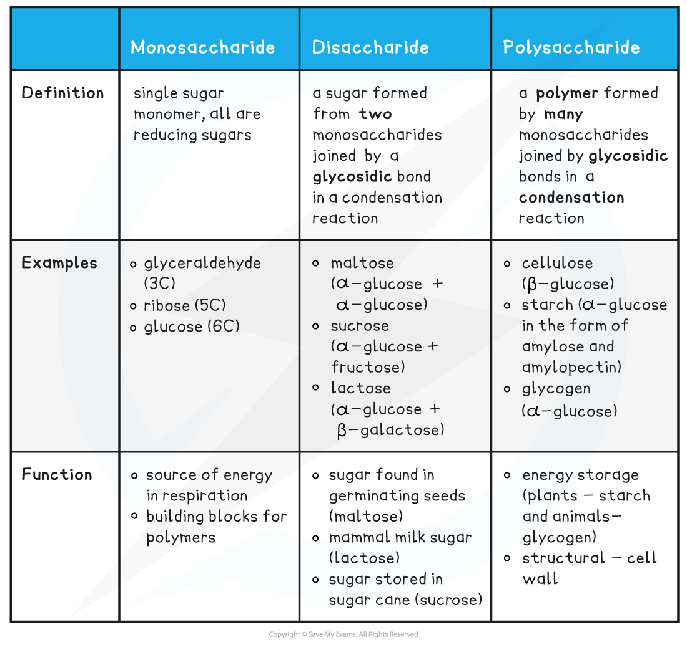

# Saccharides

## Types of Saccharide

> **Spec point** — `spcpt_qDT9KPF38Nc74T6f`

## Types of Saccharide

- **Carbohydrates** are one of the main carbon-based compounds in living organisms
- All molecules in this group contain **C**,** H **and** O**

  - Carbon atoms are key to the structure of organic compounds because
  
    - Each carbon atom can form **covalent bonds**; this makes the compounds very stable
    
      - Covalent bonds are so strong they require a large input of energy to break them
    - Carbon atoms can form covalent bonds with oxygen, nitrogen and sulfur
    - Carbon atoms can bond to form straight chains, branched chains, or rings
- Carbon compounds can form small, single subunits, or **monomers,** that bond with many repeating subunits to form large molecules, or **polymers**

  - This is a process called *polymerisation*
- The three types of carbohydrates are:

  - **monosaccharides**
  
    - The **monomers** of carbohydrates; they can join together to make carbohydrate polymers
    - Monosaccharides are simple carbohydrates
    - Monosaccharides are **sugars**, e.g. **triose** (3C) sugars, **pentose** (5C) sugars and **hexose** (6C) sugars
  - **disaccharides**
  
    - **Two monosaccharides** can join together via [condensation reactions](https://www.savemyexams.com/international-a-level/biology/edexcel/18/revision-notes/1-molecules-transport-and-health/biological-molecules/1-4-condensation-and-hydrolysis/) to form **disaccharides**
    - Examples include lactose and maltose
  - **polysaccharides**
  
    - Polysaccharides are carbohydrate polymers; **repeated chains of many monosaccharides**
    - Starch (including amylose and amylopectin), glycogen, and cellulose are examples of polysaccharides

> **Exam Hint**
> Although cellulose is an important polysaccharide you do not need to know about it in this topic.

## Saccharide Structure & Function

> **Spec point** — `spcpt_RHtfkqCtxVxcg6Sc`

## Saccharide Structure & Function

### Monosaccharides

#### Monosaccharide structure

- **Glucose** is a well known example of a monosaccharide

  - Glucose is a **hexose sugar**
  - The six carbons that make up glucose form a** ring structure**
  
    - Carbons 1-5 form a ring, while carbon 6 sticks out above the ring
- Glucose comes in two forms; **alpha** ($α$) and **beta **($β$)

  - The forms of glucose are almost identical; they differ only in the **location of the H and OH groups attached to carbon 1**
  
    - Alpha glucose has the H above carbon 1 and the OH group below
    
      - Remember = **a**lpha has the H **a**bove
    - Beta glucose has the H below carbon 1 and the OH group above
    
      - Remember = **b**eta has the H **b**elow

 <!-- asset download failed -->

 <!-- asset download failed -->

***Alpha glucose (top) has the hydrogen above carbon 1 and the OH group below, while beta glucose (bottom) has the hydrogen below carbon 1 and the OH group above***

#### Monosaccharide function

- The main function of monosaccharides is **to store energy **within their bonds

  - When the bonds are broken during *respiration*, energy is released
- The structure of glucose is related to its function as the main energy store for animals and plants

  - It is **soluble** so can be transported easily
  - It has many **covalent bonds which store energy**
- Monosaccharides can combine through *condensation reactions* to form larger carbohydrates
- Some monosaccharides are used to **form long, structural fibres,** which can function as cellular support in some cell types

### Disaccharides

#### Disaccharide structure

- Common examples of disaccharides include

  - **Maltose **
  
    - Contains two molecules of glucose linked by a [1,4 glycosidic bond](https://www.savemyexams.com/international-a-level/biology/edexcel/18/revision-notes/1-molecules-transport-and-health/biological-molecules/1-4-condensation-and-hydrolysis/)
    - This means that the glycosidic bond is located between carbon 1 of one monosaccharide and carbon 4 of the other
  - **Sucrose**
  
    - Contains a molecule of glucose and a molecule of fructose linked by a 1,2 glycosidic bond
    - This means that the glycosidic bond is located between carbon 1 of one monosaccharide and carbon 2 of the other
  - **Lactose**
  
    - Contains a molecule of glucose and a molecule of galactose linked by a 1,4 glycosidic bond

***Sucrose is a disaccharide formed from a molecule of glucose (left) and a molecule of fructose (right) joined together by a 1,2 glycosidic bond***

#### Disaccharide function

- The function of disaccharides is to **provide the body with a quick-release source of energy**

  - Disaccharides are made up of two sugar molecules so they're easily broken down by enzymes in the digestive system into their respective monosaccharides and then absorbed into the bloodstream
- Due to the presence of a large number of hydroxyl groups, **disaccharides are easily soluble in water**

  - These hydroxyl groups form hydrogen bonds with the water molecules when dissolved in aqueous solutions
- Just like monosaccharides they are **sweet in taste**

  - Sucrose, also known as table sugar, is an example

### Polysaccharides

#### Starch: structure

- Starch is constructed from **two** **different** **polysaccharides**

  - **Amylose**
  
    - Unbranched **helix-shaped **chain with 1,4 glycosidic bonds between α-glucose molecules
    
      - A helix is a spiral shape
    - The helix shape enables it to be more **compact** and thus more can be stored
  - **Amylopectin**
  
    - A **branched molecule** containing 1,4 glycosidic bonds between α-glucose molecules **and** 1,6 glycosidic bonds
    - The branches result in many terminal glucose molecules that can be **easily hydrolysed** for use during cellular respiration or added to for storage
- Both forms of starch are** insoluble**, so they do not dissolve and** won't alter the water potential** of cells

***Amylose is a helix-shaped polysaccharide found in starch, the storage polysaccharide in plants***

***Amylopectin is a branched polysaccharide found in starch***

#### Starch: function

- Starch is the **storage** polysaccharide of **plants; **it is stored as granules in **plastids**

  - Plastids are **membrane-bound organelles** that can be found in plant cells
  
    - They have a specialised function, e.g. amyloplasts store starch grains and chloroplasts carry out photosynthesis
- The **amylose** in starch has a helical structure which makes it very compact, meaning that much can be stored in a small space
- The **amylopectin** in starch has branches that provide many terminal glucose molecules that can be **easily hydrolysed** for use during cellular respiration or added for storage

#### Glycogen: structure

- Glycogen contains both **1,4** and** 1,6 glycosidic bonds**
- Glycogen is **more branched than amylopectin**

  - The branching provides more terminal glucose molecules which can either be **added to or removed by hydrolysis**; this allows the **quick **storage or release of glucose to suit the demands of the cell
  
    - This is essential in animal cells as animals are very metabolically active
- Glycogen is compact, which means that much can be stored in a small space

  - Liver and muscles cells have a high concentration of glycogen, present as** visible granules; **this enables a high cellular respiration rate
- Glycogen is insoluble

***Glycogen is a highly branched molecule used as a storage polysaccharide in animals and fungi***

#### Glycogen: function

- Glycogen is the **storage** polysaccharide of **animals** and **fungi**
- Glycogen is **more branched than amylopectin**

  - The branching provides more terminal glucose molecules which can either be **added to or removed by hydrolysis**; this allows the **quick **storage or release of glucose to suit the demands of the cell
  
    - This is essential in animal cells as animals are very metabolically active
- Glycogen is compact which means that much can be stored in a small space

  - Liver and muscles cells have a high concentration of glycogen, present as** visible granules; **this enables a high cellular respiration rate

**Summary of Storage Polysaccharides Table**

**Types of Carbohydrate Summary Table**

