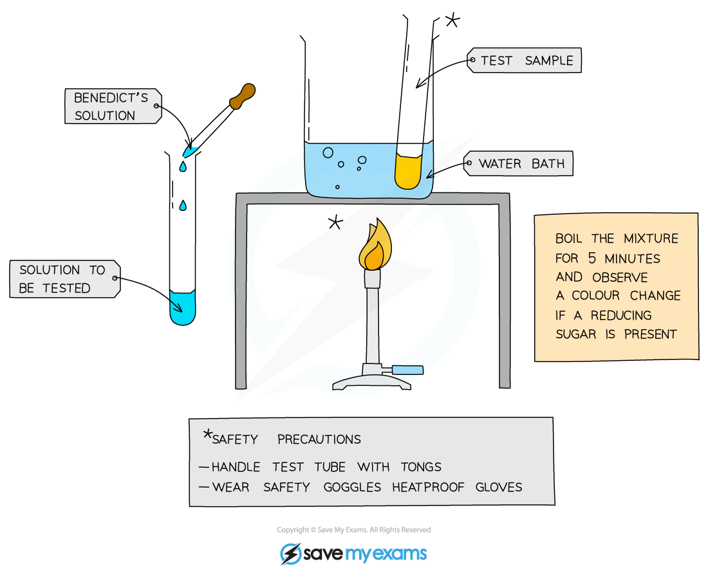
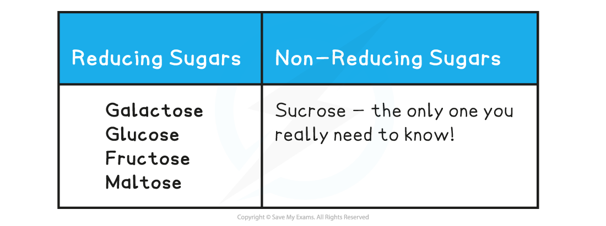
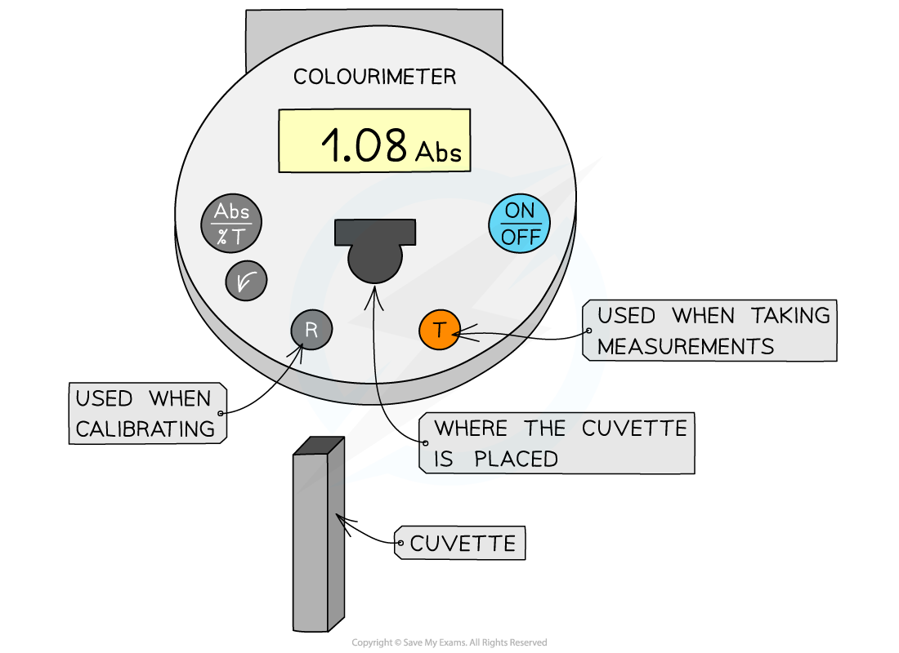
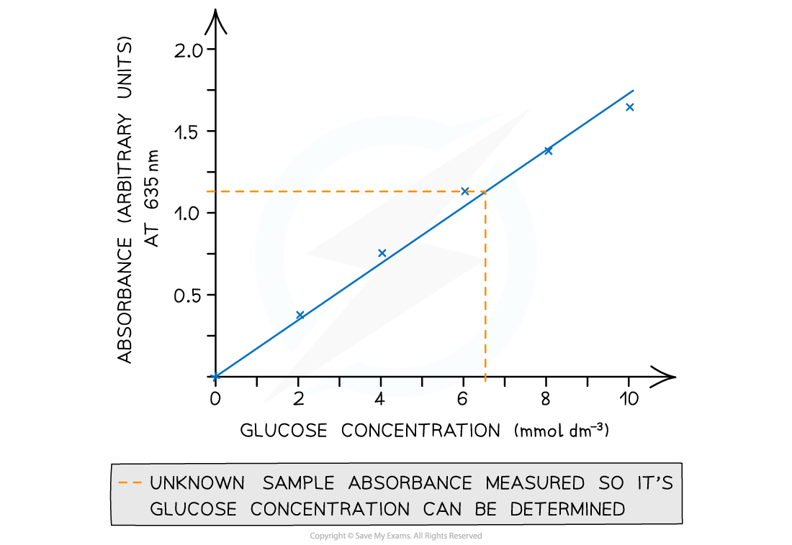
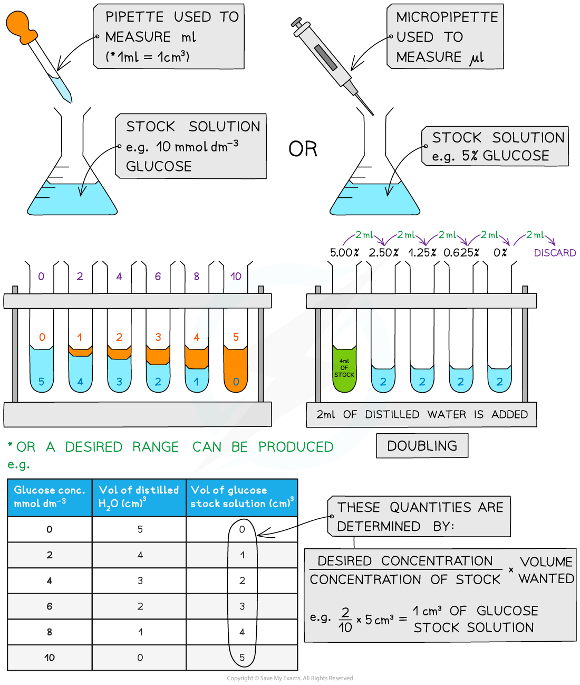
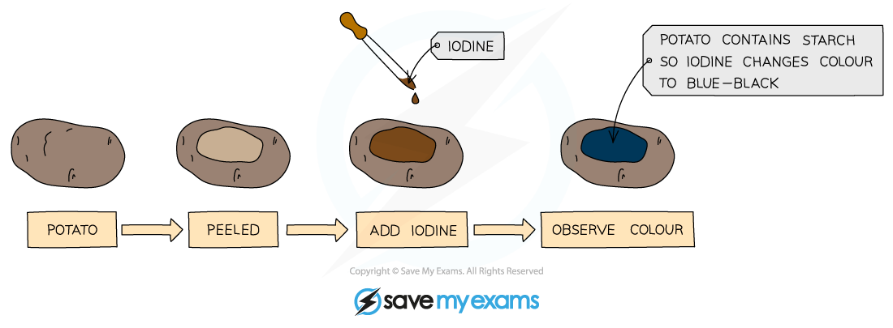

# Core Practical 1: Estimating the Concentration of Sugars & Starch

## Concentration of Sugars

> **Spec point** — `spcpt_n2hVhtng25Fp66Dt`

## Concentration of Sugars

- There are a number of tests that can be carried out quickly and easily in a lab to determine if a sample contains a certain type of sugar
- Depending on how the tests are carried out, they can produce *qualitative* or semi-*quantitative* results
- Sugars can be classified as **reducing** or **non-reducing**; this classification is dependent on their ability to donate electrons (a reducing sugar that is able to donate electrons is itself oxidised)

  - **OILRIG** in Chemistry

#### Qualitative Benedict’s test: detecting the presence of reducing sugars

- Benedict’s reagent is a **blue** solution that contains copper (II) sulfate ions (CuSO4 ); in the presence of a reducing sugar copper (I) oxide forms

  - Copper (I) oxide is not soluble in water, so it forms a **precipitate**

#### Apparatus

- Beaker
- Bunsen burner
- Tripod
- Gauze
- Test tubes
- Test tube rack
- Tongs
- Heatproof gloves
- Goggles
- Benedict's reagent
- Test sample
- Water bath

#### Method

1. Add **Benedict's reagent** (which is blue as it contains copper (II) sulfate ions) to a sample solution in a test tube
2. **Heat** the test tube in a water bath or beaker of water that has been brought to a boil for a few minutes
3. If a *reducing sugar* is present, a coloured precipitate will form as copper (II) sulfate is reduced to copper (I) oxide which is insoluble in water

  - It is important that an **excess** of Benedict’s solution is used so that there is more than enough copper (II) sulfate present to react with any sugar present

#### Results and analysis

- A positive test result is a colour change somewhere along a colour scale from blue (no reducing sugar), through green, yellow and orange (low to medium concentration of reducing sugar) to **brown/brick-red** (a high concentration of reducing sugar)

***The Benedict's test for reducing sugars produces a colour change from blue towards red if a reducing sugar is present***

#### Testing for non-reducing sugars

- Some sugars don't react with Benedict's reagent; these are known as **non-reducing** sugars
- A few extra steps can be taken to test for non-reducing sugars using Benedict's reagent

#### Method

1. Add **dilute hydrochloric acid** to the sample and heat in a water bath that has been brought to the boil
2. **Neutralise** the solution with **sodium hydrogencarbonate**

  - Use a suitable indicator (such as red litmus paper) to identify when the solution has been neutralised, and then add a little more sodium hydrogencarbonate as the conditions need to be slightly alkaline for Benedict’s test to work
3. Then carry out Benedict’s test as normal

  - Add Benedict’s reagent to the sample and heat in a water bath that has been boiled – if a colour change occurs, a reducing sugar is present

#### Results and analysis

- The addition of acid will **hydrolyse any glycosidic bonds** present in any carbohydrate molecules
- The resulting monosaccharides left will have an aldehyde or ketone functional group that can **donate electrons** to copper (II) sulfate (reducing the copper), allowing a precipitate to form

**Reducing & Non-reducing Sugars Table**

#### Semi-quantitative Benedict's test: estimating the concentration of reducing sugars

- Benedict’s solution can be used to carry out a *semi-quantitative* test on a reducing sugar solution to determine the **concentration** of reducing sugar present in the sample

  - It is important that an excess of Benedict’s solution is used so that there is more than enough copper (II) sulfate present to react with any sugar present
- The **intensity of any colour change** seen relates to the **concentration** of reducing sugar present in the sample

  - A positive test is indicated along a spectrum of colour from green (low concentration) to brick-red (high concentration of reducing sugar present)

#### Additional apparatus

- Colourimeter
- Cuvettes
- Pencil
- Graph paper
- Water
- Pipettes
- Stopwatch

#### Method

1. Set up **standard solutions** with known concentrations of a reducing sugar (such as glucose)

  - These solutions should be set up using a **serial dilution** of an existing stock solution
2. Each solution is then treated in the same way

  - Add the same volume of **Benedict’s** reagent to each sample and **heat** in a water bath that has been boiled (ideally at the same temperature each time) for a **set time** (5 minutes or so) to allow colour changes to occur
  - It is important to ensure that an **excess** of Benedict’s solution is used
3. The same procedure is carried out on a sample with an **unknown concentration** of reducing sugar which is then **compared to the stock solution colours**
4. To avoid issues with human interpretation of colour, a **colourimeter **is used

  - A sample of each known solution is added to **cuvettes **which are then inserted into a colourimeter** **to measure the **absorbance** or **transmission of light** to establish a range of values that form a **calibration curve**

#### Results and analysis

- The** unknown sample can be compared **against the calibration curve to estimate the concentration of reducing sugar present

#### Colorimeter

- A colorimeter is an instrument that beams a specific wavelength (colour) of light through a sample and measures how much of this light is **absorbed** by the sample

  - Colour filters are used to control the light wavelength emitted
  - The colour used will be **in contrast** to the colour of the solution, e.g. Benedict's solution turns orange in the presence of sugar, so the colorimeter will* assess the intensity of the* *orange* colour; in order to do this a blue light filter would be used to shine blue light through the sample
  
    - Blue light is absorbed by an orange solution as orange light is reflected to give the orange appearance
    - The extent to which the blue light is absorbed will differ depending on the intensity of the orange colour; a solution that is orange/green will absorb less blue light than a solution that is brick red
    - The absorbance value therefore provides a **quantitative** measure of the strength of the orange colour
- Colorimeters must be **calibrated** before taking measurements

  - This is completed by placing a *blank* into the colorimeter and taking a reference; it should read 0 (that is, no light is being absorbed)
  - This step should be repeated periodically whilst taking measurements to ensure that the absorbance is still 0
- The results can then be used to plot a calibration or standard curve

  - Absorbance against the known concentrations can be used
  - Unknown concentrations can then be determined from this graph

***A colourimeter is used to obtain quantitative data that can be plotted to create a calibration curve to be used to find unknown concentrations***

#### Serial dilutions

- Serial dilutions are created by taking a series of dilutions of a stock solution. The concentration decreases by the **same** quantity between each test tube

  - They can either be ‘doubling dilutions’ (where the concentration is halved between each test tube) or a desired range (e.g. 0, 2, 4, 6, 8, 10 mmol dm-3)
- Serial dilutions are completed to create a standard to compare unknown concentrations against

  - The comparison can be:
  
    - Visual
    - Measured through a calibration/standard curve
    - Measured using a colourimeter
  - They can be used when:
  
    - Counting bacteria or yeast populations
    - Determining unknown glucose, starch, protein concentrations

***Making serial dilutions***

## Concentration of Starch

> **Spec point** — `spcpt_cYvfKzG7DbXXGGGg`

## Concentration of Starch

#### Qualitative iodine test: detecting the presence of starch

- Iodine solution can be used to test for the presence of starch in a test sample

#### Apparatus

- Test sample
- Iodine solution
- Spotting tile
- Gloves
- Goggles

#### Method

1. Add a few drops of **orange/brown iodine** solution to the test sample

#### Results and analysis

- If starch is present, iodide ions in the solution interact with the centre of starch molecules, producing a complex with a distinctive **blue-black colour**
- This test is useful in experiments for showing that starch in a sample has been digested by enzymes

***Iodine test for the presence of starch***

#### Semi-quantitative iodine test: estimating the concentration of starch

- Iodine solution can be used to carry out a *semi-quantitative* test on a food sample to determine the **concentration** of starch present in the sample
- The **intensity of any colour change** seen relates to the **concentration** of starch present in the sample

  - A positive test is indicated along a spectrum of colour from dark brown (low concentration) to blue-black (high concentration of starch present)

#### Additional apparatus

- Colourimeter
- Cuvettes
- Pencil
- Graph paper
- Test tubes
- Test tube rack
- Water
- Pipettes
- Liquid food sample
- Stopwatch

#### Method

1. Set up **standard solutions** with known concentrations of starch

  - These solutions should be set up using a **serial dilution** of an existing stock solution
2. Each solution is then treated in the same way

  - Add the same volume of **iodine solution** to each sample and allow colour changes to occur within a set time
3. The same procedure is carried out on a sample with an **unknown concentration** of starch (food sample) which is then **compared to the stock solution colours**
4. To avoid issues with human interpretation of colour, a **colourimeter **is used

  - A sample of each known solution is added to **cuvettes **which are then inserted into a colourimeter** **to measure the **absorbance** or **transmission of light** to establish a range of values that form a **calibration curve**

#### Results and analysis

- The** unknown sample can be compared **against the calibration curve to estimate the concentration of starch present
