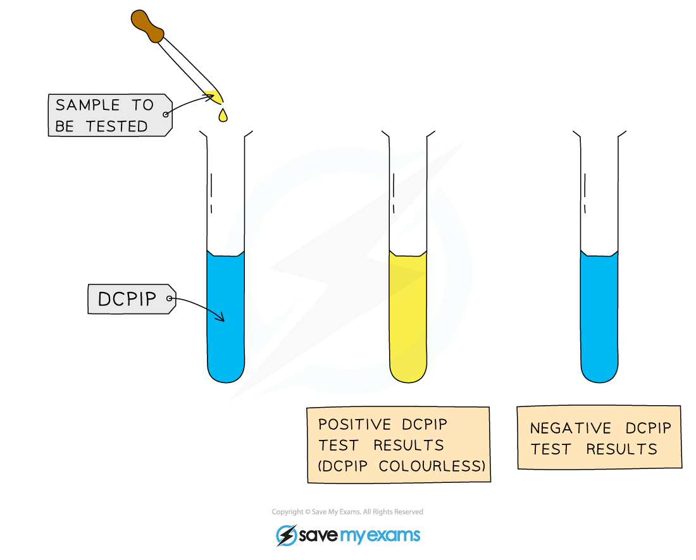

# Core Practical 2: Investigate the Vitamin C Content of Food & Drink

## Investigating the Vitamin C Content of Food & Drink

> **Spec point** — `spcpt_YX7B4wbK4hCXHBpX`

## Investigating the Vitamin C Content of Food & Drink

- Vitamin C is found in green vegetables, fruits, and potatoes
- It is essential for a healthy diet
- The chemical name for vitamin C is **ascorbic acid**

  - Ascorbic acid is a good *reducing*** agent **and therefore it is easily *oxidised*
- Methods for the detection of vitamin C involve **titrating **it against a solution of an oxidising agent called DCPIP

  - DCPIP is a blue dye that **turns colourless** in the presence of vitamin C
  - Titration is a **method of chemical analysis** that involves determining the quantity of a substance present by gradually adding another substance; in this case the concentration of vitamin C is determined by gradual addition of a vitamin C solution to DCPIP

#### Apparatus

- Vitamin C solutions
- 1% DCPIP solution
- Distilled water
- Range of fruit juices
- Measuring cylinder
- Pipette
- Stop watch
- Test tubes

#### Method

1. Make up a series. e.g. six, of known vitamin C concentrations

  - This can be done by serial dilution
2. Use a measuring cylinder to measure out 1 cm3 of DCPIP solution into a test tube
3. Add one of the vitamin C solutions, drop by drop, to the DCPIP solution using a graduated pipette or burette
4. Shake the tube for a set period of time using a stop watch

  - It is important to keep the shaking time the same for each concentration; this is a **control variable**
5. When the solution turns colourless record the volume, in number of drops, of vitamin C solution added
6. Repeat steps 2-5 for the same concentration twice more and calculate an average
7. Repeat steps 2-6 for each of the known concentrations
8. Results can be plotted as a line of best fit showing the average volume of vitamin C needed to decolourise DCPIP against the concentration of vitamin C

  - This is a **calibration curve** and can be used to find the concentration of vitamin C in unknown samples such as fruit juices

***Drops of vitamin C solution of known concentration can be added to DCPIP to determine the volume required for the DCPIP to be decolourised***

#### Risk assessment

- DCPIP is an irritant

  - Avoid contact with the skin
  - Wear eye protection

#### Results

- The volume of vitamin C solution required to decolourise DCPIP should **decrease **as the concentration of the vitamin C solution** increases**
- The results of the experiment can be plotted on a graph of **volume of vitamin C needed to decolourise DCPIP** against the **concentration of vitamin C**

  - The line of best fit for such a graph is known as a **calibration curve**; unknown substances can be compared to it to gain an **estimate **of their vitamin C concentration
- The calibration curve produced from this experiment can be used to **estimate the concentration of vitamin C** in fruit juices

***A graph of volume of vitamin C needed to decolourise DCPIP against vitamin C concentration can be used as a calibration curve to estimate the vitamin C concentration of unknown substances***
