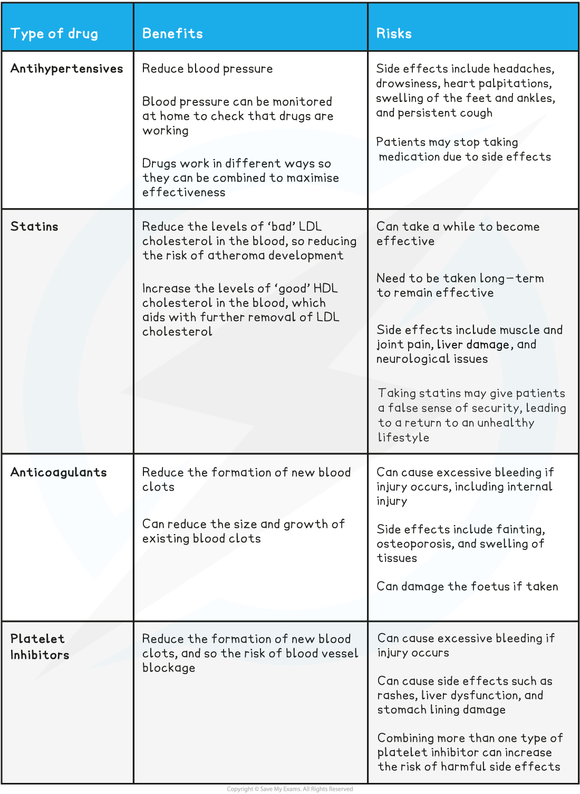

# Treatments for CVD: Benefits & Risks

## Treatments for CVD: Benefits & Risks

> **Spec point** — `spcpt_swSZDmWSd3ynJV26`

## Treatments for CVD: Benefits & Risks

- While reducing the risk factors and lowering the risk of developing cardiovascular disease (CVD) is the best option, CVD is still very common and treatment options are needed
- There are a number of different **treatment options** for cardiovascular disease, many of which involve taking **medication**
- Types of medication for the treatment of CVD include

  - Antihypertensives
  - Statins
  - Anticoagulants
  - Platelet inhibitors

#### Antihypertensives

- These drugs work by **lowering blood pressure**

  - High blood pressure is also known as **hypertension**
- Lowering blood pressure **reduces the risk of arterial endothelial damage **and therefore reduces the risk of atheromas and thrombosis
- **Beta blockers,** **vasodilators** and** diuretics** act as antihypertensives

  - Beta blockers prevent increases in heart rate
  - Vasodilators increase the diameter of the blood vessels
  
    - ACE inhibitors are a type of drug that block the production of angiotensin, a hormone that causes constriction of the blood vessels
    - This keeps the arteries dilated, which lowers the blood pressure
  - Diuretics reduce blood volume by decreasing the amount of sodium reabsorbed into the blood by the kidneys, therefore decreasing the volume of water reabsorbed into the blood

#### Statins

- These drugs work by **lowering blood cholesterol **

  - They block an enzyme in the liver which is needed to make cholesterol
- This **lowers the LDL concentration** in the blood therefore reducing the risk of atheroma formation

  - LDLs are sometimes known as 'bad' cholesterol; at high levels they increase the risk of atheromas forming
- Statins also **reduce inflammation** in the arterial lining, which lowers the risk of atherosclerosis

#### Anticoagulants

- These drugs **reduce blood clotting**

  - Blood clotting can be referred to as blood coagulation
  - Warfarin is an anticoagulant that decreases the level of prothrombin in the bloodstream
- Reduced formation of blood clots **decreases the likelihood of thrombosis** and therefore reduces the risk of blood vessels being blocked by blood clots

#### Platelet inhibitors

- These are also substances which **reduce blood clotting**

  - Platelet inhibitors are a type of anticoagulant
  - **Aspirin** and clopidogrel are the most commonly used examples of these drugs
- They prevent the clumping together of **platelets, **so preventing the formation of blood clots

**Benefits and Risks of Cardiovascular Disease Drugs Table**

