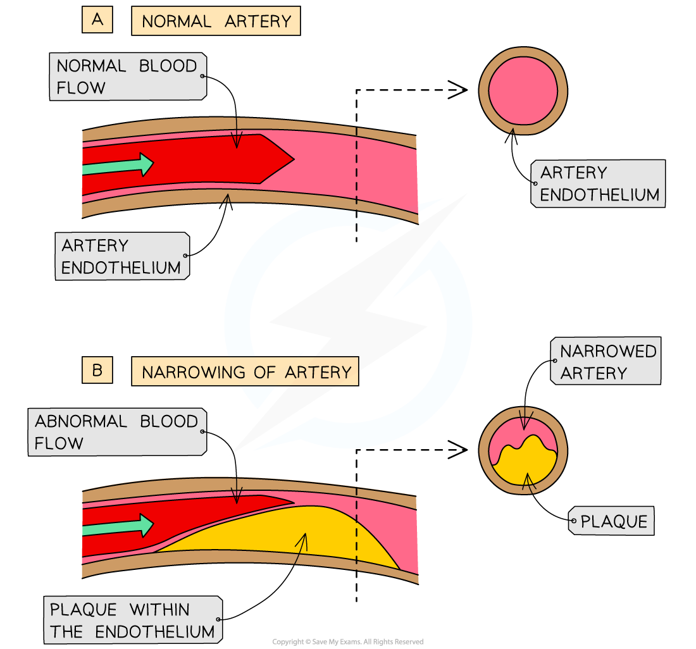

# Atherosclerosis

## Atherosclerosis

> **Spec point** — `spcpt_C6xmkHBr8TRPGSBY`

## Atherosclerosis

- There are a number of diseases of the heart, or cardiovascular diseases, that can affect blood vessels in different ways
- **Atherosclerosis, **also known as hardening of the arteries, is caused primarily by damage to the delicate *endothelium* of an artery followed by an **inflammatory response**

  - It is a progressive disease, meaning that it can worsen over time
- In a healthy artery the **endothelium** is smooth and unbroken to reduce friction between blood and the inside of the artery
- The steps involved in atherosclerosis are

  - **Damage**, e.g. by high blood pressure,** **is caused to the **endothelium**
  
    - Damage can also occur as a result of high levels of certain types of cholesterol, smoking, diabetes, obesity, and old age
  - An **inflammatory response** occurs and white blood cells, such as macrophages, accumulate in the damaged area
  - **Lipids** and **cholesterol **clump together with the macrophages **under the endothelium** and form **fatty streaks**
  
    - This is one of the first signs of atherosclerosis
  - **Platelets** can also add to the fatty deposit
  
    - Platelets are fragments of red blood cells involved in the blood clotting process
  - The collection of cholesterol, lipids, macrophages and platelets accumulate under the endothelium
  
    - The structure forms a** plaque** known as an **atheroma**
  - The atheroma narrows the lumen of the artery, reducing and restricting blood flow and thereby **raising blood pressure**
  - Over time the plaque can **calcify and harden**, reducing elasticity of the artery wall and further increasing blood pressure

***Atherosclerosis is the process by which atheroma plaques form in the endothelium of arteries***
