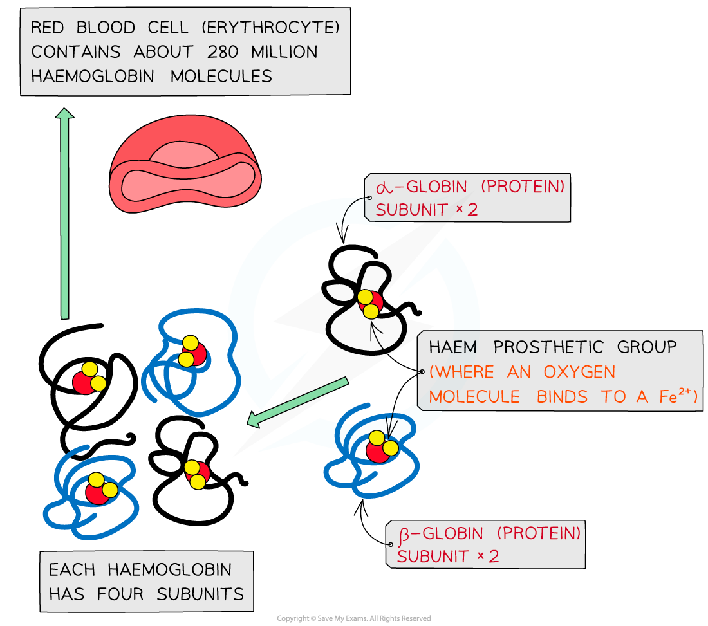
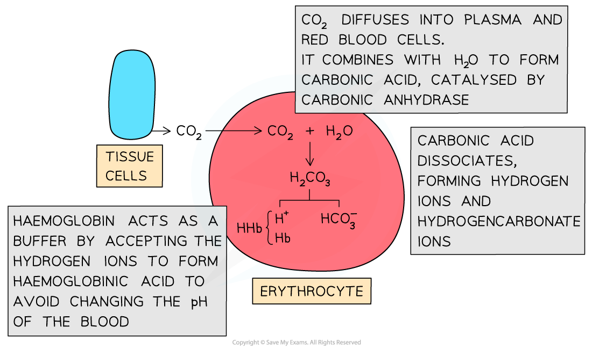
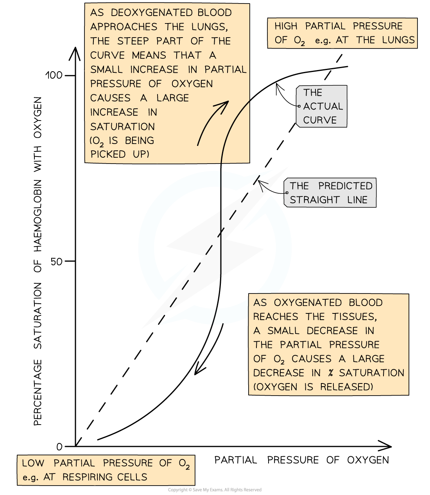
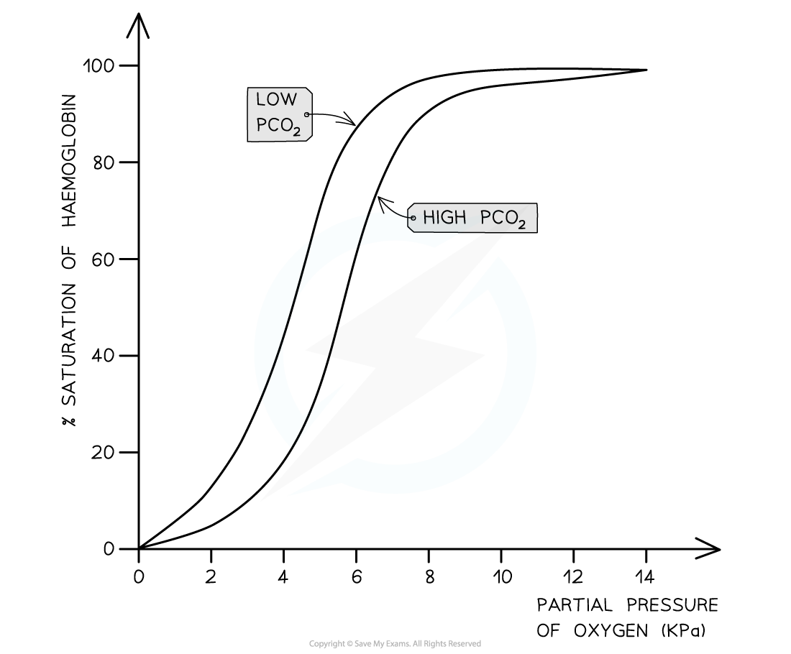
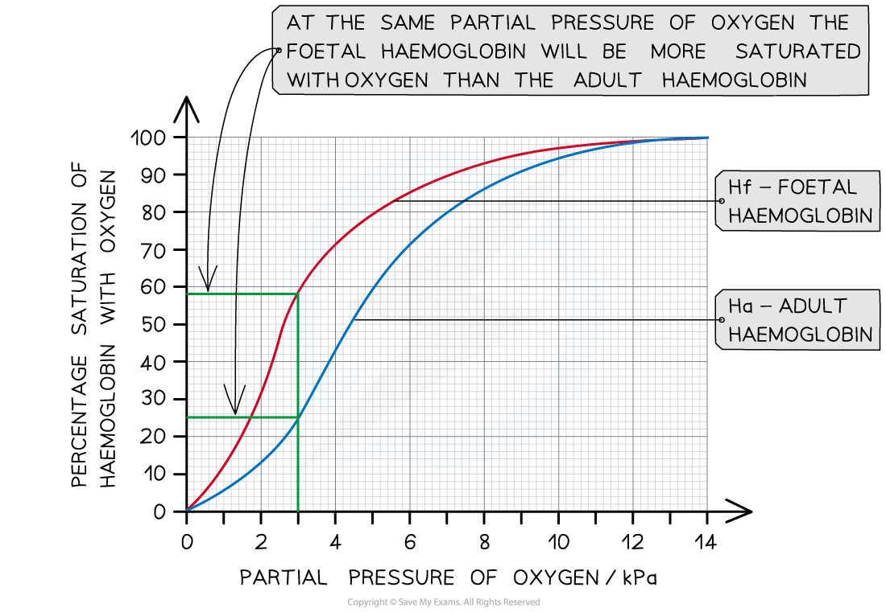

# The Role of Haemoglobin

## Haemoglobin Structure & Function

> **Spec point** — `spcpt_hSkVFG7FBb54TxSn`

## Haemoglobin Structure & Function

#### Transport of oxygen

- The majority of oxygen transported around the body is **bound to the protein haemoglobin in red blood cells**

  - Red blood cells are also known as** erythrocytes**
- Each molecule of haemoglobin contains **four haem groups**, each able to bond with one molecule of oxygen

  - This means that each molecule of haemoglobin can carry four oxygen molecules, or eight oxygen atoms in total

***Haemoglobin proteins are made up of four subunits, each of which contains a region called a haem group to which oxygen can bind***

- When oxygen binds to haemoglobin, oxyhaemoglobin is formed

**Oxygen + Haemoglobin **$\rightleftharpoons$** Oxyhaemoglobin**

**4O****2**** + Hb **$\rightleftharpoons$** Hb4O**** 2**

- The binding of the first oxygen molecule results in a conformational change in the structure of the haemoglobin molecule, making it easier for each successive oxygen molecule to bind; this is **cooperative binding**
- The reverse of this process happens when oxygen dissociates in the tissues

#### Carbon dioxide transport

- Waste carbon dioxide produced during *respiration* diffuses from the tissues into the blood
- There are three main ways in which carbon dioxide is transported around the body

  - A very small percentage of carbon dioxide dissolves directly in the blood plasma and is transported in solution
  - Carbon dioxide can **bind to haemoglobin**, forming **carbaminohaemoglobin**
  - A much larger percentage of carbon dioxide** **is transported in the form of **hydrogen carbonate ions (HCO****3-****)**

#### Formation of hydrogen carbonate ions

- Carbon dioxide **diffuses into red blood cells**
- Inside red blood cells, carbon dioxide combines with water to form H2CO3

**CO****2**** + H****2****O  ⇌  H****2****CO****3**

- - Red blood cells contain the enzyme **carbonic anhydrase** which catalyses the reaction between carbon dioxide and water
  - Without carbonic anhydrase this reaction proceeds very slowly
  - The plasma contains very little carbonic anhydrase hence H2CO3 forms **more slowly in plasma** than in the cytoplasm of red blood cells
- Carbonic acid dissociates readily into H+ and HCO3- ions

**H****2****CO****3 **** ⇌  HCO****3****–**** + H****+**

- Hydrogen ions can combine with haemoglobin, forming **haemoglobinic acid** and preventing the H+ ions from **lowering the pH** of the red blood cell

  - Haemoglobin is said to act as a **buffer** in this situation
- The hydrogen carbonate ions diffuse out of the red blood cell **into the blood plasma** where they are transported in solution

***Carbon dioxide can be transported in the form of hydrogen carbonate ions***

## Association & Dissociation of Haemoglobin

> **Spec point** — `spcpt_SFjQxxdcdNx7TQ8q`

## Association & Dissociation of Haemoglobin

#### The oxygen dissociation curve

- The oxygen dissociation curve shows the **rate at which oxygen associates, and also dissociates, with haemoglobin** at different **partial pressures of oxygen (pO****2****)**

  - Partial pressure of oxygen refers to the **pressure exerted by oxygen within a mixture of gases**; it is a **measure of oxygen concentration**
  - Haemoglobin is referred to as being saturated when **all of its oxygen binding sites are taken up with oxygen**; so when it contains **four oxygen molecules**
- The ease with which haemoglobin binds and dissociates with oxygen can be described as its **affinity** **for oxygen**

  - When haemoglobin has a high affinity it **binds easily** and **dissociates slowly**
  - When haemoglobin has a low affinity for oxygen it **binds slowly **and **dissociates easily**
- In other liquids, such as water, we would expect oxygen to becomes associated with water, or to dissolve, at a **constant rate**, providing a **straight line** on a graph, but with haemoglobin **oxygen binds at different rates as the pO****2**** changes**; hence the resulting curve

  - It can be said that haemoglobin's **affinity for oxygen changes at different partial pressures of oxygen**

***Oxygen binds to haemoglobin at different rates as the partial pressure of oxygen changes; the resulting curve is known as the oxygen dissociation curve***

#### Explaining the shape of the curve

- The curved shape of the oxygen dissociation curve for haemoglobin can be explained as follows

  - Due to the shape of the haemoglobin molecule, it is **difficult for the first oxygen molecule to bind** to haemoglobin; this means that binding of the first oxygen occurs slowly, explaining the relatively **shallow curve at the bottom left** corner of the graph
  - After the first oxygen molecule binds to haemoglobin, the **haemoglobin protein changes shape**, or conformation, making it **easier for the next oxygen molecules to bind**; this speeds up binding of the remaining oxygen molecules and explains the **steeper part of the curve in the middle **of the graph
  
    - The shape changes of haemoglobin leading to easier oxygen binding is known as **cooperative binding**
  - As the haemoglobin molecule approaches saturation it takes longer for the fourth oxygen molecule to bind due to the shortage of remaining binding sites, explaining the **levelling off of the curve in the top right** corner of the graph

#### Interpreting the curve

- When the curve is read from left to right, it provides information about the **rate at which haemoglobin binds to oxygen** at different partial pressures of oxygen

  - At **low pO****2**, in the bottom left corner of the graph, **oxygen binds slowly to haemoglobin**; this means that haemoglobin cannot pick up oxygen and become saturated as blood passes through the body's oxygen-depleted tissues
  
    - Haemoglobin has a **low affinity for oxygen at low pO****2****, **so saturation percentage is low
  - At **medium pO****2**, in the central region of the graph, oxygen **binds more easily to haemoglobin **and **saturation increases quickly**; at this point on the graph a** small increase in pO****2**** causes a large increase in haemoglobin saturation**
  - At high pO2, in the top right corner of the graph, **oxygen binds easily to haemoglobin**; this means that haemoglobin can pick up oxygen and become saturated as blood passes through the lungs
  
    - Haemoglobin has a **high affinity for oxygen at high pO****2****, **so saturation percentage is high
    - Note that at this point on the graph **increasing the pO****2**** by a large amount only has a small effect on the percentage saturation of haemoglobin**; this is because most oxygen binding sites on haemoglobin are already occupied
- When read from right to left, the curve provides information about the** rate at which haemoglobin dissociates with oxygen** at different partial pressures of oxygen

  - In the lungs, where **pO****2**** is high**, there is **very little dissociation** of oxygen from haemoglobin
  - At **medium pO****2****, oxygen dissociates readily from haemoglobin**, as shown by the **steep region of the curve**; this region **corresponds with the partial pressures of oxygen present in the respiring tissues** of the body, so ready release of oxygen is important for cellular respiration
  
    - At this point on the graph a **small decrease in pO****2**** causes a large decrease in percentage saturation** of haemoglobin, leading to easy release of plenty of oxygen to the cells
  - At **low pO****2**** dissociation slows again**; there are few oxygen molecules left on the binding sites, and the release of the final oxygen molecule becomes more difficult, in a similar way to the slow binding of the first oxygen molecule

#### The Bohr effect

- Changes in the oxygen dissociation curve **as a result of carbon dioxide levels **are known as the **Bohr effect**, or Bohr shift
- When the **partial pressure of carbon dioxide in the blood is high, haemoglobin’s affinity for oxygen is reduced**

  - This is the case in **respiring tissues**, where cells are producing carbon dioxide as a waste product of respiration
  - This occurs because **CO****2**** lowers the pH of the blood**
  
    - CO2 combines with water to form carbonic acid
    - Carbonic acid dissociates into hydrogen carbonate ions and hydrogen ions
    - Hydrogen ions bind to haemoglobin, causing the release of oxygen
- This is a helpful change because it means that **haemoglobin gives up its oxygen more readily** in the respiring tissues where it is needed
- On a graph showing the dissociation curve, the curve **shifts to the right** when CO2 levels increase

  - This means that **at** **any given partial pressure of oxygen, the percentage saturation of haemoglobin is lower at higher levels of CO****2**

***The dissociation curve shifts to the right as a result of the Bohr effect. This means that at any given partial pressure of oxygen, the percentage saturation of haemoglobin is lower at higher CO******2****** levels***

#### Foetal haemoglobin

- The haemoglobin of a developing foetus has a **higher affinity for oxygen than adult haemoglobin**
- This is vital as it allows a foetus to **obtain oxygen from its mother's blood** at the placenta

  - Foetal haemoglobin can **bind to oxygen at low pO****2**
  - At this low pO2 the mother's haemoglobin is **dissociating with oxygen**
- On a dissociation curve graph, the curve for foetal haemoglobin **shifts to the left **of that for adult haemoglobin

  - This means that **at any given partial pressure of oxygen, foetal haemoglobin has a higher percentage saturation than adult haemoglobin**
- After birth, a baby begins to produce adult haemoglobin which** gradually replaces** foetal haemoglobin

  - This is important for the **easy release of oxygen in the respiring tissues **of a more metabolically active individual

***Foetal haemoglobin has a higher affinity for oxygen than adult haemoglobin. This means that at any given pO******2******, foetal haemoglobin will have a higher percentage saturation than adult haemoglobin***
