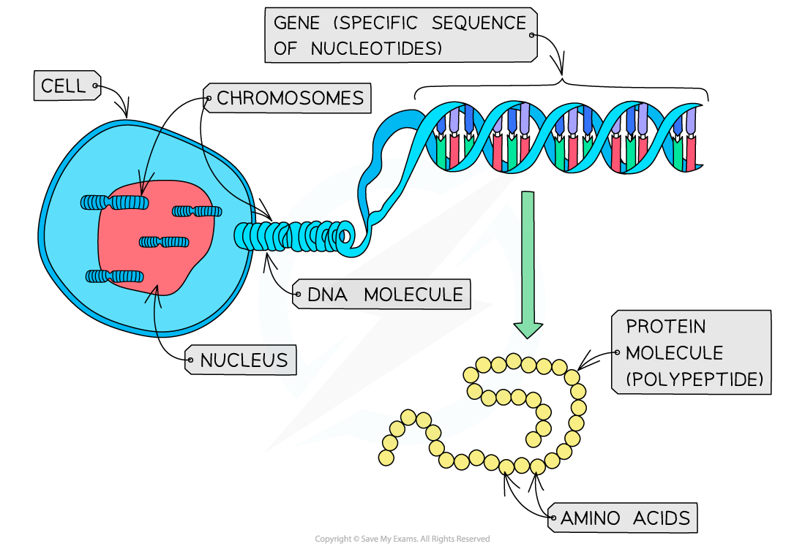

# How Bases Code for a Polypeptide Chain

## Crick's Central Dogma

> **Spec point** — `spcpt_FFsG2jbhr7zvdpgt`

## Crick's Central Dogma

- A **gene** is a **sequence of nucleotides **that forms part of a DNA molecule (one DNA molecule contains many genes)
- This sequence of nucleotides (the gene) **codes for the production of a specific polypeptide** (protein)
- Protein molecules are made up of a series of **amino acids** bonded together
- The **shape** and **behaviour** of a protein molecule depends on the **exact sequence **of these amino acids (the initial sequence of amino acids is known as the **primary structure** of the protein molecule)
- The **genes in DNA molecules, therefore, control protein structure** (and as a result, protein function) as **they determine the exact sequence in which the amino acids join together** when proteins are synthesised in a cell

***A gene is a sequence of nucleotides that codes for the production of a specific protein molecule (polypeptide)***
