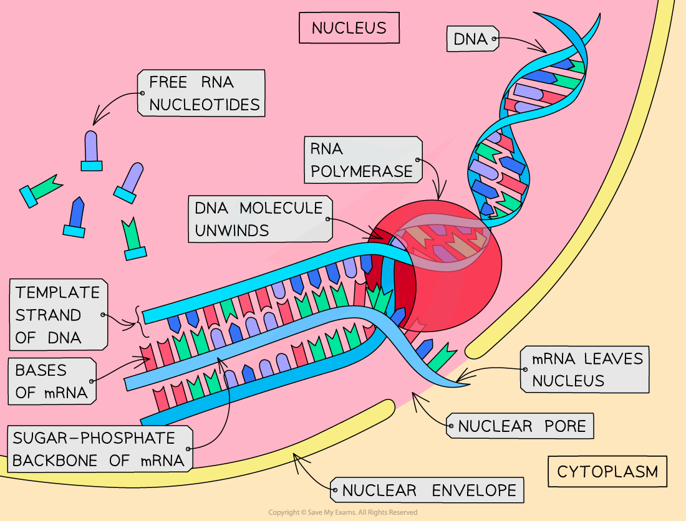
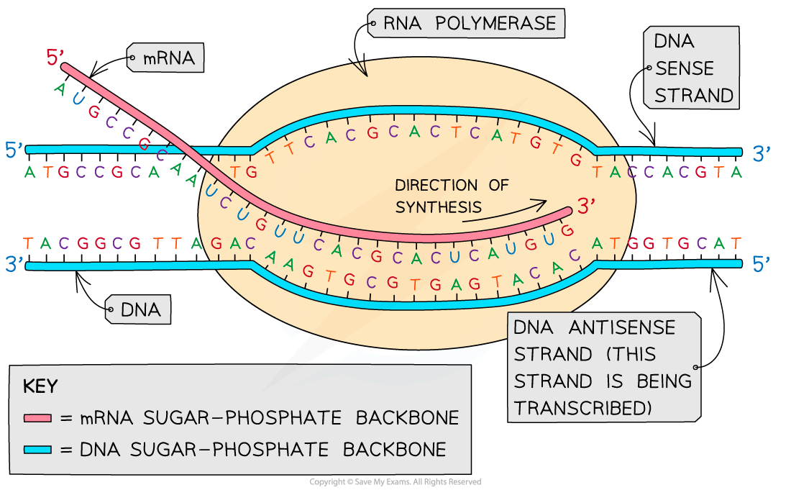
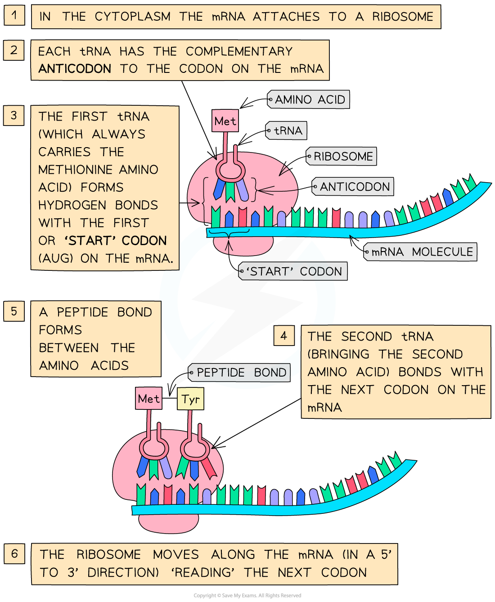
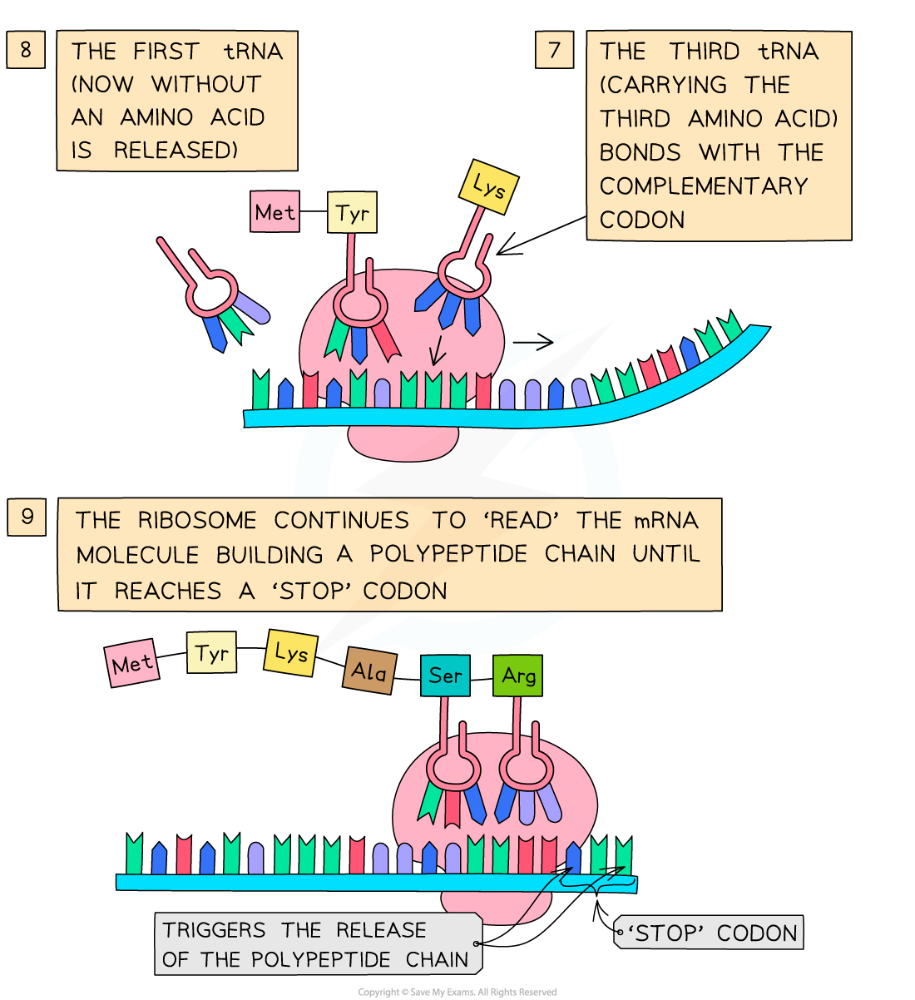

# Transcription & Translation

## Transcription

> **Spec point** — `spcpt_ffTTYVpGBshbGZtt`

## Transcription

- A **gene** is a **sequence of nucleotide bases **in a DNA molecule that **codes for the production of a specific sequence of amino acids**, that in turn make up a **specific polypeptide** (**protein**)
- This process of protein synthesis occurs in **two stages**:

  - **Transcription** – **DNA** is transcribed and an **mRNA **(messenger RNA)** **molecule is produced
  - **Translation** – **mRNA** is translated and an **amino acid sequence** is produced
  
    - mRNA is a single-stranded molecule made up of many **RNA nucleotides **joined together
    - The role of mRNA is to carry the information encoded in the DNA from the nucleus to the site of translation on ribosomes

#### The process of transcription

- This stage of protein synthesis occurs in the **nucleus** of the cell
- Part of a DNA molecule unwinds and the hydrogen bonds between the complementary base pairs break
- This **exposes the gene to be transcribed** (the gene from which a particular polypeptide will be produced)
- A **complimentary** copy of the code from the gene is made by building a **single-stranded nucleic acid molecule known as mRNA**

  - This reaction is catalysed by ***RNA polymerase***
- **Free activated RNA nucleotides** pair up, via hydrogen bonds, with their **complementary** bases on the exposed strand of the **‘unzipped’ DNA molecule**
- The sugar-phosphate groups of these RNA nucleotides are then bonded together in a reaction catalysed by the enzyme RNA polymerase to form the sugar-phosphate backbone of the mRNA molecule
- When the gene has been transcribed and the mRNA molecule is complete, the hydrogen bonds between the mRNA and DNA strands break and the **double-stranded DNA molecule reforms**
- The **mRNA molecule then leaves the nucleus **via a pore in the nuclear envelope

***The transcription stage of protein synthesis - DNA is transcribed and an mRNA molecule is produced***

#### Anti-sense and sense strands

- In the **transcription** stage of protein synthesis, free RNA nucleotides pair up with the exposed bases on the DNA molecule
- RNA nucleotides only pair with the bases on** one strand of the DNA molecule**

  - This strand of the DNA molecule is known as the **antisense** or **template strand** (or the **transcribed strand**) and it is used to produce the **mRNA molecule**
  - The other strand is known as the **sense** or **coding strand** (or the **non-template** or **non-transcribed strand**)
- **RNA polymerase** moves along the template strand in the **3' to 5' direction**

  - This means that the **mRNA** molecule grows in the **5' to 3' direction**
- Because the mRNA is formed by complementary pairing with the DNA template strand, the mRNA molecule contains the **exact same sequence of nucleotides** as the DNA **coding strand** (although the mRNA will contain **uracil** instead of **thymine**)

***The antisense strand of DNA is the one that is transcribed into mRNA***

> **Exam Hint**
> Be careful – **DNA** polymerase is the enzyme involved in DNA replication; **RNA** polymerase is the enzyme involved in **transcription** – don’t get these confused.
> 
> Note the use of **sense** and **anti-sense strands** in transcription can be replaced with non-transcribed and transcribed/template strands respectively.
> 
> The mRNA strand will have the same base sequence as the sense strand **except** on RNA the base **U**racil replaces **T**hymine from the DNA strand.

## Translation

> **Spec point** — `spcpt_wkRMvx7qqRGfzVxt`

## Translation

- Translation occurs **in the cytoplasm** of the cell
- After leaving the nucleus via a nuclear pore, the **mRNA molecule attaches to a ribosome**
- In the cytoplasm there are **free molecules of tRNA** (transfer RNA)

  - tRNA is a single stranded molecule of RNA that folds into a clover-like structure
  - tRNA molecules have a **triplet of unpaired bases at one end, **known as the **anticodon**, and a region at the other end where a specific **amino acid can attach**
  - There are about 20 different tRNA molecules, each with a **specific anticodon** and **specific amino acid **binding site
- The **tRNA molecules bind with their specific amino acids** (also in the cytoplasm) and bring them to the mRNA molecule on the **ribosome**
- The triplet of bases (anticodon) on each tRNA molecule pairs with a** complementary triplet** on the mRNA molecule called the **codon**

  - Near the beginning of the mRNA is a triplet of bases called the **start codon (AUG)**
  - This is a signal to **start off translation **
  - AUG codes for an **amino acid **called **methionine**
- **Two tRNA molecules fit onto the ribosome at any one time**, bringing the amino acid they are each carrying side by side
- A **peptide bond** is then formed, via a **condensation reaction**, between the two amino acids
- This process continues until a **‘stop’ codon **on the mRNA molecule is reached – this acts as a signal for translation to stop and at this point the amino acid chain coded for by the mRNA molecule is **complete**
- The amino acid chain then forms the **final** **polypeptide**

***The process of translation***

> **Exam Hint**
> Make sure you learn both stages of protein synthesis fully. Don’t forget – transcription occurs in the nucleus but translation occurs in the cytoplasm!
