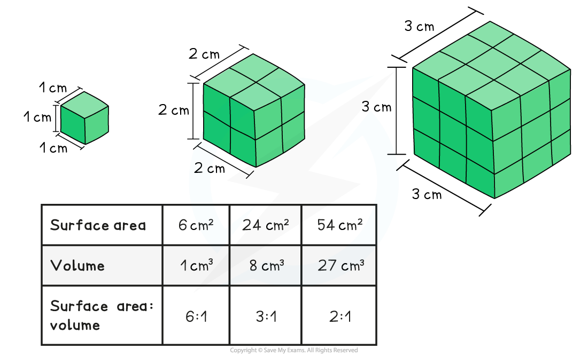
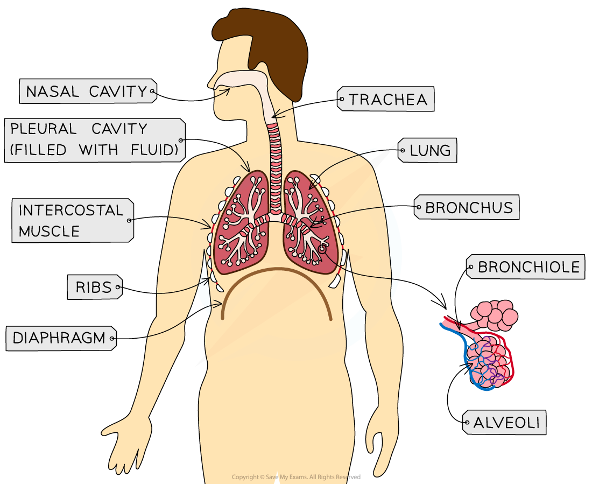
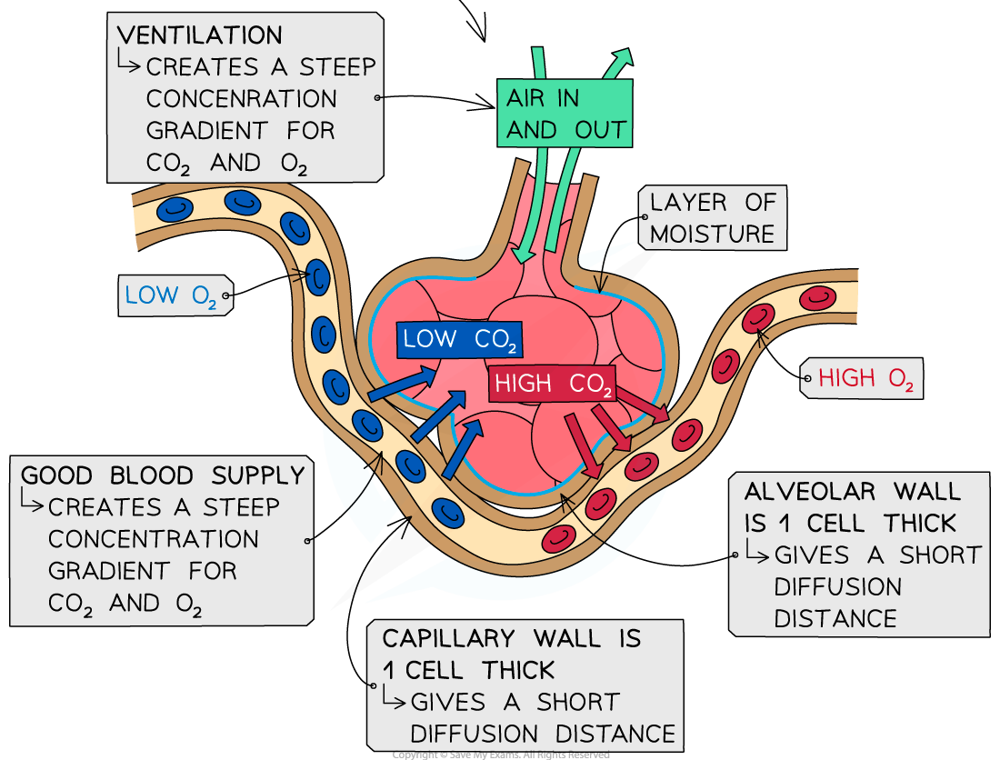

# Properties of Gas Exchange Surfaces

## Properties of Gas Exchange Surfaces 

> **Spec point** — `spcpt_dBs6hfMh5q884gJ9`

## Properties of Gas Exchange Surfaces

- All organisms need to **exchange gases with their environment, **e.g.

  - Aerobic *respiration* requires oxygen and produces carbon dioxide as a waste product
  - *Photosynthesis* requires carbon dioxide and produces oxygen as a waste product
- The process of gas exchange occurs by *diffusion*
- The surface over which this gas exchange takes place is known as an **exchange surface**; exchange surfaces have specific properties that enable efficient exchange to take place

#### Surface area to volume ratio

- The surface area of an organism refers to the **total area of the organism that is exposed to the external environment**
- The volume refers to the **total internal volume of the organism, **or total amount of space inside the organism
- The surface area of an organism in relation to its volume is referred to as an organism's **surface area : volume ratio (SA:V ratio)**
- As the overall **size of the organism increases**, the surface area becomes smaller in comparison to the organism's volume, and the organism's **surface area : volume ratio** **decreases**

  - This is because **volume increases much more rapidly than surface area as size increases**

- **Single-celled organisms **have a **high SA:V ratio **which allows the exchange of substances to occur by simple diffusion

  - The large surface area allows for maximum absorption of **nutrients** and **gases** and removal of **waste products**
  - The small volume within the cell means the diffusion distance to all organelles is short
- As organisms** increase in size **their **SA:V ratio decreases**

  - There is **less surface area **for the absorption of nutrients and gases and removal of waste products **in relation to the volume**, and therefore requirements, of the organism
  - The greater volume results in a longer diffusion distance** **to the cells and tissues of the organism
- **Large multicellular organisms **have evolved adaptations to facilitate the exchange of substances with their environment

  - The gas exchange systems of multicellular organisms are adapted to increase the surface area available for the exchange of gases e.g.
  
    - *Alveoli* increase the surface area of mammalian lungs
    - Fish gills have structures called** lamellae **which provide a very large surface area
    - Leaves have a **spongy mesophyll layer** within which a large area of leaf cell surface is exposed to the air
- Note that the problem of internal diffusion distance is a separate, though connected, issue solved by the presence of a mass transport system such as a circulatory system

#### Diffusion pathway

- The** diffusion pathway**, or **distance**, across an exchange surface is **very short**
- The surface often contains only **one layer** of epithelial cells

  - The cells can also be flattened in shape to further reduce the distance across them
- This means that substances have a very **short diffusion pathway**

#### Concentration gradient

- This is the **difference in concentration** of the exchange substances on either side of the exchange surface, e.g. between the air inside the alveoli and the blood
- A greater difference in concentration means a **greater rate of diffusion** as the gas molecules move across the exchange surface
- The continued movement of exchange substances away from the exchange surface mean that a **concentration gradient is maintained**

  - This is achieved by e.g.
  
    - The alveoli have a **good blood supply**; this constantly removes oxygen from the capillary side of the exchange surface and supplies carbon dioxide
    - The ventilation system in mammals ensures constant **inhalation and exhalation**; this supplies oxygen and removes carbon dioxide from the alveoli side of the exchange surface

> **Exam Hint**
> Be careful when discussing surface area; the phrases 'surface area' and 'surface area : volume ratio' cannot be used interchangeably. Larger organisms have a larger surface area than smaller ones (an elephant clearly has a larger surface area than a bacterial cell), but it is the surface area : volume ratio that gets smaller as body size increases.

## Fick's Law of Diffusion

> **Spec point** — `spcpt_hjwg9WXBdG8zNhgr`

## Fick's Law of Diffusion

- Fick's Law relates the rate of diffusion to the concentration gradient, the diffusion distance and the surface area
- This relationship can be represented by the following equation, where ∝ means "proportional to"

**rate of diffusion **$\propto$** (surface area x concentration difference)**$\div$**thickness of membrane**

- **Proportionality** means the rate of diffusion will double if

  - The surface area or concentration difference **doubles**
  - The diffusion pathway **halves**

- Fick's Law can be written as an equation which can be used to calculate the rate of diffusion

**Rate = P x A x ((C****1**** - C****2****)**$\div$**T)**

- Where

  - P = A **p**ermeability constant that is a quantitative measure of the rate at which a particular molecule can cross a particular membrane
  - A = surface **a**rea
  - C1 - C2 = the difference in **c**oncentration between two areas
  - T = **t**hickness of the exchange surface

> **Worked Example**
> A sample of alveolar epithelium tissue from a mammal is 1.5 $μ$m thick and has a surface area of 3 $μ$m2. The concentration of oxygen in the alveolus is 1.8 x 10-16 mol $μ$m-3 and the concentration of oxygen in the blood is 7.5 x 10-17 mol $μ$m-3. The permeability constant for oxygen across alveolar epithelium is 0.012 molecule s-1.
> 
> Calculate the rate of diffusion across the section of alveolar epithelium.
> 
> **Answer:**
> 
> **Step 1: Substitute numbers into the equation**
> 
> Rate = P x A x ((C1 - C2)$\div$ T)
> 
> Rate = 0.012 x 3 x ((1.8 x 10-16 - 7.5 x 10-17)$\div$1.5)
> 
> **Step 2: Complete the calculation**
> 
> Rate = 0.012 x 3 x (1.05 x 10-16 $\div$1.5)
> 
> Rate = 0.012 x 3 x 7 x 10-17
> 
> Rate = 2.52 x 10-18 molecules $μ$m-2 s-1

> **Exam Hint**
> You will be given the equation for Fick's Law in your exam, but it is important you understand what it means and how to interpret it.

## The Lung & Gas Exchange

> **Spec point** — `spcpt_V5st6nFxjnq6PDfS`

## The Lung & Gas Exchange

- The **lungs** of air-breathing animals provide an ideal exchange surface for the diffusion of gases

  - The lungs are located in the **thorax**, or chest cavity
  - Some animals rely entirely on their lungs for gas exchange, while amphibians use lungs alongside gas exchange across the skin
- The role of lungs is to **maximise gas exchange** while **minimising the loss of water** across the exchange surface
- Mammals have very **efficient** gas exchange structures in their lungs

***The lungs are located in the thorax, and enable efficient gas exchange***

- **Trachea**

  - The trachea is the **tube** that allows air to travel to the lungs
  - It contains c-shaped rings of **cartilage** that ensure that the tube **remains open** at all times and does not collapse
  
    - The c-shape prevents any friction from rubbing with the oesophagus located close behind, as well as providing increased flexibility when food is being swallowed
  - There is a layer of **mucus** covering the lining of the trachea that helps to **trap dust and pathogens**, preventing them from entering the lungs where they could cause infection
  
    - Tiny hairs called **cilia** are also found on the lining of the airways, where they **waft mucus** towards the top of the trachea, removing any trapped particles and pathogens from the airways

- **Bronchi**

  - Bronchi (singular bronchus) have a similar structure to the trachea but they have **thinner walls** and a **smaller diameter**
  - Cartilage provides support for the bronchi in the form of rings and plates

- **Bronchioles**

  - Bronchioles are narrow, self-supporting tubes with thin walls
  - There is a **large number of bronchioles** present in the gas exchange system
  - Each one varies in size, getting smaller as they get closer to the alveoli
  - The larger bronchioles possess **elastic fibres and smooth muscle **that enable adjustment of the size of the airway to increase or decrease airflow
  
    - The smallest bronchioles do not have any smooth muscle but they do have elastic fibres

- **Alveoli**

  - Groups of alveoli are located at the ends of the bronchioles
  - The **alveolar wall** consists of a **single layer of flattened**, or **squamous**, **epithelium**
  
    - The squamous epithelium forms the alveolar wall and is very **thin and permeable** for the **easy diffusion** of gases
    - The alveoli are surrounded by** elastic fibres**, allowing them to **stretch during inhalation**
  - Alveoli are surrounded by an extensive capillary network
  
    - **Carbon dioxide diffuses out of the capillaries and into the alveoli** to be exhaled, while **oxygen diffuses from the alveoli and into the capillaries** to be carried around the body
  - A layer of moisture lines the alveoli, facilitating the diffusion of gases
  
    - Oxygen and carbon dioxide are able to **dissolve** in the layer of moisture, so exchange occurs **in solution **rather than with the air inside the alveoli

***Human alveoli are adapted for efficient gas exchange***

> **Exam Hint**
> When describing the features of the alveoli, be careful to refer to the alveolar epithelium as the 'wall of the alveoli' or the 'alveolar wall', and not as a 'cell wall'; cell walls are only found in plants!
