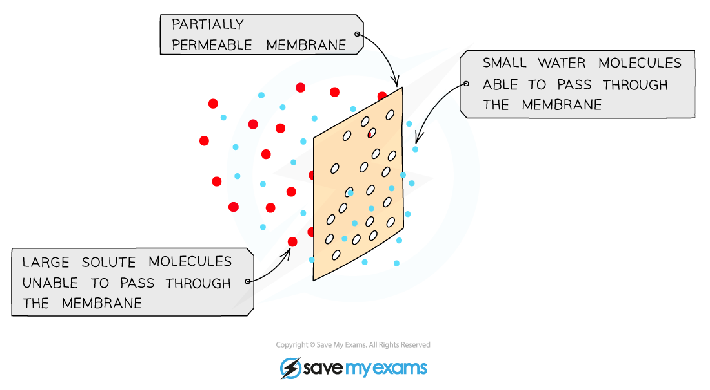
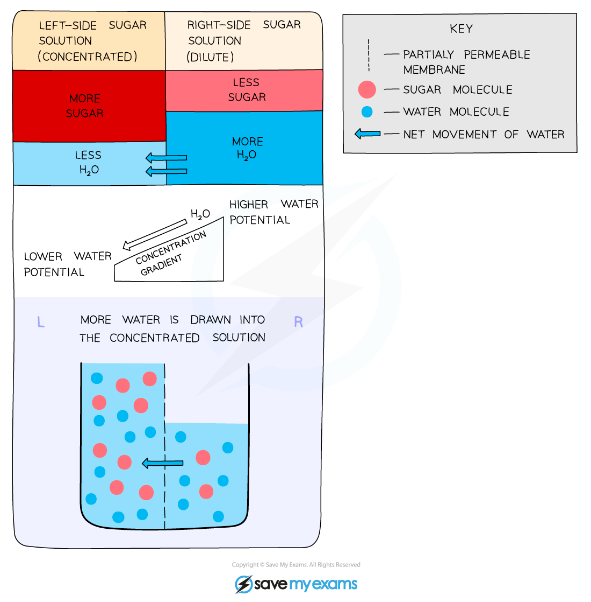
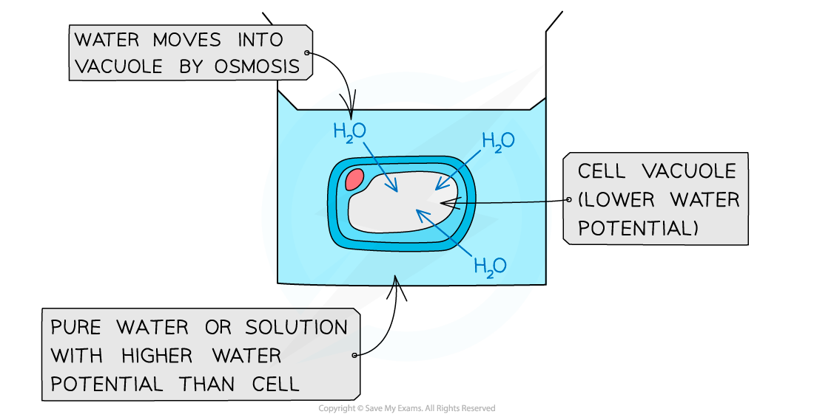
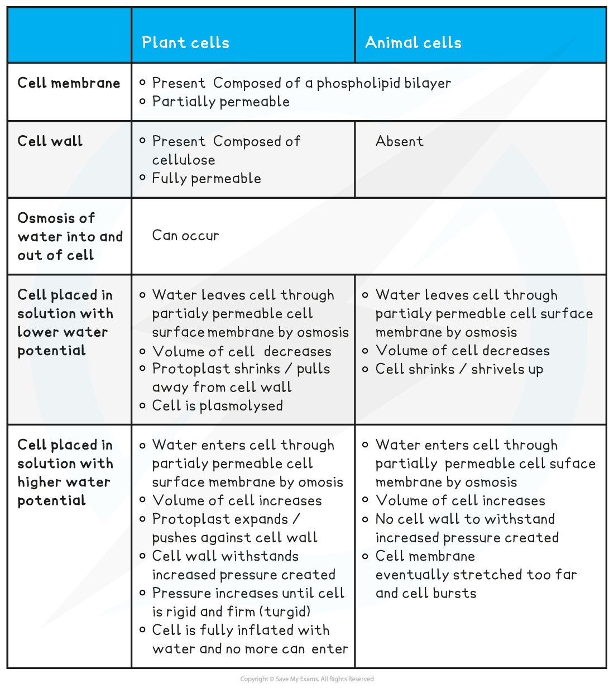

# Osmosis

## Osmosis

> **Spec point** — `spcpt_2FD4MYfbnsDCvqZq`

## Osmosis

- All cells are surrounded by a cell surface membrane which is **partially permeable**
- Water can move in and out of cells across the cell surface membrane by a process called **osmosis**

  - **Osmosis is the net movement of water molecules from a region of higher water potential to a region of lower water potential through a partially permeable membrane**
- **Water potential** is a measure of **the number of free water molecules** present in a solution; higher water potential = more free water molecules

  - Water molecules will move from an area of **more free water molecules** to an area of **fewer free water molecules**
  
    - Water molecules are considered 'free' when they are **not surrounding substances in a solution**; when a substance dissolves it becomes surrounded by water molecules; such water molecules are **no longer free **and **cannot move through a membrane** readily
- During osmosis water is **moving down its concentration gradient**, so it is a specialised form of *diffusion*
- Cell membranes are partially permeable, allowing small molecules like water through but not larger molecules such as solutes

  - Although water molecules are *polar*, they can still pass through the bilayer because of their small size.

***Osmosis is the movement of water molecules from an area of high water potential to an area of low water potential through a partially permeable membrane***

***Osmosis is the movement of water molecules down their concentration gradient. Note that 'water potential' is a term used to describe the number of free water molecules present***

- Osmosis is important because it constantly affects the **cells **of living organisms

  - Cell cytoplasm consists of **water and dissolved substances**, meaning that it has a **water potential** of its own
  - Cells** lose or take on water **depending on the water potential of their surroundings in comparison to their cytoplasm
- When cells are placed in pure water, which has the highest possible water potential, water **moves into the cells by osmosis** and the cells **swell**

  - In animal cells this could lead to cell **bursting**
  - In plant cells the **cell wall prevents bursting**
- When cells are placed into a solution that has a lower water potential than their cytoplasm, e.g. a concentrated glucose solution, water moves **out of the cells by osmosis** and the cells **shrink**

  - In animal cells the entire cell **shrivels**
  - In plant cells the vacuole and cytoplasm shrink but the **cell wall maintains the overall shape of the cell**

***When cells are placed into solution they are affected by osmosis. A cell placed in pure water will take on water as water moves into the cell by osmosis from an area of high water potential to an area of low water potential. In plant cells this causes the cell to swell, but the cell wall prevents the cell from bursting***

**Osmosis in Plant and Animal Cells Table**

