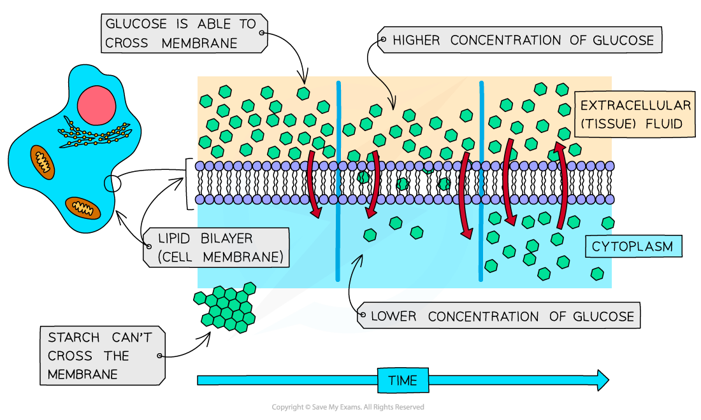
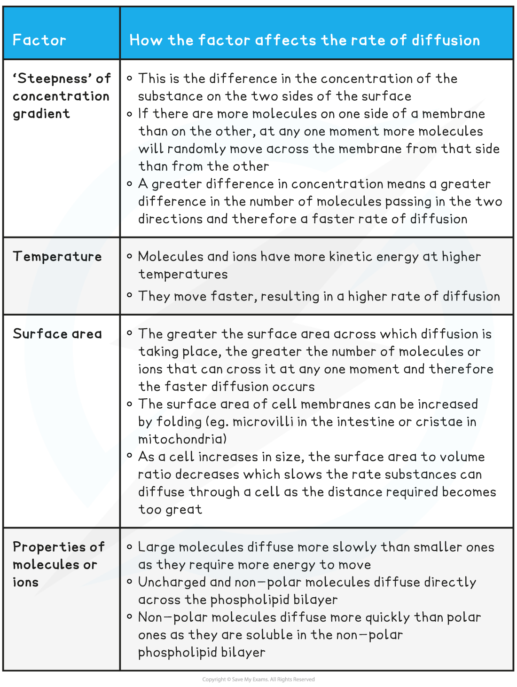
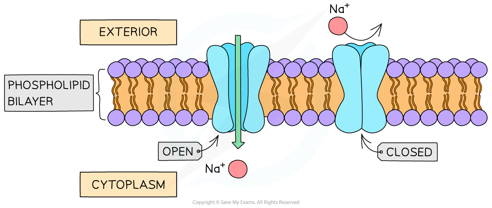
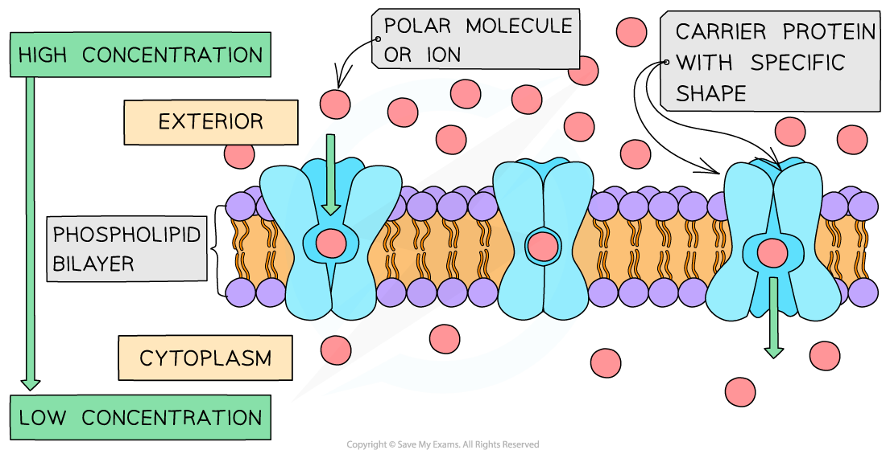
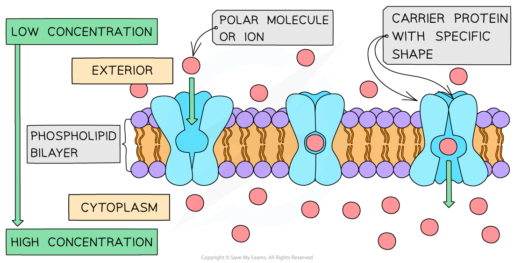
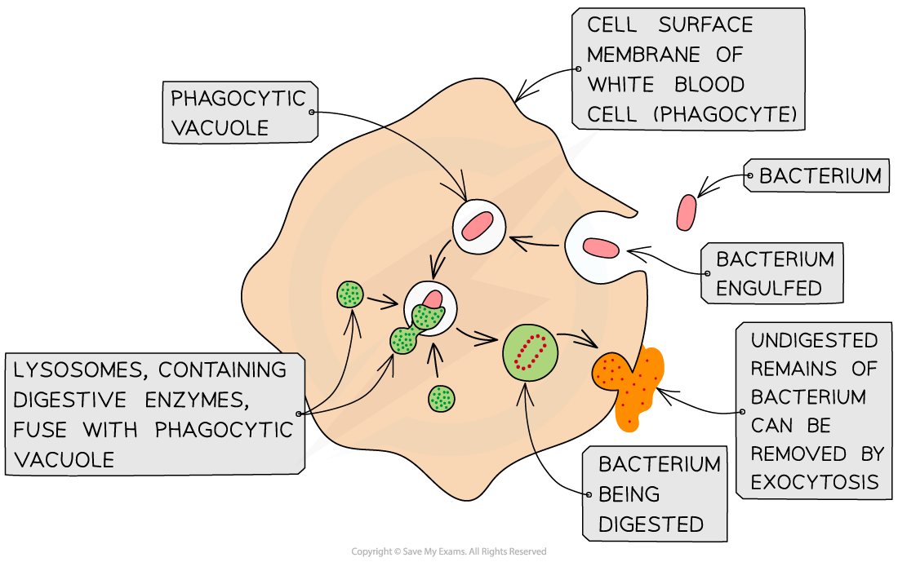
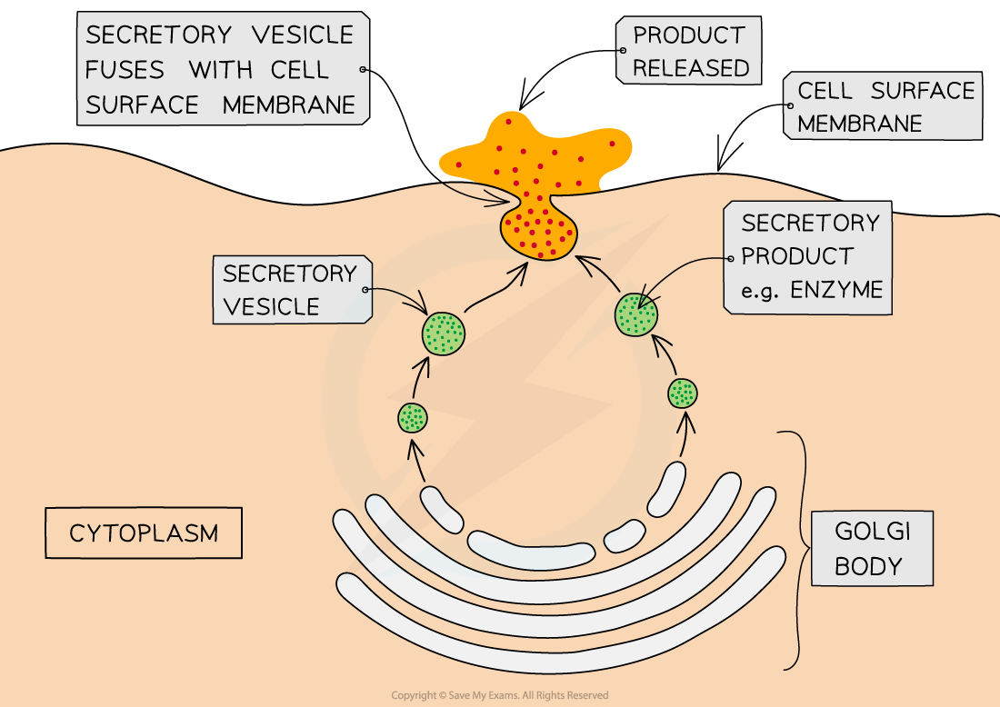

# Diffusion, Facilitated Diffusion & Active Transport

## Diffusion & Facilitated Diffusion

> **Spec point** — `spcpt_Q2SZW7N9x5j57XBw`

## Diffusion & Facilitated Diffusion

- Diffusion is a type of **transport **that can occur **across a cell membrane**

  - Note that diffusion can also happen within a cellular compartment; the presence of a membrane is not essential
- It can be defined as **the net movement of a substance from a region of its higher concentration to a region of its lower concentration**

  - **Net** **movement** refers to the **overall direction of movement**; in reality molecules in a liquid or gas move in all directions, but most molecules move from a high to a low concentration
  
    - The molecules of a liquid or a gas move randomly due to the kinetic energy of the molecules or ions
- The molecules or ions move **down a ***concentration gradient*
- Diffusion is a **passive process** meaning that it does **not require energy** in order to occur

  - Diffusion can be described as **passive transport**
- Diffusion will continue until the concentration of a substance on each side of a membrane has become equal; this is known as **equilibrium**
- Some molecules are able to diffuse directly between the phospholipids of a membrane; this can be described as **simple diffusion**

  - Molecules that can move by simple diffusion tend to be **small** and *non-polar*
  
    - Small molecules can fit between the phospholipids
    - Non-polar molecules are able to interact with the non-polar tails of the phospholipids

***Diffusion can occur across a cell surface membrane. The image above shows the progression of glucose diffusion; on the left of the diagram there is a steep concentration gradient, and by the end of the process on the right of the diagram the glucose concentration has reached equilibrium***

- The **rate** at which a substance diffuses across a membrane depends on **several factors**

  - Concentration gradient
  - Temperature
  - Surface area
  - Properties of substance involved

**Factors Affecting Diffusion Table**

#### Facilitated diffusion

- Some substances cannot diffuse directly through the phospholipid bilayer of cell membranes, e.g.

  - **Large,** *polar* **molecules** such as glucose and amino acids
  - **Ions** such as sodium ions (Na+) and chloride ions (Cl-)
- These substances can only cross the phospholipid bilayer with the help of transport proteins; this form of diffusion is known as **facilitated diffusion**
- There are two types of transport protein that enable facilitated diffusion

  - **Channel proteins**
  - **Carrier proteins**
- They are **highly specific,** meaning that they only allow one type of molecule or ion to pass through

#### Channel proteins

- Channel proteins are **pores** that extend through the membrane **from one side to the other**
- They allow **charged** substances, e.g. ions, to diffuse through the cell membrane
- The diffusion of these ions does not occur freely; most channel proteins are ‘gated’, meaning that part of the channel protein on the inside surface of the membrane can move in order to close or open the pore

  - This allows the channel protein to **control the exchange of ions**

***Channel proteins are pores in the cell membrane; they can open and close***

#### Carrier proteins

- Unlike channel proteins which have a fixed shape, **carrier proteins can switch between two shapes**
- This causes the binding site of the carrier protein to be open to one side of the membrane first, and then open to the other side of the membrane when the carrier protein switches shape
- The direction of movement of molecules diffusing across the membrane **depends on their relative concentration** on each side of the membrane

  - Net diffusion of molecules or ions into or out of a cell via carrier proteins will occur **down a concentration gradient**

***Carrier proteins change shape to transport molecules from one side of a membrane to the other***

> **Exam Hint**
> Remember that the movement of molecules from high concentration to low concentration is **diffusion**. If this movement requires the aid of a protein, for example because the molecule is charged and cannot pass directly through the phospholipid bilayer, this is **facilitated diffusion**.

## Active Transport

> **Spec point** — `spcpt_5q93xyHv4Bcsph7q`

## Active Transport

- Active transport is the **movement of molecules and ions through a cell membrane from a region of lower concentration to a region of higher concentration**

  - Active transport **requires energy** in the form of **ATP **from respiration to move substances **against their** **concentration gradient**; hence this is an **active **process
- Active transport requires **carrier proteins**

  - Each carrier protein is specific to a particular type of molecule or ion
- Energy is required to allow the carrier protein to** change shape**; this transfers the molecules or ions across the cell membrane

  - The **energy required is provided by ATP **(adenosine triphosphate) produced during respiration
  - The ATP is *hydrolysed* to release energy

***Active transport moves substances across a membrane from low to high concentration. Note that ATP is required for carrier proteins to change shape***

- Examples of active transport include

  - **Reabsorption** of useful molecules and ions **into the blood** after filtration into the kidney tubules
  - **Absorption **of some products of digestion from the digestive tract** into the blood**
  - **Loading sugar** from the photosynthesising cells of leaves **into the phloem** tissue for transport around the plant
  - **Loading inorganic ions** from the soil **into root hair cells**

> **Exam Hint**
> Be careful not to get carrier proteins and channel proteins confused when answering questions on active transport. Active transport requires **carrier proteins** (transmembrane transport proteins that undergo conformational change) **not** channel proteins.

## Endocytosis & Exocytosis 

> **Spec point** — `spcpt_yBbKG3ng4YqSf6T6`

## Endocytosis & Exocytosis

#### Endocytosis

- Some molecules are **too large** to travel via membrane proteins, e.g.

  - Proteins
  - Lipids
  - Some carbohydrates
- In such cases a cell can **surround a substance with a section of the cell surface membrane**

  - The membrane **engulfs** the substance and pinches off inside the cell to form a **temporary vacuole** with the ingested substance contained inside
  - This is **endocytosis**
  
    - *Phagocytosis* is an example of endocytosis
- Endocytosis is an **active process **and requires a source of energy

***Phagocytosis is an example of endocytosis; the cell surface membrane extends around a pathogen, engulfing it and enclosing it within a temporary vacuole inside the cell***

#### Exocytosis

- Some substances produced by the cell need to be **secreted**, such as hormones, some enzymes, and lipids
- **Vesicles** containing the substance **pinch off from sacs of the Golgi apparatus **
- These vesicles are moved toward the cell surface and fuse with the cell surface membrane to be released outside the cell

  - This is **exocytosis**
- Exocytosis is an **active process** and requires a source of energy

***Exocytosis allows the bulk secretion of substances from cells***
