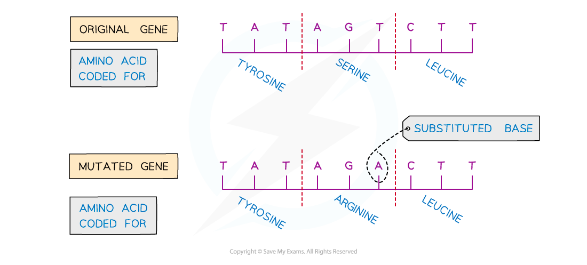
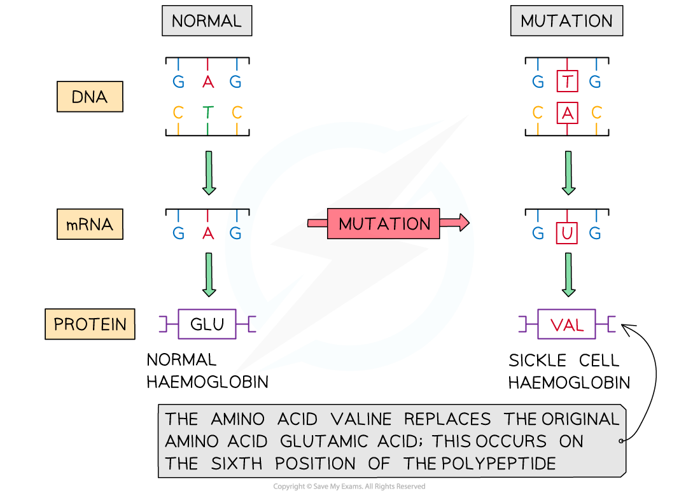

# Mutations

## Nature of Mutations

> **Spec point** — `spcpt_r34X2HmP83FqPC8h`

## Nature of Mutations

- A **gene mutation** is a change in the sequence of bases in a DNA molecule
- Mutations may result in an altered *polypeptide*; as the DNA base sequence of a gene determines the sequence of amino acids that make up a polypeptide, **mutations in a gene can sometimes lead to a change in the polypeptide that the gene codes for**
- Mutations occur **spontaneously during** *DNA replication*
- There are different ways that a mutation in the DNA base sequence can occur, e.g.

  - Substitution
  - Insertion
  - Deletion
- Substitution, insertion, and deletion mutations are all examples of **point mutation**; mutations that involve a change in the DNA base sequence at a** single location**
- Other types of mutation can affect entire genes or entire chromosomes

  - Genes can be replicated or lost
  - Chromosomes can be divided unequally during meiosis, resulting in cells with extra or missing chromosomes

#### Substitution of nucleotides

- A mutation that occurs when **a base in the DNA sequence is randomly swapped for a different base**
- A substitution mutation will **only change the amino acid for the triplet in which the mutation occurs**, and will have no impact on triplets located elsewhere in the gene
- Substitution mutations include

  - **Silent mutations**
  
    - The **mutation does not alter the amino acid sequence** of the polypeptide; this is due to the *degenerate* nature of the genetic code
  - **Missense mutations**
  
    - The **mutation alters a single amino acid** in the polypeptide chain, e.g. sickle cell anaemia is caused by a single substitution mutation changing a single amino acid in the haemoglobin protein
  - **Nonsense mutations**
  
    - The **mutation creates a premature stop codon**, causing the polypeptide chain produced to be incomplete and therefore affecting the final protein structure and function, e.g. cystic fibrosis can be caused by a nonsense mutation
    
      - Note that a **stop codon** provides a signal for the cell to **stop translation** of the mRNA molecule into an amino acid sequence

***Substitution mutations involve swapping one nucleotide for another***

#### Insertion of nucleotides

- A mutation that occurs when **a nucleotide is randomly inserted** into the DNA sequence is known as an insertion mutation
- An insertion mutation **changes the amino acid that would have been coded for by the original base triplet**, as it creates a **new, different** triplet of bases

  - Remember that every group of three bases in a DNA sequence codes for an amino acid
- An insertion mutation also has a **knock-on effect** on other base triplets by **changing the triplets further on in the DNA sequence**

  - This means that insertion mutations cause what is known as a **frameshift mutation; **they don't only change the triplet where the insertion has occurred, but every triplet downstream of the insertion
- This **may dramatically change the amino acid sequence produced** from this gene and therefore the **ability of the polypeptide to function**

***Insertion mutations occur when a new nucleotide is added into a base sequence***

#### Deletion of nucleotides

- A mutation that occurs when **a nucleotide is randomly deleted** from the DNA sequence
- Like an insertion mutation, a deletion mutation **changes the triplet in which the deletion has occurred,** and also **changes every group of three bases further on in the DNA sequence**

  - This is known as a frameshift mutation
- This **may dramatically change the amino acid sequence produced** from this gene and therefore the **ability of the polypeptide to function**

## Effects of Mutations

> **Spec point** — `spcpt_mdm65y7VkXv66d5X`

## Effects of Mutations

- **Most mutations do not alter the polypeptide** or only alter it slightly so that its appearance or function is not changed

  - This is possible because the genetic code is **degenerate**; the base sequence can be changed without necessarily altering the amino acid
- However, a **small number of mutations **code for a** significantly altered polypeptide **

  - A mutation changes the DNA base sequence
  - One or many amino acids in the primary structure of a protein is altered
  - Different bonds form in the secondary and tertiary structures of the protein
  - The final 3D structure of the protein is altered

- Very rarely this can give rise to a protein that **provides an organism with an advantage**, e.g. resistance to an antibiotic, or the ability to digest a new type of food

  - Mutations that provide an advantage can **drive the process of evolution** by causing **natural selection** to occur
  
    - Individuals with an advantage are more likely to survive and reproduce
    - The advantageous mutation is more likely to be passed on
    - The mutation becomes more common in the population

- More often, mutations that affect polypeptide structure are likely to be harmful, **affecting the ability of proteins to perform their function, **e.g.

  - In **cystic fibrosis**, a membrane channel protein no longer functions
  
    - A fault in the CFTR gene leads to production of **non-functional chloride channels,** **reducing** the movement of **water by osmosis** into cell secretions
    - This results in the production of **thick, sticky mucus** in the air passages, the digestive tract and the respiratory system
  - In **sickle-cell disease**, the haemoglobin protein no longer functions
  
    - Sickle-cell disease is caused by a single substitution mutation that causes **haemoglobin proteins to clump together**
    - This affects the **shape of red blood cells**, preventing easy blood flow and causing severe pain and problems with blood supply to important organs

***Sickle cell disease is caused by a single substitution mutation that changes one amino acid in the haemoglobin protein***

- Mutations in the genes that are involved with cell division can lead to **uncontrolled cell division** and the development of **tumours **that can become cancerous
- Mutations that occur in the gametes, or sex cells, can be **passed on to future generations**, meaning that every cell in the body of an organism's offspring will contain the mutation
- **Mutagens** can increase the likelihood of a mutation occurring, e.g.

  - Ionising radiation
  - X-rays
  - Some chemicals
