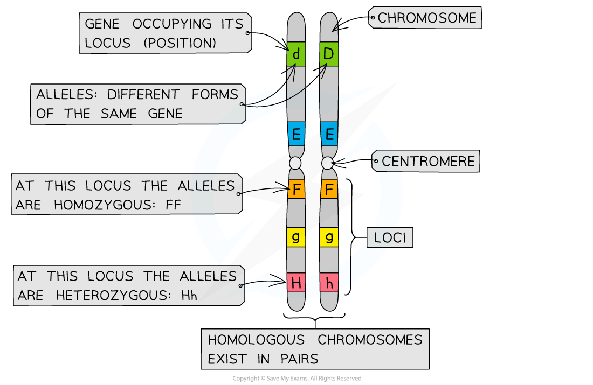
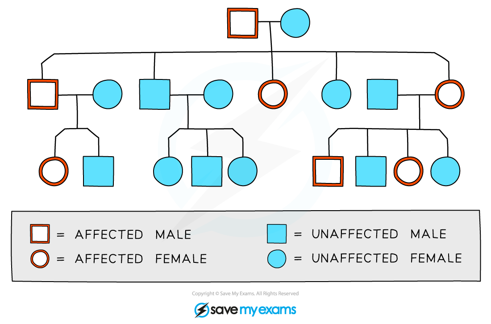

# Patterns of Inheritance & Sex Linkage

## Key Terms: Genetics

> **Spec point** — `spcpt_zyWNYSPyZktXh8bn`

## Key Terms: Genetics

#### Genes & alleles

- A **chromosome** is a long DNA molecule which contains many **genes **
- A **gene** is a length of DNA that codes for a single *polypeptide*

  - The **position of a gene** on a chromosome is its **locus** (plural loci)
- Each gene can exist in two or more **different forms **called **alleles**

  - Different alleles of a gene have slightly **different nucleotide sequences** but they still occupy the **same locus** on the chromosome
  - Different alleles arise by the process of *mutation*
  - E.g. each allele might produce a different coat colour in mammals
  
    - One allele might code for a black coat while the alternative allele might code for a chestnut coat
- When writing about genes it is conventional to use a single letter to represent a gene, while different alleles may be indicated by using upper and lower case letters, e.g. **A** and** a**

#### Homozygous & heterozygous

- Every individual has two copies of each allele; one on each chromosome in a **homologous pair**

  - A homologous pair of chromosomes is a pair of chromosomes that **match in size and shape**, and that contain **the same genes at the same loci**
  
    - The chromosomes may not contain the same alleles of each gene
  - One member of a homologous pair of chromosomes comes from one parent, while the other comes from the other parent
- When an individual has **two identical alleles** at a locus they are said to be **homozygous, **or a **homozygote**

  - Homo = the same
- When an individual has **two different alleles** at a locus they are said to be **heterozygous, **or a **heterozygote**

  - Hetero = different

***Chromosomes match up to form homologous pairs which have the same genes at the same loci. While the genes are the same, the alleles may be different, meaning that individuals can be either homozygous or heterozygous at a particular locus***

#### Genotype & phenotype

- The **genotype** of an organism refers to the **alleles of a gene **possessed by that individual

  - E.g. An organism's genotype could be represented by the letters gg
- The genotype of an individual affects their **phenotype**; a phenotype is the **observable characteristics** of an organism
- E.g. every horse has two copies of a gene for coat colour in all of their cells, one on each homologous pair of chromosomes; the gene could be notated using the letters A and a

  - A horse that has two **A** alleles** **has the **genotype** **AA **and is homozygous
  
    - If the** A** allele codes for a black coat, then the **phenotype** of the horse would be black
  - A horse that has two **a** alleles has the genotype **aa** and is also homozygous
  
    - If the **a** allele codes for a chestnut coat then the phenotype of the horse would be chestnut

#### Dominant & recessive

- Not all alleles affect the phenotype in the same way
- Some alleles are **dominant;** they are **always expressed** in the phenotype no matter which other allele is present

  - This means they are expressed in both heterozygous and homozygous individuals, e.g.
  
    - A horse with the genotype** AA** would be said to be **homozygous dominant **and would have a black coat phenotype
    - A horse with the genotype **Aa** would be said to be **heterozygous **and would still have a black coat phenotype, as the allele for black coat colour is dominant over the lower case allele
    
      - It is possible to refer to a heterozygous individual as a **carrier** of the recessive allele; the allele doesn't show in the phenotype but could still be passed on to offspring
- Others are **recessive;** they are **only expressed** in the phenotype **if no dominant allele** is present

  - This means that it is only expressed when present in a homozygous individual, e.g.
  
    - A horse with the genotype **aa** would be said to be **homozygous recessive** and would have a chestnut coat phenotype due to the absence of the dominant black allele

#### Codominance

- Sometimes** both alleles can be expressed** in the phenotype at the same time; this is known as **codominance**

  - When an individual is heterozygous they will express both alleles in their phenotype
- When writing the genotype for codominance the **gene** is represented by a **capital letter** and the **alleles **are represented by **different superscript letters**, for example **I****A**
- An example of codominance can be seen in **coat colour in cattle**

  - The gene for coat colour can be represented by the capital letter C
  - The alleles for coat colour can be represented by letters R (red) and W (white)
  - A cow that is homozygous and has a red coat has the genotype CRCR
  - A cow that is homozygous and has a white coat has the genotype CWCW
  - A cow that is heterozygous will have a **roan** coat, containing a **mixture of red and white hairs**; the genotype will be CRCW

## Genetic Pedigree Diagrams

> **Spec point** — `spcpt_3bzrnbN3CDj3YqKg`

## Genetic Pedigree Diagrams

- Family pedigree diagrams can be used to trace the **pattern of inheritance** of a specific trait, e.g. a genetic disorder, **through generations of a family**
- Pedigree diagrams can provide information such as

  - Whether a trait is caused by a **dominant or recessive allele**
  - Whether a trait is more likely to be inherited by **males or females**
  - The** genotypes** of individuals in the family
  - The **probability** that an individual in the family will inherit a trait

***Pedigree diagrams can be used to show the pattern of inheritance of a genetic trait***

- **Males** are indicated by the **square shape** and **females** are represented by **circles**
- **Affected **and** unaffected individuals** can be indicated using **colour, shading**, or **cross-hatching**
- **Horizontal lines** between males and females show that they have **produced children**
- **Vertical lines** show the relationship between **parent **and** child**
- Roman numerals may be used to indicate **generations**
- For each generation the eldest child is on the left and **each individual** is **numbered**
- The family pedigree above shows the following

  - Both males and females are affected by the trait in question
  - Every generation has affected individuals
  - The eldest son in the second generation is affected
  - There is one family group that has no affected parents or children
- The diagram above does not contain enough information to show

  - Whether the trait is caused by a dominant or recessive allele
  - The genotypes of the individuals involved

> **Worked Example**
> The pedigree diagram below traces the inheritance of **albinism** through several generations. Albinism affects the production of the **pigment melanin** leading to lighter hair, skin and eyes.
> 
> 
> 
> Using the pedigree chart, deduce and explain the following:
> 
> 1. The type of allele that causes albinism
> 2. The genotype of individuals **9** and **7**
> 3. The possible genotypes of **10** and **11**
> 
> **Answer:**
> 
> **Question 1**
> 
> Albinism is caused by a **recessive allele**
> 
> Person number 9 is an affected individual despite parents 6 and 7 being unaffected; 6 and 7 must both be carriers of the recessive allele and 9 has inherited one recessive allele from each parent
> 
> **Question 2**
> 
> The genotype of person 9 must be **homozygous recessive** (aa) and the genotype of 7 must be **heterozygous** (Aa)
> 
> Person 9 is an affected individual with albinism; as this is determined by the recessive allele they must have two copies of the albinism allele
> 
> Person 7 must be heterozygous as he does not have albinism but has passed on the recessive allele to person 9
> 
> **Question 3**
> 
> The possible genotypes of 10 and 11 are **heterozygous** (Aa) or **homozygous dominant** (AA)
> 
> They are both unaffected individuals so must possess at least one dominant allele (A), however, it is possible that they each might have inherited a recessive allele (a) from one parent (both parents must have a copy of the recessive allele in order for person 9 to have albinism)

> **Exam Hint**
> When answering questions about pedigree charts for genetic diseases, it is always useful to remember which phenotype is caused by the homozygous recessive genotype. You can write these genotypes onto your chart and it will give you a good starting point for working out the possible genotypes of the rest of the individuals in the chart.

## Sex Linkage

> **Spec point** — `spcpt_YjJqPzhBpTTfKwGD`

## Sex Linkage

- Sex-linked genes are located on the sex chromosome
- This means the sex of an individual affects which alleles they pass on to their offspring through their gametes
- If the gene is on the X chromosome, **males** (XY), **will only have one copy** of the gene, whereas **females** (XX) **will have two**

  - The X chromosome has many more genes on it than the Y chromosome, so sex-linkage that involves the Y chromosome is very rare
- Sex linkage is notated using a capital letter to represent the chromosome X or Y and a superscript letter to represent the allele
- There are** three genotypes** for females,** **e.g. for a genetic trait caused by a recessive allele

  - XAXA = unaffected
  - XAXa = carrier
  - XaXa = affected
- **Males** have only **two** **genotypes**, e.g.

  - XAY = unaffected
  - XaY = affected
- It is not possible for males to be **carriers** of X-linked traits, nor for them to **pass such traits on to their sons**; males only pass Y chromosomes on to their sons

> **Worked Example**
> **Red-green colour blindness **is a well known sex-linked trait in which individuals find it difficult to distinguish between the colours red and green. It is controlled by is a gene **found on the X chromosome;** the dominant B allele codes for normal vision and the recessive** **b allele results in red-green colour blindness.
> 
> Use a genetic diagram to show how two parents with normal vision can have offspring with red-green colour blindness.
> 
> **Answer:**
> 
> **Step 1: Work out the genotypes of the parents**
> 
> Both parents have normal vision so each must have a copy of the dominant B allele
> 
> The father only has one copy of the X chromosome, so his genotype must be XBY
> 
> The question tells us that the parents must be able to have a child with colour blindness, so this allele must come from the mother; she must therefore have a copy of the b allele and her genotype must be XBXb
> 
> **Step 2: Work out which gametes the parents can produce**
> 
> The genotype XBY will produce gametes containing either XB or Y
> 
> The genotype XBXb will produce gametes containing either XB or Xb
> 
> **Step 3: Use the gametes to complete a Punnett square and then indicate which offspring will be affected**
> 
> |   | XB | Y |
> |---|---|---|
> | XB | XBXB | XBY |
> | Xb | XB | XbY |
> 
> The individual with genotype XbY will be affected by red-green colour blindness; they only have only copy of the X chromosome and it contains the colour blindness allele

> **Exam Hint**
> Note that in the worked example above the letter B has been chosen to represent colour blindness rather than the letter C. It can often be a good idea to choose letters for which there is a clear difference between the upper and lower case; this avoids losing marks in exams because examiners can't tell the difference between, e.g. C and c, or S and s
