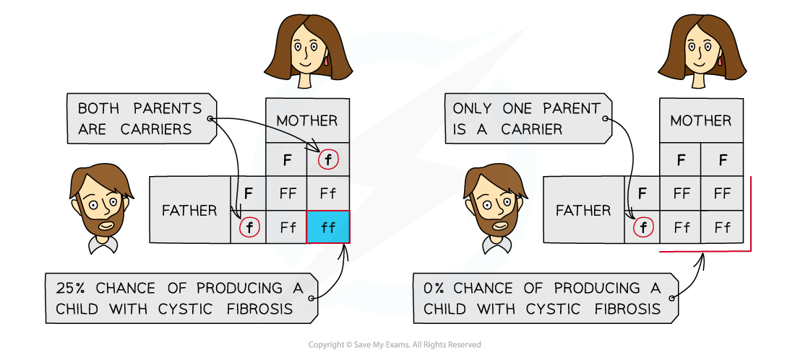

# Cystic Fibrosis

## Cystic Fibrosis

> **Spec point** — `spcpt_JFVGkJKTb5cC5SJJ`

## Cystic Fibrosis

- Genes can affect the *phenotype* of an organism

  - A gene codes for a single polypeptide
  - The polypeptide can affect the phenotype, e.g. it could form part of an enzyme or a membrane transport protein
- **Genetic disorders** are often caused by a mutation in a gene that results in a differently-functioning or non-functioning protein that **alters the phenotype** of the individual

#### Cystic fibrosis

- Cystic fibrosis is a genetic disorder of **cell membranes **caused by a *recessive* allele** **of the **CFTR** (**C**ystic **F**ibrosis **T**ransmembrane Conductance **R**egulator) gene located on chromosome 7

  - This gene codes for the production of chloride ion channels required for secretion of sweat, mucus and digestive juices
  - A mutation in the CFTR gene leads to production of **non-functional chloride channels**
  - This **reduces** the movement of **water by osmosis** into the secretions
  - The result is that the body produces large amounts of **thick, sticky mucus** in the air passages, the digestive tract and the reproductive system
- Because cystic fibrosis is determined by a **recessive allele,** this means

  - People who are *heterozygous* won’t be affected by the disorder but are **carriers**
  - People must be *homozygous*** recessive** in order to have the disorder
  - If **both parents** **are carriers** the chance of them producing a child with cystic fibrosis is 1 in 4, or 25 %
  - If only **one of the parents is a carrier** with the other parent being homozygous dominant, there is no chance of producing a child with cystic fibrosis, as the recessive allele will always be masked by the dominant allele

***Cystic fibrosis is a genetic disorder caused by a recessive allele***

#### The respiratory system

- Mucus in the respiratory system is a necessary part of keeping the lungs healthy

  - It prevents infection by trapping microorganisms
  - This mucus is moved out of the respiratory tract by cilia
- In people with cystic fibrosis, due to the faulty chloride ion channels, the **cilia are unable to move** as the mucus is so thick and sticky
- This means microorganisms are not efficiently removed from the lungs and lung infections occur more frequently
- Mucus builds up in the **lungs** and can block airways which limits gas exchange

  - The **surface area for gas exchange is reduced** which can cause breathing difficulties
- **Physiotherapy** can support people with cystic fibrosis to loosen the mucus in the airways and improve gas exchange

#### The digestive system

- Thick mucus in the digestive system can cause issues because

  - The tube to the **pancreas** can become blocked, preventing digestive enzymes from entering the small intestine
  
    - Digestion of some food may be reduced and therefore **key nutrients may not be made available for absorption**
  - The mucus can cause **cysts** to grow in the pancreas which **inhibit the production of enzymes**, further reducing digestion of key nutrients
  - The** lining of the intestines **is also coated in thick mucus, **inhibiting the absorption of nutrients into the blood**

#### The reproductive system

- Mucus is normally secreted in the reproductive system to prevent infection and regulate the progress of sperm through the reproductive tract after sexual intercourse
- The mucus in people with cystic fibrosis can cause issues in both men and women

  - In **men** the tubes of the testes can become blocked, preventing sperm from reaching the penis
  - In **women** thickened cervical mucus can prevent sperm reaching the oviduct to fertilise an egg
