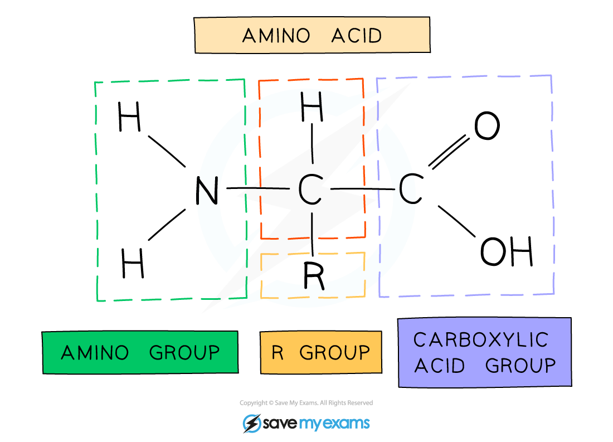
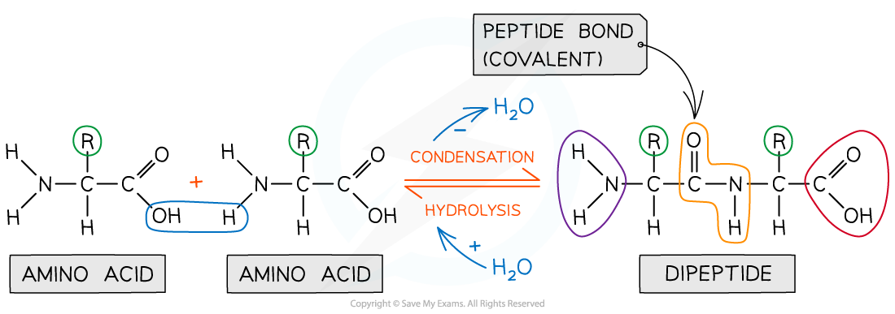
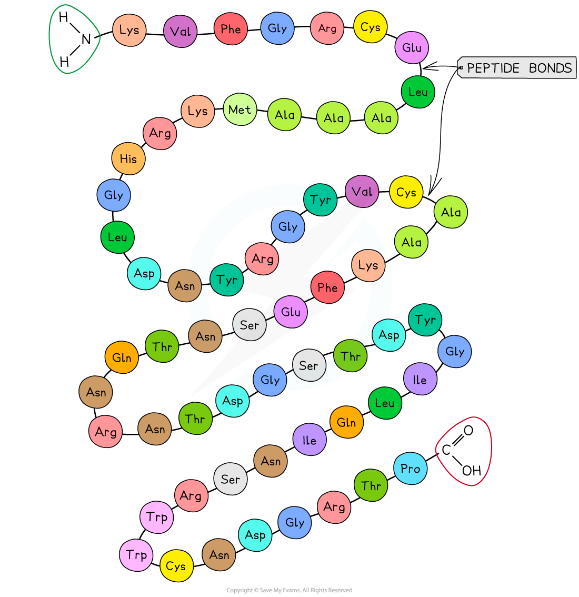
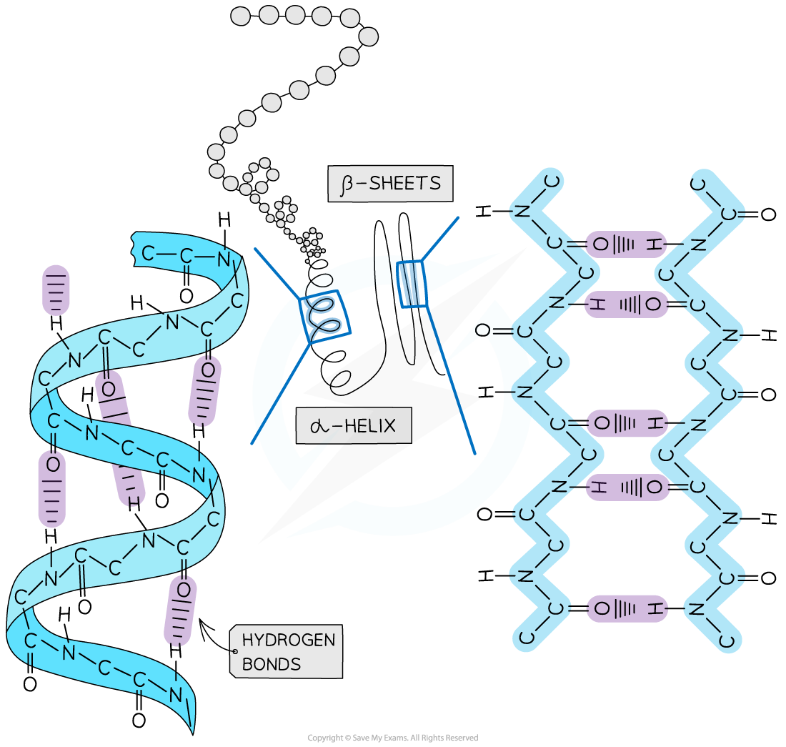
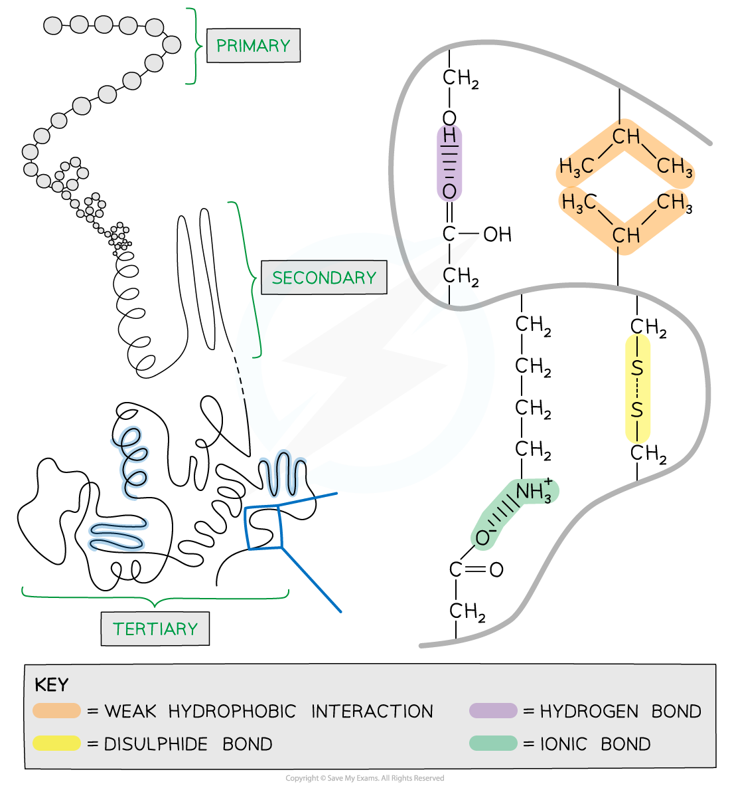
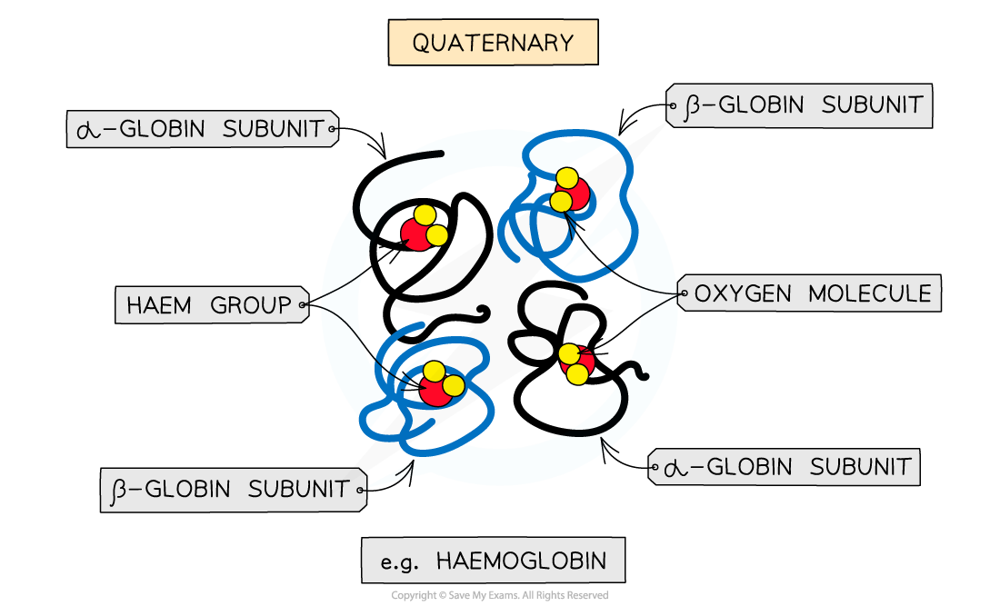
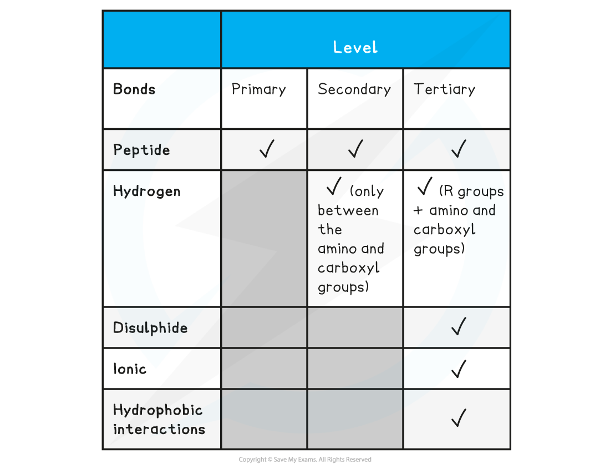
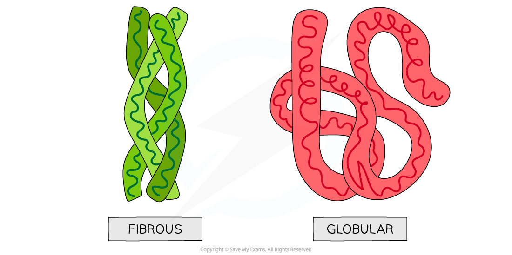
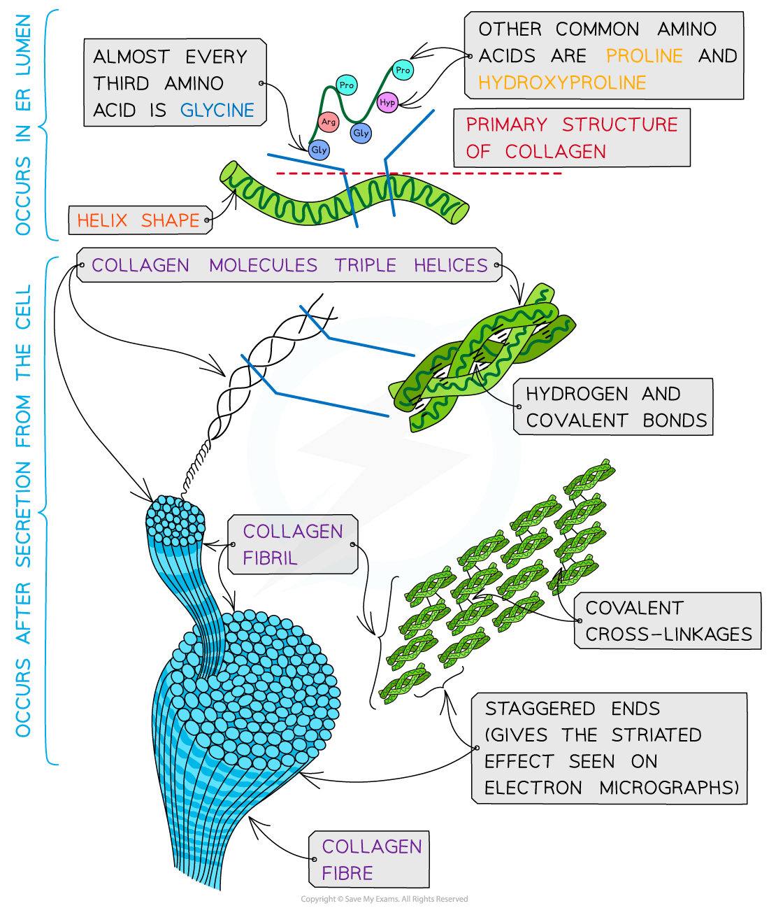
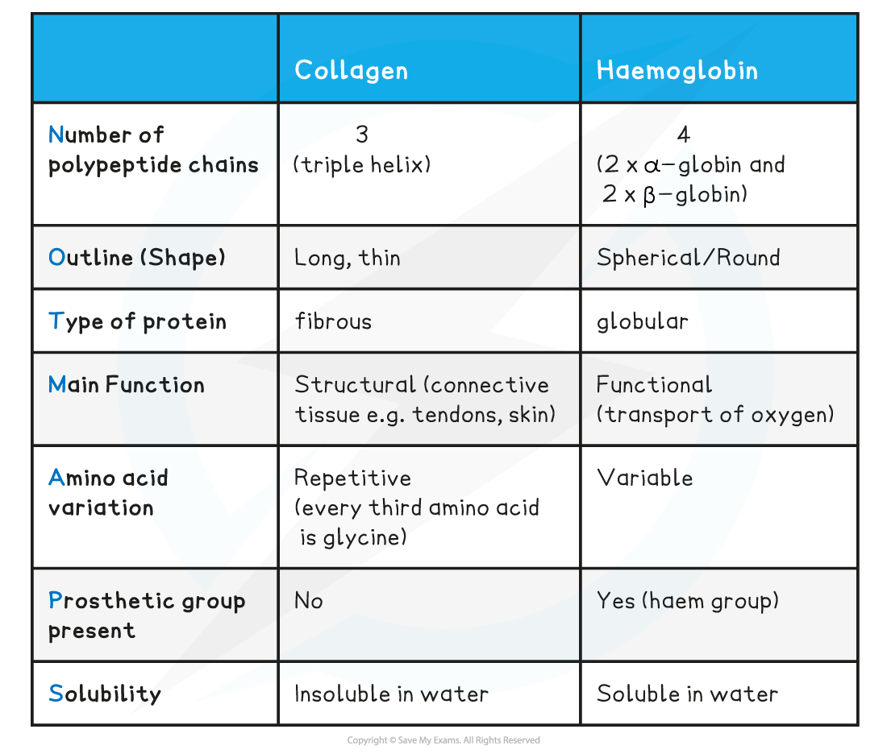

# Amino Acids, Proteins & Protein Structure

## Amino Acids Structure

> **Spec point** — `spcpt_qnYWPg9c9zWGbyrd`

## Amino Acids Structure

#### Proteins

- Proteins are polymers (and macromolecules) made of monomers called **amino acids**
- The sequence, type and number of the amino acids within a protein determines its shape and therefore its function
- Proteins are extremely important in cells because they form all of the following:

  - **Enzymes**
  - Cell membrane proteins (eg. carrier)
  - Hormones
  - Immunoproteins (eg. immunoglobulins)
  - Transport proteins (eg. haemoglobin)
  - Structural proteins (eg. keratin, collagen)
  - Contractile proteins (eg. myosin)

#### Amino acids

- Amino acids are the **monomers** of polypeptides
- There are 20 amino acids found in proteins common to all living organisms
- The general structure of all amino acids is a central carbon atom bonded to:

  - An **amine** (also called amino) group -NH2
  - A **carboxylic acid** group -COOH
  - A **hydrogen** atom
  - An **R** group (which is how each amino acid differs and why amino acid properties differ e.g. whether they are acidic or basic or whether they are polar or non-polar)

***The general structure of an amino acid***

## Polypeptides & Protein Structure

> **Spec point** — `spcpt_nHnnmfbbdDw3df2n`

## Polypeptides & Protein Structure

- Peptide bonds form between amino acids
- Peptide bonds are **covalent bonds** and so involve the sharing of electrons
- In order to form a **peptide bond** :

  - A hydroxyl (-OH) is lost from the carboxylic group of one amino acid
  - A hydrogen atom is lost from the amine group of another amino acid
- The remaining carbon atom (with the double-bonded oxygen) from the first amino acid bonds to the nitrogen atom of the second amino acid
- This is a **condensation** reaction so water is released
- **Dipeptides** are formed by the condensation of **two** amino acids
- **Polypeptides** are formed by the condensation of **many** (3 or more) amino acids
- A protein may have only one polypeptide chain or it may have multiple chains interacting with each other
- During **hydrolysis** reactions, the addition of water **breaks the peptide bonds **resulting in polypeptides being broken down to amino acids

***Peptide bonds are formed by condensation reactions (releasing a molecule of water) and broken by hydrolysis reactions (adding a molecule of water)***

> **Exam Hint**
> When asked to identify the location of the peptide bond, look for where nitrogen is bonded to a carbon which has a double bond with an oxygen atom, note the R group is not involved in the formation of a peptide bond.
> 
> Structures of specific amino acids are not required.

## Primary, Secondary & 3-D Structure of Proteins

> **Spec point** — `spcpt_PBhDHX3Pn2MZHynz`

## Primary, Secondary & 3-D Structure of Proteins

- There are **four** levels of structure in proteins

  - Three are related to a single polypeptide chain
  - The fourth level relates to a protein that has two or more polypeptide chains
- Polypeptide or protein molecules can have anywhere from 3 amino acids (Glutathione) to more than 34,000 amino acids (Titin) bonded together in chains

#### Primary structure

- The sequence of amino acids bonded by covalent peptide bonds is the **primary structure** of a protein
- **The DNA** of a cell **determines** the primary structure of a protein by instructing the cell to add certain amino acids in specific quantities in a certain sequence. This affects the shape and therefore the function of the protein
- The primary structure is **specific** for each protein (one alteration in the sequence of amino acids can affect the function of the protein)

***An example of the primary structure of proteins showing the three-letter abbreviation of specific amino acids***

#### Secondary structure

- The **secondary structure** of a protein occurs when the weak negatively charged nitrogen and oxygen atoms interact with the weak positively charged hydrogen atoms to form **hydrogen bonds**
- There are two shapes that can form within proteins due to the hydrogen bonds:

  - **α-helix**
  - **β-pleated sheet**
- The **α-helix** shape occurs when the hydrogen bonds form between every **fourth** peptide bond (between the oxygen of the carboxyl group and the hydrogen of the amine group)
- The **β-pleated sheet **shape forms when the protein folds so that **two parts of the polypeptide chain** are **parallel** to each other enabling hydrogen bonds to form between parallel peptide bonds
- Most **fibrous** proteins have secondary structures (e.g. collagen and keratin)
- The **secondary structure** **only** relates to **hydrogen bonds** forming between the **amino group **and the **carboxyl group** (the ‘protein backbone’)
- The hydrogen bonds can be broken by high temperatures and pH changes

***The secondary structure of a protein with the α-helix and β-pleated sheet shapes highlighted. The magnified regions illustrate how the hydrogen bonds form between the peptide bonds***

#### Tertiary structure

- Further conformational change of the secondary structure leads to additional** bonds forming between the R groups **(side chains)
- The additional bonds are:

  - **Hydrogen **(these are between R groups)
  - **Disulphide **(only occurs between cysteine amino acids)
  - **Ionic** (occurs between charged R groups)
  - Weak **hydrophobic interactions** (between non-polar R groups)
- This structure is common in **3D** **globular** proteins

***The 3D tertiary structure of proteins with hydrogen bonds, ionic bonds, disulphide bonds and hydrophobic interactions formed between the R groups of the amino acids***

#### Quaternary structure

- Occurs in proteins that have **more than one** polypeptide chain working together as a functional macromolecule, for example, haemoglobin
- The same bonds responsible for maintaining the tertiary structure of a protein will also be involved in forming the quaternary structure
- Each polypeptide chain in the quaternary structure is referred to as a **subunit** of the protein

***The quaternary structure of a protein. This is an example of haemoglobin which contains four subunits (polypeptide chains) working together to carry oxygen***

**Summary of Bonds in Proteins Table**

> **Exam Hint**
> Familiarise yourself with the difference between the four structural levels found in proteins, noting which bonds are found at which level. Remember that the hydrogen bonds in tertiary structures are between the R groups whereas in secondary structures the hydrogen bonds form between the amino and carboxyl groups.

## Globular & Fibrous Proteins

> **Spec point** — `spcpt_cD4ShQ8cHCjGWG5Z`

## Globular & Fibrous Proteins

#### Globular proteins: Structure

- **Globular proteins **are

  - **Compact**
  - Roughly **spherical** (circular) in shape
- Globular proteins form a spherical shape when folding into their tertiary structure because:

  - Their **non-polar hydrophobic R groups** are orientated towards the **centre** of the protein away from the aqueous surroundings
  - Their **polar hydrophilic R groups** orientate themselves on the **outside** of the protein
- The folding of the protein due to the interactions between the R groups results in globular proteins having **specific shapes**
- Some globular proteins are ***conjugated protein*** that contain a ***prosthetic group***

#### Globular proteins: Function

- The orientation of their R groups enables globular proteins to be (generally) **soluble** in water as the water molecules can surround the **polar hydrophilic R groups**
- The **solubility** of globular proteins in water means they play important **physiological** roles as they can be easily **transported** around organisms and be involved in **metabolic reactions**

  - For example, **enzymes** can catalyse specific reactions and **immunoglobulins** can respond to specific antigens

#### Haemoglobin

- Haemoglobin is a **globular** protein which is an oxygen-carrying pigment found in vast quantities in red blood cells
- It has a **quaternary** structure as there are **four polypeptide chains**

  - These chains or subunits are **globin** proteins (two **α–globins** and two **β–globins**) and each subunit has a prosthetic **haem** group
- The **four globin subunits** are held together by **disulphide bonds**

  - Their **hydrophobic R groups** are facing **inwards** (helping preserve the **three-dimensional spherical shape**)
  - Their **hydrophilic R groups** are facing **outwards** (helping maintain its **solubility**)
- The arrangements of the R groups is important to the functioning of haemoglobin
- If changes occur to the sequence of amino acids in the subunits this can result in the properties of haemoglobin changing

  - This is what happens to cause **sickle cell anaemia **(where base substitution results in the amino acid valine (non-polar) replacing glutamic acid (polar) making haemoglobin less soluble)
- The prosthetic **haem** group contains an **iron** II ion (Fe2+) which is able to **reversibly** combine with an **oxygen** molecule forming **oxyhaemoglobin** and results in the haemoglobin appearing bright red
- Each **haemoglobin** with the four haem groups can therefore **carry** **four oxygen** **molecules** (eight oxygen atoms)

***The molecular structure of haemoglobin showing the α-globin and β-globin subunits, the prosthetic haem group with oxygen molecules bonded to form oxyhaemoglobin***

- Haemoglobin is responsible for binding oxygen in the lungs and **transporting **the** oxygen **to tissue to be used in aerobic metabolic pathways
- As **oxygen is not very soluble** in water and haemoglobin is, oxygen can be carried more efficiently around the body when bound to the haemoglobin
- The **presence** of the **haem group** (and Fe2+) enables small molecules like oxygen to be bound more easily because as each **oxygen molecule** binds, it **alters** the **quaternary structure** (due to alterations in the tertiary structure) of the protein which causes haemoglobin to have a higher affinity for the subsequent oxygen molecules and they bind more easily
- The **existence** of the iron II ion (**Fe****2+**) in the prosthetic haem group also allows **oxygen** to **reversibly bind** as none of the amino acids that make up the polypeptide chains in haemoglobin are well suited to binding with oxygen

#### Fibrous proteins: Structure

- **Fibrous proteins **are long strands of polypeptide chains that have cross-linkages due to hydrogen bonds
- These proteins have little or no tertiary structure
- Fibrous proteins have a limited number of amino acids with the sequence usually being highly repetitive
- The highly repetitive sequence creates **very organised structures**

#### Fibrous proteins: Function

- Due to a large number of **hydrophobic R groups**, fibrous proteins are **insoluble** in water
- Fibrous proteins are **strong** and this, along with their insolubility property, makes fibrous proteins very suitable for **structural roles**
- Examples of fibrous proteins:

  - **Keratin** makes up hair, nails, horns and feathers (it is a very tough fibrous protein)
  - **Elastin** is found in connective tissue, tendons, skin and bone (it can stretch and then return to its original shape)
  - **Collagen** is a connective tissue found in skin, tendons and ligaments

***Globular and fibrous protein models illustrating the spherical shape of globular proteins and the long, stranded shape of fibrous proteins***

#### Collagen

- **Collagen** is the most common **structural** protein found in **vertebrates**
- It provides structural **support**
- In vertebrates it is the component of **connective tissue** which forms:

  - Tendons
  - Cartilage
  - Ligaments
  - Bones
  - Teeth
  - Skin
  - Walls of blood vessels
  - Cornea of the eye
- Collagen is an **insoluble** **fibrous** protein

#### Structure of collagen

- Collagen is formed from **three polypeptide chains** closely held together by **hydrogen bonds** to form a **triple helix** (known as tropocollagen)
- Each polypeptide chain is a **helix shape** (but not α-helix as the chain is not as tightly wound) and contains about 1000 amino acids with glycine, proline and hydroxyproline being the most common
- In the primary structure of collagen almost **every third** amino acid is **glycine**

  - This is the smallest amino acid with a R group that contains a **single hydrogen atom**
  - Glycine tends to be found on the inside of the polypeptide chains allowing the three chains to be arranged closely together forming a **tight triple helix** structure
- Along with hydrogen bonds forming between the three chains there are also **covalent bonds** present

  - Covalent bonds also form **cross-links** between R groups of amino acids in interacting **triple helices** when they are arranged parallel to each other
  - The cross-links hold the collagen molecules together to form **fibrils**
- The collagen molecules are positioned in the **fibrils** so that there are **staggered ends** (this gives the striated effect seen in electron micrographs)
- When many fibrils are arranged together they form collagen **fibres**
- Collagen fibres are positioned so that they are lined up with the forces they are withstanding

***Collagen is a fibrous structural protein that is formed by triple helices. Collagen molecules arrange into collagen fibrils and finally into collagen fibres which have high tensile strength***

#### Function of collagen

- Collagen is a flexible** structural** protein forming **connective tissues**
- The presence of the **many hydrogen bonds** within the **triple helix structure** of collagen results in **great tensile strength**. This enables collagen to be able to withstand large pulling forces without stretching or breaking
- The **staggered ends** of the collagen molecules within the **fibrils** provide **strength**
- Collagen is a **stable** protein due to the high proportion of proline and hydroxyproline amino acids present. These amino acids increase stability as their R groups repel each other
- The length of collagen molecules means they take too long to dissolve in water (making it insoluble in water)

**Comparison of Collagen & Haemoglobin Table**

