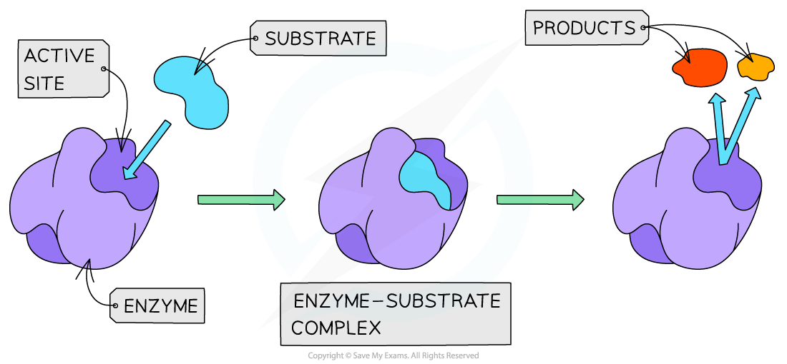
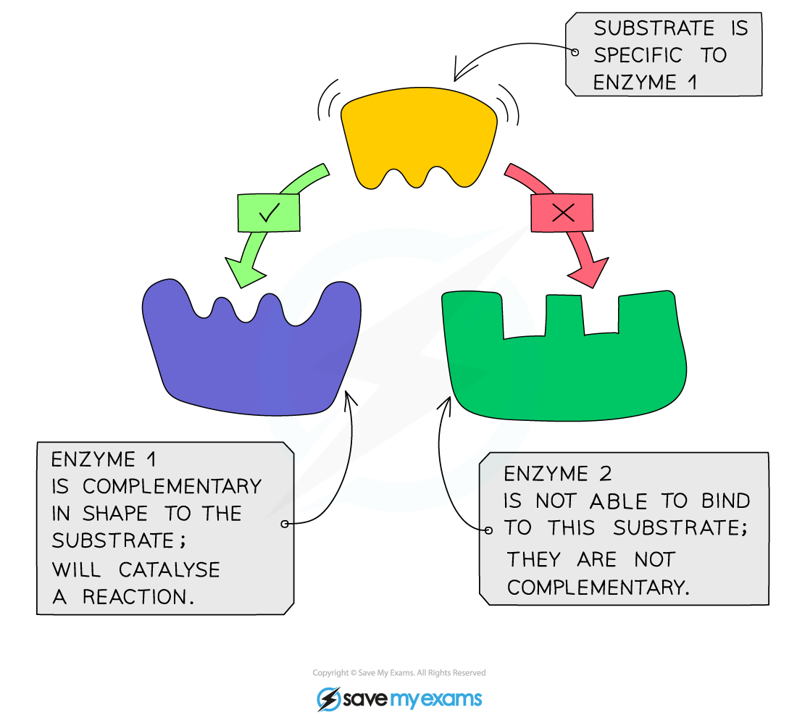
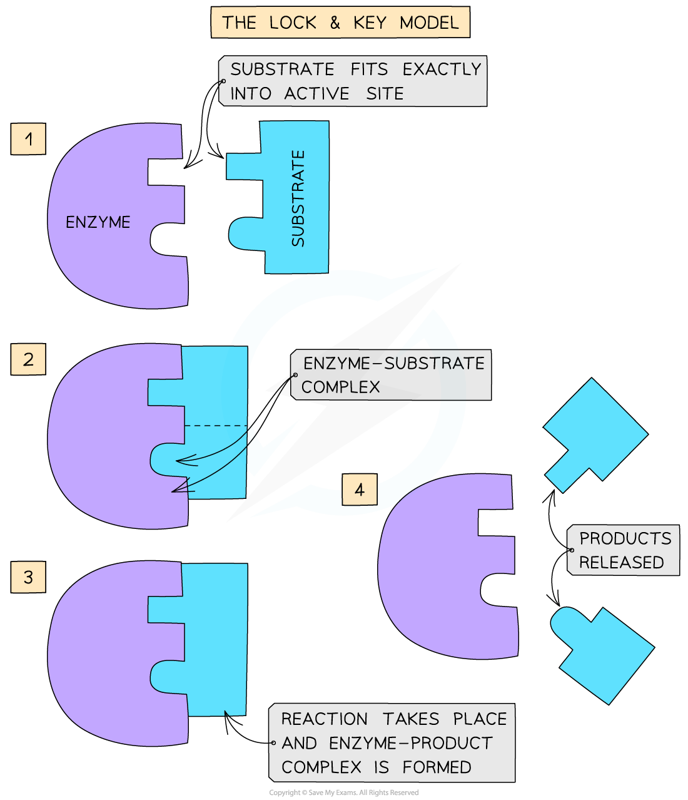
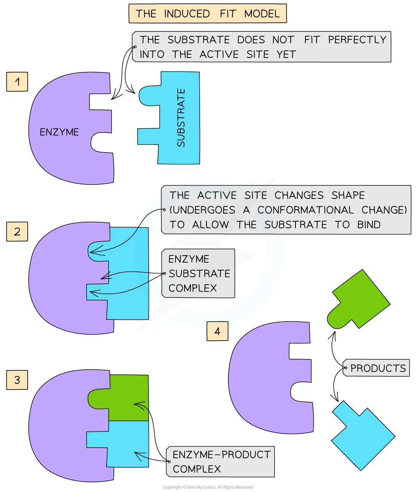
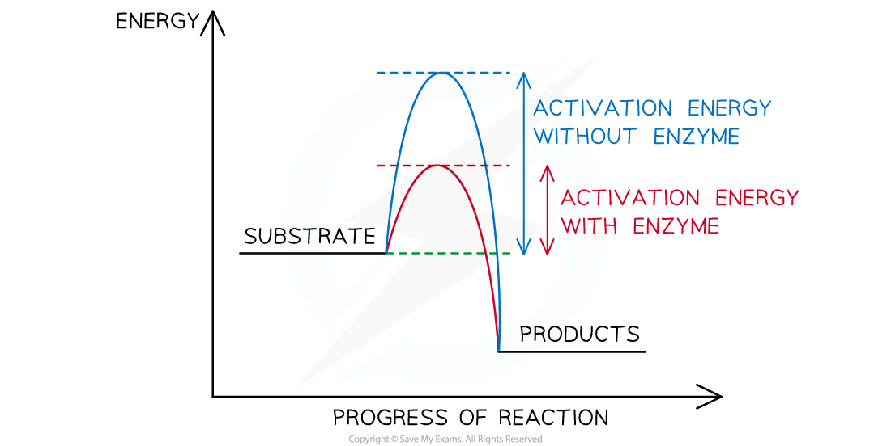
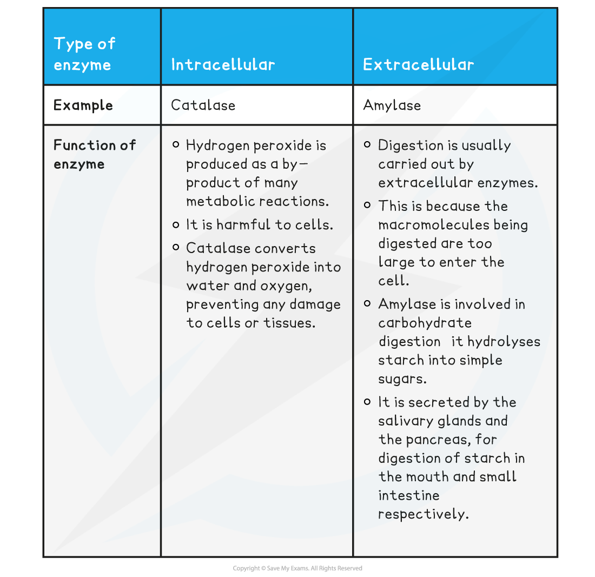

# Enzymes: Roles & Modes of Action

## 3-D Structure & Enzyme Function

> **Spec point** — `spcpt_FN8SJtSxqKJyRzkS`

## 3-D Structure & Enzyme Function

- Enzymes are **globular proteins**
- This means their **3D shape** (as well as the shape of the **active site** of an enzyme) is determined by the complex tertiary structure of the protein that makes up the enzyme and is therefore **highly specific**
- Enzymes have a unique **active site** where **specific substrates bind **forming an **enzyme-substrate complex**
- The **active site** of an enzyme has a **specific shape** to fit a **specific substrate**
- Extremes of **heat** or **pH** can alter the protein structure and **change the shape** of the active site, **preventing** substrate binding – this is called **denaturation**
- Substrates **collide** with the enzymes active site and this must happen at the **correct orientation and speed** in order for a reaction to occur

***The active site of an enzyme has a specific shape to fit a specific substrate (when the substrate binds an enzyme-substrate complex is formed)***

#### Enzyme specificity

- The **specificity** of an enzyme is a result of the **complementary nature** between the **shape** of the **active site** on the enzyme and its **substrate**(s)
- Only **one specific substrate will fit into one specific active site**
- The shape of the active site (and therefore the specificity of the enzyme) is determined by the **complex tertiary structure** of the **protein** that makes up the enzyme:

  - Proteins are formed from chains of amino acids held together by peptide bonds
  - The order of amino acids determines the shape of an enzyme
  - If the order is altered, the resulting three-dimensional shape changes
- If the **tertiary structure of the protein is altered** in any way, the shape of the **active site will change **and the substrate will no longer fit the active site
- This means that an enzyme-substrate complex will not be able to form and the product(s) will not be produced: **the enzyme will not be able to carry out its function**

***An example of enzyme specificity***

#### The lock-and-key hypothesis

- In the 1890’s the first model of enzyme activity was described by Emil Fischer:

  - He suggested that both enzymes and substrates were **rigid structures** that **locked** into each other very **precisely**, much like a key going into a lock
  - This is known as the ‘**lock-and-key hypothesis**’

***The Lock and Key hypothesis***

#### The induced-fit hypothesis

- The lock-and-key model was later **modified** and adapted to our current understanding of enzyme activity, permitted by advances in techniques in the molecular sciences
- The **modified** **model** of enzyme activity (first proposed in 1959) is known as the ‘**induced-fit hypothesis**’
- Although it is very similar to the lock and key hypothesis, in this model the enzyme and substrate **interact** with each other:

  - The enzyme and its active site (and sometimes the substrate) can **change shape** slightly as the substrate molecule enters the enzyme
  - These changes in shape are known as **conformational changes**
  - The conformational changes ensure an **ideal binding arrangement** between the enzyme and substrate is achieved
  - This **maximises the ability of the enzyme to catalyse the reaction**

***The Induced Fit model of enzyme action***

## Enzymes are Catalysts

> **Spec point** — `spcpt_zjp4WpZJzcBBfK72`

## Enzymes are Catalysts

- Enzymes are **biological catalysts**

  - ‘Biological’ because they function in **living systems**
  - ‘Catalysts’ because they **speed up the rate of chemical reactions** without being **used up** or undergoing **permanent change**
  - They speed up reactions by **reducing the** ***activation energy*** of reactions

#### Enzymes and the lowering of activation energy

- All chemical reactions are associated with **energy changes**
- For a reaction to proceed there must be enough **activation energy**
- Activation energy is the **amount of energy needed** by the substrate to become just **unstable** enough for a **reaction to occur** and for **products to be formed**

  - Enzymes speed up chemical reactions because they reduce the **stability** of **bonds** in the reactants
  - The **destabilisation of bonds** in the substrate makes it **more reactive**
- Rather than lowering the overall energy change of the reaction, enzymes work by providing an **alternative energy pathway **with a **lower activation energy**
- Without enzymes, **extremely high temperatures** or **pressures** would be needed to reach the activation energy for many biological reactions

  - Enzymes avoid the need for these **extreme conditions** (that would otherwise **kill cells**)

***The activation energy of a chemical reaction is lowered by the presence of a catalyst (i.e. an enzyme)***

> **Exam Hint**
> Don't forget that enzymes are proteins and so anything that could denature a protein, rendering it non-operational (extremes of heat, temperature, pH etc.) would also denature an enzyme.

## Locations of Enzyme Reactions

> **Spec point** — `spcpt_7B7PwfVw2xnqWFKs`

## Locations of Enzyme Reactions

- Enzymes are **globular proteins** with **complex tertiary structures**

  - Some are formed from a single polypeptide, whilst others are made up of two or more polypeptides and therefore have a **quaternary structure**
- **Metabolic pathways** are controlled by enzymes in a biochemical cascade of reactions

  - Metabolism is a combination of **anabolic** and **catabolic** reactions
  
    - **New molecules** are **built up** during anabolic reactions
    - Large, complex molecules are **broken down** into smaller, simpler ones during catabolic reactions
  - Virtually every metabolic reaction within living organisms is catalysed by an enzyme
  - Enzymes are therefore essential for life to exist
- All enzymes are **proteins** that are produced via the process of protein synthesis **inside cells**
- Some enzymes **remain** **inside** cells, whilst others are **secreted** to work **outside** of cells
- Enzymes can be **intracellular** or **extracellular** referring to whether they are active inside or outside the cell respectively

  - **Intracellular** enzymes are **produced** and **function** **inside the cell**
  - **Extracellular** enzymes are **secreted** by cells and catalyse reactions **outside** cells (eg. digestive enzymes in the gut)

**Intracellular & Extracellular Enzymes Table**

