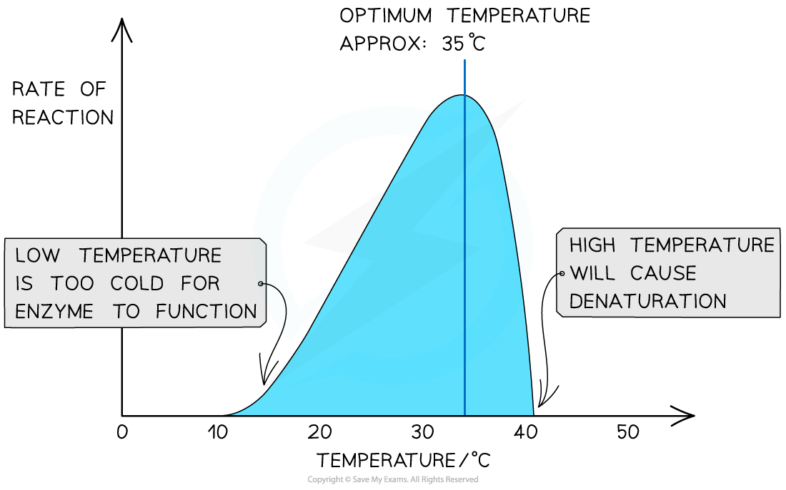
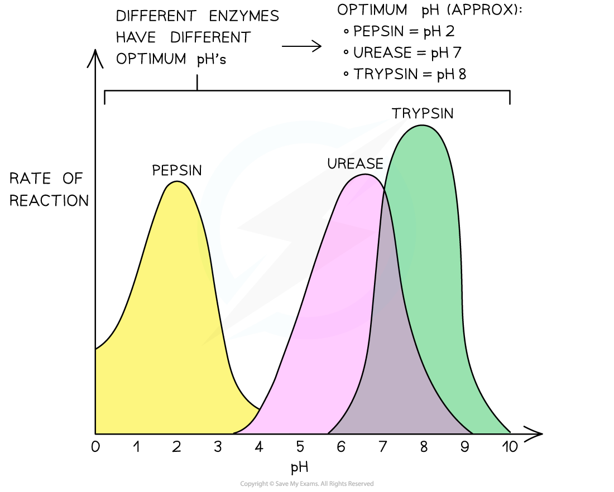
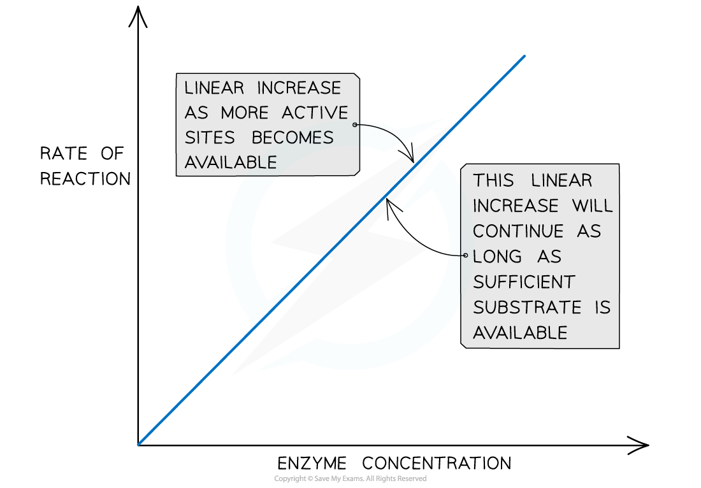
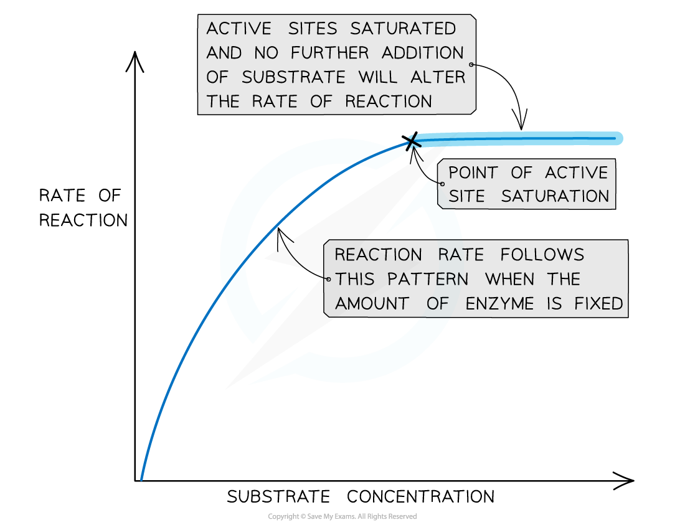
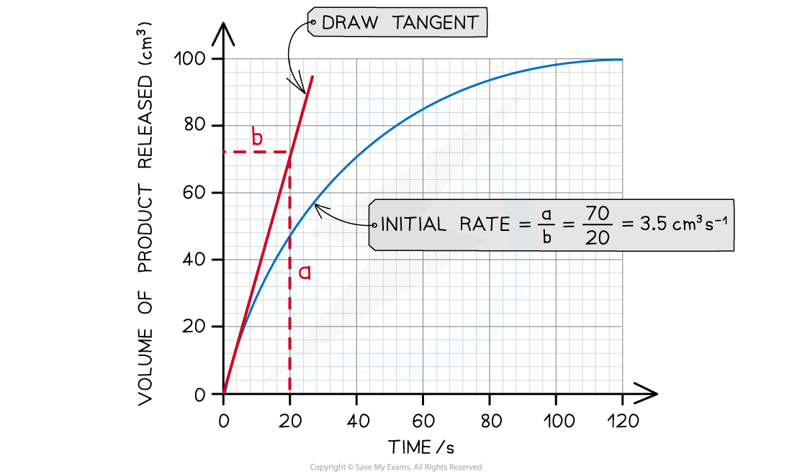
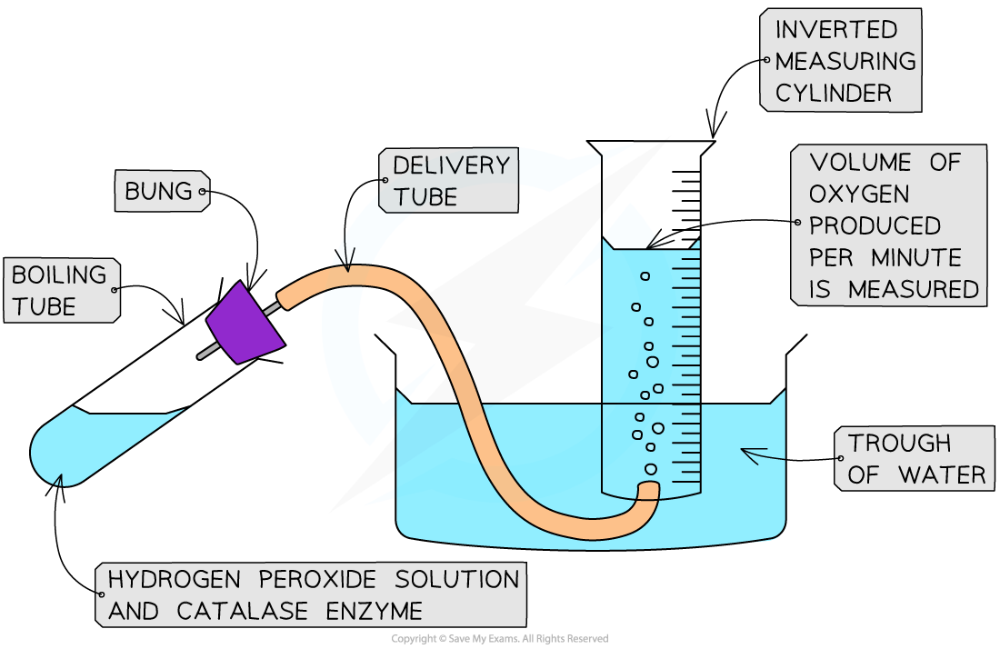
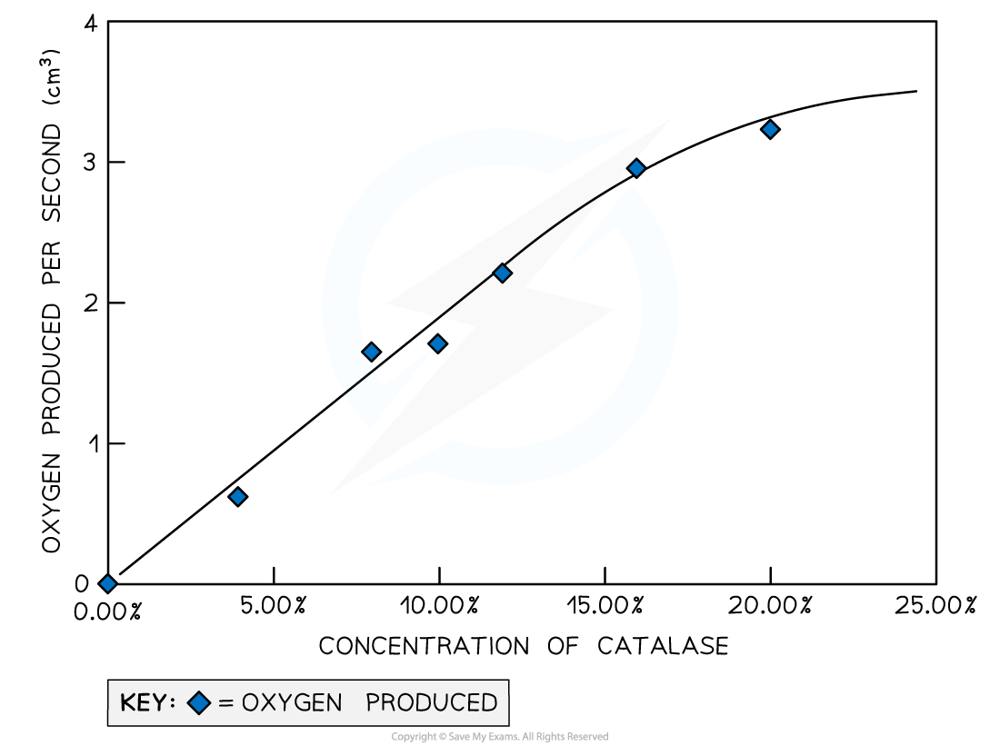

# Core Practical 4: Investigating the Rate of Enzyme Reactions

## Investigating the Rate of Enzyme Reactions

> **Spec point** — `spcpt_KXKDb2z5TvjtwgQ6`

## Investigating the Rate of Enzyme Reactions

#### Temperature

- Enzymes have a **specific optimum temperature** – the temperature at which they catalyse a reaction at the **maximum rate**
- **Lower temperatures** either **prevent** reactions from proceeding or **slow them down**:

  - Molecules move relatively **slow**
  - **Lower frequency of successful collisions** between substrate molecules and active site of enzyme
  - Less frequent enzyme-substrate complex formation
  - Substrate and enzyme collide with **less energy**, making it less likely for bonds to be formed or broken (stopping the reaction from occurring)

- **Higher temperatures speed up reactions**:

  - Molecules move more **quickly**
  - **Higher frequency successful collisions** between substrate molecules and active site of enzyme
  - More frequent enzyme-substrate complex formation
  - Substrate and enzyme collide with **more energy**, making it more likely for bonds to be formed or broken (allowing the reaction to occur)

- However, as temperatures continue to increase, the rate at which an enzyme catalyses a reaction **drops sharply**, as the enzyme begins to **denature**:

  - **Bonds** (eg. hydrogen bonds) holding the enzyme molecule in its precise shape start to **break**
  - This causes the **tertiary structure** of the protein (ie. the enzyme) to **change**
  - This permanently **damages** the **active site**, preventing the **substrate** from **binding**
  - **Denaturation** has occurred if the substrate can no longer bind
  - Very few human enzymes can function at temperatures above 50°C
  
    - This is because humans maintain a body temperature of about 37°C, therefore even temperatures exceeding 40°C will cause the denaturation of enzymes
    - High temperatures causes the hydrogen bonds between amino acids to break, changing the conformation of the enzyme

***The effect of temperature on the rate of an enzyme-catalysed reaction***

> **Exam Hint**
> When answering questions about reaction rates for enzyme-catalysed reactions, make sure to explain how the temperature affects the speed at which the molecules (enzymes and substrates) are moving and how this, in turn, affects the number of successful collisions.

#### pH

- All enzymes have an **optimum pH** or a pH at which they operate best
- Enzymes are **denatured** at extremes of pH

  - **Hydrogen** **and ionic bonds** hold the tertiary structure of the protein (ie. the enzyme) together
  - Below and above the optimum pH of an enzyme, solutions with an excess of H+ ions (acidic solutions) and OH- ions (alkaline solutions) can cause these **bonds** to **break**
  - This **alters the shape of the active site**, which means enzyme-substrate complexes form less easily
  - Eventually, enzyme-substrate complexes can no longer form at all
  - At this point, **complete denaturation** of the enzyme has occurred
- Where an enzyme functions can be an indicator of its optimal environment:

  - Eg.** pepsin** is found in the stomach, an acidic environment at pH 2 (due to the presence of **hydrochloric acid** in the stomach’s gastric juice)
  - Pepsin’s optimum pH, not surprisingly, is pH 2

***The effect of pH on the rate of an enzyme-catalysed reaction for three different enzymes (each with a different optimum pH)***

- When investigating the effect of pH on the rate of an enzyme-catalysed reaction, you can use **buffer solutions** to measure the rate of reaction at** different pH values**:

  - Buffer solutions each have a **specific pH**
  - Buffer solutions **maintain** this specific pH, even if the reaction taking place would otherwise cause the pH of the reaction mixture to **change**
  - A **measured volume** of the buffer solution is added to the reaction mixture
  - This **same volume** (of each buffer solution being used) should be added for each pH value that is being investigated

> **Exam Hint**
> Temperature can both affect the speed at which molecules are moving (and therefore the number of collisions between enzyme and substrate in a given time) and can denature enzymes (at high temperatures). pH, however, does not affect collision rate but only disrupts the ability of the substrate to bind with the enzyme, reducing the number of successful collisions until eventually, the active site changes shape so much that no more successful collisions can occur.

#### Enzyme concentration

- Enzyme concentration affects the rate of reaction
- The **higher** the **enzyme concentration** in a reaction mixture, the **greater the number of active sites** available and the **greater the likelihood of enzyme-substrate complex formation**
- As long as there is **sufficient substrate available**, the initial rate of reaction** increases linearly** with enzyme concentration
- If the **amount of substrate is limited**, at a certain point any further increase in enzyme concentration will **not increase** the reaction rate as the amount of substrate becomes a **limiting factor**

***The effect of enzyme concentration on the rate of an enzyme controlled reaction***

#### Substrate concentration

- Substrate concentration affects the rate of reaction
- The **higher the substrate concentration the faster the rate of reaction**
- More substrate molecules means **more collision between enzyme and substrate** so the more likely an active site will be used by a substrate
- The is only the case up until a certain concentration of substrate, at which point a **saturation point** is said to have been reached

  - At this point **all active sites are occupied **and increasing the substrate concentration will not affect the rate of the reaction
- **Substrate concentration will decrease over time** (if no new substrate is added)
- The** rate of reaction **will therefore **decrease** over time
- This means the **initial rate of reaction will be fastest** throughout the reaction

***The effect of substrate concentration on the rate of an enzyme controlled reaction***

#### Practical: Investigating the rate of enzyme reactions

- The **progress** of **enzyme-catalysed reactions** can be investigated by:

  - Measuring the** rate of formation of a product**
  - Measuring the **rate of disappearance of a substrate**
- There are many enzymes that can be used in this practical; some common examples are catalase, amylase and protease
- The initial rate of reaction can be calculated to determine the effect of changing enzyme or substrate concentrations

  - The initial rate of reaction is at the start of the reaction
  - You can **calculate the initial rate of reaction using a graph** of results showing volume of product/substrate against time
  - **Draw a tangent** to the graph through the origin
  - **Calculate the gradient of the tangent** - this is the **initial rate of reaction**

***How to calculate the initial rate of reaction from a graph***

#### Effect of enzyme concentration on the rate of reaction

- You can measure how fast a product is made in a reaction

#### Apparatus

- Catalase solution at five different concentrations (enzyme)
- Hydrogen peroxide solution (substrate)
- Buffer solution (to keep the pH constant)
- Boiling tube
- Bung and delivery tube
- Measuring cylinder
- Water trough
- Stopwatch

***The apparatus set up to investigate how changing the concentration of catalase affects the volume of oxygen produced***

#### Method

1. Add a set volume of hydrogen peroxide solution to a boiling tube
2. Add a set volume of buffer solution to the same boiling tube
3. Invert a full measuring cylinder into a trough of water
4. Place the end of the delivery tube into the open end of the measuring cylinder and attach the other end to a bung
5. Add a set volume of one concentration of catalase to the boiling tube and quickly place the bung into the boiling tube
6. Record the volume of oxygen collected in the measuring cylinder by the water displaced every 10 seconds for 60 seconds
7. Repeat the experiment twice more and calculate the average volume of oxygen produced at each 10 second interval
8. Repeat the whole experiment for the different concentrations of catalase
9. Plot the average volume of gas produced against time for each concentration
10. Compare the initial rate of reaction of each of the concentrations

#### Results

- As the concentration of catalase increases the volume of oxygen produced would increase
- This is because there would be more available active sites for hydrogen peroxide to use
- The volume of oxygen would plateau out after the initial rate of reaction due to the substrate decreasing, having been converted into the product (oxygen)

***An example of a set of results for one concentration of catalase showing the volume of oxygen produced per second***

#### Effect of substrate concentration, temperature and pH on the rate of reaction

- Another investigation is to measure how fast a substrate is removed from a reaction
- This can be done using a range of substrate concentrations to investigate how changing concentration effects the rate of the reaction
- The breakdown of starch by amylase is a good example of how to investigate the effect of substrate concentration on the rate of the reaction
- Iodine solution can be added to a starch solution to create a solution with a blue-black appearance

  - This will provide a measurable way of determining the rate at which starch is broken down to maltose using a colorimeter
- The colorimeter will measure how the absorbance of the starch solution change over a period of time once amylase is added to it
- This can be repeated for a range of different starch concentrations and a graph of absorbance against time can be plotted
- Results should show a fast initial rate of reaction and then plateau out as the substrate is converted into product(s) and all available active sites become occupied by the increasing concentration of substrate
- The investigation can be repeated by altering the pH (use buffer solutions) or temperature

> **Exam Hint**
> When investigating the effect of enzyme concentration, pH or temperature on the rate of an enzyme catalysed reaction, it is important to provide an abundance of substrate to prevent it from becoming a limiting factor.
