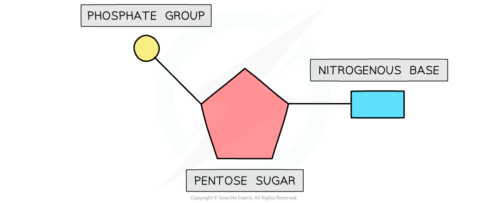
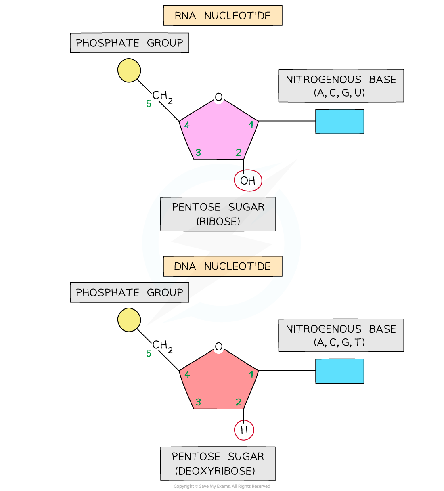
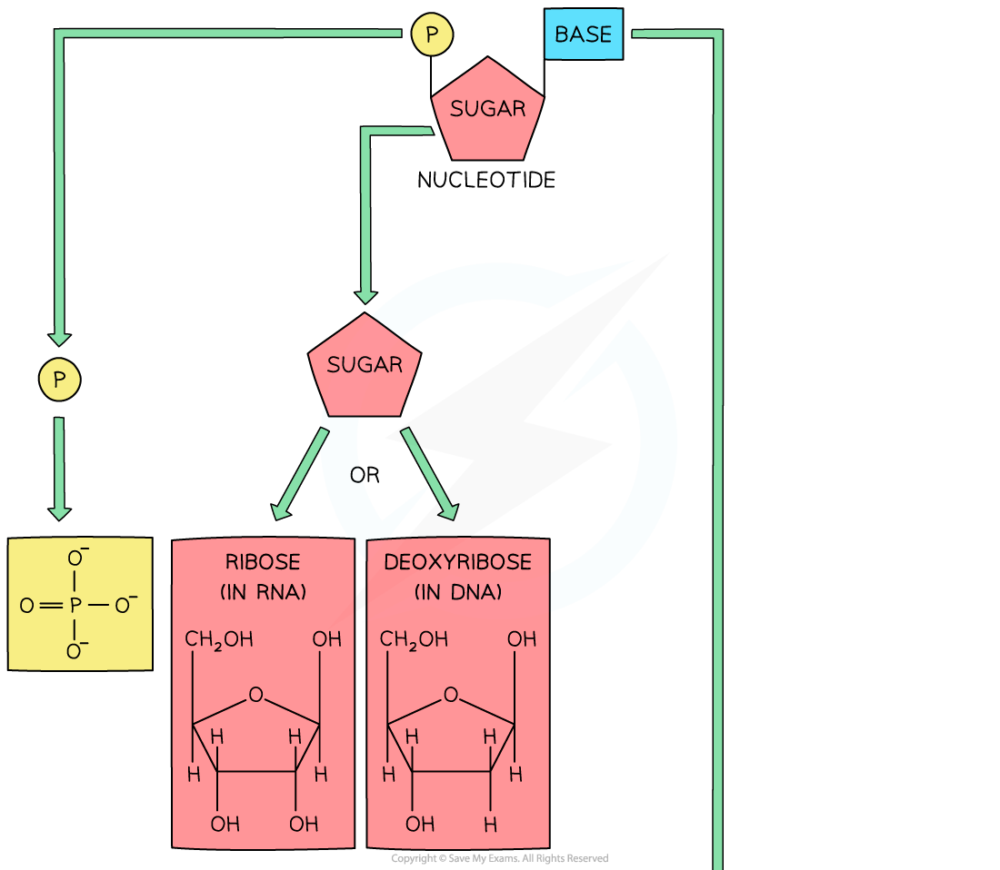
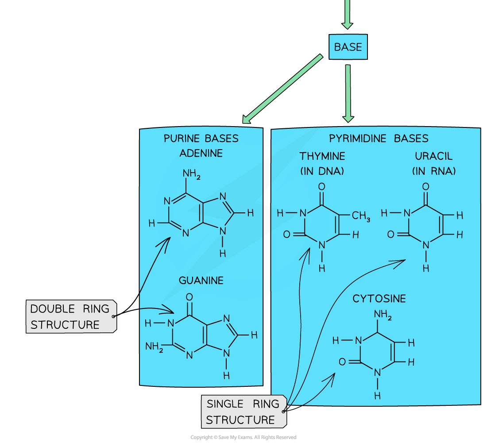
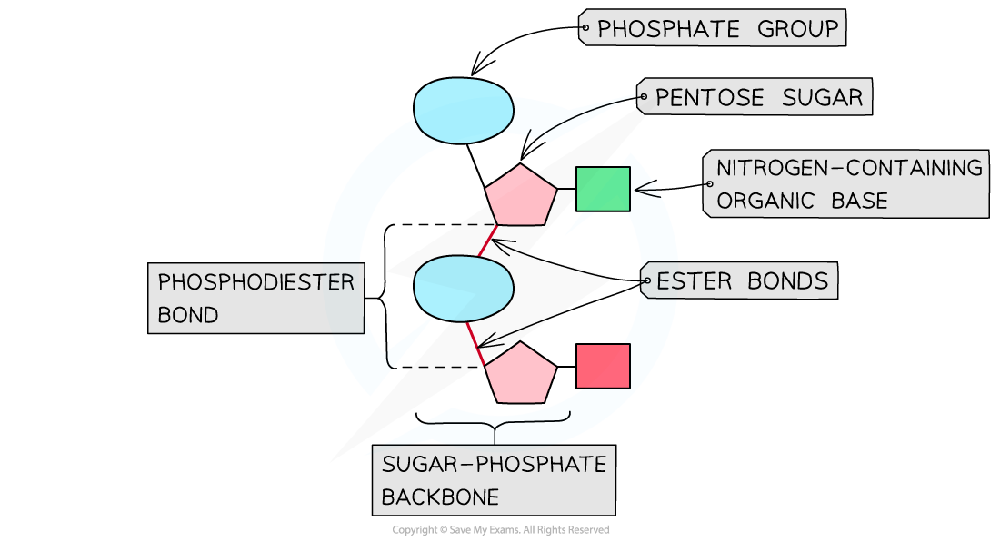
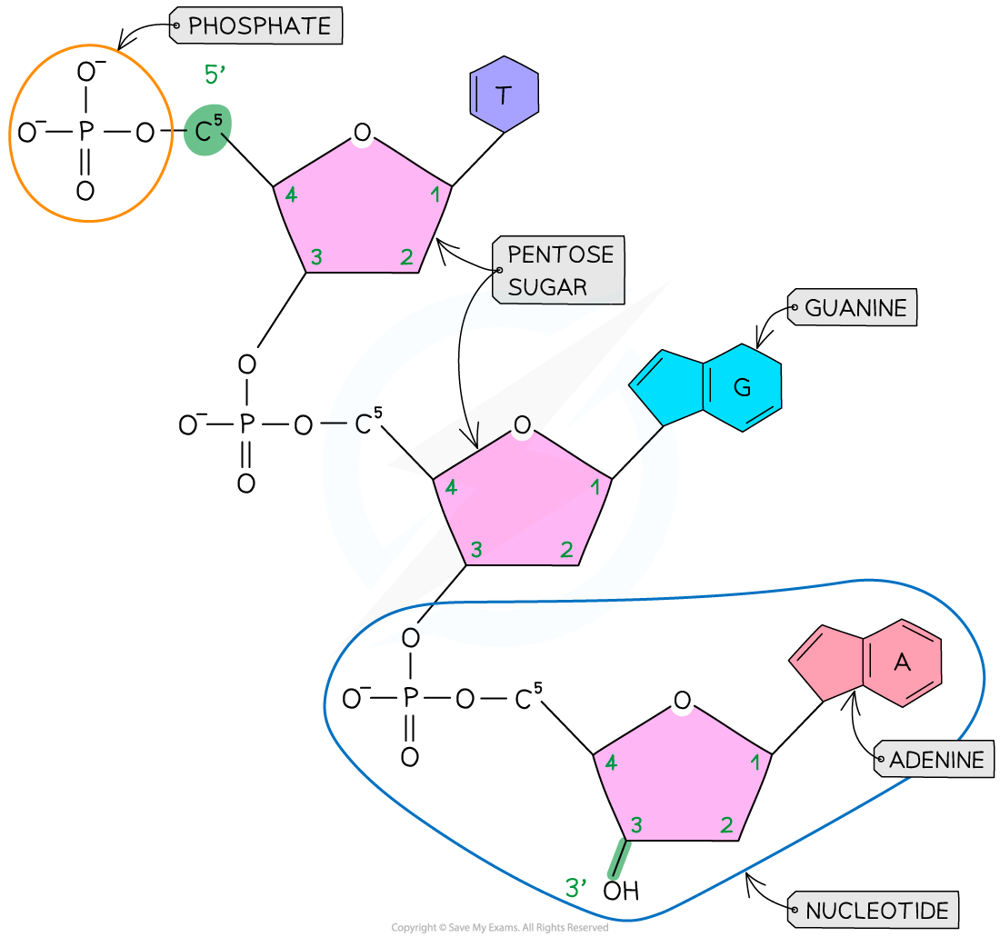
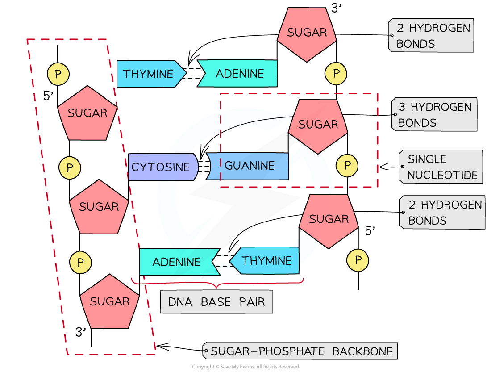
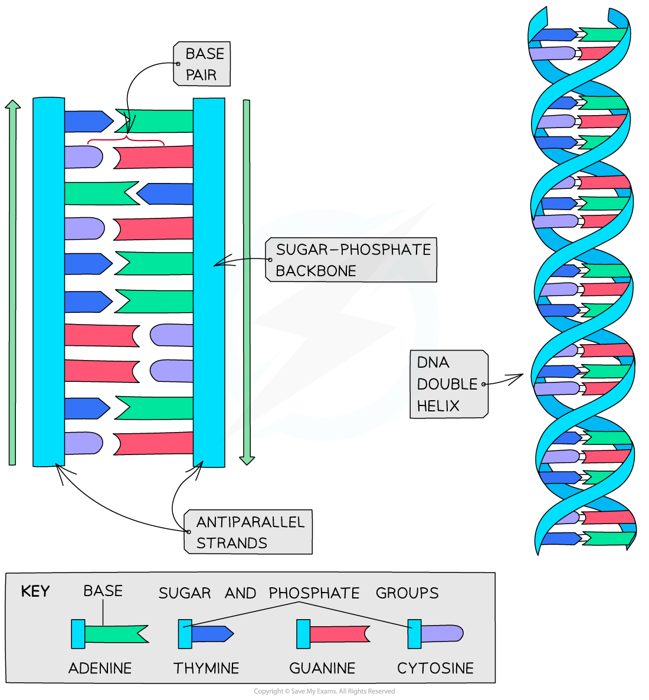

# Nucleotides, DNA & RNA, Base Pairing

## Nucleotides

> **Spec point** — `spcpt_n2fkcv8Rw2K9ZmcH`

## Nucleotides

- Both DNA and RNA are **polymers** that are made up of **many repeating units** called **nucleotides**
- Each nucleotide is formed from:

  - A **pentose sugar** (a sugar with 5 carbon atoms)
  - A nitrogen-containing **organic base**
  - A **phosphate group**

***The basic structure of a mononucleotide***

#### DNA nucleotides

- The components of a DNA nucleotide are:

  - A **deoxyribose** sugar with **hydrogen** at the 2' position
  - A phosphate group
  - One of four nitrogenous bases - adenine (A), cytosine(C), guanine(G) or thymine(T)

#### RNA nucleotides

- The components of an RNA nucleotide are:

  - A** ribose** sugar with a hydroxyl (OH) group at the 2' position
  - A phosphate group
  - One of four nitrogenous bases - adenine (A), cytosine(C), guanine(G) or **uracil (U)**
- The presence of the **2' hydroxyl group** makes **RNA more susceptible to hydrolysis**

  - This is why DNA is the storage molecule and RNA is the transport molecule with a shorter molecular lifespan

***RNA nucleotide compared with a DNA nucleotide***

#### Purines & Pyrimidines

- The **nitrogenous base** molecules that are found in the nucleotides of DNA (A, T, C, G) and RNA (A, U, C, G) occur in **two structural forms**: **purines** and **pyrimidines**

  - The bases **adenine** and **guanine** are **purines** – they have a **double ring structure**
  - The bases **cytosine**, **thymine** and **uracil** are **pyrimidines** – they have a **single ring structure**

***The molecular structure of each base is different, depending on whether they are a purine or pyrimidine***

## Polynucleotides: DNA & RNA

> **Spec point** — `spcpt_vxHwbhj5Q6vFWvSh`

## Polynucleotides: DNA & RNA

- DNA and RNA are polymers (**polynucleotides**), meaning that they are made up of many nucleotides joined together in long chains
- Separate **nucleotides are joined via condensation reactions**

  - These condensation reactions occur between the **phosphate group** of one nucleotide and the **pentose sugar** of the next nucleotide
- A condensation reaction between two nucleotides forms a **phosphodiester bond**

  - It is called a phospho**di**ester bond because it consists of a phosphate group and **two** ester bonds (phosphate with double bond oxygen attached - oxygen - carbon)
- The chain of alternating phosphate groups and pentose sugars produced as a result of many phosphodiester bonds is known as the **sugar-phosphate backbone** (of the DNA or RNA molecule)

***A section of a polynucleotide showing a single phosphodiester bond (and the positioning of the two ester bonds and the phosphate group that make up the phosphodiester bond)***

#### DNA structure

- The nucleic acid DNA is a **polynucleotide** – it is made up of **many nucleotides** bonded together in a **long chain**
- DNA molecules are made up of **two polynucleotide strands** lying side by side, running in opposite directions – the strands are said to be **antiparallel**
- Each DNA polynucleotide strand is made up of **alternating deoxyribose sugars and phosphate groups bonded together **to form the **sugar-phosphate backbone.** These bonds are **covalent** **bonds** known as **phosphodiester bonds**

  - The phosphodiester bonds link the **5-carbon of one deoxyribose sugar** molecule to the phosphate group from the same nucleotide, which is itself linked by another phosphodiester bond to the **3-carbon of the deoxyribose sugar molecule of the next nucleotide **in the strand
  - Each DNA polynucleotide strand is said to have a **3’ end and a 5’ end** (these numbers relate to which carbon on the pentose sugar could be bonded with another nucleotide)
  - As the strands run in opposite directions (they are **antiparallel**), one is known as the **5’ to 3’ strand** and the other is known as the **3’ to 5’ strand**
- The nitrogenous bases of each nucleotide project out from the backbone towards the interior of the double-stranded DNA molecule

***A single DNA polynucleotide strand***

#### RNA structure

- **Like DNA**, the nucleic acid RNA (ribonucleic acid) is a **polynucleotide** – it is made up of **many nucleotides** linked together in a chain
- **Like DNA**, RNA nucleotides contain the nitrogenous bases adenine (A), guanine (G) and cytosine (C)
- **Unlike DNA**, RNA nucleotides **never contain** the nitrogenous base **thymine** (T) – in place of this they contain the nitrogenous base **uracil** (U)
- **Unlike DNA**, RNA nucleotides contain the pentose sugar **ribose** (instead of deoxyribose)
- Unlike DNA, RNA molecules are only made up of **one polynucleotide strand** (they are single-stranded)
- RNA polynucleotide chains are relatively **short compared to DNA**
- Each RNA polynucleotide strand is made up of **alternating ribose sugars and phosphate groups linked together**, with the nitrogenous bases of each nucleotide projecting out sideways from the single-stranded RNA molecule
- The **sugar-phosphate bonds** (between different nucleotides in the same strand) are **covalent** **bonds** known as **phosphodiester bonds**

  - These bonds form what is known as the **sugar-phosphate backbone** of the RNA polynucleotide strand
  - The phosphodiester bonds link the **5-carbon of one ribose sugar** molecule to the phosphate group from the same nucleotide, which is itself linked by another phosphodiester bond to the **3-carbon of the ribose sugar molecule of the next nucleotide **in the strand
- An example of an RNA molecule is **messenger RNA **(**mRNA**), which is the transcript copy of a gene that encodes a specific polypeptide. Two other examples are **transfer RNA (tRNA)** and **ribosomal RNA (rRNA)**

***Messenger RNA (mRNA) is an example of the structure of RNA***

## Base Pairing in the DNA Double Helix

> **Spec point** — `spcpt_mbpZQTwKBhZgjr8X`

## Base Pairing in the DNA Double Helix

- The two antiparallel DNA polynucleotide strands that make up the DNA molecule are **held together by hydrogen bonds** between the nitrogenous bases
- These hydrogen bonds always occur between the **same pairs of bases**:

  - The purine **adenine** (A) always pairs with the pyrimidine **thymine** (T) – two hydrogen bonds are formed between these bases
  - The purine **guanine** (G) always pairs with the pyrimidine **cytosine** (C) – three hydrogen bonds are formed between these bases
  - This is known as **complementary base pairing**
  - These pairs are known as **DNA base pairs**

***A section of DNA showing hydrogen bonding between base pairs***

#### Double helix

- DNA is not two-dimensional as seen in the diagram above
- DNA is described as a *double helix*
- This refers to the **three-dimensional shape** that DNA molecules form

***DNA molecules form a 3D double helix structure***

> **Exam Hint**
> Make sure you can name the different components of a DNA molecule (sugar-phosphate backbone, nucleotide, complementary base pairs, phosphodiester bonds, hydrogen bonds) and make sure you are able to locate these on a diagram.
> 
> Remember that **phosphodiester bonds** join the nucleotides in the sugar-phosphate backbone, and **hydrogen bonds** join the bases of the two complementary strands together.
> 
> Remember that the bases are complementary, so the number of A = T and C = G. You could be asked to determine how many bases are present in a DNA molecule if given the number of just one of the bases.
